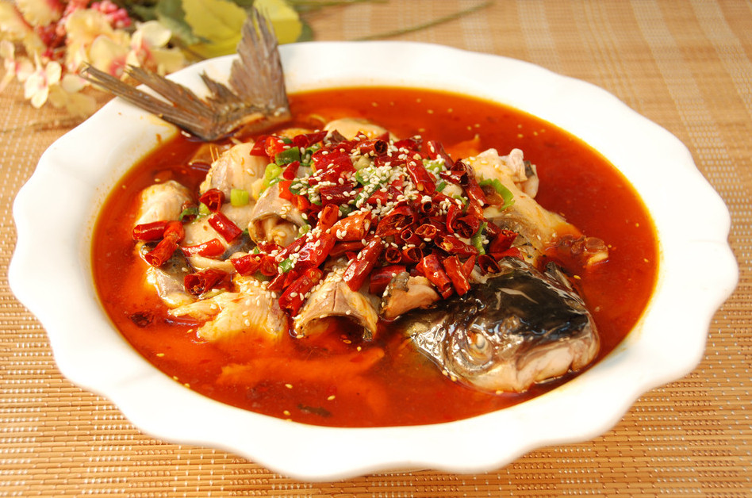
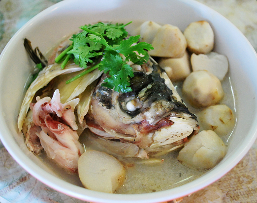

# 吃鱼

红油清冽，露出藏在最底的黄绿芽苗，轻吹浮面花椒，如风涌船动，滑向一边。鱼片早已用黄酒生粉胡椒揉捏入味，经滚油浇烫，白如玉璧，香味四溢。

食客如我已在大快朵颐，我的兄弟刘鹏却面露难色。伸筷，手微颤，自鱼腹处轻撕片肉，置于碗中。至此神色终显凝重，两筷分握两手，左右用力，将鱼肉慢慢撇开。再用食指拇指并起，轻拈碗中一物，额角有汗渗出，俩眼盯紧，丝毫不敢放松，缓缓放在桌上，这才长舒一口气。

那是一根鱼刺。

“我真不擅长吃鱼。”

这个冬天敢单穿一件衬衣，生造二斤牛栏山，怒啃整锅羊蝎子的一百六十斤北京爷们儿，终于败在了一锅水煮鱼面前。

“刺儿太他妈多了，这得挑到什么时候？”他用筷子敲着装水煮鱼的盆儿，“做了这么多年兄弟了，就别明摆着坑我了。”

“这样有意思吗？”

神色里满是悲愤，字字啼血，声声动人，如同伪军在战场上见了国军，高声疾呼大家都是自己人，中国人不打中国人。

这种事儿我已经不是第一次遇到了。

号称老饕的青少年美食家王鹏举同志，西去重洋之外啃过欧洲佬的面包，东渡大洋尝过日本人的寿司，嚼过驴碗口，喝过酸豆汁，可对上一盘豆瓣鲫鱼，也两眼抓瞎。

有一次去老虎庙的小渝府吃烤鱼，点了四斤草鱼，等加着炭火的大铁盘端上来，只有王鹏举同志“停杯投箸不能食”。

我们问他为怎么不吃。

他不屑的说，你们不就图草鱼便宜么？可是草鱼刺儿这么多，你们拿手挑的不累吗？

沉默良久，终于有人回答道：“我们不用手，用舌头捋一遍，再拿嘴巴一抿，刺儿就出来了。”

美食家王鹏举同志听了这话，一副卧槽还他妈可以这样这个世界再也不好了的表情。

“有本事你们换鲶鱼！”他义正言辞拍桌怒喝道。

像是春晚上范伟大着舌头说，你别老整三岁的题，有本事你整四岁的。

北方人不善吃鱼。

当然这话不一定对，也打了我自己人种的脸，但之所以形成这种有地域歧视的观点，全赖身边这群不能吃鱼的怂货。

“人生有三大恨，一恨鲥鱼多刺，二恨海棠无香，三恨红楼梦未完。”这是张爱玲在《红楼梦魇》里说的话。她所提到的鲥鱼，与河豚、刀鱼齐名，并称“长江三鲜”，一直被誉为江南水中珍品，古时候还当成贡品给皇帝老爷尝过。

当初见到这句话，我有点纳闷儿，这个生于上海洋气十足的名门之后，这个能“低到尘埃里”的文艺女青年，怎么会恨鲥鱼多刺？江浙之地产鱼颇多，人人都是吃鱼的食客，对于他们来说，往往爱吃鲥鱼，因为刺多之往肉质鲜嫩，哪怕鱼骨都留有余香，吃鱼是种乐趣，吐刺亦是乐事。

这问题我百思不得其解，后来和一个河北姑娘聊起这事儿来，才终于解惑。

她对我说：“张爱玲祖籍不是河北唐山么，看来还是咱北方的基因在起作用。”

不过不善吃，并不代表不会做。

北方邻河面海的地区，做鱼的方法多有独到之处。

我曾经去济南的汇泉楼（现在的汇泉饭店）吃过他们的招牌菜“黄河鲤鱼”。据说做这道菜的主食材选用的是黄河水至深处的鲤鱼，这种鲤鱼肉质鲜嫩，头尾皆是金黄色，全身鳞甲阳光之下闪闪发光，古时候人们称其为快要跳过龙门的“半龙”。

就算是好厨子想要把这道菜做出模样来，也颇不容易，刀工调味儿火候缺一不可。 

先是去鳞，用小刀片片挑了，要不伤鱼身分毫。之后再用快刀切出刀纹，道道长宽一致，外裹芡糊，再进热油内炸，等到首尾都翘起来的时候，再用洛口老醋加冰糖调制的蜜汁浇在鱼上，据说只有这样的汤汁才能去掉鱼肉里本来的土腥气。

这道菜成品之后，外焦里嫩，轻拈鱼肉入口，第一声嘎嘣如咬化冰糖。

至于天津地区，因为临海，对海鱼的庖厨之术也多有研究。不过我对天津做大鱼的招法没有研究，倒是对一道名为“三鲜同锅”的菜印象深刻。

那是去天津的兄弟家吃饭，正好碰上他爷爷在家。老爷子见来了客人，亲自去菜市场买了一网兜海鲜，主要是小鱼小虾小螃蟹，鱼如小指长，虾如指节细，蟹如指盖大。老爷子先是把海货拿水焯了，去掉腥气，搁在一边。然后搬出一口大铁锅，搁在土台灶子上，先是小火，将三鲜都扔进去，不用锅铲，而用手炒。瘦臂掂起铁锅，手指并起，如龙潜深渊。

待锅底通红，再用铁铲，等鱼虾蟹全呈焦色，再加花椒，辣椒，葱花，一小撮芝麻，出锅。

拈起一小条鱼，扔进嘴里，刺儿都焦了，能直接咬碎，微辣，带有麻香，再喝上一口酒，通体舒坦。

不过平凡人家往往没有如此高的手艺，做出来的鱼大多是蒜瓣豆瓣混合味儿，加盐过多，吃口鱼肉要喝半瓶子矿泉水。至于北京街面上的馆子，手艺一直平平，早年间以东北的大块炖鱼为主，现在以川渝的水煮鱼烤鱼为王。有所谓的美食专栏作者给这种现象起了个冗长的名字，叫“北京地区饮食由北向南的递进式变迁”。

这种现象导致的后果是，百度百科上出现了个词条儿叫“北京水煮鱼”。

我川渝地区的兄弟得知这消息，气的牙根儿痒痒，痛斥这是在败坏四川美食的传统文化。他们还说了，学点儿皮毛不算什么，真正的精髓菜肴在于鱼香肉丝和鱼香茄子，吃鱼而不见鱼，这才是吃鱼的最高境界。

一风渐起，自有一风渐衰。我有一东北同学，拉我去北京街头找东北风味的馆子，他说想吃酱焖嘎牙子。嘎牙子，其实就是黄颡鱼。 是因为其群游时会发出“嘎嘎”之声，因而得名。这菜是拿传统的东北大酱焖熟的，味道浓郁，唇齿留香。

等走到他所说的那家店跟前，却发现里面空空荡荡，门上贴着店面招租的纸条。

同学矗立在风中，沉默良久，有种赵本山宣布退出春晚大舞台的落寞。

中国人讲究一饭一蔬皆有情趣，一尾鲜鱼的烹饪自然也是这个道理。

人们常说吃菜在念，念的是家乡的原汁原味。可说到底家乡的味道，家在乡前，千千万万个家才撑起乡，无数个乡又拼凑出了国，这才是舌尖上真正的中国味道。所以能做出自己心上那道鱼味儿的人，只能是家里掌勺人，或是媳妇儿，或是老娘，或是奶奶姥姥，当然也有可能是男同胞。

原来律所有一个同事，汕头人，用广普叫我的名字总是像在喊“瞪着羊”。他爱吃鱼，但嫌北京所谓鱼味儿失了本真，总是闷闷不乐。后来他老妈给他寄了个包裹，里面有自家做的鱼酱。

他邀请我也来尝一口，刚一拧开盖子，像是突然有一百十斤的大鱼窜出来用鱼尾抽了我一嘴巴。千百年来海岸城市的风雨沧桑都聚集在小小的一瓶鱼酱里，用它就能完全感受水生世界的波诡云谲。

轻舀一勺，置于口中。

如遭冻带鱼当头棒喝，如遭鲜鱼汤醍醐灌顶。

从那以后我再也不敢称自己能吃鱼鲜。

不过那个汕头同事倒是对鱼酱颇为钟爱，每次不敢多吃，午饭时舀一小点儿，放在饭里，然后急急忙忙盖上盖子，搁在冰箱里，然后时不时偷看几眼。

我们说，你要真想吃，就大大方方多吃几口。

他解释说，怕吃快了，就没了，所以要省着吃，因为每次吃，就像回了家一样。

我其实也挺馋我妈那一口的。

她老人家做豆瓣鲫鱼其实一般，但我偏偏爱吃。

从菜场买的新鲜鲫鱼，将鱼去鳞掏肚收拾干净，然后在鱼身两面各剞两刀，见鱼骨而停。鱼身外抹上绍兴黄酒和细盐，鱼肚内搁进大蒜葱段，然后腌制。

稍待后再开旺火，下油烧热乎，把鱼放进去炸至浅黄捞起，然后在锅里放豆瓣酱、葱姜蒜炒至汤汁呈酱红色。再把鱼搁进去，用文火小煮，加酱油、少许白糖。

最后勾芡淋醋，些微绿葱花点缀，盛盘出锅。

我妈做鱼，但从不吃鱼，说是嫌刺儿多。不过有时候她会轻抬筷子，掀开鱼脸鳞片，夹所谓的“鱼脸肉”，她说这是鱼全身最活的地方。

我爸吃鱼厉害，一条鱼嗦啰嗦啰，五分钟就能整条肉进刺儿出。

来没我的时候，是我妈做鱼，我爸吃鱼。

后来有了我，还是我妈做鱼， 但变成我吃鱼肚，我爸吃鱼头鱼背鱼尾。我问他怎么不吃好地方？他回答我说，你瞧蚊子叮人，是不是专找指头缝儿，小腿窝儿，后脚跟儿？那是因为它们知道越是犄角旮旯，味道越好，吃鱼也是一样。

他一边嘬鱼尾，一边对我说。

我爹是忽悠我呢，真实原因我知道是为什么，但说出口就太矫情了，倒是每每想起来，心里总觉得暖和。

老一辈的北方家庭，在吃鱼一事上往往有所缺憾。

我奶奶的表兄，原来住在白洋淀，到了捕鱼的时候，抓了不少好鱼，心里想着给妹妹妹夫送去，于是一路辛苦送到了北京。

我奶奶见了鱼，开始犯愁，怎么做呢？得嘞，腌成咸鱼吧。

好好的新鲜活鱼，成了阳台上晾晒的鱼干。

后来到了六十年代，我爷爷奶奶支援祖国建设南下，到了湖北襄阳的棉纺厂。刚搬到新家没多久，就闻到隔壁邻居家里做饭异香扑鼻。

我爷爷是个嘴馋之人，拿着根香烟，去找隔壁男主人套近乎，顺便问问人家做的是什么。等十来分钟后，老爷子带着一脸诡异的神色回到家中。
“做的什么，问清楚了吗？”奶奶问。

“嗯。”老爷子尴尬的点点头，“他们说是驴头瞪驴头。”

夫妻俩傻了，这驴头瞪驴头是几个意思？

等在这儿生活了一段时间，口音都习惯之后，老爷子才知道，他是听岔了，人家说的是芋头炖鱼头。

可知道菜名了，到自己手里，不会做还是不会做。做了无数次鱼，换了无数种鱼，要么是口儿太重，要么是刺儿太多，总之，这就像是人民日益增长的物质文化需要与落后的生产方式之间不可调和的矛盾。

可老爷子偏偏想吃鱼，我奶奶就想辙吧。这么苦思冥想，还真给她想出来一办法。

那是她在涿州工作的时候学会的，菜名叫“无骨鱼”。用的是巴掌大的小鱼，去鳞取内脏冲洗干净，然后把小鱼抹上精盐放在一边。再用鱼内脏加葱姜大料单煮一锅，沸腾后把杂物篦出。最后把小鱼丢进鱼汤里，盖上锅盖子，等汤干烟弄焖熟开锅才算齐活。这样的鱼，骨肉酥烂，可以卷饼，也可以蘸蒜泥，风味儿独特。

这道菜做出来以后果然大获成功，我奶奶笑称这辈子就指望这道菜活了，于是就这么一做几十年，成了老爷子的特供菜。

我小的时候，一到冬天，我奶奶就会做无骨鱼，盛在一个小碟子里，再搭上一份蒜泥。老爷子抱着我，讲水浒英雄，草莽好汉，说到尽兴处，拿筷子头蘸一点儿他酒盅里的白酒，塞我嘴里。

辣！

小爷要嚎啕，刚出一个音儿，老太太就发现老爷子罪行了，扭头过来瞪他。老爷子有点儿尴尬的笑笑，夹一块鱼又放进我嘴里，嚼一嚼就化了。

窗外白茫茫一片，大雪纷飞，鞭炮声响。

初中的时候，二叔在郊区弄了块地，说是给爷爷奶奶颐养天年之用。

老头儿老太太很高兴，最让他们欢喜的是那边有一块小池塘。

奶奶说，能给老头儿养点儿小鱼吃，解他的馋虫。

老头儿听了这话还有点儿不好意思，老脸微红。

搬家那天，我也去帮忙了。房屋是按照老式的北方房屋造的，还砌了个炕。稍微收拾停当，老太太攥着我的手，让我去帮着一起撒鱼苗。清亮亮的水，鱼苗像是一个个小黑点儿，窜了进去。

只不过它们最终还是安逸的在池塘里生活着，没有成为盘中美食。

老爷子后来身体不好，进了医院，老太太说等鱼苗长大了，就给他再做鱼吃，这话也未曾实现。

那些鱼都长大了，繁衍了，死了，又有新的小鱼冒了出来。

老太太一如既往的按时喂食，巡视自家的池塘。

我问她，奶奶，你怎么不做那鱼了？

她说身体不好，做鱼太费功夫，而且也不想做了。

我听了她的话，看着池塘里的鱼悄悄吐着泡泡。

我常常在想，这个世界上，有没有人做一道菜，一辈子只为了一个人呢？我想一定是有的吧。

我奶奶不做鱼已经有十年了。

我爷爷因为医疗事故去世，也已经有十年了。

(采编：房帅帅；责编：陈翔；)