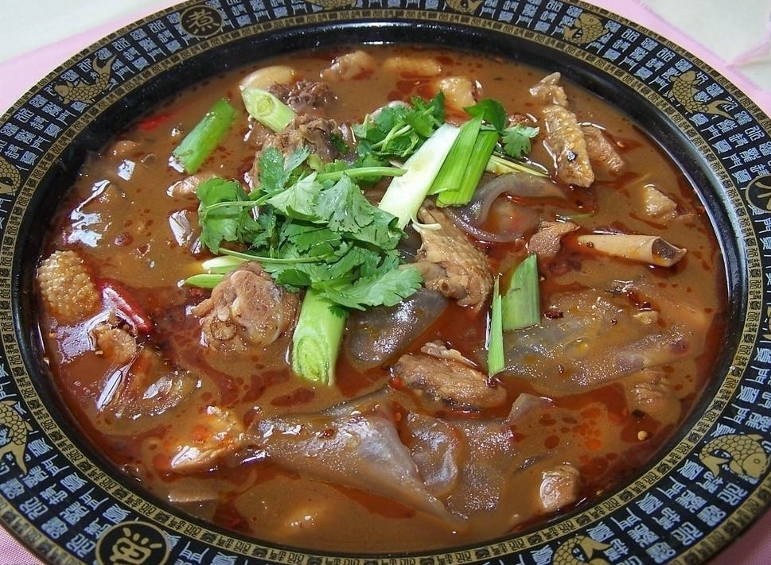

# 记忆中的粉皮炖鸡

因为从小到大我在家里吃到的菜式都一直在不停地变化之中，导致想找到一道能代表我的菜真地很不容易。妈妈是江西人，好清淡，喜辣，忌咸；爸爸是山东人，重口味，爱咸也爱辣。我在北京度过的十八年中，有一半儿的时间爸爸都在外地工作，妈妈负责做饭，姑姑偶尔也会来帮忙。加之我小时候曾经在江西生活过将近一年，造成尽管我的籍贯上是山东费县、户口是北京朝阳，我与大多北方姑娘的口味喜好不同。我喜欢辣椒的刺激口感，耐得住淡，也受得了咸。我偏爱南方的米饭，很长时间吃不惯北方的面食——因为妈妈做不来这些。但我热爱北方的饺子。小学时，每周六，姑姑都会来我家包饺子。

我家人口不多，只有爸爸、妈妈和我。在北京除了父母外唯一的亲人就是姑姑。爷爷奶奶那一辈儿的人都在农村，伯伯叔叔们也全留在了乡下。所以不像其他那些爷爷奶奶给做饭的家庭，我吃过奶奶煮饭的次数，两只手应该也数得完了。

但是我还是决定以一道山东临沂费县南张庄孙家的拿手老菜——粉皮炖鸡，作为我的代表菜。原因是我家每个人都做过粉皮炖鸡（尽管每个人炖的水平高低差距极大），而且每个人都喜欢吃这道菜——鉴于父母常常因为口味咸淡问题吵得不可开交，能有个共同欣赏的菜色着实难得。

我鲜少回山东过年，致使每次回去必定会受到无与伦比的款待。初二那年，爸爸驱车八个多小时带我从北京回到了山东——正值春运，火车票一票难求的程度可想而知。一路颠簸，双腿浮肿。当小车最终开到坑坑洼洼的村里土路上时候，我却安下了心来。去年初刚娶了媳妇的堂哥早就在路口等着了，小跑过来给打开了车门。当我的脚终于踏上了那黄土地的时候，第一个反应竟是腿软快要跌倒。奶奶的问寒问暖听上去极其的飘忽，陌生也亲切。身体疲惫得只想着赶快洗个澡去睡觉，撇开这一切亲戚的吵闹的问候；理智与情感却告诉我，一定要向大家一一问好，讲吉祥话。待爸爸停好车后，我俩走到了奶奶的老房子。

是平房，建房的材料还是十多年前用的，说是比砖房要舒服，不知有没有冬暖夏凉的效果。奶奶热情地端出了卡着时候做出来的粉皮炖鸡，来招待我和爸爸。大概因为太累了，我看着那鸡肉上油腻的亮光，第一个反应居然是想吐。我说：“吃不下去，不饿。”奶奶还是盛了一碗粉皮给我，“粉皮不顶饱，吃着暖暖肚子。”拗不过热情，我端着粉皮，坐在板凳上，听着奶奶对爸爸一口的山东土话——或者应该叫做费县话。爸爸就算在老家也是坚持讲普通话的，“费县人应该多出去走走，别总把一口土得掉渣的普通话当成自豪挂在嘴上。”

粉皮是奶奶自己家里做的。把红薯、土豆磨成粉，用烫箩把粉在滚水上烫成薄薄的糊，最后再晒成粉皮。自家做的粉皮从来都不会平整，但都是大约半径两个手掌大小的标准的圆。一张张脆脆的圆形粉皮落成高高一摞，加上每张粉皮间都有很大的空隙，这粉皮摞看上去就更高了。做粉皮炖鸡的时候，会等最后快熟时才把粉皮掰成小块儿放进去。因为是手掰的，所以最后粉皮进鸡汤时大小不一，形状各异。我从奶奶手中接过那碗粉皮的时候满肚子狐疑，不明白为啥这粉皮看上去会那么地乱。因为在那之前，我只见过超市里面那种机器制出的、常是被餐馆用来做猪肉炖粉条的长条形粉皮。这碗粉皮入口时有种滑滑的感觉，比那种长条形的粉皮要来得脆些，滑过舌头，嚼嚼就碎了，不会咬了很多下才出了几个破洞。经过长时间的熬制，粉皮很入味，鸡肉的精华都熬进去了。鸡肉、料酒、酱油、花椒、大料的香味儿全都浸在了粉皮中，让本身没有特别味道的粉皮成了极品美味。

本来说“吃不下去，不饿”的我愣是把一碗粉皮吃下了肚，还感觉意犹未尽。估计是大家伙和我一样喜欢吃粉皮。一锅炖鸡，总是粉皮先被吃干净，奶奶再放些粉皮进去煮第二锅，然后粉皮又被分吃光了。这道菜的好处呢，就是可以让很多人吃很久，而且很方便。只要第一次把鸡炖好，以后只要向里面添加粉皮就可以了。这种吃法最终会导致鸡肉本身没剩什么味道。到了那个时候，就抓一把面放进鸡汤里头，就着鲜美的鸡汤，面和鸡肉便也成了一顿佳肴。

在山东过年的那几天，因为几乎天天都杀鸡，所以我天天都有机会吃到这粉皮。（尽管鸡有很多不同的作法，但粉皮炖鸡是每天都会提供的，大概是因为奶奶看我很喜欢这道菜吧……）以至于最后要回北京的时候，奶奶放了一大袋子粉皮到车的后备箱里，让爸爸回北京后再做给我吃。

爸爸是男孩，又因为读书好，一直被爷爷奶奶当成家里的宝——当然也确实是家里的宝。所以爸爸在老家的时候没做过饭。我出生后，也因为常常常驻外地（两年珠海，近六年的香港，其他时候全国各地跑），爸爸一直没机会在家里做饭。从奶奶家拿回一大摞粉皮后，爸爸居然真地开始做起了粉皮炖鸡，现在应该算作他的拿手菜之一了吧。某个周六的中午，在卧室学习的我被从厨房飘来的熟悉得仿佛带着泥土气息的粉皮炖鸡的香味儿给吸引到了餐厅。口水开始慢慢泛滥，记忆也不自主地回溯到了在奶奶家过春节的时候，仿佛一闭眼睛，就已经围坐在了老屋的火炉旁。堂哥的小儿子的啼哭声似乎就在耳边，堂姐的谈婚论嫁的故事也被津津乐道着。

被这香味儿吸引过来的还有妈妈。大概这种朴实的炖鸡的方法也勾起了她对江西南昌夏园村的回忆吧。后来爸爸又出差了。家里那摞粉皮就静静地躺在了厨房的一角。又是某个周六，姑姑来了，妈妈和姑姑一起又一次做了粉皮炖鸡。至于味道如何我就不太记得了。只知道，一直被我当成是北京人的姑姑，在那一刻，真地散发出了一股山东女人的感觉。

再后来便是爸爸出差，妈妈回江西奔丧。自己坐在家里，如果说有想家的感觉，还不如说是想爸爸妈妈。一个人静下来就容易胡思乱想，蓦然间竟有种“被酒莫惊春睡重，赌书消得泼茶香，当时只道是寻常”的感叹。当然，我指的是爸妈平常的作息习惯以及言谈话语。于是就想做些什么，好让自己觉得仿佛一切都没有变。看着厨房里的那一摞粉皮，念到冷藏柜里还有只柴鸡，蠢蠢欲动的心瞬间激起了我做粉皮炖鸡的念头。

鸡处理得很好，步骤也都完全。就不知怎的，鸡汤完全没有味道，鸡也没有味道。明明满屋子都是暖暖的鸡汤的香气，盛起一匙，却淡如白水。人家都说自己吃自己第一次做的饭，尽管再难吃，也都觉得好吃。我真的认为这只是一种描写手法。满嘴的寡淡，只让我觉得把好端端的一只柴鸡给浪费了。

离开北京后，我去了美国读书。最想念的，就是故都的饭菜。哪怕能再吃点食堂里的大锅饭也好啊，一盘鱼香茄子真是赛过一锅的炸鸡翅。在我到了美国一个学期后，爸爸也去了芝加哥工作。赶上春假，坐飞机去爸爸那里。我说想吃粉皮炖鸡，爸爸就真地做了这菜。当然，粉皮不再是奶奶做的了，是去亚洲超市买的那种东北猪肉炖粉条用的粉条。一锅鸡上桌后，闻起来味道和在北京山东吃的很像，但总有一点点无法言明的不同。不知是真地不同，还是心理在作怪。可是我知道自己的心境和当初在北京的时候的确实不同了。闭上眼，老家的种种只是浮现在了脑后，一种一切都回不到过去的寂寞静静地、清晰地漫上了心头。

真地很想回北京看看啊，可是好像也只停留在想想。又想藉由着熟悉的味道来找回曾经的感觉，可是味道慢慢也会变了，想保持，难啊。就算完全留住了当初的味道，环境变了，心境也变了。于是一切真的只剩下回忆，和那瞬间熟悉的柔软。这种能在记忆中刻下的、烙下的，希望可以都是美好的曾经。

