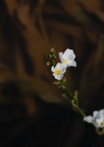
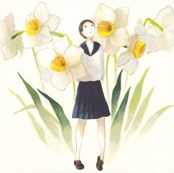
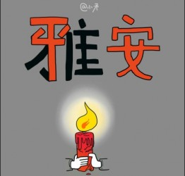

# 一个关于地震的小事

2008年，5月12日，那时，我是四川省绵阳中学高中三年级的一名学生。

2013年，4月20日，凌晨，今天的我已经从浙大毕业快1年，距离当年那场地震，竟也过去5年。

我无法去表达，作为一个四川人，对于同胞们在两次地震中所给予的支持和帮助，让我有多么感激。今天，我想讲的，是一个微不足道的故事，却是一个改变我一生的故事。

所有灾难的力量，并不仅仅是让人们更加团结，让人与人之间的同情心共鸣，彼此温暖，它展现人性的恶，却更彰显人性的善与光明。而对于每一个个体来说，灾难，是一种如此直接而出乎意料地方式，把我们每个人都必定面对的人生终点——死亡，就这样毫无防备地赤裸裸地摆在了我们面前，在不到10秒的时间内，突然切换到频临死亡的模式，突然人生十年二十年的长远规划在瞬间灰飞烟灭只剩下一个念头——这一秒钟，我不要死。

那一年，下午2：28分，距离上课还有2分钟，我坐在教室的最后一排，教学楼的第6层，做着等比数列的一道题目。忽然楼道开始晃动起来，所有的同学都开始惊慌失措，跑到走廊上一看，大批的同学正在冲向楼梯，而三楼、四楼随着人们的惨叫开始有人跳楼，大概只有3秒钟的反应时间，我头顶上的一盏灯忽然砸下来，在我的脚边砸得粉碎，随之而来的是整个班的同学更加失控地一起拥向楼梯。

从6楼，跑到1楼，那段距离，30秒。

整个楼道剧烈地晃动着，粉尘弥漫，记忆中是刺鼻而模糊的味道，前前后后全都是人，我们就这样彼此紧紧地扣着双手向下跑，速度并不慢，双手都扣得那么紧，生怕旁边的人滑倒。直到跑出教学楼，一路狂奔到操场，很远，回头，看着还在晃动的教学楼，墙壁上竟然已经被撕开了明显的口子。

所有的学生，都站在了操场上集合。整个学校没有任何人伤亡，也没有建筑物的倒塌。然而，在接下来的30分钟内，整个操场弥漫的，竟然是一片哭声，同学们彼此抱头痛哭。刚才来不及反应的恐惧，竟然在逃离后被释放，如果，就在那一刻交代了，我们此生还有多少未完成？如果，刚才那一刻，有任何一点点不测，我们现在恐怕就见不到阳光了……死亡，就以这样蛮横而霸道地方式，活生生地摆在了距离高考还有不到1个月的我们面前。那是一种如何令人震惊的方式，当我们的脑海里已经填满的是对于整个暑假的放肆憧憬，对于未来大学生活的慢慢期待。一场灾难，却可以瞬间把这一切都掏空，把生命冰冷而脆弱的本质，毫无保留地暴露在我们面前。

哭过，一个朋友问我：“在跑下来的那30秒里，你是不是一直想着因为要上自己心仪的学校。所以你不能死？”

那个瞬间，我愣住了。 

在那30秒中，所有关于梦想、抱负和那所被念叨了很久的目标大学，没有分毫出现在我的脑海里。那30秒，我的思维几乎是完全空白的，空白的如此彻底，我甚至不知道自己还有没有“我要活着”这个念头。我所唯一能回想起来的事情是，我的整个身心灵，都调动了所有的能量，只是想多撑，哪怕一秒。

也就是在那一刻，我人生中第一次触碰到了一种东西——生命，只是那么纯粹那么纯粹，本质的盛名——与我当天穿着什么无关，与我未来要上什么大学无关，与我那教室里所有做满了未做满的习题无关，与我所有关于未来的设想和抱负无关。它只是生命而已，活着，一口气，能呼吸，能挺能看，就是生命。

也就在那一刻，我忽然觉得，许多我曾经那么看重的东西，竟然都像灰尘一样，轻飘飘地，落了下来。

走向体育场，当时的灾民避难场所。捐赠的衣物像小山一样堆积起来，好心的市民在家煮了上百个白水鸡蛋，用水桶拎着走到体育场一个个发给灾民。医院，伤病员还在不断地被运过来，那些血肉模糊的场景至今在我的脑海里被有意识地打上了禁区，请让我不要回忆。至今，我仍然害怕恐怖片，害怕血腥的场景。切肤之痛。

后来……后来……我上了大学，仍然会把假期投给故乡的灾区。义无反顾。后来，2011年的3.11日本地震后，我在那个暑假去了日本，走到仙台，矗立在那所被海啸冲垮的小学前，看着堆积如山的安魂菊。我几乎能看到最后一刻发生在这里的所有场景，我几乎能听到那些呼喊，看见那些紧紧握在一起的手。生，抑或是，死？命运的无常，就在于你可能将心都已经装满了对明天所有最美好的希望，却在今天画上了全部的休止符。

于是，我们只能学会去抓住所有稍纵即逝的美好。

的确，在那么一段日子里，那种对死亡的恐惧仍然会让我在睡梦中惊坐而起。自我确认，我还活着。

的确，在那么一段日子里，我把所有的今天，都当做生命的最后一天来生活。我不能像励志书一样说，我每一天都过得很没有遗憾。但我知道，当我选择用这个方式生活的时候，我开始和最深处的自己对话，我开始问自己的生命是否在当下的生活里绽放，我不沉迷于任何的光环，我也不在乎别人怎么看我。我知道，我只活一次。

如果明天，就是告别日。今天的我，是否还会沉迷最后一集电视剧？是否还会愿意在抱怨和牢骚中度过？是否还会害怕失败，害怕受挫，害怕被人嘲笑？

我是如此热爱生命里的那些源泉与光。用超出常人数万倍的热情，去爱着，那些闪光的瞬间，那些令人迷醉的美好。

不过是，活得很用心。毋宁说，用心在活，而非walking dead.

今天，2013年4月20日，8：20分，微博上的爱心接力，家门口的成雅高速公路已经被作为生命通道，来自四面八方的物资正在涌入灾区。爱，一直都在。我们的文明在这个时候仍然会爆发它最强大而团结的力量，超越所有的制度和牢骚。

而我只能讲这么一个俗套的小小故事，作为回报。

如果，正在读这篇日志的你，愿意在某个夜深人静的晚上，当四周寂静的时候，忽然感觉自己将要在1分钟后死去，去真正感受那种死亡的悲鸣与恐惧，去想象此时此刻的你就身处在地震中的一栋楼里，倒塌、惨叫，你却无能为力。

就在那一瞬间，去抓住本真的那个你，去抓住你最内核的那个生命，再也不要把它放开。

此谓，向死而生。

——拜谢大恩，愿神保佑善良的你。

（采编：孙晓天，责编：佛冉）
