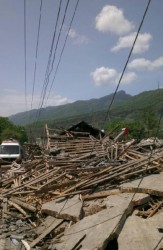

# 雅安地震札记

晚上去楼下那家铜梁人开的川菜馆吃饭，一落座老板娘就寒暄起来：“你们家那边受地震影响咋样啊？”，我答道一切安好无恙。餐馆里的电视，已经调到央视新闻频道，关于芦山地震的报道，老板娘看得很认真，还不时和我交谈。

这家人来广东已经十几年了，他们和我有着一样的省籍认同。当雅安蒙难之时，我们都强化了自己的身份意识，我们是一个命运共同体，我们有一个共同的名字——四川人。

作为一个“新闻逃兵”，我无从冲到前线，且把这些天来一些散乱的想法写成札记吧。

 **被堵塞的道路** 

这些天，重灾区的道路拥堵得很厉害。官方禁止民间车辆进入灾区，怕进一步增大了灾区道路的负荷。

拥堵的原因，有人归结为大型机械过多地占用道路，也有人说是社会车辆盲目进入地添堵，还有的则直接把罪魁归为交通管制本身。这些天我一直在注意前方的消息和报道，绝大多数我所信任的市场化媒体的记者，都指出拥堵并不是“管制”带来的结果。对于川西深山沟壑中的芦山、宝兴而言，道路狭窄崎岖，省道也只能容一辆车通过，一旦车流集聚，其通行之困难，就不言而喻。

重灾区内的伤员要外运，重灾区外的物资人员要转入，在道路资源有限的情况下，如何协调双向车流之间的关系，就变成棘手问题。当局的“交通管制”，更多出于无奈，为伤者留出救援的生命通道比什么都要重要，哪怕是牺牲物资运输的效率。

另一方面，此次芦山县地震的房屋毁损和人员伤亡情形，的确要远远小于五年前的汶川地震，当地虽然也可能存在人手短缺的情况，大量非专业人员的突然涌入给当地交通、环境和资源带来的压力却将很大程度上抵消爱心的效果。现在呼吁社会人员缓进灾区的，不只是官方机构和官方媒体，还有不少市场化媒体的记者和专业的慈善救援机构。我们决不能容忍政府和军队对于救灾的垄断，决不能接受民间力量在灾难面前的缺席，但这并不意味着我们不尊重灾区基本的秩序需求。

据《21世纪经济报道》称，不少物资已经转运到雅安，然而一天多都未得到运出。一方面是灾区的物资极度匮乏，21日甚至已开始出现哄抢等秩序混乱，另一方面却是物资的闲置。这也不能完全排除有交通阻滞的因素。

上苍给人的考验，总是多种极端因素的叠加。当灾难发生在深山沟壑之中，这无疑给人们的救援带来更大的困难。我们都没有忘记“512”之后从成都市区通往都江堰市的滚滚车流，以及车流中涌动的爱心，然而芦山县地震所在的区域，实在没有办法让每个人都以这样朴素的方式去给予最直接的力量。人们在这样偏远的地区生活，本身就是生命的自我挑战，而在这样地方发生的灾难，更考验着人性，考验着人心，考验着每一个居民，也考验每一个外来者。

虽然道路狭窄崎岖，是不可能避免的自然瓶颈。但是我们仍然可以看到一点一滴的进步，据央视报道，从22日起当地开始以单向通行方式疏导车流，已收到一定效果，而一路从成都进入灾区的志愿者也使用摩托车而非汽车作为代步手段，一方面避免“添堵”，一方面也能够成功“避堵”，再严苛的地理条件，也不能限制人们想办法努力突破，以拯救生命，改善灾区民众的境遇。

 **到底是否余震** 

芦山县地震，到底是不是汶川地震的余震？这几天也引发争议。

以中国地震局地质研究所研究员周本刚为代表的学者分析称，虽然芦山地震与汶川地震同处于龙门山断裂带，但并非汶川余震，而是独立的地震。周本刚对新华社表示，两次地震有一些相同之处，发生在同一断裂带、同为逆冲型地震，与龙门山断裂带运动性质一致，但从位置上看，芦山地震与汶川地震分处龙门断裂带不同位置。从位置上看，芦山地震发生在龙门山断裂带西南段，而汶川地震则位于龙门山断裂带中北段，两地距离较远。

但据财新网报道，中科院院士、北京大学地球与空间科学学院名誉院长陈运泰为代表的一批科学家，指出这是一次汶川大地震的强余震，而且陈运泰早在几年前对此提出过警告，有记者还专门就此向中央提交了内参。

2008年汶川地震后，陈运泰及其团队通过研究汶川地震断层面上的破裂错动的分布，得出结论，认为在汶川地震的破裂带上有两个比较大的破裂“亏空”区，即在汶川地震时基本上没有发生过破裂的地方。他当时认为，位于汶川西南约100千米的破裂“亏空”区是很有可能发生强余震的地方。而这个“亏空”区，就在雅安市的宝兴县附近。2008年5月20日，陈在一次中科院院士讨论会上发表了上述看法，强调要特别注意汶川地震的晚期强余震，并认为强余震可能拖好几年才发生，当时还有在场记者给中央政治局写了内参。

事实上，不少国外专家也持类似的看法，美国地质勘探局地球物理学家杰西卡•特纳认同芦山地震是汶川地震余震的说法，2008年9月日本产业技术综合研究所研究员远田晋次等人发表的一项分析结果也显示，受四川5.12地震影响，震区附近的断层中地壳形变正在逐渐积蓄，周边地区10年内发生6级以上强震的概率从原来的49%上升到了57%-71%。

芦山地震到底是不是汶川地震的余震，这并不只是个学术问题，更关乎到对汶川地震重建进程的问责。陈运泰说，表面上看，是否余震好像只是学术观点的不同，但是事实上，强调这次地震不是余震，隐含的目的是为了表明，没有重视到似乎就理所当然。“如果说这是余震，那么为什么地震之后对那个地方没有进行详细的调查研究？”

芦山、宝兴等都是汶川地震的灾区，宝兴县还一度登上“极重灾区”名单，被民政部指定由海南省对口援建，最终国务院虽因海南财力弱小为由没有明确海南属于对口援建省份，但宝兴县重建还是接受了海南方面的支持。客观地说，汶川地震之后四川盆地西部北部的重建地区，新建建筑的抗震标准有所提高，但应对7级地震灾难时所遭受的伤亡和损失，仍然能说明不少问题。以中国的实力，当然不可能在每一地的房屋建设上都达到日本那样的水准，但是对于有着明显的7级以上地震风险的超高危地区，其抗震标准是否应该相应提高？陈运泰认为，地震虽然无法预报，但防灾措施可以优先地震风险较大的地区。如果龙门山断裂带南段的破裂风险能引起足够重视，在这个区域加大科研和抗震防灾的投入，那么在芦山地震中，惨痛的伤亡损失也许能减少一些。

地震造成惨重损失，是天灾还是人祸？从“5.12”到“4.20”，这一问题始终没有得到完全地解答。四川盆地西北边缘地处板块接合处，地质条件复杂，然而当地水电建设方兴未艾，雅安市境内青衣江流域更是小水电泛滥。说三峡水库诱发川西地震未免危言耸听，然而川西地区地质活动频繁的背后，到底有没有在当地人为活动的因素影响？人命关天，水库建设与地质灾害的关系研究，来不得半点虚假。学术不能为某些行业利益，为了地方政府的GDP而背书。

至于防震减灾措施上的缺陷，即使我们在条件有限的情况下没有办法求全责备，也绝对需要深刻地总结。汶川地震之后国内外如此之多的善款，到底有多少真正用在了加固老百姓的房屋上，这并不是个挑动民粹的“吹毛求疵”，而是对政府效率的真实拷问。

**灾区的那些人** 

从汶川到芦山，五年时间过去，没有改变的是四川人的精神。

作为中国最重要的移民省份，自清初的数百年来，湖广人、客家人和其他民系的人士涌到四川，让四川从明末战乱之后的满目疮痍中恢复过来。这些移民的精神，是筚路蓝缕不畏艰险的精神，是坚忍不拔顽强不屈的精神。在神圣抗战中，是川人的精神顶起民族救亡的一片天空，在汶川地震后，是川人的精神让这片土地在风雨后重新站起。

20日那天，一个四五岁的小女孩受伤后，却在镜头前展现笑容。她的照片感动了无数网友，她传递出属于四川的温暖信号。有人说，她那么小，难道不更应该哭出来吗？其实，笑也好，苦也罢，她表现的是一个幼小的四川小孩的真实面貌。她的乐观，不是在镜头前装出来的，而是这片土地上人们与生俱来的。

川人的韧性，让这个喜欢安逸又乐天知命的族群，在巨大的灾难和挑战面前有着强大的抗压能力。

在这片土地上，除了笑容，还有哭声。那一年地动山摇之后，岷江畔的崇山峻岭多了许多新冢。那些新冢里埋着的，是我们同胞的父母、丈夫、妻子和儿女。那些小孩子的父母，只想要一个说法。有人为他们搜集名字，有人把他们的名字念出来，最后，他们的名字和那些找寻他们名字的人，都变成了敏感词。这是这片古老土地上始终不能遗忘的伤痛，五年过去，不得医治的伤口只得化脓。

川人的刚直，让许多本来只是随遇而安的普通人，成为政治权力之下的不服从者。他们懂得感恩，他们也绝对愿意宽恕，然而在宽恕之前需要的是解释和道歉。

在这片土地上，除了生动的表情，还有勇敢的行动。人们永远难以忘记，“5.12”之后那些献血点排起的长龙，也记住雅安地震后仅仅一天成都血库就因激增的献血者而充盈。在四川，你看到公民中国的力量在顽强生长，你看到公民责任与守望相助的力量。有一份统计说，“5.12”地震中，军队救援出一万多人，而民间互助救出的人有七万。这就是川人的力量。当着汪副阁揆，一位村民说“我们尽量给政府减轻压力，要自救”，这不是那个村民的“作秀”，反倒透出其骨子里的善良。

川人的勤勉，让这个族群可以在灾难面前保持些许尊严。也是这种精神，让这个族群可以相互簇拥取暖。媒体人石扉客在“5.12”地震后曾说，倘若同样的灾难是发生在中国其他地方，人性的丑陋或许不知道要强烈多少倍，这并非对川人的恭维。

 **一碗稀饭的感动**

交通的堵塞依然存在，物资的匮乏仍令人担忧。任何一场巨大灾难的应对，都难以做到十全十美。

虽然已暂别新闻业，我在前线的老同事、老朋友们还是让我牵挂。有时会想，与其在遥远的千里之外担心他们的安危，真的不如自己也上前线去承受同样的风险。灾情就是命令，那些奔赴雅安的记者们，也都有各自独特的收获。

今天凌晨，我偶然读到《中国青年报》田文生记者的手记，21日，他在芦山县城中央吃饭，一碗稀饭，和一碟鸭肉。吃完晚饭，他要掏钱给女老板，女老板笑着回答：“你们天远地远来帮我们，我收啥子钱哟，我还得谢谢你”。田文生说，听到这句话的那一瞬间自己“石化了”。

这几天有些人说，记者不要盲目去灾区，会消耗灾区资源给灾区添乱。《南方周末》资深编辑曹筠武说，“身处巨大悲剧中的灾民往往比电脑屏幕前的各位大神更能明白这些道理（记者披露的真相对得起那些方便面和矿泉水，对得起他们消耗的资源）。

曹筠武回忆道：“我曾经跟同事张悦晚上从汶川山上的牛脑寨返回县城，山路早被震得七零八落，山势又陡，俩人都胆战心惊的边摸索边半开玩笑说今天说不定就挂这儿了。走到半山腰看到有手电筒亮起，远远的给我们指路。下山才知道是村民看见山顶的手电光，于是站在山脚给我们当了一晚上的路标。

“我记得那几个村民说，看见半夜山上灯光，就猜你们是外面来的，那肯定要给你们指路。在那时的汶川，“外面来的”，指军队、医生、记者和志愿者，我们只有不停地道谢。村民说，你们把这里的情况传出去就是帮到我们了。”

是的，在灾难面前，记录者是个神圣的职业。尤其在中国这样一个畸形的国度，官员在，救援在，记者在，物资在。记者的镜头和笔，往往关系着灾民的矿泉水和方便面，此时，我相信我的那些老同事、老朋友们，正在我遥远的家乡，与我的父老同胞，结成休戚与共的关系。

我相信他们的勇敢，我更相信川人的善良。

祝福每一个勇敢和善良的人，都平安。

（采编：孙晓天，责编：佛冉）

