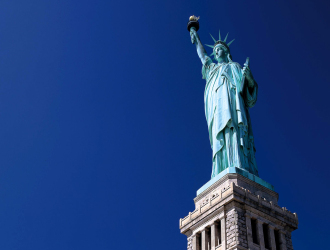
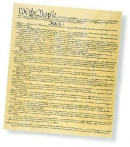
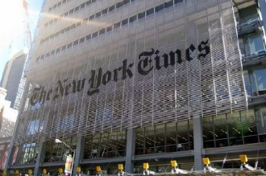

# 新闻自由在美国！

** **

**一 、 美国有没有新闻审查？**

新闻审查是新闻业内人士非常熟悉的，也是美国经常用来攻击别国新闻管制的一个理由。什么叫新闻审查呢？其实很简单，就是某个政府机构对媒体要发布的新闻预先进行检查，通过可以发布，不通过不能发布，所以，更准确的讲应该叫做新闻预审。从2012年开始，我们的邻国缅甸正式解散了新闻审查机构，废除了新闻审查制度，缅甸的民众有了新闻自由，他们朝着现代政治文明迈出了重要的一步。

美国有没有新闻审查？答案是没有。美国妇孺皆知言论和新闻自由是他们最重要的权利，美国国父之一杰弗逊说：“如果在报纸和政府之间一定要选择一个，我宁肯选择报纸，而不要政府！”自美国建国以来，从没出现一个政府机构是负责对新闻进行审查的，事实上也不允许设置这样的机构，因为这是从根本上违反美国宪法第一修正案的。历史上美国联邦政府曾经不止一次试图想要涉足新闻审查，不过大部分时候哪怕是稍微触动了一下新闻自由的基石，最终在司法干预下，铩羽而归。有那么短短的一段时间，联邦政府对新闻自由进行了一些的限制，最后结束的很不光彩。美国第二任总统亚当斯时期，美国新闻界充斥着对国会和政府的反对意见，一度发展到了对国会议员以及总统进行人身攻击甚至诽谤的程度，美国国会以当时美国处于战争状态为由颁布了临时法令《惩治叛乱法》，实行期限两年半。该法案禁止报纸对美国国会和总统进行诽谤和诋毁，违反者要被施以罚款和监禁的处罚。虽然并没有设置一个特定机构对新闻进行预先审查，但是该法案规定了什么样的文章不能发表，相当于间接对报刊进行预先审查，自然激起了民众的反对。美国弗吉尼亚州和肯塔基州议会立即还以颜色分别通过了决议案，废止该法案，州议会和国会之间的分歧让刚刚建国的美国陷入了风雨飘摇的危机，值得庆幸的是该法案的有效期只有两年半。

美国没有新闻审查，新闻发布决定权完全在于报刊自己，不过这并不是说对报刊没有丝毫约束，对报刊的法律约束在于事后追诉，譬如有人认为这个新闻让自己名誉受损，就可以向法院起诉报刊。

那么谣言怎么办？诽谤怎么办？这个问题1964年美国联邦最高法院在《纽约时报》诉沙利文一案中做出了解答，容许新闻有谣言和诽谤！

新闻怎么能容许谣言和诽谤呢？有个耳熟能详的笑话，美国作家马克吐温有一次面对记者说国会议员中有些人是狗娘养的，新闻见报后国会议员群情激愤，要求马克吐温道歉，于是马克吐温在第二天的报纸上表示收回原来的话，更正为国会议员中有些人不是狗娘养的。对于政府官员的讽刺挖苦，各种抨击，甚至人身攻击几乎是美国新闻媒体的一项传统，现任美国总统奥巴马就曾被媒体塑造为吃狗肉的野蛮人。至于新闻中的谣言，你认为每年四月一日的愚人节新闻是怎么来的呢？

按照中国人的眼光来看，很自然会想到，政府为什么不管呢。其实美国的高官天天被讽刺挖苦，心里也不好受，美国总统布什被媒体称为弱智，他的智商一度成为美国媒体嘲笑的对象，你觉得他能开心吗？问题不是不想管，而是管不了。

说来让人难以置信，美国政府对外强大到在世界各地建立军事基地，但对国内的新闻媒体却是束手无策，如同一个关在笼子里的巨人，任由媒体调戏，实在忍不住了，吼叫两声，也是威吓多过实际伤害，名副其实的纸老虎。

为什么会这样呢？倒不是美国政府官员们思想有多先进，能充分认识到新闻自由是民众的权利，不去侵犯，或者道德有多高尚，如果能管的话，政府官员们会毫不手软管制住新闻媒体。不能管的原因在于美国政府从诞生的那一刻起，就被设计成这样的，美国的制宪先贤们在商讨成立政府的时候对政府可能有一天会侵害新闻自由早有防备，他们对自己制造出来的政府是否会成为肆意侵害民众权利的怪物有着极强的警惕心，所以他们费尽心机，绞尽脑汁，在费城开了四个月的会，终于制定出一部限制政府权力，保障民众权利的美国宪法。

**二、 “约法三章”和美国宪法**

中国有句成语叫约法三章，《史记》记载，汉高祖刘邦在起义反秦的时候，民心不稳，于是他和民众订立了三条约定，杀人的偿命，伤人的判罪，偷盗的受惩罚。有了这三条约定，民心就安稳，刘邦建立了汉朝政府。

按照现代的眼光来看，约法三章算是某种统治者和被统治者之间的契约，被统治者承认统治者的地位，统治者按照约定来实施统治，多少有一点君权民授的意味。

2000年后，在大洋彼岸，远离汉朝的北美大陆，出现了类似的场景。

1774年，美洲大陆十三个殖民地不堪英国政府的压迫，他们联合起来在华盛顿将军的带领下，打跑了英国殖民者，获得了独立的地位。这十三个殖民地就是美国刚开始建国时的十三个州，每个州类似于一个小国，都有自己的政府和议会，他们的联盟很不紧密，非常松散。一个重要的原因是因为英国政府的压迫让他们对一个集权的强大的政府有着天然的警惕性，他们好不容易把一个压迫他们的英国政府赶走了，如果再自己制造出一个紧密团结的强大政府，自己州的人民就有再次被压迫的危险，那岂不是前门拒虎，后门进狼。这个联盟松散的程度甚至到了一度华盛顿将军领导的军队的军饷都发不出来，因为联盟不具有征税权。

其实很容易理解这十三个州的担忧，他们之所以要和英国开战就是因为英国贪得无厌的对殖民地进行征税，如果他们要组建一个政府，那么势必也要征税，这就有步英国政府后尘的风险？

但是当时的客观环境是战争的阴云依然笼罩在北美大陆，面对强大的欧洲，他们随时可能被入侵，州与州之间也摩擦不断，贸易纠纷，主权纷争，可以说是内忧外患。这就迫切需要他们组建一个政府，协调内部纷争，对抗外部的威胁。

1787年，十三个州分别派出了代表到费城开会（制宪会议），商谈建立政府。代表们的难处在于这个政府既要强大到足以解决内忧外患的问题，同时又不能过于强大侵犯到州和民众的权利。经过将近半年时间不断的商讨，争论，妥协，制宪代表们终于拿出了一个组建美国联邦政府的方案，这个方案就是美国宪法！宪法制定后，因为民权条款的缺失，后来任美国总统的杰弗逊起草了十条修正案，作为对宪法的补充，这十条修正案又叫《权利法案》，四年后获得通过，为美国宪法补充了民权方面的内容。

我们常说，美国是个法制国家。这其实和制定宪法的美国国父们不无关系，要知道55位制宪代表不仅学识渊博，熟悉当时欧洲各种先进的政治理论，而且其中有34位是律师，后来起草《权利法案》的杰弗逊也是律师，他们严谨的遵循法律程序的思维模式对未来美国政府的运作起到了至关重要的作用。直到今天，这部美国宪法依然运行良好，美国政府的状态也达到了美国国父们的期望，我们现在看到的美国正是如此：对外是个强大的政府，对内则保障民权和州的独立自主。

美国宪法其实是一份契约，或者说合同，合同的一方是美国人民和州政府，另一方是美国联邦政府。这份合同规定了州政府把一部分权力让渡给联邦政府，划分出他们之间的权力边界（州政府和联邦政府之间不是上下级关系），以及保障民权的约定，还规定了联邦政府的详细运作方式，行政权，立法权，司法权三权分立，以及这三权产生的方式。州政府让渡给联邦政府的权力比如军队和外交的权力保障了联邦政府的强大，而对政府的约束和运作方式的规定则避免因为政府过于强大而侵犯到州和人民的权利。

之所以美国政府不能建立新闻审查机构，官员们对于新闻媒体的讽刺挖苦甚至造谣诽谤毫无办法的原因就在于美国宪法中对联邦政府的一条约束：宪法第一修正案。

这条修正案原文是：Congress shall make no law respecting an establishment of religion, or prohibiting the free exercise thereof; or abridging the freedom of speech, or of the press; or the right of the people peaceably to assemble, and to petition the Government for a redress of grievances.（国会不得制定有关“确立国教或禁止信仰自由、剥夺言论自由或新闻出版自由、剥夺人民和平集会和向政府请愿伸冤的权利”这些事项的法律。）

按照美国宪法规定，美国联邦政府立法权属于国会，执法权属于行政，司法权属于法院，这三者相互独立。如果政府要管制新闻，执法部门必须有法可依，但是宪法第一修正案明明白白限制了国会对管制新闻进行立法，所以美国没有新闻法，美国政府管制新闻也就于法无据。在短短200多年的美国历史上，美国联邦政府和新闻界的冲突持续不断的在发生，但始终处于下风，其关键的原因就是宪法第一修正案的存在。美国的记者被称为无冕之王，原因就在于各行各业，能得到宪法保护的职业只有新闻业，这独特的地位也让记者成为了制约和监督美国政府，保障民权的中坚力量！

因为美国没有管制新闻的法律，所以有关新闻的约束全部依靠新闻媒体的自我约束，由新闻媒体自己来决定，政府不能插手。但是这并不是说新闻媒体就可以无法无天了，如果被抓到确凿的证据是恶意的谣言诽谤并且造成了损失也是会被告上法庭受到惩罚的。最关键的地方是新闻发表前无法干涉，只有在发表后才能追偿，而追偿也必须遵循法律程序，由独立的司法部门作出裁决。

照中国人保守的眼光来看，美国的新闻，无疑是乱象丛生的，广泛的新闻自由造成各种各样五花八门，千奇百怪的现象，对公众人物的嘲讽，当然也包括各种有才的有创意的论调基本上等同于中国人在网络上看到的各种热贴（归功于网络的自由度，我们其实可以发现中国和美国其实没有本质的区别，可见这种自由中国人也并不是不能接受），在布什任总统期间，媒体对布什的嘲笑可谓是极尽挖苦之能事，有些脱口秀节目甚至在布什卸任之后还在瞎起哄。以一个非常流行的段子为例：布什总统、副总统和一众官员参加会议，遭遇暗杀，送院急救。记者们闻风赶到医院。问医生：“请问总统有救吗？”医生摇摇头说：“唉，总统没救了！”记者又问：“那副总统有救吗？”医生又摇摇头说：“唉，也没救了！”记者问：“那到底谁还有救？”医生精神一振说：“国家有救了！”

如果新闻容许谣言和诽谤，那谣言满天飞，整个社会不是乱了吗？恰恰相反，在新闻自由的环境下，美国的新闻职业道德却并没有变得不堪，随着时代发展，反而越来越进步，讲究新闻伦理的媒体逐渐发展壮大，受到人们的普遍信任，而不注重新闻伦理的则沦为八卦小报，人们平时看着娱乐，谁也不会当真，这也充分说明公众对于新闻是有自我分辨能力的，媒体有着自净化能力。事实上新闻自由反而遏制了真正的谣言，因为如果有谣言出现，自由的媒体就会很自然的去质疑查证，澄清事实。

虽说美国政府拿新闻界办法有限，但一些遭受新闻媒体诽谤攻击的官员却不能就这么算了，诽谤政府没什么事，但是如果你对我个人造谣就是可忍孰不可忍了。在美国，把媒体告上法庭的案子数不胜数，这些案子有输有赢，其中非常经典的一件案子发生在1964年，《纽约时报》诉沙利文案。不过，在介绍这件案子之前，我们先来了解一些比较有意思的概念。

**三、 几个新奇有趣的概念**

在很多的国家的宪法上都有相关言论自由的条款，可是没有落到实处的国家为数不少。这就让我们产生了这样一个疑问：到底是什么保证了美国宪法的权威性？要理解这一点，先要明确几个新奇且有趣的概念。

**联邦政府**：我们经常听到的美国政府其实指的是美国联邦政府，在美国还有州政府，外交权由州政府授权给联邦政府，联邦政府代表美国和其他国家建立外交关系，和其他国家打交道的都是联邦政府，我们谈论的美国政府基本上指的是联邦政府。联邦政府和州政府之间没有上下级关系，美国50个州，各有各的宪法和议会，州长也都由各州自己选举产生。联邦政府和州政府权限规定非常明确，各管各的，本州的事务州政府管辖，涉及到州与州之间的事务联邦政府管辖。比如一起杀人案，一般是由州警察局处理，但是如果发现另外一个州也有相似的命案，嫌疑犯是流窜作案，那就不只是一个州的事情了，案件就交由联邦调查局（FBI）来调查。

**联邦最高法院**：和政府机构一样，美国的法院也分为州法院和联邦法院，每个州都有一个州最高法院（得克萨斯州有两个最高法院，一个管民事，一个管刑事）作为州最高司法机构，美国联邦最高法院是美国的最高司法机构。联邦最高法院是解释美国宪法的最终裁决者，这项解释宪法的权力叫司法审查权，联邦最高法院的司法审查权正是保证美国宪法能够被实践的原因。如果国会通过的法律被联邦法院判定违宪，那就相当于宣判了这项法律的死刑。美国建国200多年来，联邦最高法院判定国会立法违宪的案例超过100件。最高法院设置9名大法官，他们有很高的独立性，为了保证这种独立性，9名最高法院的大法官都是终身制，除非辞职或者遭到国会的弹劾，只要在世，永远是大法官，这种独立性可以让最高法院顶住媒体舆论的压力，从而在法律上维护少数人的正当宪法权利，对抗多数人的暴政。联邦最高法院的判决形式也和一般法院判决不太一样。因为大法官是9名，所以由9个人投票，票数多的叫做多数派意见，票数少的叫少数派意见，不管是多数派和少数派，他们的意见都会被记录下来，多数派或少数派意见内部有时候也会有分歧，同意判决结果，但是所依据的法律意见不一样，也会作为意见书记录下来。这些意见将被历史所检验，有一些尽管是少数派意见但也会因为时代和文明的发展显示出睿智和远见。

**听证会**：听证会显然不是涨价会。听证，顾名思义，就是听取证据，它是一种审判案件的模式，辩诉双方进行辩论，摆事实讲道理，对证人进行质询，对证据发表意见，法院审案子都要召开听证会，双方律师进行激烈的庭辩。联邦最高法院的庭辩相对比较简单，每一方的律师只有半个小时的时间，包括大法官对律师进行诘问，律师作出回答的时间。这种审判的模式和中国人传统的审判很不一样，它的主角并不是高座公堂之上的青天大老爷，而是辩诉双方的辩论本身，这有点像前些年非常流行的国际大专辩论会。另外，美国国会也有听证会，这种听证会和司法审判有所不同，一般是对国内重大事件进行调查。国会听证会并没有明显的辩诉双方的辩论，而着重在对证人进行质询，以还原调查真相。举个例子，比如美国发生了动车事故，有人员丧生，有必要的话国会会举行听证会，各种证人，从制造商，到调度员，从目击者到生还者，以及各种专家都会一一作证，接受国会质询。这样的听证会是完全公开的，电视会对国会听证进行直播，全美国都可以看到。（美国国会是天天电视直播的，国会现在在讨论哪件国家大事，你打开专门的电视频道就知道了。）

**联邦司法部**：乍一听，这个部门的名称似乎来头不小，按中国人的习惯，可能会以为司法部是管着法院呢。其实，联邦司法部不但跟美国的法院系统风马牛不相及，甚至它的权力也极其有限。我们知道，美国的法院是独立于政府的，如果政府被起诉了，或者政府要起诉（主要是控告罪犯，即公诉），产生法律纠纷的时候，司法部就会代表美国政府上法院打官司。说白了，就相当于一个律师事务所，为美国政府提供法律咨询，代理的服务。司法部的优势在于由于它代表的是联邦政府，所以它获取证据会更加容易，它可以调动联邦调查局，而普通的律师事务所恐怕只能请私家侦探。

**判例法**：美国的法院判案会采用一个很有趣的法律依据——判例法，一个案件判决后，以后类似的案件将都参考这个案件的判决作为法律依据。不过俗语说的好，人非圣贤，孰能无过，虽然联邦最高法院的大法官个个学识渊博，舆论口碑公认非常公正，但有时候也会出现被认为是糟糕的判决，比如1857年联邦最高法院以7：2的结果否决了黑人奴隶斯科特获得公民身份的诉求。这个判决从法律上可以说维护宪法第五修正案公民的财产权（当时美国南方的州还存在奴隶制，奴隶属于财产），但是用现在的眼光看显然很荒唐。要推翻联邦最高法院的判例应该说并不容易，有两种办法：一是采用宪法修正案的方式，比如美国宪法第十三，第十四修正案废除了奴隶制，确立了黑人的公民身份，这就推翻了斯科特案的判决。这种方式非常困难，它需要达到的条件是国会众议院，参议院都要达到三分之二多数通过，同时要在规定的时间内获得四分之三的州通过。第二种方法是联邦最高法院在新的案件中自己推翻以前的判决，比如1951年丹尼斯诉美国案，最高法院以6：2裁定丹尼斯煽动武力推翻政府违反《史密斯法》（丹尼斯在私人聚会中发表了无产阶级武装夺取资产阶级政权的观点，是不是很熟悉？没错，丹尼斯就是当时美国共产党总书记），少数派意见中布莱克大法官认为这种言论属于宪法第一修正案要保护的言论自由的范畴。后来在1957年的耶茨案和1969年的布兰登伯格案中最高法院分别以6：1和一致裁决推翻了丹尼斯案的判决，确立了言论自由包括理论上鼓吹暴力和不遵守法律的自由，只要言论不造成现实且迫切的危险，都受到宪法第一修正案的保护。这个意思就是说，报纸上发表暴力推翻政府的言论是合法的，但是如果你发表具体行动计划，比如几点几分，具体地点在哪里，大家一起带上枪来实施暴力活动这就是现实且迫切的危险，已经超出言论范围，这就要被禁止了。问题在于，在一个自由成熟的社会，鼓吹暴力的报刊恐怕读者很少，会卖不出去，因为虽然没有法律约束，但人还有道德观念，暴力毕竟是反道德的。

**四、 新闻自由和《纽约时报》诉沙利文案**

权利之间有时会产生冲突，新闻自由也不例外，如果新闻不真实不客观有损被报道的人物特别是公众人物的名誉，就会被指控为谣言和诽谤，《纽约时报》诉沙利文就是这样一起案子，这起案子之所以经典是因为联邦最高法院在新闻自由和政治人物的名誉权之间划了一条明确的界线，而这条界线大幅度的倾向于新闻自由这边，联邦最高法院以9：0的一致裁决判决《纽约时报》胜诉。

在美国南方几个州还存在种族隔离的时代，美国黑人的民权运动如火如荼，《纽约时报》诉沙利文案就和著名的美国黑人领袖马丁路德金有关。1960年，马丁路德金联合了一些支持民权运动的人士，在《纽约时报》上发布了一整版的题为“关注他们的呼声”的广告，广告揭露了南方一些州对黑人争取平等的示威活动进行镇压。问题是，这则广告的部分内容是不真实的，它把一些警察的合法执法行动当成了对示威活动的镇压。虽然政府不能对《纽约时报》进行管制，但是有些官员坐不住了，沙利文就是其中之一。沙利文是阿拉巴马州蒙哥马利市负责警察局的一位官员，他认为这则广告是在诽谤他的名誉，于是一纸诉状，将《纽约时报》告上了法庭。

该案的初审由阿拉巴马州地方法院审理，州法律对诽谤的民事索赔比较宽泛，你只要证明是诽谤，就算自己没有遭到实际损失也可以索赔，这当然很容易证明，且清一色都是白人的陪审团很难说没有偏向性，最终陪审团裁定《纽约时报》向沙利文赔偿名誉损失费50万美元。这个判决一出，其他相关的官员纷纷效仿，一时间，对《纽约时报》的索赔接踵而来。尽管《纽约时报》上诉到了阿拉巴马州最高法院，但还是败诉。

1964年，联邦最高法院接受了《纽约时报》对此案的上诉，最终以9：0否决了州法院的判决。联邦最高法院认为，媒体是没有办法保证新闻的每一个细节都是真实毫无瑕疵的，如果动辄以诽谤施加惩罚，那么媒体就会因为害怕承担责任而不敢批评官员，这实际上是在压制言论，违反了宪法第一修正案要保护的新闻自由。

联邦最高法院的判决给媒体对官员的诽谤是否需要被惩罚划出了一条界线，那就是除非官员能够证明媒体对于官员的诽谤是出于“真正的恶意”，才能惩罚媒体。官员除了证明新闻报道是失实的，还要证明媒体是恶意的，当然同时还需要证明自己受到了损失。在这个案件中，沙利文不能证明《纽约时报》有“真正的恶意”。

这个判例影响了后来很多相关的案件，成为维护宪法第一修正案的经典判例。

之后，联邦最高法院又把 “真正恶意”的原则扩大到了公众人物（对普通人的诽谤并不在此例，除非涉及公共事件）。因为公众人物是受瞩目的，当他受到诽谤时可以利用自己掌握的社会资源，来澄清和反击对他的诽谤。现在的美国八卦媒体肆无忌惮深挖名人隐私，为了吸引眼球甚至不惜造谣正是仗着宪法第一修正案对言论和新闻自由的保护。名人们在享受名声带来的好处的同时，必然要承受由此带来的坏处，这也算是一种公平吧。2012年，著名影星章子怡以诽谤为由把一家刊登有关章子怡“丑闻”的小网站告上了法庭。虽然目前案件还在听证，在洛杉矶法院查到该案最近一次听证会是在2013年2月22日（该次听证因故取消，这是章子怡一方第四次取消预期的听证会了，似乎章子怡的律师对该案采取了拖延策略，这种方法也是有钱人对于一些弱势小报采取的方法，消耗小报的资源，毕竟律师费和调查费用是很贵的，很多小媒体就会经不住而面临破产），但目前的情形对章子怡却很不利，联邦最高法院关于《纽约时报》诉沙利文案的判例很明确，如果章子怡拿不出“真正恶意”的证据，官司必输无疑。同时加州的州法律另外还有对新闻自由的保护条款（当媒体因资金匮乏而无力在法庭上捍卫自己的第一修正案权利时，法庭在判决起诉无效的情况下，让原告赔偿媒体的律师费和合理的损失费）。如果案件被法官裁定不成立，章子怡可能还要支付那家网站请律师以及相关的费用，章子怡为此要预先缴纳20万美元的保证金，这是为了防止小媒体如前文所述被有钱人拖垮的一个法律条令。可见美国对于宪法第一修正案的保护已经到了何种地步。 `

当然如果媒体的“真正恶意”证据确凿，就会被法院判定诽谤成立，这个时候惩罚是比较严厉的，媒体会因惩罚金高昂面临倒闭，关门大吉。

从这里我们看到联邦最高法院的判决其实并不是在裁定谁对谁错，因为两方都是有道理的，它只是在寻找一个平衡点，判决不能十全十美，关键是找到一个最不坏的结果。在保护公众人物的名誉权和保障新闻自由之间，美国联邦最高法院认为保障新闻自由更重要！

**五、 新闻自由和五角大楼文件泄密案**

新闻媒体对官员的抨击会导致名誉权和新闻自由之间的对抗，那么新闻媒体对“国家机密”的挖掘，把政府的机密文件公开刊登在报纸上就势必带来政府维护国家利益和媒体捍卫新闻自由之间的对抗，1971年美国新闻界和美国联邦政府就因此对簿公堂。

事情是由一份被联邦政府列为高度机密的文件所引发的。在美国陷入越战泥沼的1967年，美国国防部秘密成立了一个越战历史报告组，对美国的对越政策进行研究分析。历经两年的时间，报告组拿出了一份报告，即“五角大楼文件”。这份报告十分庞大，囊括了大量官员的个人和官方的文件记录、会议记录、电话记录、备忘录等等，总计7000多页，250万字，把美国的对越政策的决策过程完整的呈现出来，揭示出美国是如何一步一步陷入越战泥沼的，最要命的当然是官员的决策失误导致战争的升级。

当时美国国内的反战呼声日渐高涨，五角大楼文件泄密案的主角埃尔斯伯格因为自身经历让他成为一个坚定的反战者，由于工作关系，他接触到了这份机密文件，通过阅读这份文件他感到美国陷入越战是多么愚蠢，他要通过把这份文件公之于众来结束越南战争。在通过各种合法的渠道来公开这份文件失败后，他想到了新闻界。

他租了一台复印机，利用工作的便利每晚把文件偷出一部分，复印后再还回去，把这套文件复印出来之后，他联系《纽约时报》以发表这些文件。

《纽约时报》权衡利弊，虽然认为必然会导致政府的强烈反弹，但是还是准备连载发表这批文件。不过为了避免法律风险，编辑还是把文件中涉及到美国政府的武器计划，正在进行的外交决策等可能影响到美国国家利益的内容删除了，毕竟战争还在进行中。

必须要提到的是在最高法院以前的判例中曾经确立过一个政府制止报刊发表文章的一个标准，叫做尼尔标准。尼尔是明尼苏达州一个报刊发行人，他的报刊是个什么报刊呢，是个专门污蔑诽谤的报刊，有一次造谣之后被明尼苏达州检察官告上了法庭，要求报纸不再刊登这些谣言，在州最高法院获得支持，尼尔上诉到了联邦最高法院。1931年，联邦最高法院推翻了州最高法院的判决，联邦最高法院认为对于文章发表后造成的损害可以惩罚，但是不能提前制止，因为制止发表相当于事先审查，这侵犯了新闻自由，是违反宪法第一修正案的。首席大法官休斯认为，即使是恶意造谣炒作，也有新闻自由的保障。不过在该案判决书中，休斯大法官确立了一个政府可以“预先禁止”的标准，这个标准规定报刊泄密必须达到了公布军队出征的人数，日期，以及地点这样的程度才能禁止报刊发表。可见，《纽约时报》在发表五角大楼文件时还是有所忌惮的。

《纽约时报》关于五角大楼文件连载直到发表第二期后联邦政府才反应过来，一方面是因为第一期是星期天发表的，星期天政府不上班；另一方面是因为该文件属最高机密，除了国防部有限的几个人知道，司法部根本一无所知，所以国防部和司法部还要进行沟通。第二期连载发表后，司法部长紧急给《纽约时报》发了一封电报，说该文件属于机密，发表该文件违反《反间谍法》，有损国家利益，要求《纽约时报》停止发表。《纽约时报》并不买账，不但在第二天如期发表了第三期连载，而且还发布了针对该电报的一个声明，说保障人民的知情权符合美国国家利益，配的标题是：“司法部长要求停止发表文件，遭到《纽约时报》拒绝”，给了司法部长一个下不来台！

于是司法部向位于纽约的联邦地方法院（事涉联邦政府，管辖权属于联邦法院）紧急申请，要求法庭发出禁制令，停止《纽约时报》的发表。事关国家机密，法官自然不敢草率从事，召开了紧急听证会。对法官来说，作出判断的难点在于一方面宪法第一修正案要求不得事先禁止新闻的发表，但同时他又吃不准这些被标为机密的文件是不是符合可以被事先禁止的“尼尔标准”，毕竟文件有7000页，不是一天就可以看完的。于是，法官作出了一个稳妥的决定，他签发了一个临时禁制令，暂时禁止《纽约时报》发表这些文件，三天后进行进一步的听证，再做判决，他实际上给了司法部三天的时间来说服法庭发布这些文件会带来国家利益的损害。

临时禁制令签发后，成了大新闻，法庭不在事后施加惩罚，而是事先禁止报刊的发表在美国是非常罕见的，何况事涉联邦政府机密文件，自然引起了轰动。

让联邦政府始料未及的是，这个时候，《华盛顿邮报》接过了《纽约时报》的工作。《华盛顿邮报》和《纽约时报》一样是美国的大报，这两家报纸历来竞争激烈，这么重大的新闻邮报没份，自然十分憋屈，于是私下里积极联络机密文件的提供人，而《纽约时报》的暂停发表也让机密文件的提供人埃尔斯伯格十分不满，就找到了《华盛顿邮报》，邮报大喜，两下里一拍即和，于是马上开始发表五角大楼机密文件的系列报道。

这一次司法部的反应要快一些，邮报发表的当天下午，司法部就做出了反应，在和邮报私下的交涉被拒绝后，马上起诉到华盛顿地方法院。不过，和纽约的法官不同的是，华盛顿的法官倾向于新闻界，他表示司法部拿不出任何证据证明发表这些文件会带来国家利益的损害，于是他拒绝签发对邮报的禁制令，不过同时他也警告邮报如果继续发表，可能会导致政府事后起诉，遭到惩罚。

法官一做出判决，司法部立刻向联邦上诉法庭提出了上诉，这一次，他们获得了和纽约一样的暂停发表的临时禁令，为了阻止邮报第二天再发表文件，这一切都是在一天内完成的。与此同时，纽约的进一步听证的结果对联邦政府十分不利。法官要求联邦政府承担举证责任，证明发表这些文件会带来迫切的，紧急的危险，给国家利益造成损害，但司法部始终不能提供证据（250万字的文件，看完也要几个月，要马上拿出证据，也难为司法部了）。

就这样来来往往，几天之内，双方的律师在两地进行了激烈的庭辩。从法律角度上讲，司法部是占劣势的，司法部依据的《反间谍法》是不能用来限制新闻媒体的，实际上在1917年《反间谍法》在国会通过的时候，国会就删除了一条关于总统有权在战争时期禁止媒体发布能被敌人用来损害美国国家利益的新闻的条款，国会认为这条条款事实上是对新闻进行审查，有违反宪法第一修正案之嫌。而且司法部又不能拿出证据来证实国家利益会受到损害。新闻界则理直气壮，一方面，宪法第一修正案在为他们撑腰，另一方面，他们认为政府自行规定的机密是单方面的规定，它只能限制政府的雇员，不能用来限制新闻界，否则新闻界就无法揭露政府的暗箱操作，政府会用机密掩盖丑闻，侵害人民的知情权。

就在双方在法庭上激战正酣的时候，对联邦政府更加不利的事情发生了。《纽约时报》和《华盛顿邮报》暂时不能发表文件，其他媒体机会就来了，位于芝加哥，波士顿等地的全国大大小小十几家报纸都通过各种渠道弄到了一些五角大楼文件，开始发表这些文件。

纽约和华盛顿两地的联邦上诉法院经过共17名法官的投票，分别作出了判决，纽约的八名法官以5：3裁决案件要进一步听证，在进一步听证之前，由联邦政府列出一个表，说明哪些文件是不能发表的，在此期间，《纽约时报》暂时不发表这个表上的文件。华盛顿的九名法官则以9：0裁定支持《华盛顿邮报》可以继续发表这些文件。

于是《纽约时报》向联邦最高法院上诉要求推翻纽约的判决，而司法部则上诉要求推翻华盛顿的判决，相同的案子，不同的判决，联邦最高法院不得不接受这件案子了。

联邦最高法院否决了司法部秘密听证的要求，公开审理了此案，听取了三方律师的庭辩，开庭时旁听席座无虚席！其实经过这么多日子司法大战，代表政府一方的司法部已经是黔驴技穷了，最后结果也不出意料。最高法院在几天后作出判决，《纽约时报》和《华盛顿邮报》可以继续发表五角大楼文件，美国新闻界就宪法第一修正案和政府的对决获得了一次重大的胜利。大法官的意见书中的论述表明了联邦最高法院对新闻自由的态度：“没有一个自由的、获得充分信息的新闻界，就不可能有脱离蒙昧的人民。”“只有一个自由的、不受约束的新闻界，才能揭露政府的欺瞒。”“自由的新闻界的重大责任是防止政府任何一个部分欺骗民众。”“宪法第一修正案的首要目的是防止政府压制新闻界，约束信息流通。”

可见，在国家机密和新闻自由之间，美国联邦最高法院同样倾向于新闻自由。

**六、 言论自由和焚烧国旗案**

说新闻自由自然不能不提言论自由，言论自由虽然受到宪法第一修正案的保护，不过也不是一帆风顺的，在历史上美国也有人“因言获罪”，美苏冷战时期，美国共产党总书记丹尼斯就因为宣扬暴力推翻政府而被判有罪。但是在现在的美国，言论自由的权利得到了更好的保护，丹尼斯案被后来的判例所推翻，现在的美国共产党可以完全合法的宣传“无产阶级武装斗争夺取政权”的理论。

美国联邦最高法院对于言论是否要被禁止提出了一条“现实且迫切的危险”的标准，一个非常经典的例子就是在人满为患的剧场内故意大声呼喊“着火了”，这种言论已经不是单纯的表达，可能造成严重的事故，带来“现实且迫切的危险”，这必须被禁止。但是并不会带来“现实且迫切的危险”的言论，即便是宣扬暴力的，也受到宪法第一修正案的保护。举个例子，你可以在白宫门口，在不影响交通的情况下（以免交通警干涉），宣传大家应该联合起来，暴力推翻美国政府，只要不涉及到具体的时间，行动计划（如果涉及到时间计划则可能会因为现实且迫切的危险而被逮捕）。只不过，问题在于，这种言论恐怕没什么人会听，因为大家都知道，如果要暴力推翻美国政府，必须获得大量的支持，但是如果你能够获得大量的支持，你为什么不去竞选美国总统呢？这不是比暴力推翻政府更容易吗？

可能有人会问，那么种族歧视的言论呢？难道也受到宪法第一修正案的保护？没错，在法律的角度上，种族歧视言论同样受到保护，可以自由发表。但是问题在于，种族歧视的观念在美国实在太令人反感，太令人鄙视，你发表这种言论法律管不着你，你可能会面临被解雇，面临各种鄙视，如果言论过激的话，甚至你的家门口会有人抗议（你看，人家也有言论自由表达对你的抗议），朝你吐唾沫，偷偷扎破你的车胎等等，所以即便你有种族歧视的想法，最好还是不要说出来为好！

言论自由并不区分言论是否正确，即便是谣言也属于言论自由的范畴。当然，造成损害的谣言要受到法律的事后追诉，如果你起诉的话。譬如我如果大造美国总统奥巴马的谣言，造成了奥巴马的形象损害，奥巴马能做的只能是到法院起诉我，或者自己面对新闻媒体来澄清谣言，他唯一不能做的就是让我闭嘴。实际上，在自由言论的环境下，谣言的生存力是很小的，很快就会被揭穿和澄清。

有一种受到宪法第一修正案保护的言论比较有趣，从表面上看，它是一种行为，并非言论，但它是表达性的行为，现在比较流行的行为艺术就属于这种行为，它相当于是言论。美国曾经闹得沸沸扬扬的焚烧国旗案就体现了对这种言论自由的保护。

热爱自己的国家是一个为大多数人所接受的观念，美国也不例外，而国旗作为国家的象征和标志，自然就受到爱国者们的崇敬。美国建国后，50个州当中有48个州通过了保护国旗的相关法律条款。

1984年8月，美国共和党全国大会在得克萨斯州的达拉斯举行，一些反共和党的人就在当地举行了抗议活动，抗议里根为总统的共和党政府。抗议人群高喊口号，同时顺手把一面国旗扯下了旗杆，他们来到市政厅门口，抗议首领约翰逊开始焚烧这面国旗。

自然，焚烧国旗的行为让很多爱国者感到义愤填膺，在后来的法庭上，不止一位证人作证说他们感到被严重冒犯了。当地警察很快逮捕了约翰逊，检查官根据州法律向法庭起诉，这起州政府诉约翰逊的案件显然并不难判，第一，州法律有明确的条款，第二，损毁国旗证据确凿，所以陪审团做出了一致的裁决，判决约翰逊有罪。法官判处约翰逊一年监禁，以及2000美元的罚款。

约翰逊不服，将此案上诉到了得克萨斯州最高法院，这一次，没等联邦最高法院出手，州最高法院的法官维护了宪法第一修正案的言论自由权利。其实这跟联邦最高法院之前判决的另外一起案例有关，因为美国使用判例法，联邦最高法院的判例可以作为法律依据来判决美国其他类似的案件。这起案例由西弗吉尼亚教育局强制规定所有公立学校的学生每天要向国旗致敬而引发，有些宗教家庭的孩子不愿意向国旗致敬，从而引起诉讼，最后联邦最高法院判定向国旗致敬是一种表达性的行为，是一种言说形式，所以受到宪法第一修正案的保护，如果政府强制学生向国旗致敬，无疑侵犯了学生的言论自由。

得克萨斯州最高法院引用了这个判例，推翻了对约翰逊的定罪。因为约翰逊的行为同样也属于表达性的行为，他是在言说自己的思想观念，当然受到宪法第一修正案的保护。不过问题在于，州最高法院最多只能判定违反州宪法，违反美国宪法的州法律，州最高法院是无权宣布违宪的，所以这个皮球最后还是踢到了联邦最高法院那里。

联邦最高法院受到了大量爱国者的压力，不过最终法院还是以5：4裁决约翰逊无罪，在判决书中，大法官们表达了自己的爱国之情，但是不得不痛苦的做出一个严酷的决定，虽然他们不喜欢，但是它是对的，在宪法和法律决定结果的意义上，它是对的。“一个痛苦又基本的事实是：国旗保护那些蔑视它的人”。

这个判决最大的影响在于判决相当于宣布了48个州有关保护国旗的法律的失效，当然引起了强烈的抗议（抗议者们大概没有想到大法官们维护的正是他们抗议的权利），甚至连布什总统也加入到了抗议的队伍中（个人认为这厮应该是为了提升自己的支持率，典型的政客）。美国国会为了表示自己的愤慨，很快通过了《国旗保护法》。美国的司法体系中，联邦最高法院无权干涉国会立法，国会立法的违宪判定必须要有案子上诉到最高法院，最高法院才有权进行司法审查。为了把篓子捅到最高法院，就在《国旗保护法》生效的当天，约翰逊就在美国国会大门口，国会山的台阶上再次焚烧国旗，有趣的是这一次他来晚了一步，已经有另外一位妇女抢先在这个地方烧了一次国旗了。当然，案子又摆到了最高法院大法官的案头。和上次一样，同样是5：4的裁决，《国旗保护法》被判定违宪。最高法院大法官的独立性可见一斑，即便受到大量的舆论压力，只要认为是对的，就坚守宪法底线。

显然让最高法院推翻自己的判决是不可能了，但是美国制度的好处就是你往往会有合法的程序来改变你认为不公正不合理的地方，美国总统布什呼吁通过宪法修正案来改变最高法院的判决，于是爱国者们开始推动通过保护国旗的宪法修正案，如果宪法修正案获得通过，那大法官们自然也只能按照宪法来行事了。但是，通过宪法修正案并不是件容易的事，首先要获得国会参众两院三分之二多数通过，之后还需要在规定时间内获得四分之三的州通过，用通过宪法修正案来推翻最高法院的判决，美国历史上大概只有寥寥数次而已。

虽然经过爱国者的不懈努力，但保护国旗的宪法修正案几次都在国会参议院的投票中以数票之差败下阵来，而且一年不如一年。事实上大多数反对通过宪法修正案的人并不认同焚烧国旗的这种行为，他们只不过认为应当保护焚烧国旗的人表达的权利，用流行的话讲就是我不同意你说的话，但是我坚决捍卫你说话的权利。

有趣的是，最高法院判决后，美国国内就基本上见不到焚烧国旗的了，有句话道出了其中本质，连国旗都让你烧了，那你烧它又有什么意义呢？

（采编：宋安琪；责编：彭程）
