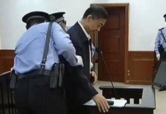
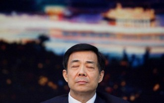

# 以自白书说都督案

庭审帷幕悄然落下，台下观众意犹未尽，对于今年的中国法庭，甚至可以夸大些说，对于今年的中国而言，这都是一出波澜壮阔的大戏。薄都督力战公诉方，除了对其身份证据保持认可之外，对例如受贿及贪赃枉法的各项证据都均予以否定。根据庭审后数据统计，薄都督在庭审中最常说的一句话就是：我不知情，这件事情我不知道。

而面对此种情况，公诉方似乎有些慌乱，在第一天庭审，薄都督全面翻供的情况下，无论是公诉还是证人反击都不算迅速。尤其是薄都督二十一连问，证人连续进入其设置好的逻辑中，反而显得薄都督形象高大了起来。

在如此困境，公诉方很自然地就将纪委审查薄的时候所形成的《自白书》与《认罪书》列于公堂之上，希冀将其作为证据，以证明薄都督的情况，以彰显其前后说辞不一。

我们可以就《自白书》与《认罪书》进行合理假设，一般来说，在纪委审查阶段，“犯事儿”的高官都会以自己提供上述材料为条件，与纪委部门进行所谓的“内幕交易”，比如不移送司法机关。然而在薄都督陈述了上述材料之后，却最终还是进入了法律程序，结果使得薄都督全面推翻了自己的供词并且当庭反驳。这样的假设或许就可以较好的解释这两样材料为何存在，而薄都督又为何翻供了。

然而在公诉方向法院提交《自白书》与《认罪书》作为证据，却又引出了两个更大的问题。

第一：纪委审查阶段的文书，是否可以作为定罪证据？

在法庭审判中，自书认罪依据阶段不同，也具有不同的效力。比如在检查取证阶段的自白书，可以作为具有效力的法庭证据，然而这在本案当中是缺失的。纪委审查过程中的自白书与认罪书，却又因为其取证方式的尴尬性质，使得证据效力颇为头痛。

纪委审查是党对干部的审查，它无法解决更无法代替实质法律效力的审查，其本身的取证行为是无效的。这也就导致最终薄都督的《自白书》与《认罪书》是毫无法律效力的，无法采信。

这也是薄都督案件审理中的一个极为明显的特点。

薄都督翻供，公诉方拿出《自白书》与《认罪书》说你是翻供，然而这两样“证据”却无效。法庭在审理的过程中，当然不能仅仅依靠口供进行定罪，所以这样的审判逐渐朝向其他客观证据倾斜。正如陈有西先生所说，“不论薄犯有多大的罪行，不能靠自证其罪的纪委审查自白书来证明有罪。”

所幸此类证据尚且周全，受贿罪相关款项的走向，以及证人证言，物证书证，行贿细节等等都还有较强的关联性存在，能够形成较好的证据链。比如薄与谷在国外的住宅，比如保险柜里的相关金额，再比如证人陈述的相关证言，都进一步削弱了薄都督不认罪的负面影响。

但即使是如此情况，公诉方的攻击仍显乏力疲软，往往给人带来顾左右而言他的感觉。这也就很明显的带来了下面这个问题。

第二：纪委阶段的其他记录可否作为证据？

既然公诉方已经将他们所认为的具有佐证效果的《自白书》与《认罪书》陈设公堂，那么其余的审查报告或者书面文字是否也对于案情具有相关帮助？在必要的时刻，能否作为特定内容由法院调取？

历数我国的高官审判，大多数都是以经济类犯罪作为控诉的重点内容。这也符合人们对于高官审判的一贯认知，既以经济犯罪为条件一定限度的弥补政治错误。薄都督的案件也可以很明显的看到这样的踪迹。

在控诉过程中，公诉方的许多证据都直指其经济上的问题，而对于其从政阶段的其他问题避而不谈。这既是公诉方频频发难却频频失手的原因，也是庭审刻意回避的一个重点问题。然而薄熙来所贪赃枉法的金额与以往的高官犯罪截然不同，既不是动辄上亿，也不是豪车洋房，实在有些“大失所望”。

面对这样的疑问，假若将纪委介入阶段的相关材料提供出来，恐怕就可以天下大白了。

然而会不会提供，可不可能提供？最终庭审结束给出了答案。

不会，更不可能。

2013年7月26日，《人民日报》刊载的文章主要对法院要进行的庭审进行了阐述。对于薄熙来被指控涉嫌受贿、贪污和滥用职权的庭审，《人民日报》强调说，法律没有特殊地带，任何人、甚至是高官也无法逃避责任。实际上结合来看薄熙来案件的特殊性还在于，案件本身具有政治上的色彩。根据《中国共产党纪律处分条例》规定，对党员的纪律处分分为四类：(一)警告；(二)严重警告；(三)撤销党内职务；(四)留党察看；(五)开除党籍。

而中纪委只要对当事人作出开除党籍处分决定，基本上就表示此人的行为已经构成违法，会要求司法机关介入，而前四类的处分，要视情况而定。而从此次监察部按照国务院和中纪委的部署和要求，会同最高人民检察院、公安部等部门和有关地方党委、政府，对薄都督进行了认真查处后作出的批捕决定可以推断出，中纪委在薄都督被双规期间已经掌握了基本的犯罪事实。

高官，政治，纪委，法律，双规，证据，效力。当这些名词组合在一起，成为了纷乱复杂的一锅粥。如何更好地查处官员犯罪，如何更好地解决双规中的法律问题，如何规避再如都督案一样，只能拿不具有法律效力的这自白书说事儿。这恐怕也是摆在反腐问题面前的拦路老虎，由不得我们不思考，由不得我们不正视。

（编辑：戴正阳；责编：林骥）
