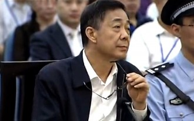
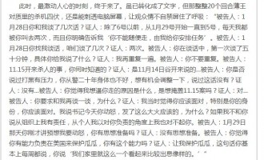
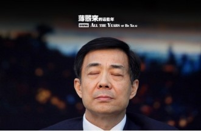

# “薄案”在法治路上——庭审程序分析篇

数以亿计的热切目光关注下，纷沓而至的言论的熙熙攘攘中，长达101小时困兽犹斗的薄案庭审功德圆满的拉下帷幕。

年过六甲的薄熙来虽然在历经17个月的煎熬后面容多染上几分沧桑，但是其意气风发，严密的逻辑，辩驳口才仍是不减当年重庆“一把手”的风范。这个人曾经“唱红打黑”，一手遮山城，笔者不论当年薄如何无畏，不可否认，他此刻以一种独特角色在诠释着中国现今的法治进步以及发展导向。以一场空前，或可绝后的公开透明庭审。以一种精彩绝伦的绝地反击似的辩驳。

或许网络新闻各路宣扬“从薄熙来案公审感受法治中国的力量”、“中国‘史无前例’微博直播薄案审理彰显反腐自信”，诸如此类舆论之中，在对于该场庭审的公开化，信息透明化程度的里程碑性意义仍有一言而敝之，太过抽象性的嫌疑，所以不妨拿些近年的相关法律条文以及其他案例比对比对。

1、 庭审公开，显法治之力

先提，关于庭审笔录的公开。薄案的五天庭审笔录主动全部同步向全社会公开，包括证据录音，视频，证人证言的详细始末。法院微博直播也是紧锣密鼓的在网路展开。如此透明的审判方式需要足够的勇气与自信，做第一人既然坐拥载入史册的荣耀，必定得同担同等的风险。

为何需如此战战兢兢？

在旧刑诉法当道之时，庭审笔录，法院连律师都不让复印，视为审判机密，更何谈露其于光天化日之下为饭后谈资？究其根本，无保障该权利行使的法律依据。而在2013年1月1日起生效的《刑事诉讼法》第三十八条才刚有明文规定：“ 辩护律师自人民检察院对案件审查起诉之日起，可以查阅、摘抄、复制本案的案卷材料。其他辩护人经人民法院、人民检察院许可，也可以查阅、摘抄、复制上述材料。” 自辩护律师享有调阅权之后，在法律层面上庭审笔录的公开也渐显其轮廓。

这大半年，作为“大动干戈”的新刑诉法的适应期，庭审材料律师的查阅复印自由以及其公开的路途并不坦荡。大多数的司法从业人员并没有轻易的从旧法中爽快的脱身而出，律师们在一些敏感的刑事案件中在复印庭审笔录，卷宗的请求中仍要碰钉子。薄案即是一场突破心理防线，灌输新的法治思想的重要战役，不究其做戏与否，预期效果已然达到，或者更甚也不然。

再说，庭审程序公正。在五日高度透明公开的审理过程中，严密的举证过程和被告人的答辩，全部按照法律程序以笔录的形式完全向外披露。尤其突破的地儿在于，法庭公布了包括黄奇帆、夏德仁、于幼军等多位部级领导干部的证词。此次不加掩饰地全部公开实为少见，也体现了对法制的尊重。在官员的权力、地位的淫威之下，法治的大旗终于摇曳的飘扬起来。法官对于庭审公正态度，无论从措辞，行为上都无任何的诱导压迫性，始终维持着一个客观对待，依法定程序行事的谦谦君子的伟岸形象。

而在09年叱咤一时的李庄案，在重庆市江北区人民法院公开开庭审理，可以容纳200多名旁听者的第一审判庭座无虚席。虽同是公开审理但显然往时不同今日，李庄申请法官集体回避被驳回，提出5点申请关于证人出庭以及对证据的当庭调阅等请求均当场被驳。其实只要稍微翻看一下法院的《被告人权利告知书》，22条被告权利保护的详细列出，便可发现审判长坦然果决的驳回违背了相关法律的本义所在。”而显而易见，薄熙来案在此地方做得合法很多。其本质上虽同普通刑事案一样，影响力却超越太多，但在公正方面却勇于比普通刑事案件的做得更为极致。所幸公正并未屈尊与权力脚下，作证的部级领导干部，无论多高级别都要履行宪法赋予的作证的义务，其恪守了此原则。薄熙来案五天的庭审，无一不如此，自始至终严格按照法定程序进行，这也是此次庭审战线拉的分外长的原因所在。

很多法学家都说司法的生命在于公开，真正的审判就应如此这般透明。为何需要公开？关起门来打狗可是又快又省事儿还给上了个保险栓。实则不然，人民法院的根本属性之一是司法的人民性。其中一个重要的衡量指标就是公开透明程度。也就是说，司法活动的各个环节，不论是公正的还是有失公正的，不论是廉洁的还是不廉洁的，不论是实体性的还是程序性的，不论是公众喜欢的还是不喜欢的，均应原汁原味地向当事人公开、向公众公开。当然，公开不是目的，而是以社会性评判对法院的行为形成一种制约，以防止不公正的发生。况且，法院公开的“先发制人”远比其“马后炮”遮遮掩掩的“坦白从宽”要有效得多。人总是有强烈的好奇心，其知情欲望未得到满足，自然会把受到的不公待遇归咎于“保密”的法院、迁怒于闭塞的司法制度。即使道理再充分，面对一个发怒的群体，也无计可施。

说到法院的公开审判又不得不提审判公开原则一事儿，即人民法院开庭审理案件的过程和判决的宣告，都公开进行，允许公民旁听，允许新闻界依法公开采访、公开报道。 {除下列三类案件外：1.涉及国家秘密的案件; 2.有关公民个人隐私的案件; 3.未成年人犯罪的案件。}《宪法》第125条中规定："人民法院审理案件，除法律规定的特别情况外，一律公开进行。"《刑事诉讼法》第11条中规定："人民法院审判案件，除本法另有规定的以外，一律公开进行。"这均是其雷打不动的法律依据。可想而知，“公开”一词于审判于司法均有着极重的不可抹杀的意义。

薄案所突显庭审的公开公正透明，于此，对于中国法治进程的推动力自也了然。其所具的法治力量亦是无法比拟，远不能用一个“赞”字形容。庭内庭外关系有所突破，拉个近景，场内如火朝天，极浓的火药味儿又是怎个回事儿？

2、法官主导制向对抗性交锋转变

同样的极左分子，同样轰动全国的国家大审，薄案与当年江林一案颇有相似，审判意义却是截然不同。最主要的变化点最根本的突破点在庭审模式以及法官角色变化中显现无疑。这便是法庭硝烟弥漫剑弩拔张的根源所在了。

薄在法庭之上几乎推翻了以前自己的全部供述，逻辑清晰严密，毫无破绽的辩解无一不令人瞠目结舌。面对公诉人的进攻性发问淡然自若，对答入流。8月24日16时23分，我们难以揣测当薄熙来面对一位重要配角出场的心情，王立军以左膀右臂，心腹大患的双重矛盾身份吊诡的存在着。我们之所以期待，是意料到该证人的出场将把庭审的对抗性交锋推到一个白热化的高度，比23日薄向徐明连发20问的激烈程度可能更甚。这对生死冤家的碰撞与摩擦，并没有辜负我们的高期许。外行人看的是唇枪舌战的激烈程度以及从言语表情挖掘而出的八卦头条，作为半个内行人却得努力从这字里行间掏出个半深奥的门道来。

这种对抗性交锋呢，在学理上，归于当事人主义的对抗制模式，是现代刑事诉讼中的一种主要存在模式，是以控辩双方的诉讼对抗和法官的中立听证为审判结构的基本法理。另一种基本诉讼模式是职权主义诉讼模式。职权主义的非对抗制模式，其特征主要是强调国家机关的职权作用，审判中主要由法官直接调查主导审判。目前我国的审判方式正处于从非对抗制到对抗制的转型之中。法官角色也在一次次的刑事诉讼法的修改之中有所转化，在庭审中渐呈弱化趋势。

在传统法律制度下，封建时代纠问式诉讼中并不存在现代意义上的司法官，封建时代的“法官”是多种社会角色的糅合；“马锡五审判方式”下的法官扮演着案件事实侦查者的角色。二者均对我国现行制度中的法官角色有着深远的影响。直至新中国刑事诉讼法典的一一颁布，法官的主导地位才有其真正意义上的法律保障，我国的诉讼模式自此制定。

我国1979年的《刑事诉讼法》参照苏联构建了职权主义审判模式，我国传统的职权主义诉讼模式的核心是法官对程序的绝对控制权，并且法官在很大程度上承担了部分控诉职能，审判职能与控诉职能的重叠造成了法官角色的混乱，极大影响了诉讼公正的实现。因而我们可将其称之为传统的强职权主义审判模式。1996年《刑事诉讼法》修改后，在关于审判方式的规定中引入了一些抗辩的机制，将法院对公诉案件的实质性审查修改为程序性审查；将原来法庭调查以法官为主导改为以控辩双方为主进行，法官事实调查者的角色得到了弱化。 但在实践中，由于证人出庭制度、证据开示制度不完善等原因，对抗制的庭审方式在我国还没有得到很好的实行。

时过境迁，2013年正式实施的新刑诉开启了“对抗制”进一步加强的新纪元，源于其对证据制度的完善。也源于此次薄案所做出的标杆性实践。只有证据开示制度的建立，证人出庭制度的完善，庭审之上才有争论，才有对抗的依据以及主体所在，否则凭空言谈可不是意义全无。根据新刑诉法第187条的规定，在任何一方诉讼参与人对证人证言提出异议的，或者人民法院认为有必要的情况下，证人就应当出庭作证。“应当”二字意味着证人出庭制度在法律的规定特种情况下的必要性。同时还相应完善一系列的证人强制出庭、证人保护、证人补助费用等制度。这也是前文所说薄熙来与王立军当庭对质的法律保障所在，是弦崩一线的根本前提。

建立刑事诉讼证据开示制度,是抗辩式审判方式的重要标志,是世界各国刑事诉讼发展的必然趋势。在刑事诉讼法再修改之前,修改后的律师法赋予了辩护律师在审查起诉、审判阶段完全的阅卷权,表明在我国刑事诉讼中设立证据开示制度已是势在必行。

“对抗制”的条件一一成熟，在此案件中无论是控辩双方，证人与当事人之间交锋对抗十分明显，而法官则静坐观山虎斗，已然是个纯粹的中立者以及秩序管理者。法官，曾经的主导者，是否要就此卸下一部分的职能，换一个控辩双方更为自由的质证，辩论空间？“主”姓也必然换作“引”字。

3、辩护权

“公权力机关一家亲”的观念想来根深蒂固，而此刻正襟危坐的裁决者在庭审中作用弱化，维持中立者的态度，脱下诱导性压迫性的面具，对于站在公权力对抗面的被告人辩护人来说无疑是一大幸事。“对抗制”的“对抗”需要两者权衡，旗鼓相当。被害人受到公权力的关怀同情，以正义维权的名义合法权利得到伸张。相应的我们需要赋予被告及其辩护人一定的权利并加以维护，使其有足够的力量在法庭上维护其一席之地的尊严。薄在法庭上的发言掷地有声受到了充分的尊重，其辩护律师也头头是道充分表达自己的辩护意见，比起之前一涉及敏感刑事案件辩护律师的辩护意见常被打断的现状，在辩护权的维护发展实践中是一巨大的进步。

那么，何为辩护权？辩护权是指导刑事被告人及其辩护人对被控告、被追究的犯罪，从事实、证据、法律、处刑等诸方面进行申辩、反驳、反证、以维护被告人的合法权益，使案件得到公正合法的处理的权利；是指刑事诉讼法赋予当事人及其辩护人针对控诉而进行申辩活动的权利。

刑事诉讼法第32条规定：“犯罪嫌疑人、被告人除自己行使辩护权以外，还可以委托一至二人作为辩护人。”就法条理解，辩护权可以分为自我辩护以及律师辩护两大块内容。

自我辩护，反映到本案中即薄据理相抗，以公诉人的指控为中心，阐述自我一系列无罪的缘由的自由。相对应的实则是被指控人的辩护权，是第一性权利。而律师辩护权则是第二性的权利。依附于被指控人辩护权而存在的，在刑事诉讼中，律师辩护是不可或缺。首先，被指控人所处的特殊地位使得自我辩护难以实现辩护目的。在通常情况下，被指控人往往被采取了某种刑事强制措施，处于丧失人身自由的羁押状态，因而不可能调查取证，{比如薄十七个月的真实处境}为本人进行实质性的辩护，在薄案中是其律师就证据的关联性，合法性，客观性一一辩述，体现其专业性。其次，大多刑事案件，被指控人均是平常人，能做到如薄临危不惧，处变不惊，井井有条为自己发出强有力的辩护，实属少数。从庭审公开的笔录发言所占比例，激烈的对抗交锋程度，法官客观包容的态度看来，被告人的辩护权利得到十足的“拥护”。

为何“辩护权”近年来受到各路青睐，很多学者为之奔走？简而言之三句话，其价值论根据是人权保障，制度性根据是无罪推定，而其方法论根据是相对制度。一扯到人权，这个问题立马变得深邃且无边起来，这也是其呼声愈大的根因所在。

薄熙来,从高位上指点江山跌至囹圄面壁，似乎已成定局。在告别政治生涯的种种功绩，细数人生墨点之时，中国也在法治路上大大的迈出一步。这里，不得不感激他的存在。

（编辑： 胡逸娴；责编：林骥）
