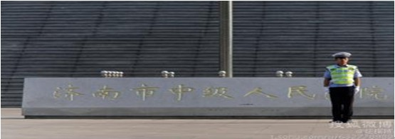

# 一场与法律无关的庭审戏

审判薄熙来恐怕是最近大家都熟知的一件事情，往往最关注的应该是那些高层官员、出租车司机和胡同口专攻研究国家大事的老大爷们。而这次却发生了微妙的变化，这次庭审不像往常一样只在大媒体特别是报纸电视播报，也不仅仅是只播报庭审结果，而是全程使用微博直播，这算是历史上第一次了。

所以这次庭审引起了网络的一场狂欢，尤其是年轻人开始以极大的热情关注这次庭审，各种衍生的段子和笑话，当然也有“认真严谨”的解读分析，整个庭审在这种气氛中变得荒诞了起来（虽然这种审判本身就是一件荒诞的事情）。人们甚至已经并不去在乎审判中的法律要点是什么，或者有关罪名的攻辩水平，在这场庭审里似乎法律已经变得不重要了，人们通过网络这样一个草根化和自由化的平台本身就消解了法律的严谨性。

就好像是上面做了一场戏，虽然漏洞百出但是也还算是有点意思，而下面看戏的人也很配合，好像真的入戏了一样。演戏的人变成了明星，那些坊间流传的罪名完全没有被提及，相反变成了村支书级别的经济问题和电视剧一样的感情纠葛戏路。

换句话说，这场庭审之所以能够以微博直播的形式展示出来，也反映了在这种高压政治下的默契，就是导演这场戏的人非常自信，他允许演戏的人自由发挥，因为他知道无论演成什么样子，看戏的人都会欣然接受并且主动让自己入戏。

而这些，其实跟法律没什么关系了。就好象所有的法庭戏也都不是在真的讨论法律一样。

一场庭审的公开会对庭审产生怎样的影响？很多法律工作者们喜欢谈论这个问题，就是舆论或者说民意是否可以左右法律？在正常的情况下，无论是否公开或者直播，舆论和民意都不该影响法律。法官都应该严谨审慎只参照法律作出判断，在有陪审团制度的国家，陪审员更是不该与他人讨论案情，不能受到外界影响来做出犯罪嫌疑人是否有罪的判断。

但是这是一种过于理想的状态，人们面对公开和直播的时候判断会发生变化，会有更多的权衡因素，法官也很难排除这一点。如果说庭审的公开给了民众一次了解庭审了解法律的机会，那么能够保证民众必然理解这种机会吗？答案是不能的，一部分民众甚至还不能理解律师应该尽可能找出漏洞来帮助嫌疑人脱罪，哪怕理由很荒诞；也不能理解嫌疑人并不需要证明自己无罪，而是公诉人证明他有罪。那么在这种舆论状态下把这一切暴露出来，会不会对庭审造成很大的压力，对律师和法官形成阻碍呢？

简单地说，法律其实是技术性的，那么技术性的活动在一个圈内人范围内讨论是一回事，而拿到社会上给大家一起看又是另一回事，当然还要加上煽风点火不懂装懂的媒体。

而与我们无关的是，“所幸”我们既没有民意也没有法治，所以根本无需担心民意干扰审判。

当媒体用娱乐的方式消解了政治色彩的审判带来的紧张与严肃，我们其实会发现这场审判让大家更加摸不到头脑了。如果说之前的类似事件当局的想法停留在“我有权力，我不让你们知道也不让你们评论”，那么现在这场审判就是“你们随便评论随便玩，我根本就不在乎”。看似敞开的言论自由之下，实际上是当局对于权力高压的绝对自信。

而我们再回过头讨论这场审判，是否还有必要了呢？

（编辑：马特；责编：林骥）

[【天下熙攘•一】“薄案”在法治路上—-庭审程序分析篇](/archives/41257)
