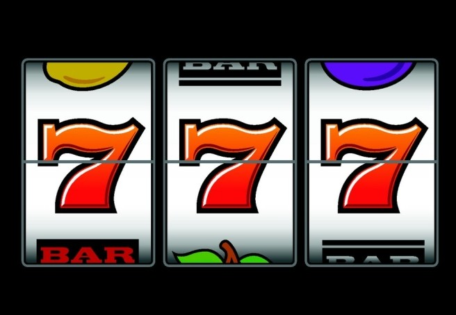

# 【天才与赌徒】天才与赌博机的必胜策略

每一个试图用概率战胜赌博机的数学爱好者，都会被老板的电路板揍得鼻青脸肿。

S君是我的小学同学，高中时曾入选上海计算机竞赛的市队。我们同时对文史及数学感兴趣，但他对于数理逻辑方面的问题敏感得多。

昨天我和他聊起了赌球公司制定赔率的问题，我的想法是赌博公司本身并不把重心放在预测球赛走向上，事实上他们只关心买家的下注比例，而赔率正是这样一个与赌家下注比例自适应的权重。换而言之，赔率是下注比的一个函数，如果我们可以从赔率逆求出庄家手中的下注比，那么我们也可以模拟庄家的策略下注，在宏观大量下注的前提下获得稳定收益。

S君对我的想法持悲观态度，他说在生活中的博弈上，数学只是很小的一个部分。庄家完全可以用很简单的规则保证固定的收益，从数学上入手希望很小。（后来讨论的结果是，考虑到庄家还有5-15%的抽税，我的策略显然是不可行的。）唯有找到数学之外，连庄家也未曾意识到的“潜规则”，再结合严格的数学推倒，才有获胜的可能。

他讲了自己利用逻辑从赌博机中赚钱的故事，让我瞠目结舌，也促成了这篇文章。

那时还是初中，我在田林三中，他在西南位育——二者中间夹着一个田林电影院，学校也经常组织班级去看电影。电影院顶楼是一层游戏机房，我虽然只去过一次，但是已经提起还是能想起来。

S君和我不同，是一个喜欢电玩的人，家里堆满了游戏光盘，也经常去那个游戏机房玩。他很快发现了一台赌博机有利可图。

那是一个怎么看都很“公平”的游戏：一个简单的机械装置，有两个投币口，分别代表黑色与白色。玩家则把相应押注的游戏币投进去（游戏币与一元现金等值）。等到所有玩家投币结束，机器开始运转，并随机从黑白两个小孔中掉出一个球来。输家清空，赢家有一倍奖金。

S君讲到这里，我意识到这个赌局等于说老板为一个各占1/2的互斥事件都开了1的赔率。这种模型下，无论玩家采用怎样的混合策略，期望收益始终为零。

我没想出怎样获胜，我也不认为有可能获胜。

S君接着说，他的策略很简单。即一次选定一种颜色，如黑色。则第一次赌一块钱在黑色；如果输了，第二次压两块钱继续黑色；如果再输，第三次四块钱黑色……如此往复。如果n轮不赢，就在第n+1轮压2的n次方于黑色。一旦赢了就收手开始下一次1、2、4、8的新循环。

这种方法的好处是，无论前面亏了多少钱，只要接下来赢一次，就能扭亏为盈，净赚一元，而n次连续失败的概率非常小，仅为1/(2^n)。

当然了，这种方法不足以唬到我。当我之前说任何混和策略期望都为零的时候，自然也把这种策略包括在内了。

看起来失手的概率很小，为什么期望还是零呢？很简单，因为他的赌注太大了，假设前7次都输了，那么第八次就不得不压上256元才有可能翻本。但是第八次再输，就累计亏损511元，我不认为一个初中生还有资本继续赌下去。换句话说，失败的概率虽小，但每次出现七八次不中的小概率事件时损失也是致命的，足以让他几周之内都没钱继续游戏。再者，这个策略每一个成功的循环只能收益1元，要想获得稳定收益，必须大量重复。以每次循环两次估计，要想赚到20块钱就需要玩40把。四十已经超过了2的五次方32，也就是说，想用这个策略赚20块就几乎肯定会遭遇连续五次白色，以至于亏掉32元。这显然是非常不理智的。

老实说，我非常怀疑这个策略的可行性。

然而事实上，S君确实采用这个策略，每次在游戏机房里赚到20-30个币之后，接着去玩其他游戏逍遥一下午。我并非只是完全相信他的一面之词，而是他后来的分析使我不得不相信这种策略确实是行之有效的，因为我之前的分析犯了致命的错误。

“汉平，你的致命错误在于，你相信这是一个完全公平的博弈。”

“什么意思？”

S君笑着说，“你的分析从数学角度无懈可击。可是别忘了，你的结论是玩家期望为零，换句话说，庄家的期望也是零。可是庄家的收益真的是零吗，如果是零，他买这个机器教这份租金岂不是亏了？”

事实上S君的想法我也想过，庄家一定会赚钱。唯一的方法就是庄家在操纵小球。做个极端的假设，假如有人赌一万在白色，那么他能获胜的概率就非常小了，庄家不会坐视几周的流水付之东流。虽然不会有人在游戏机房赌上一万，但是据S说，一次赌上200-300的成年人并不少见。

对庄家来说，最贪心的情况莫过于每次都操控小球落在投注较小的颜色上，这样每次都赚。但这样显然不是常态，如果太明显而被玩家意识到，就无法愉快地玩耍了。

庄家应该有赢有输，总体上维持一个适当的小收益，比如每十局10%，虽然不大但是比起什么金融理财产品还是堪称暴利了。

我有些疑惑：“那么对玩家来说，应该每次都站在少数一方，那也不是你这个策略呀。”

S接着说，这个机器设置是每个玩家走上前投币的。不与玩家交流的话，基本上看不到其他玩家把币投到了那个地方，而每次都与其他玩家交流再做决策又是不可能的。

我：“所以‘少数获胜’这个潜规则并没有实际意义？”

S：“不能这么孤立地看——其实当你意识到这个博弈存在‘潜规则’的时候，就已经比之前前进很多了。我们接下来思考其他的、足以利用的潜规则。”

我：“还有其他的吗，我觉得少数获胜已经足以让老板赚钱了。”

S：“老板事先已经承担了机器以及场地的成本，也就是说，他在这次博弈中是负债的。他不仅不能亏欠，还必须要赚钱。而赚钱有两个必要条件，一个是不能让某人一次赚走巨款，就是所谓少数获胜，另一个重要的条件是——在稳定收益的前提下吸引尽可能多的玩家。”

我：“从赌徒的心里来说，这场博弈不用交税，胜负看起来各半，其实已经非常诱人了。”

S：“但是不具备数学思维的其他玩家并不这么看。我们回到一开始你质疑我的问题，你说我的策略虽然失败的概率不大，但是一旦失败就会损失惨重是吧？”

我：“对啊，虽然失败的概率只有1/(2^n)，但是一旦失败就会亏损2^n左右——总体期望始终为零。”

S：“你不妨仔细想想我可能失败的情况。我手里一般有300元左右，足以从压1块开始支撑我到压128元，也就是玩8次。我失败的唯一可能是，连续八次都是白色，那我就完了。”

我：“虽然可能性很小，但是确实存在……而且损失很大……”

S：“**你错了，这种概率只存在于数学之中。实际上绝无可能——老板不允许这种情况出现。**试想在游戏中，一旦出现八次同一颜色，对于我来说，固然可以接受，因为我玩过上千次了，八次白色的概率是1/128，总会遇到的。但是对于其他偶尔只玩过一次的玩家，他们会怎么想，是愿意接受自己就是撞到了1/128的运气，还是开始质疑庄家？何况这游戏庄家本来就在操控。”

想要让玩家不质疑游戏被操控，不是真的不操控，而是只要让他们不感觉到被操控。

基于这样的原则，即便是正常分布下的小概率事件也必须拿掉，因为他们会引来质疑。反而温水煮青蛙式的偶尔操纵几盘少数获胜，因为庄家事先也不知道白色与黑色那个是少数，所以从结果上来看，并不会破坏黑白色的平均分布。

所以庄家并不顾忌让少数获胜，因为这种诡计并不打破直观上黑白的平衡。但绝对不允许存在的是“连续多次出现同一种颜色”，虽然在大量游戏中理应出现这种小概率事件。

**它们是数学中的小概率事件，却在现实中被修正为零概率事件。**

讲到这里我才完全明白了S真正敏锐的地方，也明白为何这么一个简单的策略可以在这样一个“公平”的博弈中始终获胜了。

后来S又补充说，他认为老板刻意控制10%的收益太麻烦了，毕竟老板还要照顾其他游戏和玩家。所以更接近事实的推测是，这个机器本身自带了一种随机分布。在这种分布下，老板确实收益和玩家整体一样，都是零。而老板只要每天抽一段时间，操纵几次游戏，使得这几次游戏中老板始终赚到足够钱，其他时间就让机器自动运转。这样除非出现有人压一万这种情况老板如临大敌以外，这个公平的机器就是一个聚宝盆了。

而S的策略不仅对贪心的老板有效，对看似公平的机器同样也试用。道理很简单，那是一个十几年前的机器，里面固然有电子成分，但更多的还是一个简单的机械装置。其实包括电脑在内，任何人造机器都无法真正地表示出“随机性”，任何程序中的随机数本质上都是一种复杂运算下的伪随机。当然，由于电脑的计算能力非常强大，它产生的随机性非常强，可以模拟数百万种情况。

但对于简单的机械，模拟数十种情况就需要很大的成本，并且毫无必要——假设这台机器只预存了黑黑黑黑黑、白黑黑黑黑、白白黑黑黑……白白白白白等五次博弈的全部分布，也就是2^5=32种情况，这对于偶尔玩之的玩家来说已经足够随机与公平了——除了S。

对S而言，如果机器只预存了这32种情况并且反复调用，那么他的策略只要准备五次赌博所必须的1+2+4+8+16=31元就可以始终获胜了。

事实上S在第一次就提钱买好30多个币。每一次以这些币为资本，赚到额外的20-30个币之后，去玩真正想玩的游戏。也就是说机器预存的情况确实小于等于32钟。

到这时候，我才发现我与S的思维差距有多么大，我的所有判断都基于数学，而这部分在之前两三百字就解决的“无懈可击”，可是后面的数千字才是S所真正思考的领域。

S说有时候有急事或者其他原因，他来不及把赚的游戏币花光就要回家了。他很少会找老板把剩余的币换成钱（原则上可以）。但是考虑到他要重复使用这个策略，那么事实上就不可以贪图小利而让老板起疑——他会选择一个数学上明显会输的游戏把币迅速输光。当然了，偶尔也会小赚一点——一直到初三那家店忽然倒闭，扣去手上的30多个游戏币，也赚了几十块钱，毕竟主要还是为了开心，不是靠这个发财。

这就是S的故事。

毕竟以更高的数学视野来看，直线不过是曲线的一种，最初等的一种。

而在社会这个比数学复杂的多的环境中，理性不过是感性的一种，最初等的一种。

任何玩家都必须拥有基本的理性素养，但这远远不够，因为分高下的场合不在于此。

理性之上，情商为王。

（采编：刘大宁；责编：刘铮）