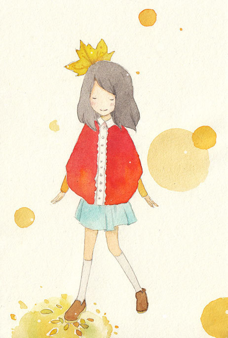

# 无声的女孩

她叫郭小颖，中等个头，中等成绩，不好看，是我高三的同班同学。在我的记忆里，她永远不声不响。有一天她生病了没来上课，我盯着空出的那张课桌，很久才想起她的名字。 

高考后大家各奔东西，她也就彻底地消失在视野里。大二暑假的同学聚会，有人提到了她，说她自杀了。大家摇着头，努力回想着她的模样，说一些感慨的话。 

我想写点纪念她的文字，毕竟同学一场。可我写不出来，煽情都煽不出来，我甚至想不起到底有没有跟她说过话。我只记得她坐第一排，短头发，天天穿校服。有一天我打完篮球回教室拿书包，看见她很认真地在扫地。还有一回她被物理老太批评，大概是受力分析画错，下课了趴在课桌上无声地哭。我想去安慰她两句，终究什么都没说。 

翻开毕业合影，她微笑着坐在角落里。 

时光的流逝总是缓慢而残酷，下一次的聚会，我们又有了新的话题。她再一次消失了，无声无息。 

昨天偶然认识了她的大学室友，我才知道，对这个女孩，纵然世界从未在意过她，离开也不是一件容易的事情。 

第一次，她用小刀割开了自己的动脉。看着鲜红的液体漫过桌角，她忽然心生恐惧。她支撑着衰弱的身体，用最后一点力气给妈妈打电话。 

第二次，她仿佛下定了决心，吞下了一整瓶安眠药。安眠药是平时偷偷攒的。或许是命不该绝，提前下班的妈妈发现了地板上奄奄一息的女儿。 

她向妈妈痛哭流涕地保证，她错了，一定好好活着，再不轻贱了自己。 

她很听话地去看心理医生，很听话地吃药，她的脸上甚至有了久违的笑容。妈妈终于稍稍安了心。 

于是，趁妈妈上班的时候，她悄悄从学校回了家。买了几卷封箱带，把家里每一条门缝、每一条窗缝仔仔细细地贴上。贴的很认真，就像写一份平时作业。然后，打开煤气，静静地坐在沙发上，等黑暗的潮水漫过她的眼睛。当邻居闻到异味，年轻的身体已经冰冷。 

我无从知晓，意识模糊之前，她想了些什么。 

或许想起了前一晚，她破天荒去参加学院歌手大赛，结果遭到了台下男生的一致起哄。人不好看，唱得也不好听，干嘛来了？ 

有一句励志的话这样讲：你浪费的每一天，都是昨天死去的人无比渴望的今天。 

有没有这样的一天，是一些人不愿面对的明天。 

她站在这舞台，穿着自以为最好看的衣服，甚至化了点妆。在一片嘘声中，用跑调的嗓   音坚持把一首歌唱完。然后向台下早已不耐烦的人们，深深地鞠了一躬。 

我终于明白，她是鼓起了多大的勇气，为自己的青春谢幕。 

都说红颜薄命，因为不是红颜的薄命，人们并不去关心。

(采编：曾文诚 责编：陈静)
