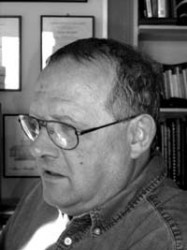
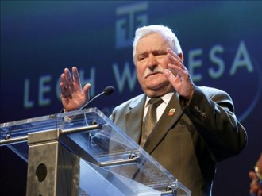
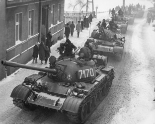

# 权利,而不是权力--我理解的米奇尼克

**一******

“极权统治的实质就是消除一切自发的政治生活，把社会中的人分裂成一个个的原子，其目的在于使每个人只能孤立地面对整个制度，从而使人感到形单影只，而且往往茫然若失，敢怒不敢言。团结工会则提出了与此截然相反的主张。”

十多年前，当我在布热津斯基的《大失败》中译本中读到这些论断时，中国社会正弥漫着一种灰暗、沮丧的情绪，正是在那些星月无光的夜晚，布热津斯基关于波兰社会自我解放进程的描述和分析引起了我内心的强烈震动。那时候我只知道团结工会的领袖瓦文萨，虽然也知道在瓦文萨的背后还站着一群波兰最优秀的知识分子，但对米奇尼克等知识分子的思想和作为知之甚少，或者可以说是一无所知。后来，我读了胡平的《米奇尼克：人·角色·思想》，对米奇尼克其人其事有了初步的了解，不禁对这位被誉为“杰弗逊式的人物”心向往之。2002年冬天，读到崔卫平的《谁是亚当·米奇尼克？》，我有一种豁然开朗的感觉，眼前仿佛出现了一片辽阔的天空、无际的大海，这些精彩至极的片段从此就在我的脑中萦回不去：

# 

“在他（米奇尼克）头脑中，不存在一个需要不断加以关注的、至高无上的权威，不需要明里暗里不断关注他们的行为、动向，希冀最终由权威作出关键的变动，从而引起预期的社会效果，或者借此作为自己政治赌博的押宝。采取和皇帝一道进餐的人仍然将皇帝看作唯一的权力资源，他将依据皇帝的脸色、皇帝将要收获什么而行事，甚至皇帝所拥有的某个怪癖，也成为这些人关心的对象和行为的依据；而采取独立行动的人们相信还有别的权力资源，他的席位不是在皇帝的餐桌上，而是在自身的行为当中，这样的行为不需要皇帝来钦定，不需要皇帝赋予其意义，而是自主的和自我赋予的。说米奇尼克是个言行合一的人，这是鲜明的例证：既然是搞民主，就意味着眼光向下，意味着立足自身，立足于和自身一样独立的人们，他和这些人们的行为便是一个富有意义的起点。他这样的行动可以从任何地方任何人们那里开始，而且可以马上就去做。”

就是那个冬天，我知道已经为本民族引入了哈维尔这一精神资源的崔卫平，又要为我们引入米奇尼克的精神资源。从此我就渴望着早日读到这部必将在汉语世界产生重要影响的《米奇尼克文集》。

米奇尼克被称为波兰的“甘地”、“路德”决不是偶然的，他是团结工会运动的灵魂人物，在波兰社会转型过程中发挥了巨大的作用。从少年时代起，他就积极参与了反权威的政治活动。从18岁第一次坐牢，他一共经历了5次监狱生涯，在狱中度过了青春时代的6年多时光，至少有两次遭到暴力殴打，他也因此理解了《古拉格群岛》中的一句话：“感谢监狱，它造就了我”。也正是共产党反复地把他投入监狱，使这位具有坚定的行动性格的知识分子，有足够的时间冷静地坐下来思考更深入的问题，并在那里写出了他的主要著作。

但他从来没有把自己看成是一个政治家，即使在波兰以不流血的代价成功地完成和平演变之后，他选择的也不是问鼎权力，入阁做官，而是办报，继续以言论影响社会、保持独立的社会批评，并不因为他参与的历史发生了戏剧性转折而改变初衷。他虽然曾高票当选为国会议员，但没有多久就辞职了，从此一心在波兰发行量最大的报纸《选举日报》主编的位置上贡献他的才智、心血和思想。他说：“我从来没有考虑自己是一位政治家，在这个角色中我从来没有感到舒服。在离开议会之后，我感到真正的解脱。”

他之所以作出这样的选择，不是什么故作姿态的清高，也不是他无法适应复杂的政治运作（历史早已证明他是最出色的政治战略家，也是富有才干的政治活动家），而是他深思熟虑的结果，和他的思想完全是相一致的。

对一个从来只知道“打江山、坐江山”，只知道明君、清官的古老中国而言，这是不可思议的，在我们这块见证了无数次王朝循环的大地上，和皇帝一道进餐几乎是唯一的选择，在“皇帝的餐桌”之外过自己独立的生活，至今还是一个全新的题目。因此，本文试着从权利，而不是权力的角度理解米奇尼克的思路和作为，理解他对于中国的意义。

**二**

1976年是米奇尼克生命中的一个新开始，年仅而立的他写出了注定成为历史文献的《新演进》一文，为波兰未来社会的变革指明了方向。在这篇纲领性的文字中，他无比清楚地认识到了“以革命来推翻党的专制以及有组织地来追求这个目标，是不现实和危险的”，因此一切地下的策划密谋行动都是不可行的，“革命的理论和密谋的行动仅仅适用于警察当局，他们以此来使得群众歇斯底里，这让他们觉得更加刺激。”为此，他提出“持续不断地为改革而斗争、寻求拓展公民自由和人权而开展的演进”，并把“新演进”的目标定位在逐步和缓慢的改进基础之上，并不要求牺牲和伤亡，它依靠的是逐步加强的公众压力，是公众持续不断地克服恐惧和发展出一种新的政治意识，而不是依靠暴力和强力来推翻现存制度。他对“新演进”的三种力量作出了准确的分析，一是工人阶级，他们的压力“是通往民主的公众生活的一个必要条件”。二是天主教会，他们长期以来支持人的自由和尊严，“更重要的，他们始终在捍卫工人阶级的公民自由，尤其是罢工和独立的劳动联盟的权利。”三是知识界，他们的责任是提出“可供选择的方案和捍卫基本原则”。

特别令人感到耳目一新的是米奇尼克第一次提出了“为一个美好的今天”而不是美好的明天而奋斗的说法。这是一个全新的起点，是人类前所未有的创造，正是在见识了布达佩斯、布拉格街头横冲直撞的苏联坦克之后，形成了他的“新演进”观，与以往各种各样的思路不同的是，他把社会变革的目光完全转向了“下面”，而不是盯着“上面”，而在此前波兰呼吁改革的声音中，无论是世俗的“修正主义”还是来自教会的“新实证主义”，“这两种理解同样相信改变来自上面”。米奇尼克最关心的不是权力的宝座，而是公众舆论和社会的自我组织，是直接面向独立的公众发言，告诉人们怎样去做，而不是朝着极权主义的权力说话，告诉掌权者怎样进行改良，他认识到“没有比来自下面的压力更能够指导当权者”。实际上就是要求致力于争取和捍卫自身的权利，而不是夺取政权。这一点和中国人总是不断地“上书”、“上折子”，总是期盼着明君、青天来拯救苍生完全不同。

与这篇文章同样重要的是这年9月他和库隆等知识分子一起成立了具有开创性意义的“保卫工人委员会”（KOR）。当时他虽然不在波兰，但他是毫无争议的缔造者之一。此前，在波兰Ursns等地曾发生工人抗议事件，他参加了一次官方对Ursns工人的审判，判决的不公正和工人妻子们的哭泣震撼了他的灵魂，他第一个以知识分子身份发表抗议信，接着，库隆发表了一封公开信，他们还向西方知识分子发出呼吁，要求捍卫波兰工人的权利。这是波兰知识分子第一次公开站出来为受迫害的工人仗义执言。接下来就是“保卫工人委员会”的出现。此时离团结工会的出现还有四年。

这是波兰转型过程中一个关键性的事件，它标志着在极权社会探索自主的公共空间的开始。这一点从他们为这个最初只有十几个人的小型团体所确立的基本原则就不难看出，他们强调公开性、真实性、行动的自主性、信任等。其深远的意义在于它是与波兰的社会生活、与千百万普通工人血肉相连的，它没有提出任何政治诉求，它以一个小小的实际行动打破了长期以来被极权主义完全垄断的社会结构，以实例告诉人们，我们可以自己动起来，自己组织起来，自己帮助自己，这就是重建社会的开始。用米奇尼克自己的话来说：“它建立在后极权制度的行动哲学上面。为什么是后极权的？因为权力仍然是全面控制的，但是社会已经不再是，社会已经是反对极权的，它在反抗和创建自己独立的机构，其结果导向一个我们称之为公民社会的某种东西，即托克维尔意义上的公民社会。这就是我们试图做的：建立公民社会。”

与其说“保卫工人委员会”的目标是政治性的，不如说是社会性的，它没有任何夺取国家政权的计划，只是寻求社会独立于政府之外自主行动的可能性，目的只是要帮助那些受迫害的工人家庭。它在重建民间社会的可能性方面迈出了一小步，却是极为可贵的一步，对他们来说，最重要的不是“政府的制度应该怎样改革”，而是“我们应该怎样反抗体制以保卫自己”，也就是要在官方权力机构之外恢复社会的活力，找回应有权利。但是在一个不容许社会有自主空间、没有形成公民社会的国度里，人们只要选择独立于政府之外，就天然地具有对极权主义的颠覆性，就注定了具有政治性，也注定了成为官方压制和打击的目标。

从“保卫工人委员会”到《新演进》，米奇尼克实际上已经清晰地画出了一幅在极权主义国家重建公民社会的蓝图，他把自己绚烂的理想化作了平凡的现实。1980年，团结工会诞生时，米奇尼克和库隆等都成为重要成员（多年以后，米奇尼克说：“我们仍然相信团结工会是我们的孩子，尽管是非法的。”），并为此入狱多年。在合法存在了13个月之后，团结工会被“军管法”取缔了，米奇尼克却没有感到灰心，即使在狱中。因为他看到了波兰社会被激发出来的生机并没有中断，地下出版、地下文化（包括文学、电影、戏剧、绘画等）、地下科学，以及以地下状态存在的独立组织（工会、艺术家协会、青年人组织等）……，当然还有独立于官方之外的教会，作为公民社会的雏形已无法连根拔掉。普通的波兰人结束了长期以来的恐惧，开始挺起腰杆，在公民社会没有出现之前，也开始像一个公民那样行事，而不管国家机器是怎么想的。这一切诚然都不是当局所愿意看到的，他们却不能随心所欲，或者运用暴力就能加以扑灭。

**三**

正因为米奇尼克不是把立足点放在权力的基础上，所以他对一场独立社会运动的评判并不是从“成”、“败”出发，不像中国人总是在权力的取予和得失上打转，始终无法超越“皇帝的餐桌”，认为权力之外无政治，从而将所有的希望都寄托在权力上面。即使是在团结工会合法存在时期，他们也“从未要求共产主义者放弃权力，把控制权交给国家造船厂的工会”。

正因为米奇尼克的起点是社会，而不是国家，他追求的是权利，而不是权力。他反对凌驾在整个社会之上、剥夺了所有社会自主空间的国家机器，目的并不是取而代之，自己去掌握那架机器，而是寻求把社会从这架无所不能、无所不为的机器下解放出来。所以，他认为即使波兰处于极权制度的刺刀下，作为一个普通人也不是无所作为的，他分析说：“（今天）的波兰制度是由一个极权主义国家伴随着一个不能以极权主义方式来控制的社会所合成。国家倒是想施行极权主义权力，但是它不可能做到这一点。它被迫和生活和解，其结果是在国家和社会之间达成一种临时平衡。”

毫无怀疑，民主是他追求的理想，为此他不惜一而再、再而三地入狱，并拒绝出国或在“忠诚声明”上签字。但这并不是因为他以为民主能一劳永逸地解决社会面临的问题，实现一个完美社会，更不是因为民主能实现权力更替，从而为自身登上政治舞台创造条件、提供阶梯，而只是为了一个“不完美的社会”，为了每个人都能拥有和君主同样的权利，每个人都享有和雅鲁泽尔斯基一样的权利，一样受到法律的保护。

他之所以站出来反对共产主义，也不是基于一种“英雄主义”，他从来不想成为英雄，也不曾想要为国家、为自由或者别的什么东西而牺牲，他只是想要像个普通人一样活着，尊重自己，也受到朋友的尊重。基于尊严、常识和记忆的理由，他断然拒绝了在“忠诚声明”上签字，拒绝选择流亡。基于同样的理由，他也放弃了以暴易暴、以暴力革命为社会变革开路的想法，他懂得以暴力手段攻占巴士底狱，会不知不觉地建立起一个新的巴士底狱。无论暴力以革命还是其他任何动听的名义，除了会掐断社会之间的有机联系，将整个社会原子化，最终导致专制之外，不会有其他更好的结果。这不仅是他从历史中得出的教训，也是他立足生活的思考结果。他由此认识到，社会的变化不是依靠权力更替就能完成的，“可以假设，如果明天由瓦文萨或者库隆来取代雅鲁泽尔斯基，什么也不会改变。因此关键问题在于建立一个民主社会，沿着团结的合作尝试的道路改变社会的权力系统，使得极权主义成为不可能。”那就必须从恢复每个人的权利入手，其中自然包含了思想、信仰的权利，言论、批评的权利，以及自我组织的权利。他说：“我全部的生活都在为那些想要反对他们所反对的人的权利而奋斗，包括我自己。”

这一切使他最终能超越于权力安排之上，超越仇恨意识、敌人意识，他从来就不相信“去共产主义化”就能解决一切问题，他说：“我们同意宽恕，但是不主张遗忘，不主张健忘。我们不要报复，却要的是揭示全部事实真相。”自始至终他都没有掌权的打算，从没想过“彼可取而代之”，而是以说出真相、承担责任的知识分子自许。一句“我们真的不想掌权”决不是政客作秀的口号，而是他身体力行的准则。所以在胜利在望的时刻，他能发出“你们的总统，我们的总理”这样理性的声音。既然他的诉求不是权力，这一切就不难理解。而对既得利益集团来说，他们永远都无法明白会有人不像他们那样追逐权力，而把权利、尊严和自由放在权力之上。

同时作为知识分子，米奇尼克在任何时候对任何权力都保持了高度的警惕，由此我们才可以理解他80年代初在团结工会内部曾经属于一个反对瓦文萨的小圈子，当时瓦文萨正如日中天，他感到瓦文萨要把一种“狂暴的、专制式的”东西强加在团结工会之上，他担心瓦文萨不顾一切代价寻求妥协，最终要出卖团结工会，会屈服于官方，把团结工会变成现存结构的组成部分，成为与过去的官方工会类似的依附组织。因此，他不仅与瓦文萨唱反调，而且在一篇叫做“围绕斯大林的争论”文章中，编造了一个正在变成独裁者的工人领袖的故事。当然后来他们成了很好的朋友，“好得像同性恋似的”。多年后回首往事，他说：“我忠实于自己反权威的理想，这就是我为什么反对共产主义。为了同样的原因，我也反对瓦文萨，因为我想到，瓦文萨要把自己的权威强加于团结工会之上。”乃至在团结工会将要被取缔前的几个月，他和库隆都成了瓦文萨“公开宣布的敌人”（当然，其中还有其他一个重要原因，官方收买、派遣的“隐蔽战线”力量已渗透进团结工会的领导层，并几乎掌握了多数，先后将库隆和他排挤出局。戒严法一颁布，这些人从此消失）。

# 

米奇尼克强调：“瓦文萨是一个运动的领导人，而我是一名独立知识分子。”知识分子与政治领袖不一样，他在什么时候都不能丧失批判性，不能放弃自己的独立思考，作出自己的独立判断。在“天鹅绒革命”之后，他昔日的同伴登上了权力舞台，他对他们的批评甚至比对前共产党人还要严厉。对人性、特别是人的局限性，他有着深刻的体认，包括对自己——“我不想自我表彰，我必须面对自己的不足”，他知道“人们很容易屈服于自身的自高自大”。

在极权主义被迫退出历史舞台之后，他选择的角色依然是做一个知识分子，他以自己是一名波兰知识分子为荣。所以，在谈论米奇尼克时，我们千万不能忘记他所反复强调的“波兰知识分子的精神气质——不管是世俗的还是天主教的——是为自由而斗争和站在弱点一边”。中国缺少的正是这样一种知识分子精神气质，相反，我们有的是“虽九死未犹其悔”的屈原式的忠君情结，依附权力、选择站在权力一边几乎成了一种惯性。另一方面，权利意识的匮乏也正是古老中国最根本的特征之一，梁漱溟在《中国文化要义》中指出，中国到处弥漫着伦理意义上的义务观念，个人几乎没有地位，连法律也是基于义务观念而立，从来没有法律意义上的权利观念。而在以个人为本位的西方社会，到处活跃着权利观念，法律以权利为本位。所以我以为，与其说中国文化最大的偏失在于“个人永不被发现这一点上”，还不如说是“权利永不被发现这一点上”。没有生长出基于个人本位的权利观念，除了围绕着权力的轴心打转，就不会有别的选择，所以我们几千年的历史只是一种周期性的治乱循环，只有权力舞台上的你争我夺、你死我活，没有真正的革命，也很难出现新的文化和思想因子。整个中国社会的重心始终是皇帝，即便是顺民，关起门来也个个都是皇帝，权力之外无权利，总以为抓住权力就抓住了一切，在朝者至死抓住权力不放，在野者总是怀觊觎之心、问鼎之意。这是中国近代以来民主难产的根本原因之一，即便是许多打着“民主”、“人权”旗号的人也往往陷入抢椅子、排座次的恶性循环之中，难以自拔。米奇尼克为我们树立了一面镜子、一个榜样。

**四**

米奇尼克不是无根的飘萍，更不是在天空中掉下来的，而是深深扎根在波兰那片有着悠久历史的大地上，和波兰的历史文化传统血脉相连。正如他自己所说：“我是从波兰民主传统中成长起来的。有四个最重要的代表——诗人米沃什、赫伯特，哲学家克拉科夫斯基和牧师卡·沃依蒂瓦（Karol Wojtyla1978年成为罗马教皇，即约翰·保罗二世）——对我理解民主的概念产生了巨大的影响。这四个人当中，没有一个政治家或者政治活动家，这就是为什么我视民主不仅仅建立在政治原则之上。对我来说，民主涉及人的生存境况和人的权利。它提供了一副宽容的图景，一种对于文化传统重要性的理解，于其中有可能冲突的人类价值都可以得到培育。对比之下，政治上的民主，是一种建立在大多数人统治之上的秩序。它可能并经常与人的权利相冲突，仅仅在保护所有人们的立场——包括少数人——的秩序之内才能实现。按照我的理解，民主的本质是自由，这个自由属于拥有良心的公民。如此理解，自由意味着多样化，之所以这样是因为在一个民主的社会秩序中，冲突是一个持续的事实。”

被他称为“当代波兰文化最初的奠基者”的克拉科夫斯基使他明白，“自由能赋予我们超越自身的力量”。赫伯特让他确信，自由、宽容、文化传统、人类尊严才是民主的核心。他说，“在一个极权主义国家，当权力而非一个超越的上帝成为人们崇拜的对象，基督教的力量就在于，教会教导人们只能跪在上帝面前而不是世俗权力面前。这就是为什么宗教基本上是反极权主义的。”这其中就包含了卡·沃依蒂瓦的教诲。获得过诺贝尔文学奖的波兰诗人米沃什曾在格但斯克造船厂的一次集会上对团结工会的人们说：

“如果你们是一个想要得到权力的政党，那么世界对你们的看法将同对待其他从事勾心斗角、尔虞我诈活动的政党一样。这样，你们将失去每个国家、每个种族、每一阶层人民的注意，一句话，你们将失去一切希望！人们希望社会生活的僵化形式能被一种符合人的真正需要和尊严的新形式所替代，希望由一种共同愿望团结起来的千千万万人民能够找到本国的公民之间、国家与国家之间和平共处的新形式。由于僵化的社会生活方式正以可怕的冲突威胁着我们这个星球，人们的这种希望就更加强烈了。”

作为米奇尼克的重要精神源头之一，我深信米沃什的这些思想一定也给了他深刻的启迪。除了受到他亲身接触过那些杰出知识分子的影响，他还从波兰文学中，从“波兰文学的良心”泽罗姆斯基等人的作品中找到了自己的根系。他年轻时曾做过“具有道德权威的伟大的波兰诗人”Antoni Slonimski的秘书，这位倾向于自由主义和反对派的诗人教会了他波兰知识阶层传统中的方方面面，帮助他解决了作为一个波兰犹太人的问题，同时像一道屏障一样保护过他。可以说，20世纪初波兰知识界“不服从”的传统深深地影响了他，包括Stanislaw Brzozowski、Stanislaw Wyspianski、Stefan Zeromski和Zofia Nalkowska等人的著作。他“感到自己和这个传统中的人们是心心相印的”，尽管这些声音是那么微弱而且零星分散，“但无论如何是真实、真诚的”。

他们的言论、人格和著作都给米奇尼克提供了无比丰富的精神滋养，成为他精神的源头。使他最后能以更清晰的“新语言”表达出公民社会的思想、人的权利思想，并化为坚定的实践。所以，他才能无比骄傲地宣布：“我，亚当·米奇尼克，一个波兰知识分子，属于这样的一个传统”，这一切使他的追求最终超越了意识形态、种族、权力和其他的因素。

乔治·奥维尔、汉娜·阿伦特、曼杰施塔姆、加缪、托马斯·曼，以及托尔斯泰、卢卡奇、马克思等人的著作对米奇尼克也不无影响，特别是汉娜·阿伦特的《极权主义的起源》教他成为“反对极权主义的反对派”，而不是“马克思主义的持异议者”，使他确信“不管谁运用暴力赢得了权力他必须用暴力维护权力。那些被教导运用暴力的人不可能放弃公民社会。因此它最终导向集中营。”崔卫平曾说过，她就是循着汉娜·阿伦特的声音找到米奇尼克的。

当然，也不能不提及他少年时代的精神导师、一个“独立的、世俗知识分子”、“当代波兰最杰出的人”里普斯基，里普斯基在他的一生中“扮演着重要角色”，正是里普斯基建议下，他在1962年参与组织了一个叫做“矛盾寻找者”的俱乐部，讨论无产阶级专政下的自由、苏联入侵匈牙利、波兰会不会发生第二次无产阶级革命、波兰共产党消亡的原因等一切被禁止的敏感话题，被官方和警察称为“修正主义苗子”，被哥穆尔卡在中央全会上点了名。这一年他只有15岁。在大学历史系学习期间，他又成为共产党内反叛出来的知识分子、“造反的共产主义”代表库隆的“热心信徒”，在以后漫长的奋斗过程中，他们是最好的同伴。

萨哈罗夫、哈维尔等比他年长的精神同道则给予了他莫大的鼓舞和启发。他曾无比深情地谈及“人的权利的捍卫者”萨哈罗夫在20世纪历史中和他个人的生命中所扮演的角色——“萨哈罗夫让我们认识到人的权利是文明世界的基础。时刻准备为权利而战斗是我们生而为人的价值所在。伟大的反极权主义革命，它将人的权利刻写在它的旗帜上，火焰一样席卷了生养我的欧洲国家，它始于安德列·萨哈罗夫。”

对哈维尔他也充满了敬意，认为哈维尔是欧洲最富有洞见的作家，是个思考的人，“是过去二十年以来在反对极权主义立场上洞察判断最为深刻的权威”，他说，哈维尔的文字中传达出了捷克文化中最可贵的价值：热爱自由、尊重传统、幽默和自讽、宽容和正直等。《无权者的权力》乃是关于在中、东欧建立公民社会的运动哲学的“最好最准确的表达”。

**五**

崔卫平说，哈维尔的语言是一种道德的语言，米奇尼克的语言则是政治的语言。我以为与其将米奇尼克的语言称为政治语言，不如说是公民语言。“政治”在中国是个被严重污染的词汇，一提及“政治”，人们便谈虎色变，因为在大多数人的心目中，早已经把“政治”等同于“权力”，等同于“皇帝的餐桌”，一提起“政治”，人们首先就会联想到尔虞我诈、勾心斗角的阴谋诡计，联想到普天之下、莫非王土，联想到改朝换代，而不管是宫廷政变还是农民造反，无不弥漫着一股血腥味。中国人之所以会把“政治”与“权力”挂起钩来，一方面是因为我们从来都都没有真正拥有天赋的基本权利，一方面是当权者总是刻意使权力神秘化，策划于密室之中，大搞暗箱作业，始终不离“君权神授”、“圣主英明”那一套。实际上这不过是见不得阳光的狭隘的政治，它与人类的政治文明完全是相背离的，广义的政治就是公民社会里人人可以行使自己自由权利的那种政治，也即崔卫平所说的“业余政治”。在这个意义上，如果说米奇尼克的语言是政治的语言，那也是“业余政治的语言”，我更愿意称之为公民语言。

这样的公民语言是朴素的、生活的语言，没有暧昧的、酸腐的气息，它扎根于生活的深处，以及波兰民族的历史传统之中，同时吸取了整个人类文明中最宝贵的成分。也因此，他的公民语言才如此富有概括力、穿透力和明晰的理性力量，毫不含糊、拖泥带水，充满了阳刚和自信，从而有着打动人心的力量。

长期以来，正是他创造性地使用了一些语言，复活了一些语言，比如他1976年提出的“新演进”，“为一个美好的今天而非美好的明天而奋斗”，后来提出的“不完美的社会”、“民主是灰色的”等等，这些语言仿佛一下子就让人获得了“面朝大海、春暖花开”的感觉，这是在哈维尔、萨哈罗夫他们那里所缺乏的。对此，他自己有着足够的认识，“语词拥有它们自身的力量；正是语词创造了一个我们生活于其中的世界，我们所呼吸于其中的智性氛围和精神气氛。我们每个人选择适合于我们自己的语言。”正如暴君有暴君的语言，公民也应该有公民的语言，这是两个不同世界的语言。

在《新演进》文中，米奇尼克对“修正主义”、“新实证主义”的局限性作了这样的分析：“如果可以运用一个隐喻式的比较，即将苏联国家组织比作教会而将马克思意识形态教条比作圣经，那么修正主义在忠诚于圣经的同时，发展出他们自己的表述；而新实证主义则追随教会，同时希望这教会或早或迟会消失。”也就是说，前者相信“圣经”而不信任“教会”，后者承认“教会”而不承认“圣经”。

与相信可能有一个完美社会的父辈不同，米奇尼克相信完美的社会只有在集中营里才会被创造出来，他追求的是一个“不完美的公民社会”，仅仅为了生活得更好一些，为了“少一些贫困，少一些恐惧”， “多一些权利“。“我们不应该为一个完美的、摆脱了冲突的社会而斗争，而是为了一个充满矛盾的社会，冲突在民主游戏规则之内得以解决。”

在《灰色是美丽的》一文中，他提出“民主是灰色的”，“民主是各种不同利益之间持续的衔接，是各种利益之间孜孜不倦地寻求妥协，是各种激情、情绪、仇恨和希望的市场，是永远的不完善，是罪人、圣徒和猴子的大杂烩。”“但是只有民主有能力向自己提问，也只有民主有能力纠正自己的错误。相比之下不管是红色专制还是黑色专制都毁灭了人的创造能力；它们消灭了人类生活的爱好趣味，最终也杀死了生活本身。只有灰色的民主，拥有人权和公民社会的机构，有可能以争论来代替武器。”

他形象地将团结工会运动称为一个“钢腿泥手”的巨人，在工人当中拥有广泛而强有力的基础，在谈判桌上却没有力量。相反，波兰的共产主义制度则是一个“泥腿钢手”的巨人，它失去了人民的支持，手里却握着利器，在谈判桌上占据着优势。

他将1981年12月13日雅鲁泽尔斯基宣布军管称为“波兰战争”，是对全社会和全体人民发动的一场战争。

# 

当波兰完成了社会转型之后，他并没有停止思考，他主编的《选举日报》仍在“创造一种新的语言”，以此来讨论和评估周围变化了的世界，因为他感到过去用来描述世界及其传统的语言已经无效，在重建新的社会生活时需要一种“新语言”，他把这种新的语言称为“共同的语言”，是为了所有人都能“生活在一个共同的波兰”，虽然当年雅鲁泽尔斯基们用暴力拒绝了“共有一个波兰”的观点，但他们不想以复仇的心理，演一出中国常见的“天街踏尽公卿骨”的历史剧，因为“我们只有一个波兰，我们必须学会生活在一起”，不应该以任何理由将共同的家园分割成共产化或者非共产化等不同的部分。同时也基于这样一种逻辑，他不想听到昔日的共产主义者说：“米奇尼克和我们没有什么不同。当我们有权时，我们把他们踩在脚下；现在米奇尼克的朋友把我们踩在脚下。”他不容许有人将这次社会变革庸俗化地看作是简单的权力更迭。

和哈维尔的剧作家和哲学背景不同，米奇尼克的知识背景是历史学，他本人虽没有写出什么重要的历史著作，却亲身参与创造了波兰的历史，他有强烈的历史使命感和责任感，惟独没有的是对权力的欲望、贪婪。他说：“衡量民族、社会和个人成熟是在这样的意义上，他们生活在自己的历史当中，有他们自己生活的故事。”创造历史，而不是追逐权势，这是多么美好的追求，他的思想、人格、经历都是一本无比丰富的鲜活的历史书，他在“皇帝的餐桌”之外创造了属于自己的新生活，最大限度地展示了人类精神的魅力。

2004年8月13—15日杭州家中

（采编：李以诺；责编：彭程）

[【学人】许知远：游牧式写作](/archives/39723)——十多年来，许知远一直活跃在传媒界，致力于他的“媒体写作”。实际上，在业已形成的写作环境中，这种跨文体的写作是反规制、反主流的写作，自由的、异类的写作。

[【学人】为什么要读胡适？](/archives/39815)——病态与健康之别，不仅取决于思想，更取决于思想的逻辑与风度。读胡适，可以拓开我们生命的宽度。然而我们不必越过他，我们只须追随他的足迹：读胡适，做公民。

[【学人】知识分子还能治疗社会吗？](/archives/39933)——古典派知识分子都有社会医生情节，今天的问题是：知识分子还能治疗社会吗？答案不是能还是不能。而是这个问题是不是一个问题？它又是如何纳入袪魅之后的世界的思想脉络里的？
