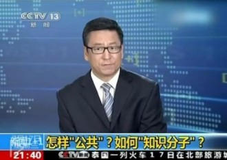
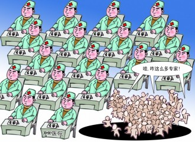

# 知识分子还能治疗社会吗？

知识分子要管好自己的嘴。——白岩松（这他妈真的是白岩松说的）

问题在哪个层次上被讨论是很重要的，我讲的是祛魅之后世界将会怎样。这已经是个不知有神，也不见先知的世界，我们只能依靠把逻辑更精致化来找到问题的出路。思维既是工具又是限制，如果淡忘对终极的追求，这还是一场不错的游戏。

今天的问题是：知识分子还能治疗社会吗？答案不是能还是不能。而是这个问题是不是一个问题？它又是如何纳入袪魅之后的世界的思想脉络里的？

首先还是应该对这里讨论的“知识分子”的具体所指做一个比较一般的界定。知识分子是什么人？在我们的印象里，修理物什的肯定不是知识分子，只能算作匠人。给人治病的医生，可能算知识分子了，毕竟他要有很多医学专业知识。但是还是少了思想家理论家们热衷的那种形而上的旨趣。而敢于给社会下诊断，治疗社会的人，应该跟知识分子联系起来。

别的我不知道，在社会学里，无数学者都会从各个方面试图对“知识分子”的内涵外延做出界定，曼海姆、葛兰西、帕森斯、萨义德、布迪厄、利奥塔、福柯等等。这里先举科塞在《理念人》当中对知识分子所做的界定，他不认同把学术界的人或所有专业人员都称为知识分子。知识分子的知识(intellect 知识分子intellectual)，有别于艺术和科学所需的智力(intelligence),其前提是一种摆脱眼前经验的能力，一种走出当前实际事物的欲望，一种超越专业或本职工作的整个价值的精神。知识分子是为理念而生的人，而不是靠理念吃饭的人。大多数在从事专业时，就像在其它地方一样，一般只为具体的问题寻找答案，知识分子则感到有必要超越眼前的具体工作，深入到意义和价值这类更具普遍性的领域之中……知识分子在其活动中表现出对社会核心价值的强烈关切，他们是希望提供道德标准和维护有意义的通用符号的人。科塞在此对于作为理念人的知识分子的特征的描述概况明显突出了知识分子的公共意识，对于人类普遍性的处境、问题、价值和意义的关怀，突出了其作为公共价值规范代言人的角色特征。

按照这个说法，只有公知才算真的知识分子。可是事实上，公知现在是臭的。这不仅仅是这些公知本身的问题，根本上来说，思想家们认定的这种有着公共意识、普遍关怀的知识分子和他们自身的立身根基之间有着一种紧张关系。这就是现代化袪魅之后的事情。

如果知识分子的公共意识和普遍关怀仅仅表现为对专业问题的关注，那么就没有这种紧张关系，因为专业问题一般都可以找到客观性的普遍标准，知识分子就专业问题发表的主张可以建立在这种客观普遍有效性基础之上。但是公共意识、普遍关怀这些，或者说公共知识分子的公共性，不表现在专业方面，表现在价值和意义问题上。即使是从专业问题入手，也是在价值问题的背景下提出的。要治疗社会，知识分子先要提出什么样的社会是健康的，应该在什么方法论的指导下诊断和治疗。

根本原因是，现代社会中已经不存在普遍性的价值标准了，在现代社会之前，这种标准是基于共同的宗教信仰的。这个袪魅化的世界，也就是尼采说的“上帝死了”的世界，马克思说的“真理的彼岸世界已经消逝”的世界，一切凝固的东西已经烟消云散，这是一个没有共同信仰价值多元的世界。袪魅之后不是没有魅，而是变成了诸神的狂欢。互异的、冲突的价值之间的斗争是现代世界在价值领域的基本状态，也是作为价值理念经营者的知识分子所必须面对的事实。科塞甚至将知识分子看作是传统的教士和先知的后代，但是他们在营造世界的意义时，已经没有了前辈可以利用的宗教价值资源。

知识分子不会消失，对于他们该如何再涉入有关世界价值和意义讨论的问题，有两种不同的立场。这样知识分子对社会的治疗就有了两种可能性。

第一种立场认为，正因为社会现在缺失了普遍的价值和意义，知识分子应该坚守使命，填补这一真空。随着普遍性价值一起消逝的，是原有价值的代言人。要有新的继任者。葛兰西对于传统知识分子和有机知识分子的区分正是对应回答这个问题的。传统知识分子的自我理解通常是独立的、自治的，超越于一切社会利益和集团之上的，正因为如此他们能代表社会一般的普遍的真理、正义和理想，有机知识分子则是与社会阶级、阶层一起产生的，与一定的社会体制或利益集团存在着有机的思想联系，他们自觉地代表某一个阶层或者集团。传统知识分子之所以能成为普遍价值的代言人，是因为其身份是自由漂浮的，因而能摆脱视野的局限性、狭隘性。而有机知识分子如何相信自己能继任社会普遍真理、价值代言人的资格呢？因为他们相信自己所代表的阶级、阶层和集团代表着历史的未来，是“普遍的阶级”或者说历史的“普遍主体”。因此作为这个阶级的代言人，也就是作为普遍价值的代言人。显然葛兰西这个有机知识分子，就是说马克思的。有机知识分子往往会更多继承进步主义的信念，他们会提供一种总体的社会治疗方案，是向着他们相信的基于本阶级立场的方向矫正的方案。

与这种立场相反，面对巨大的价值真空，另一些人认为，如今确实不可能再重新找到和确立普遍的价值标准。这种立场从根本上质疑现代社会重设普遍性价值目标的可能性，自然也否认了知识分子能为社会确立普遍价值，因此这种立场下便没有总体性的社会治疗学。这有点类似于福柯所说的“特殊知识分子”。只不过这种立场不执着于批判，而特别强调知识分子的自我认知、反思和克制，同时相应地强调现代社会中每一个个体在价值承诺上的自我抉择。这种立场不热衷于为知识分子的话语权作正当性论证，而是提醒知识分子的话语权范围的边界。这无疑是在说韦伯。韦伯认为，袪魅化之后，价值领域中的诸神纷争是现代人必须面对的命运。在纷争的诸神之中，应该选择侍奉哪一位，这个问题就无法完全依靠知识分子（学者）来做出一概的决断。在面临价值选择问题时，知识分子必须“价值中立”。价值中立否决了知识分子作为社会普遍价值代言人的资格，从而也就没有一种总体性的社会治疗方案。但是这实际上相当于将价值抉择交给了每一个个体，每个人有自由选择价值立场，但是也要自我治疗。

当然这两种立场都有问题，第一种成为新时代的教士，而第二种则被韦伯自己批判为“专家没有灵魂”。

事实上，社会是在自己变迁的，没有人能治疗社会。知识分子提出自己的社会治疗方案，是一种古典理论家的叙事方式。古典时期的宏大治疗方案，比如马克思的共产主义，都是对社会巨变、现代社会诞生的知识反应。古典理论大家都是非常敏感的，在现代社会之初就预见了很多问题和危机，但是他们的认识局限也很明显。到了现代性渐渐深入，理论家开始转入一种更复杂的叙事，反思的倾向比较明显。

而在中国现实情况中，知识群体的情况又更复杂，一方面，公权力购买知识群体的专业性话语，知识群体也急于把专业知识套现，专业看法失去客观性，“专家说”成了一种很讽刺的说法。基于专业立场治疗人的大夫都不怎么被信任，更不用说试图对社会进行评论的学者。另一方面，中国处于一个很大的价值真空中，这和公共知识分子的缺失形成一种相互的关系。少数有着公共关怀的知识分子的言论状态可以用一个成语来形容就是：乱枪打鸟。而很多代言人在公共舆论中的表态由于背后立场性的痕迹也越来越明显，被质疑虚伪而失信。当然，更糟糕的是，个体无法自我治疗。

（采编：韩忠楠；责编：彭程）

[【学人】许知远：游牧式写作](/archives/39723)——十多年来，许知远一直活跃在传媒界，致力于他的“媒体写作”。实际上，在业已形成的写作环境中，这种跨文体的写作是反规制、反主流的写作，自由的、异类的写作。 [【学人】为什么要读胡适？](/archives/39815)——病态与健康之别，不仅取决于思想，更取决于思想的逻辑与风度。读胡适，可以拓开我们生命的宽度。然而我们不必越过他，我们只须追随他的足迹：读胡适，做公民。 [【学人】权利,而不是权力–我理解的米奇尼克](/archives/39850)——米奇尼克说：“衡量民族、社会和个人成熟是在这样的意义上，他们生活在自己的历史当中，有他们自己生活的故事。”创造历史，展示人类精神的魅力。
