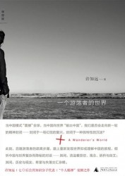

# 许知远：游牧式写作

**自由这个字眼在我们的写作中很早就有了。它的出现不是作为一种思想或哲学，而是作为一种情绪和精神状态；它不但是一种思想，而且是一种美德。**

**——〔墨西哥〕帕斯**

作为一个知识分子作家，许知远十多年来一直活跃在传媒界，致力于他的“媒体写作”。从决心以写作为业时开始，他便确认文学时代已告结束，面临的是一个“新闻报道的时代”，当此信息蜂拥之际，媒体成了“时代的教堂”，媒体写作者当然是“时代的牧师”了。于是，他醉心于《时代》、《滚石》、《经济学人》的新闻写作，梦想当一名“牧师”，以一种他名之为“新闻体”的形式布道，传播真理，激发对自由、改革和进步的热情。

实际上，这是一种跨文体写作。不同于一般新闻记者的记述，他不求“客观”，不想局限在具体的事象里。他喜欢介入，指点江山，臧否人物，分明是一种社会批评。但是，他又不愿意遵守经院里的语言逻辑，相反，追求文字的弹性、韵味和风采，从而带上一种文学性，不像论文而近于随笔。他称许叔本华的说法“像伟人一样思考，像普通人一样说话”。所以，他的文字既富含理性，又充满激情；高远、深入，又平易自然。他赋予“媒体写作”以崇高的使命，努力使之成为连接伟大的人类文化与现实大众的纽带，而拒绝沦为少数人的私密游戏。

这样的写作是真正意义上的写作。在业已形成的写作环境中，这是反规制、反主流的写作，自由的写作，异类的写作。用法国哲学家德勒兹的一个比喻的说法，或可称为游牧式写作。

许知远自称是一个“游荡者”。在他的身上，有着比一般青年人更激烈的青春的躁动；当他怀着无穷的欲望策马前往时，却不像那类纨绔子弟漫无目的的浪游、嬉玩、流连风景。而是在远方不断展开的跳动着的地平线上寻找世界变革的秘密，寻找生命之星。他宣示般地说道：“生命中应该有一条更为宽广与缓慢的河流，它的源头连接着历史的深处，缓缓地穿越我的一生，并流向下一个年代。这条河流中蕴含着人类一些永恒的情感。”这样的历史感已然包涵着一种人类彼此间的联系，一种共同命运的承担。他表示，生于七十年代的人，必须担负起时代变革的重任，除此无以证明自身的存在。

因此，许知远的游牧式写作总是带着他的问题意识，取不同的方向和路径，从边缘进入中心。所谓中心，其实是价值核心。它不是封闭的，而是开放的；它吸纳来自书籍、网络和现实生活各个方面的知识和信息，场景和细节，显示出固有的形态乃至意义的丰富性来。

许知远是一个爱国者，但又不是那类惯见的国家主义者，反倒更加近似于“世界公民”。他清楚地知道，他和他的同代人正在卷入中国的“一场伟大的试验”，在刚刚开始的关于变革的戏剧中担任了“新主角”。他渴望参与，不只一次表示说，要帮助塑造一个新国家、新社会的形成。“帮助”一词的使用很有意思，其中既有责任感，义务感，又确乎有着一种外来者的意味。诱惑与强制，自由与责任，在许知远的写作中形成为一种张力，而随时随处表现出来。

在《未成熟的国家》里，他悉心梳理中国的现代化史，比较别的史书，明显地有着独特的视角和叙述方式。全书从昨日“帝国的崩溃”开始，结束于今天“社会的焦虑”，他认同中国进入九十年代以后整整一代人全数“放弃”的说法，致力于搜寻二十年直至一百年间那些“丢失的东西”，被发展与变革中的巨大的经济成就所掩盖和遗忘的东西。

《祖国的陌生人》记录了许知远在国内走访的见闻与思考。从大陆到台湾，从北京到外省，从曾经作为沿海殖民城市的繁华的大上海到内地灰暗、暗哑的煤区，从“废都”西安到迅速崛起的年轻的深圳，他描绘了不同地域间的差异，历史的皱折和现实的阴影。书中出现的人物有知识分子、维权律师、作家、教师、报人、普通市民、民工、小老板……是众多的鲜活的面孔，组成了陌生的祖国，吸引他去辨识，去熟识，记忆和想象，并因此陷于思考乃至困惑之中。

新著《一个游荡者的世界》，是一部世界旅行记。笔涉的地方有印度、不丹、俄国、欧洲和中东。由于许知远一直带着他的“中国问题”周游列国，这就显得很特别，与其说是这是游记，不如说是一部“马上沉思录”。他说：“中国社会内部的成就、困境与失败，在世界的其他角落愈发分明。在旅行中，我总是不断地寻找这些痕迹。”整部书是叙述的、现象学的，但是又总是不时地穿插纲要式的议论。这样，使得叙述中的断片看上去反而变成了论说的根据。在进行中印比较时，许知远着重引用历史学家古哈的话说：“当代印度真正成功的故事是政治而非经济。”他描述了旅行中的一个细节：在印度的大小城镇，可以买到很多与印度无关的英语世界的最新出版物。他发现，在富裕的中国，虽或可以买到一切，却买不到这些书。不丹，年轻的国王继引入电视机和互联网之后，引入民主变革。他强行解散内阁，将政府管理权移交给大臣委员会，起草宪法并设法通过，然后宣布退位，结束世袭君主制，代之以议会民主制。不丹王室，一个统治者或统治集团非但不被权力所腐蚀，而且，居然利用手中的权力主动推动政治体制改革，以牺牲既得利益换取国家的进步。虽然，不丹的政治经验带有某种偶然因素，但是，故事本身无论如何令人鼓舞。《列宁的阴影》一篇将中国与俄国划出两条平行线进行比较。许知远写道，中国的经济增长震惊了世界，但是在社会内部，却有停滞甚至衰退之感。他以年轻人的职业选择为例，十年前，大多数大学毕业生渴望进入外资公司、私营企业、自行创业，或成为新闻记者，而现在，他们蜂拥麇集想要考取政府公务员、进入国有企业。他认为，目前迅速膨胀的官僚系统，正在毒害整个社会精神。对于俄罗斯，他上溯至勃列日涅夫时代：领袖魅力为平庸的官僚系统所取代，除了保持现存秩序，不再尝试任何新事物，社会失去了希望与朝气，荒诞感和幻灭感到处蔓延。而今，俄罗斯经历又一次历史的循环，进入了另一个“停滞年代”。历史的似曾相识是饶有意味的。之后，许知远写到他的埃及之行。很明显，“阿拉伯之春”的激荡的氛围感染了他。他站在解放广场上，思考并演绎了眼前经过的一场推翻独裁者的新型的革命：没有完善的组织，没有明确的领导人，没有周详的策划和准备，惟凭新媒体提供联络方式……总之，革命解放了个人的自由意志和创造力，并藉此打破了所谓的历史规律。为此，他高度评价埃及革命的成就，虽然革命初露头角，还有许多艰难困阻留在后头。在批判国内知识分子的普遍的反政治倾向的同时，书中不只一次呼唤对于中国未来的想象力。

在讨论中国问题时，许知远常常把它置于当代世界政治格局的框架之内。除了晚清历史，他很少借用史事，拿现实中的社会现象跟帝制时代的古老经验进行类比，或许这与他的知识结构有关，但是重要的是，他意识到，价值判断必须建立在现代性和现实感两者之上。他不能不注目先进的西方，敏感于世界各地的新闻事件，尤其是类似东欧和中东社会的结构性变化。在他那里，中国和世界是一体的。

许知远喜欢宏大。他不断涉入、探索、追踪、游弋于广大的场域。从阿伦特、奥威尔到丹尼尔·贝尔和托夫勒，他极力设法获得广阔的知识背景，完善他的方法论，避免把历史和现实世界的事物简单化。

在同一个世界体系里，他比较了多种同质和异质的成分，如毛泽东时代和后毛泽东时代，中国特色和“亚洲价值观”，“北京共识”和“华盛顿共识”。通过三峡工程、北京奥运会、法兰克福书展、Google进入或退出中国市场等等国内及国际新闻，他一再解读中国崛起；他质疑约翰·奈思比、约书亚·雷默、马丁·贾克等外国人士关于中国的种种说法，对国内学者撰写的《货币战争》、《中国不高兴》、《中国站起来》等一批大众读物，给予猛烈的嘲讽和批评。他的作品，述及众多国家、地区的人物和事件，立场是一贯的，理念是明澈的，批评是雄辩有力的。其中，尤以和法国作家珍·法兰可斯雷蒙的同名著作《极权的诱惑》为成熟，表现出了一个社会观察家和批评家的独立性。无疑地，这是中国近三十年来极少数优秀的著作之一。

作为一名知识分子，许知远的批评是多方面的，尖锐的，凌厉的，持续的。在事关国家、社会、体制等大的方面，除了批判民族主义、发展主义、技术主义、庸俗的实利主义、消费主义等等之外，还特别批判了自己的同类，老一代知识分子在多年的政治迫害和反智主义的冲击之下，使命感与中心感的丧失，以及年轻一代的“思考无能”。

对于一些具体的人与事，包括曾经心仪的师长与朋友，批评更为率直，自然也包含了某种期待的温情。比如对陈丹青和阿城这样他称为“一代最敏锐与智慧的人物”，就怀疑他们的严肃与真诚，认为他们的一些观点的表达只是某种“漂亮的表演”，甚至内心是否存在着某种持续的信念也都成了问题。他指出：“他们有智慧和感召力，却没兴趣承担起这个时代所需要的更严肃的使命。”对余华也如此。他认为在市场方面获得巨大成功的《兄弟》是一部失败之作，让严肃的读者失望。其中，最主要的是“道德与意义追问的缺失”，“产物精美却没有灵魂”。他特别强调说，问题还不在于仅仅同余华有关，而是一代中国作家的困境所在，因为创作的真正源泉正在于内在的道德激情。

知识分子敢于明言，批判社会，挑战权势，却往往怯于解剖自己。许知远不然，在他的著作中，会不时看到他的自我反省、批评和谴责，这在当今志得意满，自我炒作已成风气的知识界中特别罕见。他坦言自己知识浅薄，浮游于生活的表层，精神因此变得平庸；又剖白说自己害怕失去既得利益而逃避责任，满足现状，缺乏对生活质量的追求，缺乏内心深处的追问。他说：“像很多的同代人一样，我也是一个不自觉的投机主义者，我依赖于外界环境对自己的评价，而不是内心的准则。知识、思想，甚至理想主义，有时都不免是我投机的方式。……”他没有那类以精英自居的言论领袖的优越感，像这种近于自虐般的批评文字，在他们的嘴里是吐不出来的。

这是一种品质。知识分子需要具备某种人格特质，作为内凝力形塑自己，不但知识和思想而已。

许知远的游牧式写作是富于活力的，这是十足的青春文字，也是先锋文字。其先锋性，源头可以上接五四时期的《新青年》和《新潮》两种杂志。在过去的动荡岁月里，北大校园里的知识分子和青年学生，都是开风气的人物。这支先锋队伍的呼号，一代一代，一直激励着后来者许知远，使他，一个忧伤的年轻人终于长成勇悍的骑手。

上世纪八十年代中期有所谓“实验小说”，最先以“先锋”命名。在叙事方式和形式上翻弄点小花样，算什么先锋呢？在西方，当“先锋”从一个战争术语演变成政治名词和艺术名词时起，它就不限于形式革新。“先锋”首先是反叛的，它瓦解组织，质疑秩序，否认当下，岂但不惮于自我孤立，而且简直偏好孤军深入，而表现为一种英雄主义。先锋是自由在时代矛尖上的最耀眼的闪光，先锋是进取，是历险，是格斗，先锋的血永远是热的。

先锋因向往未来而一直“在路上”。凯鲁亚克在路上，许知远也在路上。凯鲁亚克的道路通往反叛与虚无，许知远的道路同样通往反叛，但是没有灰烬，只有火，和火。

（采编：韩忠楠；责编：彭程）

[【学人】为什么要读胡适？](/archives/39815)——病态与健康之别，不仅取决于思想，更取决于思想的逻辑与风度。读胡适，可以拓开我们生命的宽度。然而我们不必越过他，我们只须追随他的足迹：读胡适，做公民。

[【学人】权利,而不是权力–我理解的米奇尼克](/archives/39850)——米奇尼克说：“衡量民族、社会和个人成熟是在这样的意义上，他们生活在自己的历史当中，有他们自己生活的故事。”创造历史，展示人类精神的魅力。

[【学人】知识分子还能治疗社会吗？](/archives/39933)——古典派知识分子都有社会医生情节，今天的问题是：知识分子还能治疗社会吗？答案不是能还是不能。而是这个问题是不是一个问题？它又是如何纳入袪魅之后的世界的思想脉络里的？
