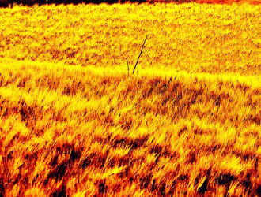

# 晒麦子

6月末的时候回家呆了几日，好久没有这么早回家了，却恰逢麦收时节。自初三住校读书以来，于四季变迁中，与庄稼已日渐稀疏。虽不是“五谷不分”，终究再没有拉着犁“当牛做马”。回家时麦子已然装袋，所缺唯有晾晒而已。在联合收割机发明之前，这恐怕是最清闲最幸福的阶段了。

90年代虽然有各种机械，但是尘土飞扬，麦茬乱飞的景象仍历历在目。脱粒完毕每个人都会覆盖着层层的土与麦茬。不过相较于镰刀割麦子，这些活计实在说不得重。收割完毕晾晒完毕，或多或少的麦子都交到村委会中，那是这个国家绵延两千年的皇粮国税。不禁想到农民究竟是土里刨食的“自耕农”，还是份属国家的“编户农”，那些痕迹经过学术的浸润重新回到生命里。

晾麦子关键在于晒干水分，贮藏一年之口粮，实在容不得自欺欺人的马虎。水泥地是最好也是最常见的选择，以往只有稍富有的家庭才能在自己门前建一块水泥地，如今倒是愈发多了。村村通公路也提供了不少的水泥地，以往的水泥地之争如今倒是不多见了；不过贫穷点的庄子周围的公路惯例充满了晒麦的人。

晒麦需要适时的翻麦，保证晒得比较均匀。总是得隔段时间去翻一下，这时间却也不固定，几支烟，一盏茶，几段闲话。庄稼人总是心里有个数，祖祖辈辈传下的经验，可不会糊弄自己的口粮。邻里关系好的，少不得互相之间帮衬帮衬，倒不是图几支烟、几碗茶，交情就是交情。每天晒完堆起，少不得又是一段时间。有心眼活泛的，不堆麦子只拿篷布遮盖一下，少不得要冒点风险。不时降临的暴雨，晴朗的夏夜也挡不住。

这些机械和工具究竟给生活带来了什么？现代意义上的农民有没有产生？我仿佛人类学家般地重新审视自己的生活，但是圈子里的自己本就是个不折不扣的农民。农民的谨小慎微、不敢冒险在我身上体现的淋漓尽致。就关注自己这一亩三分地，好听的是本分，不好听的是坐井观天。无论是再怎么批判孝道，我也是要考虑父母给出的生活建议，考虑我的行为会给他们造成的影响。那些属于农民的本能，读再多的书也无法消除。

从小开始，我们就被灌输“好好学习，长大不要种地”。无论别人怎么赞扬“田园牧歌”，绝大部分农民都在试图逃离土地，逃离这不能给他们带来尊严的土地。不谈当年模仿苏联“剪刀差”，将剥削农民作为当然合理的国家政策。如今的农村又有什么上升渠道，那些散落无依的农民工可能并不是最差的农民。教育条件越来越恶劣，好久都不曾听闻有过一本线的学生了。好的大学会提供好的上升渠道吗？洗洗睡吧。

不渲染，至少这日子绝不好过。像我这种靠学费减免上学的人，从某种程度上讲算是幸运的。那些真正贫困的人是不可能上学的，虽然人数并不多。那些苦难我们都不讲，因为这些苦难本身并没有价值。苦难就是苦难，无论你仰天大笑，还是嚎啕大哭，都无法改变你痛彻心扉的无力感。那种错不在我，即使用尽全身力气也于事无补的无力感。

比贫穷，你永远可以在前面加一个更字；比勤奋，永远有人比你更耗尽心力。可是这一切都没有价值，你有多少分数就有多少价值，你所有的德行与道行都在那个三位数中。一切苦难都不值得分享，他们唯一的价值只是在你获得“成功”的时候告诉别人“苦难成就辉煌”。没有人关心这苦难你是否愿意承受，没有人关心你彼时的无力与柔弱。

从小到大，这些苦难都是为了未来的成功，而没有关心现在的你是谁。好像如今这个又矮、又穷、又丑的你只是为了涅槃重生的未来。而社会好像也允诺了一个必定成功的命运。无论如何那个矮穷挫的你注定是没有任何重量的。就像现在写文章的我，他的努力与歌哭，并不具有任何意义。可能这样的“物化”与“异化”才是最让人觉察不到的。

可能我的父母不会明白，到如今我还是个农民。我松过土，拉过犁，播过种，撒过肥，割过麦，扬过场，用双脚一步步丈量过土地，也用双手一次次刨过粮食。和土地的联系，土地应允的或许不会实现的承诺，让我的思维模式脱不出农民。即使我能在远处装作进行了一次次反思，但是我每一次决策都深深嵌入到土地里。

就像农民不保证富足，土地不必然收获，苦难也与成功无关，但是我的生活就是我的生活。我就是我，我认同的并不是可能会成功的我，如今的我是为了成功努力的我，也是苟且卑微的我。这苟且卑微并不使我卑贱，那未来可能成功的我，也见不得有什么高贵。这苦难与卑微并不因为它是成功的垫脚石而存在，它只是我现在的生活，是我苦苦追求的生活。

依然是农民，不过耕种在另一片土地。 

采编：刘迎；责编：佛冉

[【学而思】关于读书的胡思乱想](/archives/40507)——读书这件事情好与不好都是一个备受争议的事情，多读书，读好书是从小大人们一直告诉我们的，那么如何读书？下面让作者和我们分享一些他的思考。 [【学而思】关于学术“异化”的胡思乱想](/?p=40623)——人在江湖走，哪能不为稻粱谋。“以学术为志业”意味着学术不仅仅是我们的兴趣爱好，更是我们吃饭的家伙。我们不仅要“消费知识”，而且要“生产知识”。 
