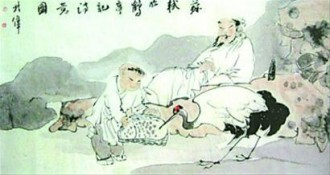

# 古代官员如何放假休息？

如今，随着时代的进步，人们的生活节奏逐渐加快，各方面的压力也越来越大，休假制度成为大家热议的话题，事关中国每个公民的切身利益。合理的休假制度可大大地提高办公效率，也对弘扬传统文化、拉动经济增长有着重要的意义。其实在古代，历代王朝的休假制度仅针对从政官员，统治者为了鼓励臣下尽心国事，专心高效地办公，不断在实践中完善休假制度，名目多样，内容丰富，对现行的节日休假制度也有一定的影响和借鉴意义。

**官员也是要休息的**

我国秦朝及以前，并没有休假这一说，政府官员每天都要按时上班，若有事只能提前请假，称为“告归”。

劳逸不调的工作会让人苦不堪言，没有办公的干劲。汉朝休假制度初具雏形，有很大地发展，据《汉律》记载，“吏员五日一休沐”，官员每过五日可 “休沐”，即洗澡沐浴的意思。大家知道古代官吏蓄发梳髻，头发太长，洗一回很费力，唐代的诗人李山甫头发长达五尺余，每次沐浴后便让碑女把长发“捧金盘承而梳之”，可见古代男子洗一次头有多么不易，故体现了朝廷对官员人文意义上的关照。这么看，汉代的“休沐”有点类似现在的五天工作日和周末。

隋唐时采用的是“旬休制度”，也就是十天休假一次。与前朝很大的变化在于，每年清明、冬至、端午、中秋、重阳可以放假，与现在的节庆日类似。除此之外，皇帝的生日、孔子的生日、老子的生日等都还可以放1至3天假，这要实施在今天，大家肯定会大呼过瘾。然而，唐朝对请事假规定得很严，每月不得超过两天，最多不过三天，超过扣一个月俸禄。如果请假超过100天，就被停职了。这似乎也情有可原，连圣人的生日都放假了，大伙还有什么不满意呢。

宋朝的休假制度显得更加宽松。《文昌杂录》载：“官吏休假，元旦、寒食、冬至各七日；上元、中元、夏至各三日；立春、清明各一日，每月例假三日，岁共六十八日。”宋朝还有一个特殊规定，各级官署，每年十二月二十日“封印”停止公务，公务人员回家过年省亲，要到次年正月二十日才返回衙门“开印”办公。这样，他们全年的实际休假达到98天。看来唐诗宋词还是要有闲工夫游山玩水才会有灵感！

到了元朝就非常不一样了。一年只剩下十几天的休息时间了。也许元代统治者的祖先们从来都在马上跑来跑去，深深懂得“生命在于运动”的道理，所以工作就是休息，休息也是工作，总之一点：大家以工作为重就好了！也是，如果老休息，元朝的部队怎么能打到欧洲呢，还不是靠着“人家工作我工作，人家休息我还工作”的精神吗？

到了明朝就更惨了，因为第一个皇帝朱元璋，也许从要饭到打仗从来就没有过休息的概念，所以他制定的休假制度那是既简单又好操作：三天。一年中只有过年、冬至和他自己的生日这三天休假，怎么样？厉害吧。但后来在实施过程中遇到了很多无法回避的问题，比如夫妻分居和父母子女问题等，估计请假的人太多了，这样才有了松动，增加了月假3天，全年加起来大概是50天左右。

清朝，到鸦片战争以后，西方人大量进入中国， “礼拜天”的概念让国人产生了认同感，受西方假日制度影响，我国休假制度发生了很大的变化，由原来的每月三天旬休，变为了星期日休假制，并一直沿袭至今。

**生病了如何请假？**

白居易有诗《病假中南亭闲望》曰“敬枕不视事，两日门掩关。始知吏役身，不病不得闲”，可以看出官员因公务繁忙，有时在病假中才能享受片刻安闲。

唐代官吏因病休假史书记载相当丰富，我们常见古文中“以疾请告”，大多因为身体欠佳、有病在身而请假回家休养治病，此外 “坠马伤足”的意外伤害和因“风痺”自然原因所导致的病痛也包括在病假之内，可看出开明的唐朝在官员休假制度上也是十分人性化的。

这些关于病假的记载，首先说明生病了必须先请假，表明请假的动机，上级根据具体状况，批准通过后才可以回家休息，不得无故翘班，一定要重视纪律。其次，唐代病假期限规定为百日，官吏因病请假超过百天须停职。唐德宗时李翱“请告，满百日，有司准例停官”，文宗大和四年大臣崔从“请假一百日，准式停官”，都是因超过了所批的期限，丢掉了官职，这个规定还是十分严格执行的，确保了办公的正常进行。当然也有受到优待照顾的特例，如唐穆宗时的宰相严绶年位俱高，疾病假己满百日，按照规定当长告退职，穆宗特加优待，诏令:“宜依旧秩，未要举停”。

以病在告，被作为一种休假方式的同时，也往往被当作一种逃避政事、躲避私祸的借口与途径。如唐德宗时宰相赵憬因为和陆贽合不来，则“数以目疾请告”，以病假为理由不当政事。贞元年间“李泌为相，以左庶子史馆修撰征，至则与同职孔述睿争竞细碎，数侵述睿，述睿长告以让，不欲争”。唐后期的张濬因躲避黄巢起义带来的祸乱，“托疾请告，侍其母，掣族避乱商州”。

** 官员们的休假生活**

在古代，尚无如今这么快捷发达的交通，丰富多样的娱乐休闲工具，但各朝的统治者还是鼓励官员与亲朋好友闲来一聚，朝廷也会举办各类节庆盛宴，地方上也有各类节庆特色活动，让大家在假日里好好地放松放松。

尤其在唐代，社会普遍存在着一种开放之风，人们乐于交往，在难得的假日里往往相邀而聚，游乐宴集之风兴盛。官吏或探访亲友，或饮宴交游，或寻欢览胜，或吟诗作赋。王勃在《腾王阁序》中称“十旬休假，胜友如云”，即是描绘了旬休饮宴交游这一景象。白居易有《春寝》诗云:“何处春暄来？微和生血气。气熏肌骨畅，东窗一昏睡。是时正月晦，假日无公事”，他在苏州任刺史时深感“劳逸不均”，在假日总是尽情游玩，或与同事亲朋欢聚一堂，或去太湖过上一夜，他觉得这是一种莫大的欣慰和欢畅，如此快哉！

到了节假日，一些官员忙着游玩享乐的同时，也忙着送礼、收礼，热闹、欢快的气氛中，掩盖不住贪腐的气息。

清代贪官和珅势焰熏天时，凡入京赴吏部应选的官员都以能谒见和珅为荣。山东历城县令某某，借休假之时，庆祝节日之名，前往和府，送了看门人2000两银子，2000两银子啊！你以为这样就能获得什么实惠了吗，那就错啦，这才被允许“长跽”(双腿跪地，上身挺直)和府大门前，等候和珅回府呢！

据陈夔龙《梦蕉事杂记》一书，晚清有个姓丁的人被任命为四川总督，要到北京谒见皇上。他先到天津，见到李鸿章。李鸿章对他说:”到京谒见皇上，应酬大于以往数倍。知道你两袖清风，已代你筹备银子1万两，存在京城某银号。”随后丁某赴京，正遇上某相国生日，这位相国，对赴京的地方官“所望甚奢”，就等着他们来送大礼。丁某的1万两银子竟不敷应用，又请李鸿章代筹1万两(主要用于打点京官，此外还要资助在京待考的100多名四川举子）。可想若在重大节日里花费在打点官员的银子是多少啊。

虽不乏有人借由休假之名行贪贿之事，但节假日里，官员们利用空闲时光，体察民情，熟读典籍，好好调剂一下平日里劳累的办公状态，对更好地投入工作、干出实事有极为重要的作用。同时富有文化和情趣的官员们宴饮畅游，吟诗作赋，在闲来时光画画山水，抚抚琴瑟，练练书法，比比棋艺，格调高雅、情趣健康的同时，也为后人留下了极为珍贵的文化瑰宝，这样重视亲朋邻里之间交流与沟通，运动健康、品味高雅的假日生活还是十分值得推崇的。

（采编：韩忠楠；责编：彭程）

[【对话】法国作家谢阁兰笔下夏桀形象之重塑](/archives/40302)——东方遇见西方，最遥远不过文人的一纸诗骚。我们在流动的文字符指中，不断追索其能指意义。惟其如此，文学才能生发，文明方能对话。 [ 【对话】《灵山》：形上的流亡](/archives/40199)——在我们惯常的理解中，流亡者获得了一片星空，却失去了整片土地。但不可否认的是，去国流亡的异邦人在广袤的大旷野中，让文明从此不断出发、永不抵达。
