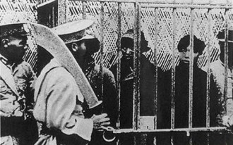
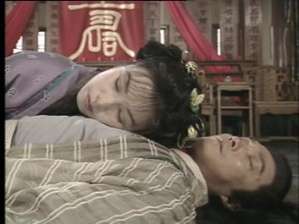
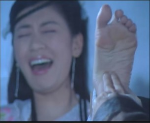
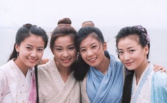
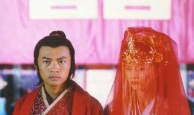
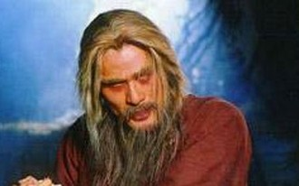
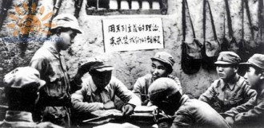

# 叛徒、内奸、教贼张无忌罪恶的一生

一 

1327年，正当第一次中国大革命进行得如火如荼之时，明教中央委员会总书记、久经考验的老一辈革命家阳顶天同志在蒙元匪帮、大地主大奴隶主的代表和打手成昆的暗算下不幸遇害。此后，国内革命形势陡然逆转，轰轰烈烈的大革命中途夭折。革命进入了低潮期，在蒙元反动政府的围剿下，大批革命意志坚定的教内同志倒在了敌人的屠刀之下，也有很多不坚定分子纷纷脱教、叛教，革命进入了低潮期。全国笼罩在一片白色恐怖之下，反革命力量大大超过了中明所代表的革命力量。革命何去何从，成为摆在教中央面前的生死攸关问题。

在这一关键时刻，以中央委员会副总书记杨逍为代表的右倾机会主义分子，和以中明中央常委、南京军区司令殷天正为代表的“左”倾冒进主义分子个人野心膨胀，为了争权夺利，发生了内讧，排挤了阳顶天同志指定的接班人谢逊同志，以及以韦一笑、彭莹玉、周颠等同志为代表的，主张和中国实际相结合、走“农村包围城市”道路的正确主张。不久，殷天正在教内路线斗争中失利，竟脱离教中央的领导，另立“中央”，建立了托派的伪天鹰教，自任总书记，悍然进行了分裂教中央的活动。殷天正的分裂行径遭到了广大教内同志的抵制，而由杨逍等领导人把持的教中央，也因为其右倾机会主义错误而为广大教徒群众所唾弃，处于瘫痪的状态。 

沧海横流，方显出英雄本色。在这一危急时刻，彭莹玉、周颠、棒胡等同志坚持走与人民群众相结合的路线，在全国各地建立根据地，播下了革命的火种，培养了朱元璋、周子旺、徐寿辉、韩山童等新一代革命家；范遥同志放弃了党内的高级职位和较为便利的生活条件，为打入敌人内部，坚持情报工作而卧薪尝胆；谢逊同志在各地进行游击战，刺杀了许多大地主大奴隶主的要人，虽然没有找到正确的革命道路，但是有力地打击了敌人的嚣张气焰；与之相反，黛绮丝（国际明运驻中国代表）等人因为自由主义、个人主义的思想腐蚀，追求小资产阶级情调的“爱情” 而脱教，而以杨逍、殷天正为代表的右倾或“左”倾的错误思潮愈演愈烈，与反动势力相勾结，加紧了篡教夺权的阴谋。 

正在这时，发生了著名的“王盘山惨案”。 

六十年前，在旧民主主义革命失败前夕，伟大的革命先行者夫妇郭靖和黄蓉为了防止反动敌人的破坏销毁，将伟大的革命导师黄裳所著的革命理论著作《阴阳矛盾论》和伟大的军事家岳飞同志所著的不朽军事著作《持久战论》封入了倚天剑和屠龙刀两件兵器中，象征着“枪杆子里出政权”的革命真理。 

但是一些思想落后的同志，不明白革命的真谛，在反动思潮的蛊惑下，陷入了“唯武器论”的错误思潮，认为得到倚天剑和屠龙刀就能取得革命的胜利。为此你争我夺，混淆了革命的主要方向和目的，产生了严重的后果。1336年，屠龙刀落到了伪天鹰教托派“中央”的手中，伪天鹰教得意洋洋，弹冠相庆，在王盘山岛上召开新闻发布会，展示屠龙刀，妄图靠此取得中明中央的领导权。为打击托派的嚣张气焰，并夺回屠龙刀，使革命回到正确的方向，谢逊同志以革命的大无畏精神毅然潜入王盘山。 

谢逊同志出身贫苦的猎户家庭，根红苗正，觉悟很高，是阳顶天同志重点培养的接班人。他的全家都是被反动势力代表成昆所杀，国仇家恨的教育，令他充满了革命的斗志，曾经一拳击毙少林寺反动头子、封建僧侣集团代表空见。在王盘山上，谢逊同志意志坚定、斗志昂扬，投入了忘我的战斗之中，最后打败了敌人的围攻，歼灭了伪天鹰教的反动势力。但是，由于谢逊同志思想中阶级斗争的弦没有时刻拉紧，忽略了向他靠拢的投机分子张翠山、殷素素，导致了严重的后果。

张翠山是一个小资产阶级知识分子，为了投机革命，投入著名民主派爱国人士张三丰先生领导下的武当民盟，担任机要秘书；殷素素是殷天正的女儿，只有十八岁，殷天正任人唯亲，大搞裙带关系，竟将她封为托派“中央常委”。二人在临安一拍即合，勾搭成奸。他们在王盘山上，为了夺取屠龙刀而向谢逊同志示好卖乖，骗取了谢逊同志的信任，最后又背信弃义，将谢逊同志的眼睛射瞎，这就是中明教史上著名的“王盘山惨案”。 

身负重伤的谢逊同志舍身将他们带到靠近北极的阿留申群岛，试图和他们同归于尽。但是为了打入中明内部，窃取革命机密，张翠山和殷素素又表演了猫哭耗子的“忏悔”，流了几滴鳄鱼的眼泪，并与谢逊同志结拜为“兄弟”，从而麻痹了谢逊同志的斗志。打听到谢逊同志是阳顶天同志指定的接班人后，他们就处心积虑地让自己的儿子张无忌拜谢逊同志为“干爹”，试图通过这种间接的方式来篡夺中明中央的领导权。 

二 

张无忌（1337-1358），是小资产阶级张翠山和托派分子殷素素的儿子，从小就受到了反动的教育。虽然在谢逊同志的积极影响下，有一定追求进步的革命思想，但是更多是小资产阶级个人享乐意识和托派的反动纲领的结合。1346年，张翠山、殷素素将自己的“结义兄弟”、双目失明的谢逊同志抛下不管，带着儿子张无忌返回国内，试图投机革命。但是其行踪很快被昆仑民革、峨嵋妇联、丐帮致公党等各民主门派发现，各民主门派关心谢逊同志的下落，向他们询问。但张翠山夫妇出于独占屠龙刀的政治野心，对此秘而不宣，引起了各民主门派的不满。不久，在革命群众揭发之下，张翠山曾经杀害过民族企业家都大锦满门，以及殷素素殴打武当民盟前任秘书俞岱岩致残的犯罪事迹大白于天下。二人的画皮被揭露后，在武当山上畏罪自杀，结束了可耻的一生。 

张无忌因为年纪幼小，被宽大处理。爱国民主人士张三丰先生亲自抚养教育他，希望他能摆脱父母的不良影响，长大后成为有用之材。但是张无忌怀着对革命进步势力刻骨的阶级仇恨，冥顽不灵，在武当山上挑拨生事，经常辱骂和殴打追求进步的同学宋青书、清风、明月等人。张三丰无奈之下，将他送到蝴蝶谷医学院，这里是中明的支部，院长胡青牛同志担任支书，他是一位久经考验的革命家、医学家，老军医。一生治病救人，兢兢业业，医好过无数明教的革命战士。张无忌试图投靠胡青牛同志以投机革命，但是胡青牛同志阶级觉悟很高，识破了他的反动本质，把他赶出了门。张无忌却赖在蝴蝶谷不走，软磨硬拽了两年，要做他的徒弟，始终被胡青牛同志所拒绝。 1350年，胡青牛同志在叛变革命的黛绮丝的屠刀下不幸牺牲，张无忌在胡青牛同志死后，私自侵吞了他呕心沥血写成的医学专著，并以他的继承人自居，四处招摇撞骗，说得到了老军医的秘方，专治性病疑难杂症，以此来讨江湖混饭吃。 

这时候，东方红，太阳升，朱元璋同志在彭莹玉同志的带领下加入了伟大、光荣、正确的中明，走上了革命道路，和徐达、汤和、邓愈等同志一起，在自己的家乡凤阳和蒙古鬼子展开了游击战（参看本书第十三章“朱元璋同志早年的革命道路”）。张无忌以胡青牛学生的身份游医来到这里，受到了他们的欢迎和款待。但是由于害怕自己的真面目被揭穿，张无忌不久后便离开了凤阳。 

在社会上，年仅十四五岁的张无忌就展现出无耻下流的一面，诱拐了一个叫杨不悔的女孩。原来，当时的中明中央领导人杨逍生活极其腐化堕落，长期与峨嵋妇联的一名女青年纪晓芙非法姘居，并生了一个女儿杨不悔。后来此事被革命群众揭发，杨逍为了保住个人权位，将纪晓芙母女赶走。不久，纪晓芙被峨嵋妇联主任灭绝找到，灭绝大义灭亲，当场将其处决。杨不悔流落在街头，后来遇到了张无忌，于是被他骗奸。张无忌听说杨不悔是杨逍的女儿，又起了投机的念头，决定将杨不悔送到昆仑山中明总部，去投靠她的父亲杨逍。不料，杨逍却生怕自己的丑行暴露，在接回了女儿之后，就把张无忌赶走。

张无忌在武当山时，曾偷窃了武当山图书馆中一些武术方面的藏书。为了实现他个人的政治野心，他离开杨逍后，就躲在昆仑山上练习拳脚功夫，成为了所谓的“武林高手”。这些浅薄可笑的武术也成为他日后招摇撞骗、吹嘘卖弄的资本。 

1357年初，在蒙元反动统治者的挑拨下，也因为杨逍、殷天正等教内高层的倒行逆施，破坏统战，引起了一些民主门派的不满，挑起了六个民主门派和中明之间的械斗，造成了双方很大的损失，这对于革命力量的发展是很不利的。在双方两败俱伤之时，张无忌却渔翁得利，跳出来收拾残局，打败了几个民主门派的负责人，让双方结束了对抗，然后宣称自己“拯救”了明教。他是殷天正的外孙，手上又有杨逍的把柄，而韦一笑、彭莹玉等进步势力也被他的表演所迷惑，因此裹挟了民意，让中明中央委员会以全票通过的结果选举他担任了中明中央第三十四任总书记的职务，实现了篡夺明教最高领导权的野心。 

一些同志据此认为，张无忌多少有“保全中明”的功绩，因此功过应该三七开，这种认识是不正确的。虽然张无忌的行为客观上是起到了保存革命势力、打击蒙元统治者气焰的作用，但是也应该看到他所做的一切都是为了实现自己的野心和享乐，这和昏庸无能的蒙元统治者放任中明壮大的性质是相同的。难道我们也要感谢他们的腐化堕落吗？并且也应该看到，张无忌在职期间，延续了杨逍、殷天正的反动路线，对朱元璋等同志的正确革命路线则加以打压，因此对革命的整体发展是很不利的。 

三 

张无忌以并非中明教员的身份窃取了中明的最高领导职务后，对于丐帮等帮派的挑衅立刻采取了投降主义的错误态度，躲在地道里不敢出头，引起了教内一些老同志的不满。为此，张无忌不得不故作姿态，打出了去海外迎接谢逊同志回国担任总书记的旗号，来维护自己的地位。同时为了个人享乐，对革命也采取了流寇主义路线，轻易地放弃了昆仑山的根据地，逼迫总部的同志和他一起转移到较为繁华富庶的中原地区。导致了光明顶总部和西域地区不久后被蒙元军队所攻占，这给祖国统一造成了很大的障碍。 张无忌的个人生活也是相当腐化的。上面已经说过，他和杨不悔之间在青少年时期就发生了不正当的男女关系。后来，他以“曾阿牛”的化名，在昆仑山中又长期和自己的表妹、殷天正的孙女殷离同居。殷离虽然出生在反动的托派家庭，但是是一个有一定进步追求的女青年，她对自己的父亲乱搞男女关系十分不满，因此和反动家庭决裂，离家出走。但是没有解决“娜拉出走之后”怎么办的问题，所以很快又被张无忌诱骗。幸好她不久后就认清了张无忌的真实面目，和他划清了界限。后来和常遇春同志经自由恋爱结合。 

在昆仑山担任领导职务期间，张无忌还和已经叛教的黛绮丝的女儿韩昭发生了关系。韩昭是奉黛绮丝的命令打入中明内部的女特务，被杨逍派去做张无忌的私人秘书，结果被张无忌所看中，成了他的女人。张无忌向她透露了很多中明内部的机密，让她得以将这些机密告诉母亲，最后母女双双回到波斯，向当时已经变修了的、对中明的发展采取敌视方针的国际明教总部去邀功请赏。韩昭凭借这些功劳和个人的小聪明，也步步高升，一度攫取了国际明教总书记的要职，给国际明运带来了无可估量的损失。

在昆仑山上，张无忌还勾引了灭绝女士的学生周芷若。周芷若是一个幼稚的女孩，被张无忌诱骗后，不顾自己的恩师灭绝女士的一再告诫，向张无忌吐露了各民主门派许多重要情报。张无忌正是靠这些不正当的手段获得了光明顶战役的“胜利”。武当民盟的机要秘书宋青书看不顺眼，去质问张无忌，反而被他翻脸殴打。 

在离开昆仑山后，教中央遇到了各大民主门派被蒙元反动势力劫持的棘手事件。这一事件的策划者和执行者是大地主大奴隶主阶级的代表、屠杀人民的刽子手、蒙元最高统治集团的重要成员的汝阳王察罕帖木儿的女儿赵敏。赵敏是一条浑身流着毒液的美女蛇，用极其卑鄙下流的手段诱骗各大民主门派上当，从而俘虏了他们。面对这样凶恶的敌人，张无忌却采取了右倾投降主义的策略，当他在赵敏的别墅成功将其抓获后，又被困在地窖里，被对方俘虏。张无忌既不果断地击毙这个革命的死敌，也不利用她做人质去拯救自己的革命同志，而是向她摇尾乞怜，求她放自己出去。在哀求未果后，张无忌丧心病狂，作出了侮辱、猥亵妇女的可耻行径，严重地败坏了革命风气。

当回到革命队伍后，张无忌对自己被俘期间的行径并未老实交代，而是采取了隐瞒的方法，妄图掩盖革命生涯中的污点。但是张无忌机关算尽太聪明，建国后，革命政府在“镇反”过程中抓获了潜逃的原赵敏爪牙、“神箭八雄”中的赵一伤，钱二败，他们向政府老实交代了张无忌先是屈膝投降，然后猥亵妇女的可耻行径。 

赵敏是一个有着强烈政治野心的女人，她虽然在蒙元统治者的阵营中有一定的身份地位，却因为最高统治集团的腐化堕落，无法爬到最高层，而受到其他男性的打压。在此情况下，她也萌发了另觅山头的想法，因此在被张无忌侮辱后，赵敏反而觉得可以攀附张无忌这棵大树，二人一拍即合，迅速勾搭成奸。制定了由赵敏抓人，张无忌放人的双簧戏，以诱骗各民主门派上钩。

首先下手的对象就是和张无忌有渊源的武当。为了骗取武当的领导权，张无忌丧心病狂，扮成小道童混进武当。眼看着张三丰先生被赵敏派出的打手刚相偷袭而不阻止，想让张三丰被杀死后，自己再出来如法炮制地“拯救”武当。但是事与愿违，张三丰先生虽然受伤，但是很快脱离了生命危险。虽然如此，张无忌费尽心机，唱念做打，终于骗得了他的信任，不但得到了太极拳等高级武术的传授，而且在武当安插了自己的势力。比如让杨逍的女儿杨不悔嫁给比她大二十多岁的武当民盟委员殷梨亭，以拉拢武当倒向自己。 

8月15日，张无忌又回到蝴蝶谷去召开了中国明教代表大会。以“领导起义”的名义对全国各地正在展开的大好革命形势横加干涉，胡乱指挥，并且安插自己的嫡系到地方部队去争权夺利。然而许多教内同志这一时期尚未看清楚张无忌的真实面目，反而对之存有幻想。张无忌脱离实际情况的指挥，虽然在朱元璋、常遇春等同志的革命警惕和坚决斗争下并没有给革命造成严重的损失，但对于革命工作也是没有益处的。一些同志至今还认为张无忌在蝴蝶谷会议上“宣布起义”才造成了日后革命形势的高涨。这实际上是唯心主义英雄史观的表现，看不到人民，只有人民才是推动历史发展的动力，而将希望寄托在少数的所谓英雄人物身上。 

四 

不久，张无忌又到了大都去和已成为其情妇的赵敏幽会，继续演出“拯救六大派”的双簧。实际上，将六大派营救出来的工作，主要是潜伏在敌人中的范遥同志完成的。根据一些记载，在范遥同志紧张地营救民主门派人士的同时，张无忌正在和老相好赵敏饮酒作乐。但是范遥同志不居功，不求名的谦虚谨慎作风反而让张无忌有机可乘，将功劳都揽在了自己身上。 

虽然客观上来说，营救民主门派对建立反蒙统一战线起了很大作用。但是却也给张无忌增加了很多迷惑效应。当时只有峨嵋派的灭绝女士看出了他的真面目，而严厉要求下属周芷若不得和他再有任何关系。但是周芷若却情迷心窍，不肯听从。张无忌因为对灭绝女士的忌恨，在营救过程中有意害她摔死而没有接住。尤其令人愤慨的是，张无忌为了诋毁灭绝女士的名声，也为了打压范遥同志，还以工作需要为由，逼迫范遥同志捏造并散布了他本人和灭绝女士有不正当的男女关系的谣言，贼喊捉贼，严重败坏了我教的崇高声誉。

不久后，正当革命形势如火如荼地展开之时，张无忌却以迎接谢逊同志为名，带着赵敏、小昭、周芷若等几个姘头去海岛上度假了。张无忌荒淫无耻的生活，让几个情妇也无法忍受，从而演出了一场争风吃醋的丑剧。小昭一气之下，回波斯去了。而赵敏因为和周芷若争夺倚天剑和屠龙刀未果，也回了大都。周芷若还企图杀害殷离而未遂，又掩盖了自己的罪行。当张无忌终于和谢逊会面时，谢逊严肃地批评了他的生活作风问题，并勒令他和周芷若订婚（当时谢逊同志还没有看清周芷若的真实面目），希望能帮助他的生活回到正轨。

但是张无忌一回到大都，就把谢逊的告诫抛诸脑后，找赵敏重拾旧欢去了，又导致谢逊同志和周芷若落入丐帮手中。

丐帮本来是一个由劳苦大众组成的革命性组织，在旧民主主义革命时期起了一些积极作用。但是因为缺乏正确革命理论的引导，一直没有找到斗争的方向。在中明成立后，不但没有积极向教中央靠拢，反而抱着抵触的心理和中明争夺革命的领导权。后来，帮内混入了陈友谅等地主富农阶级的代表和许多流氓阿飞，组织的性质也发生了一些变化。陈友谅绑架了周芷若和谢逊同志，打算让张无忌屈膝投降，以实现其控制教中央的野心。

张无忌对于谢逊同志的死活实际上是不在乎的，但是为了找回周芷若继续其荒淫享乐的生活，也为了维护其教中央总书记的体面，不得不进行一些营救工作，但也十分不得力。这个时候幸亏旧民主主义革命家杨过的后裔、著名的无党派爱国人士杨冰女士从中进行了斡旋，揭穿了陈友谅等人的反动面目，让丐帮释放了周芷若，和中明达成了和解，并结成了统一战线。杨冰女士没有留下姓名就走了，张无忌又沽名钓誉，将此算作是他自己的功劳。

此后赵敏和周芷若继续争风呷醋，勾心斗角，最后演出了在婚礼上二女争夫，大打出手的丑剧，把张无忌的丑陋面目暴露在全社会面前。相对于还有一丝民族大义和良知的周芷若来说，赵敏的无耻、放荡和堕落更加适合张无忌的口味，所以他不顾和周芷若的婚约，也不顾谢逊同志、张三丰先生对他的期望，悍然和赵敏一起出走了。这在革命教徒和群众中产生了极其恶劣的影响。亲不亲，阶级分。受到朱元璋同志革命思想熏陶的同志们，通过这件事情，越来越认清了张无忌和大地主大奴隶主勾结、投靠反动阶级的本质，并自觉与之划清界限。

五 

这一时期，陈友谅等人将被俘的谢逊同志送到少林反动僧侣集团那里。少林本来也是一个民主门派，但是其反动佛教的意识形态是麻醉人民的鸦片，其上层人物在很多根本利益上和蒙元统治者是沆瀣一气的，只是由于分赃不匀，才打起了反蒙元的旗号。虽然中明的同志对它百般争取，但它还是越来越站在了革命的对立面。最后在成昆的怂恿下，对谢逊同志举起了罪恶的屠刀，要通过对谢逊同志判处死刑向蒙元统治者献媚，并向中明施加压力。由于谢逊是他“干爹”的身份，张无忌出于维护自己体面的需要终于还是放下和赵敏的荒淫享乐，和杨逍、殷天正等人来到了少林寺。

由于张无忌不敢对少林的反动僧侣集团采取坚决的斗争态度，而寄希望于敌人的慈悲，他的“营救”除了让殷天正送命之外，并没有取得什么成果。不久少林寺召开了所谓的公审大会，召集了各大民主门派及无党派民主人士参加，妄图通过这种方式篡夺对革命的领导权。在大会上，五行旗的同志们本来已经对营救行动做了充分的准备。但是张无忌由于和周芷若的桃色纠纷，又为她的美色所迷，浑浑噩噩中被周芷若所重伤，严重影响了营救工作。

但是这个时候，成昆和少林寺的当权派也发生了内讧，并铤而走险，囚禁了空闻方丈等要人。是杨冰女士揭破了成昆的阴谋，又因为谢逊同志老当益壮，重创了成昆，以及五行旗的同志们不念旧恶，救出了空闻方丈，才让少林和中明的关系有了一定的缓和，迫使少林的领导人放弃了反动的主张，加入到革命的统一战线中来。

但是，由于张无忌并没有营救谢逊同志的决心，也由于谢逊同志自己思想改造不彻底，在目睹了张无忌的所作所为，对他彻底绝望后，又被少林的佛教唯心主义所迷惑，自愿留在少林寺中，并且在临终前写了《多余的话》，表达了对革命的灰心和失望，给革命工作造成了一定的不利影响。

尤其应当指出的是，蒙元统治者看到成昆这个代理人已经起不到什么作用了之后，悍然出动大军围困了少林寺，要将革命势力彻底扑灭。当朱元璋同志得知这个紧急情况时，不顾自己前线吃紧，毅然派出徐达、常遇春两位军长，率领两个军的兵力赶到少室山下，解了少林寺之围，取得了“反围剿”的胜利。对此，张无忌不但没有坦承朱元璋同志的丰功伟绩，反而将功劳揽为己有，四处吹嘘自己掌握了岳飞的遗著，兵法如神，战无不胜，令革命群众深感愤慨。 

不久后，张无忌又带着赵敏来到朱元璋同志领导下的濠州地区，一路大讲排场，吃喝迎送，奢侈浪费。这个时候，濠州地区通过民主选举，将不称职的领导人韩林儿罢免，选举众望所归的朱元璋同志为濠州军区总司令。后来因为掌握了韩林儿叛教投敌的劣迹，而经过军事法庭审判，将其依法处决。对这个完全正常的组织程序，张无忌却因为和韩林儿的私人关系而以总书记身份批条子、发脾气，施加压力，无理干涉。赵敏也以总书记夫人的身份干涉上下行政工作，弄得乌烟瘴气，一团糟糕。在濠州的同志们感到为难的时候，周芷若因为和张无忌的恩怨又找上门来，说要张无忌帮她做一件事情。结果张无忌和周芷若、赵敏就大被同眠，做出了“一龙双凤”的丑事，严重违反了教内的组织纪律。以朱元璋为代表的教内革命同志们在发现这一点后，和张无忌进行了坚决不妥协的斗争，并要求启动罢免程序。最后张无忌迫于无奈，同意辞职，带着两个女人离开了濠州，从此不知下落。建国后经过长期排查都没有发现，可能是叛逃海外了。 

张无忌在辞职后，又绕过组织程序，私相授受，直接“传位”给杨逍，妄图通过其代理人杨逍继续控制教中央。但杨逍在继任总书记后，无所作为，不得人心，很快在民主选举中下台，郁郁而终，结束了可耻的一生。杨逍死后，教内同志一致推选在教内外有崇高声望的朱元璋同志为中明第三十六任总书记。朱元璋同志担任总书记后，拨乱反正，推陈出新，不遗余力地推行了正确的革命路线，很快让全国革命形势有了根本的扭转，各条战线都取得了丰硕的成果和全面的胜利。并且及时进行了“整风”运动，清除了张无忌、杨逍等人的遗毒，净化了我教的队伍，纯洁了我教的风气。 

1368年，经过长期不懈的人民战争，朱元璋同志领导的第二次明教革命战争终于取得了决定性的胜利，将蒙元反动派赶出了中国大陆，建立了中华人民大明国，从此揭开了中国历史的新一页。 

但是，在蒙元反动派的统治被颠覆后，逃到外蒙的“北元”匪帮及被清除出中明的张无忌、杨不悔、殷野王等反动势力，为了给自己的反革命行径涂脂抹粉，为了抹黑伟大的中国革命，为了抹煞伟大的中国红军的功绩，收买了香港殖民地的反动文人、蒙元包衣奴才的后代金庸，炮制了反动政治读物、大毒草《倚天屠龙记》，处处以美化张无忌、赵敏、杨逍等反动分子，丑化革命领袖朱元璋等同志为能事，颠倒黑白，歪曲历史，混淆视听，流毒深远，起到了极其恶劣的影响。然而“青山遮不住，毕竟东流去”，群众的眼睛永远是雪亮的，张无忌的罪恶一生将永远被钉在历史的耻辱柱上！

(采编：陈静；责编：刘铮)

[【小人国】狱霸田洪——](/archives/36651)那天早上，好伯伯（收审所的编外管理人员，一般都上了年纪，故被人犯们呼作“好伯伯”──老威注）开了锁，吆喝：“七班涨水！”我就应声推开铁栅门，拎贼进来。这是头肥猪，起码180斤，他一只手提一只鞋，弓着腰冲大家傻笑。这时满舍房二十多个光头贼，像少林寺的棍僧，分两排撑腰杆，打盘腿，绿眉绿眼地恨他。

[【小人国】幼儿园毕业后拉开差距的原因——](/archives/18018)一个人在年轻时经历磨难，如能正确视之，冲出黑暗，那就是一个值得敬慕的人。最要紧的是先练好内功，幼儿园毕业后这2年就是练内功的最佳时期，练好内功，才有可能在未来攀得更高。

[【小人国专题】政治暗杀](/archives/36807)—当朝是一个巨大的蛊盆，所有人都被养在里面，并且泡在各种毒物里，最后看谁最毒能够活着出来。万事都归一梦了。就当这是我对你说的最后的话吧。

[【小人国专题】江山如画](/archives/37148)—看似简单的一则故事，实则蕴含深意。如今的世道有多少人浑噩于世而不知，却又笑他人不知世故。是是非非，真真假假，惘惘不知，未免太可悲可叹。
