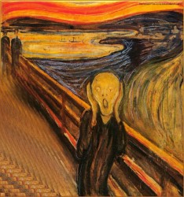
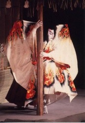
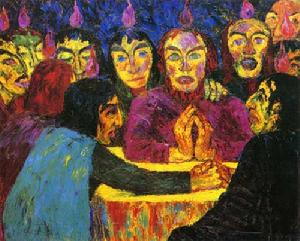
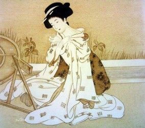
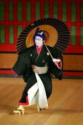
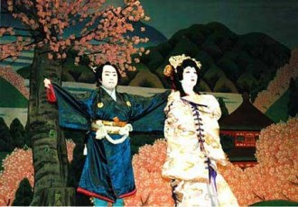

# 政治暗杀

一、 序

“你以为乾隆退位后的四年内有一夜不在思念绝对权力的滋味么？你以为乾隆退位以后的四年内有一夜不在后悔当时愚蠢的决定么？”

“唔，我对清史不是很感兴趣，看看当朝就可以了。”

“正是因为你对清史不感兴趣，我才愈加愿意同你讲。——否则你以为同那些电视剧看多的人有什么可说的么？历来唐国文艺作品多写汉国，因为气息相近，而当朝文艺作品多清宫戏……”

“对不起，你到底想说什么？”我有些不耐烦地打断他。——我待会还要去把父亲当年无罪革命时期从档案局的垃圾堆捡来的日记翻译

出来，我实在是不喜欢第二次触蛮大战时期扶桑国的文字风格，平淡，古奥，狂热，精致，汇聚了一切不和谐的因素，但是硬生生杂糅起来。 

“我是在谈政治！权力！一切发光的字眼！”

我看着他激动地站起来，张开双手向天挥舞，柔若无骨。

二、 破

2012年3月22日的夜晚如一切夜晚般无聊，晋省的高平镇沉浸在一片温和湿润的气氛中，东北方袭来的浓厚云层还在路上。我点上一支烟，放在一边，并不抽一口，而妄图翻译这本日记中的日记。

“昭和12年的最后一天，小雪。坂田少佐派我离开金陵，到芥川君廿六年前到过的广陵。这是一个古城，鉴真大僧都也是来自这里，想到那故乡的行舟，谁都会念起‘翘首望东天，神驰奈良边。’但是我无暇去看黑色的河水，陈旧的庭院，谄笑的妓女，甚至连当地士绅的宴会也无暇参加，我来的目的很简单，勘察一位叫冲田的士兵的死。

逼仄的梧桐树中间透露出一个小巷子，巷口的河流是个破败的码头，有一株樱花，枯萎着。我看着干燥的天空被樱花树枝割裂，同副官说，‘真想快点占领前朝，回到扶桑，苇之湖畔的樱花开前，静流还在等我。’副官是关西人，带着浓重的口音回答，‘是的，碇长官。我也想回到歌舞伎町，看灯火下的祭典。让我们快点结束广陵的工作，魔都每天都有船可以回家。’‘回家’，当时我想着家的念头，低头走入了污水横流的旧巷。

巷子意外地长，却不显得无聊，前朝毕竟是个有五千年历史的国家，广陵这座两千年的老城市，人们似乎已经见惯了占领和侵略。松井长官还特地命令不要在广陵大肆屠杀，以免勾起芜城多次被屠城的血气。

前朝的翻译告诉我，冲田君死在一处叫‘绿杨精舍’的慰安所里，死时面部赤紫，喉头肿胀，事实上他是吊在房梁而死，不远处还有个不知名的女人穿着和服倒在地上，胸口插着一把武士刀，现场找不到任何和凶手有关的证据。”

我揉揉眼睛和脖子，在高平镇这种地方搞考古，正如无罪革命时期在一亩地种出万斤粮食，属于纯属妄想的事情。然而我被分配至此，如同在流放地的饥饿艺术家，注定要度过这样妄想的时期，若不找些事情给自己做，简直会发疯。

忽然一只燥热的眼睛贴近玻璃，调整了一下角度隔窗瞪着我。又是那个无聊的人，我想道，但是终究还是打开了门，让他进来。

我面前的这个男人，是当朝典型的一个男人，眸子浑浊，毛孔粗大，稍微修整过却毫无品味的发型，眉毛似乎永远梳不齐，穿着凸显出毫无审美，而谈吐更令人厌恶。曾经有文化的一个国家经过了当朝的建立和无罪革命等多次浩劫，平凡人已经变得短视、庸俗、易怒、无知、躁动、浮夸。本身应该属于群体的特质全部体现在个体身上，不得不说是当朝的悲哀。

男人叫李守银，当地人，对政治非常感兴趣，因认为我是唯一一个外地人，而必然持有由外而内的冷静眼光，酷爱到附属文化局的考古办宿舍来找我聊伟大理想。

当然，他认为那是聊天，在我看来只是他的个人倾诉。差点忘记说，他是高平镇高平村委会XY染色体管委会的一名干事。

“张先生，张先生，我想到了怎么才能当上村长！”

“你所谓的办法如果是去认老村长为干爹的话，就不需要告诉我了。”

“不不，才不是，张先生，村长已经57岁了，再过两年他肯定要退休，老村长也已经76岁，没几年了，已经没有什么影响力，村子里除了我……”李守银的眼里闪着深谋远虑的光芒，对权力的渴望几乎让我这破旧的书斋都臭了几分。

“干事的伟大影响力，是么？”

“不不，才不是，张先生，村子里年纪适合接班的，只有三个人，我，李守钢，李守铎。而他们两个历来没主见，当上主任就会很开心，除了我没有什么人可以当村长了，我历来跟各处关系都好，就跟润滑剂一样。”他故作神秘地看看四周，明知方圆一公里没有任何人烟，“何况村长的老婆才23岁，看那白花花的大腿水灵灵的逼，一定会偷汉子，这可不能便宜了外人！”

“偷看女人洗澡还这么不知廉耻的，我还是第一次见。”

“不不，才不是，张先生，是隔壁的李瞎子说的，不光他一个偷看村长老婆洗澡，所有人都偷看过了。”在说到他们的俗世生活时，李守银顿时体现出庸众的本性，“除了张先生，村子里哪有男人不对村长的老婆感兴趣啊……”

这顶高帽子戴得毫无意义，因为当时我已经陷入了沉思，村长老婆其实和我这个外地人，还是有一些关系的。

村长前妻希望离开高平村出去上大学堂，来找我借过一些粗浅的书籍，并不漂亮的一个女孩子，但是对于未知的渴求不知道为何让我有些心寒。果然，不到三年，村长老婆就从大学堂回到高平县，不久传出了她对家里人说了些上大学有屁用还不是跟张干事一样蹲在村子里住十平米的宿舍连村长都不如外面大学堂的教授哪里像传说中前朝的一样有着高屋建瓴的学问人品也不过是整天色迷迷地看着女人的大腿之类。又不到一年，村长的前妻莫名死在秦城村，村长老婆就顺理成章地成为了村长老婆。

“张先生，张先生，我告辞了啊！您给了我很多启发，看来果然要往上爬就要心黑手辣，不能怜悯，不能高调，我觉得我需要煞一煞，或许煞个人……”

最后的话语我已经听不清，因为我已经困了，桌上的扶桑国日记和右侧我不断修改的翻译还翻开着，就姑且先睡了吧。

于是我右手撑着脸颊，左腿蜷曲起来，侧躺着，任三月份这莫名的小雪落在面前。

“写作，本来就是电光火石之间的事情呀。”我如此想到，“大概翻译也是吧。”

于是如夜神的恩宠，我沉沉睡去，在这个国号为“当”的朝代，当今圣上大约是不会如我这般踏实睡眠的吧。

三、 急

李守银又来找我描绘他的伟大前程，我今天有些无心翻译，于是姑且翻着高平镇的史料，前朝开始这里就是阎锡山的地盘，更久远则发生过一些惨绝人寰的事情……

“张先生，我想我面前最大的阻碍其实是李守釭，他是村拆迁办副主任，李守钢李守铎两人压根不足为虑，他们不过分别是纪委的第二副书记和综治办最资深的干事而已，他们最大的可能性，一个成为村副书记，一个成为副村长，都是没有实权的人物，而只有书记和村长一手抓，才有真正的意义。我统计了之前七任的村长和书记人选，大多都是心黑手辣之辈，基本都来自于如下几个最心黑手辣的办公室：XY染色体管委会，纪委，拆迁办。另外，历来村长书记都是奇数岁数才能上任，而到了村长退休的年龄，只有我和李守釭才符合这一规律。我必须杀了他。”

“喂喂，我说，你这个杀了他的决定是不是太过草率了。”

“不不，张先生，你不是这圈子里的人，你不懂，如果直接杀了村长，得到利益的肯定不是我，而我杀了李守釭，得到利益的就是几年后的我，而且，这样更不会让人怀疑。在我看来，大家的确是平等的，但是既然可以获得更大的特权，为什么我要自甘平庸呢？”

“特权对于你们，真的有这么大的吸引力么，你们官场还真是无……”

“不不，张先生。”李守银一反常态地打断我的对话，“只有到了刺史及以上！才能冠以这高贵的名称——官场！官场是由人精构成的群体，每个人都猜不透大家在想什么，就像在黑暗的森林中拿着枪的猎手……”

“喂喂，我说，从别的小说里借来的设定就不要以原创的心态说出来了好么？”

“不不，张先生，这是非常精妙的比喻，尤其对于官场来说。你以为乾隆退位后的四年内有一夜不在思念绝对权力的滋味么？你以为乾隆退位以后的四年内有一夜不在后悔当时愚蠢的决定么？乾隆其实无时无刻都在思念大权在握的味道！”

“事实上那四年也是乾隆掌权不是么？难道嘉庆有一天不是傀儡么？”

“不不，张先生，握有权力的力量和同时拥有权力的名声和力量是完全不同的两个概念。我也可以自称灵修大师给村长和村长老婆洗脑，顺便还可以把村长老婆上了，嘻嘻嘻嘻，啊哈哈啊哈哈哈。”

不知为何，提到村长老婆，李守银就变得表情怪异，充满淫秽的意味，我下意识地后退了半米：“你是不是每天晚上都伴着村长老婆胴体的幻想手淫？”

“嗯，当然啊，不光我一个，全村男人一定也都是这样的，难道张先生你不吗？”

“……果然你们的惯性是把所有人都想象得<del></del>和你们一样卑劣，才不敢给人民任何自由。”

“张先生，自由是什么？”

“……什么也不是。”

虽我活得挺好，此时也不禁吟起“旅に病で、夢は枯野をかけ廻る”来，奇怪了，一向对扶桑式的极致、残缺、狭隘、穷困、小气的审美表示同情的我，怎么会忽然想起这句呢？

我顿时想起，那本七十五年前的日记中的日记还在等待我的审阅，难怪……

我挥挥手，赶走了那个恶俗的人，翻开下一页日记。

“虽然现场没有任何证据，但是却留下了一本日记，其中充斥着下等人的语言，这本日记也毫无生趣，姑且摘抄几段吧。

‘来到前朝，魔都的军队抵抗很顽劣，我跟着他们的残兵一路经过吴郡，京口，到了金陵，又被派到广陵。岩手县的毛利说前朝都喜欢用陵啊陵的名字，一定是因为他们死人多。

广陵也没什么意思，有一个小队跑到郊外的万福桥去杀了一堆前朝人，好像有三五百？不知道，厌恶每天都杀人的日子，没有意思。

竹内少佐惩罚了杀人的那个小队，其实也就是关了禁闭几天，他们很得意。

竹内少佐和我是老乡，都是广岛人，但是并非一个町，所以从未来往过，但是他喜欢找我喝酒。每次喝酒，他都很兴奋，他一直说前朝人随便杀多少，要不是松井司令不让多杀，他肯定要多杀杀的。他还很不屑，说松井自己都杀了不少，不管金陵的，反而管广陵的，简直是无聊。首都的屠杀只能激起前朝人的怒火，而其他的小城杀杀很快就会被前朝人忘掉的。竹内少佐喝不到清酒就会改喝黄酒，但是喝黄酒喝多了他会发火，十二月的第一天，他因为老板的黄酒没有温好，怒火之下把老板女儿揪纠到了慰安所，还说一定要让诸君开心下。虽然我的妻子还在广岛老家等着我，但是我也很心动，大家都已经四个月没有动女人了，一直在打仗打仗，虽然战斗的兴奋能激发出大家的武士之学，但是侍道不能没有女子的温柔肉体。

绿杨精舍，这是这座城市最大的旅舍，曾有有力人士住过，现在是皇军的慰安所。 

这是一栋三层高的西洋式建筑，让我看到曾经憧憬过的帝国大学的影子，一楼可以开舞会，顶棚有一个漂亮的水晶灯。楼上则是女人，有前朝的，高丽的。

我不喜欢高丽的女人，她们只有破麻袋一般的乳房，乱蓬蓬的下体，油污的头发，粗劣干燥的皮肤，扁平的脸，麻木的眼睛。前朝的女人有的好有的坏，到了江南一带，女人大抵还不错，关东军的消息说那里的女人也很好。

我多么怀念大和抚子的精神，这才能慰藉。

今天竹内少佐告诉我们一个神秘的消息，说天皇为了犒劳大家为帝国做出的功绩，从扶桑本土送来了七位自愿而且美丽的女人。这个消息让所有人兴奋不已，毛利还偷偷摸摸说他偷看了，里面有个女人一定是岩手县的，说是只有他们岩手县才有这么漂亮的女人。那些只知道吃牡蛎的地方能有什么好女人？但是竹内少佐说，有来自广岛的女人，让我颇为迟疑。我想，万一女人认识我的妻子，那多么不好。

但是后来毛利和竹内都说，广岛来的那个女人，简直是天生的肉便器，让所有兄弟们都爽了，我也有些蠢蠢欲动，看着前朝的黑色的水，每个人的欲望都被压抑着。我更被压抑，因为我又被排到便益门看守。’

以上的日记大概是一个月以内的，接下来中断了好多天，加以一些风景的涂鸦，但是既没有松树的苍劲，也没有樱花的凄美，副官说我对这样的低级士兵要求太高，大可不必在意。虽然如此，但是我却不愿意承认这样的事情的存在。扶桑的美，是地层都无法掩盖的。”

翻译到这里，看到地层两个字，我才猛然反应过来，我有太多天没有忙工作的事情了。

第二天一早，我便带着洛阳铲跑到了村外的一片洼地。工作了一天，毫无所得。

第三天一早，我便带着洛阳铲跑到了村外另一片洼地。工作了一天，毫无所得。

第四天一早，我便带着洛阳铲跑到了村外另一片洼地。工作了一天，毫无所得。

第五天一早，我便带着洛阳铲跑到了村外另一片洼地。工作了一天，毫无所得。

第六天一早，我便带着洛阳铲跑到了村外另一片洼地。工作了一天，毫无所得。

第七天一早，我便带着洛阳铲跑到了村外另一片洼地。工作了一天，毫无所得。

第八天一早，我便带着洛阳铲跑到了村外另一片洼地。工作了一天，毫无所得。

第九天一早，我便带着洛阳铲跑到了村外另一片洼地。工作了一天，毫无所得。

所以我才说在这里如果不找点事情干，简直要发疯。第十天，阳光浓烈，帝释天一般的光芒洒在土地上，而我挖出了一些尸骨。

这些尸骨都已经石灰化了，简直想象不到是什么年代留下来的，所以我也没有报警，找了一块页岩垫屁股，坐在一颗巨大的花椒树下伴着浓烈的地味道思考着。

尸骨是什么时候的呢？这是个谜，带来的简要仪器说是1500年到3000年不等，这样的精确度，对于人类来说，还是太漫长了吧。几百万年的人类历史，到最后不过是岩层的几米厚，真的应该曳尾于涂中呀，秋风一起，又思蒓鲈。花椒的味道让人警醒，正如第一次做爱之后空虚的瞬间，结束很快，意味深长，很久以后才知道那哭泣的女孩子的真实想法，但是世界已经变了。

当朝的皇帝曾经写过一首诗，臭得像三月天不小心遗留到第二年的咸鱼，每一本教材的封面都印着这首得意之作，大家纷纷把皇帝比作乾隆大帝。我想，可不是，一样的没有品位，一样的喜欢附庸风雅，一样的喜欢毁灭真正美的事物。

几千年来，想当皇帝的人和所有的皇帝后来都没了，如花椒到了冬天干燥冷静的味道一样，潜藏着欲望的火，改变着世界的面貌。皇帝们总是百无聊赖，争来争去的权利也不过是毫毛一点，第一次触蛮大战之前，国书上曾经向全世界宣战。而无罪革命之后，国书上又向全世界开放。真正伟大的皇帝目光是长远的，而大多数伟大的皇帝只不过阻止了想毁灭世界的皇帝而已。哪有什么伟大光荣正确可言呢？

我低下头，看着不知从何处浮现的这些想法，不小心踢到了一块硬物。我连忙趴下来，用刷子轻轻刷这块硬物，这是一块久远的青铜。

经过一系列专业操作后，这块只剩下一半的虎符浮现在我面前。

虎符上有十九个阴刻篆文，可以看出曾经错银，但是太久远的时光，让银都变成了漆黑一片。

回到寝室，弄干净了虎符，给上级打了个电话，我坐下来，推开旁边的扶桑国士兵日记中的日记，戴上放大镜仔细看着它。

虎符非常简陋，见不到任何常见的饕餮、蟠螭、云雷之类的纹路，光洁干净，透着阵阵煞气，述说着如同小学后巷儿童斗殴一般的残酷战争。 

“甲兵之符，右才王，左才武安。燔燧事，虽毋会符，行。”

原来是长平之战留下的东西吗？

血流淙淙有声。

四、 终

领导终于在我发现虎符的第十二天才走完了流程派人下来，一个月后，发掘出了一个巨大的人殉坑。尸骨交叠无数，杂以三尖箭簇和扁平箭簇。虎符自然也上交了。

我则继续回到寝室，翻译日记中的日记。

“今天在周围探访了一天，却没有发现任何消息，闲极，继续回到居所，阅读日记……”

刚刚看到这里，李守银又来了。

这个人来的时间总让我联想到睡眠相位后移综合症，也让我怀疑他是不是从来不上班，我实在很少见到人每天12点起床，和丑陋的老婆做爱，吃晚午饭或早晚饭，晚上则经常来到我这里，哪怕自己絮絮叨叨也到待到1点，直到我的工作完成。

怀疑只是一瞬间的事情，我拿起集王字的《圣教序》，翻到心经那一页，念诵了起来。

“觀自在菩薩行深般若波羅密多時照見五蘊皆空度一切苦厄”

“张先生，我终于想到到底怎么样才能杀掉李守釭了！您前两天不是发现了古代的万人坑嘛？那边尸骨遍地，而且没怎么保护好，我找个晚上，偷空砍死李守釭！只要把他剔干净了，洗干净了，再用硝酸泡旧点，就跟做假古董一样，然后找个晚上，偷偷按样子埋到那边的土里，弄得跟扰乱过一样！不可能每一块尸骨都有人查的滴恩啊，所以这样就没人知道了，过几年，村长的位置肯定是我的了！”

“舍利子”

“张先生，我已经想好了杀他的方法，很简单的！去村上中学的实验室就可以弄出来！”

“色不異空空不異色色即是空空即是色受想行識亦複如是舍利子”

“张先生，我可以称二两茶叶，放入提纯器中，加酒精，水浴加热，回流提取。然后把液体里加石灰粉，蒸干，变成粉！然后再用漏斗弄掉，继续加热，有什么褐色烟雾的时候就可以了，然后多弄几次，能得到两克左右的咖啡因！具体我也不记得了，村长老婆出去上大学带回来的书里面有。”

“是諸法空相不生不滅不垢不浄不增不減是故空中無色無受想行識無眼耳鼻舌身意無色聲香味觸法無眼界乃至無意識界無無明亦無無明盡乃至無老死亦無老死盡”

“张先生，这样得到咖啡因之后，就好简单了，我把这个东西加到他平时喝的咖啡里面，他虽然自称很厉害，但是其实压根没有品位的，一定喝不出区别，然后他会逐渐高度兴奋，晚上睡不着，跟老婆多搞几次，流好多汗，心跳特别快，还出现幻觉，最后就会死了！我在里面加点春药，这样更好，淫羊藿好像就可以，要不再加点蛤蚧粉，反正让他死在他女人的肚皮上，人家只会觉得他咖啡喝多了还要搞，哈哈哈，这样他就死得的无声无息了！”

“無苦集滅道無智亦無得以無所得故菩提薩埵依般若波羅密多故心無罣礙無罣礙故無有恐怖遠離顛倒夢想究竟涅槃三世諸佛依般若波羅密多故得阿耨多羅三藐三菩提”

“张先生，这个方法不错吧！我是听了您以前和我说的话，说一定要学习科学知识，您看我学得的很好吧，我还特地假装关心教育，去听了好几节实验课，那天自己还偷偷做出来了一小撮，自己试了一口，的确会心跳好厉害，操女人的时候也特别兴奋……”

“故知”

“张先生，我已经攒到了估计有两三克，肯定能成，您放心，您这次发掘出来的万人坑。咦？我之前好像还想要砍死他，看来完全不必要，嗯，我一定是太恨李守釭了，才已经想好万全之策还要砍死他，可惜这样子没办法亲眼见到他死了，唉……”

“般若波羅密多是大神呪是大眀呪是無上呪是無等等呪能除一切苦真實不虛故說般若波羅密多呪即說呪曰揭諦揭諦般羅揭諦般羅僧揭諦”

“张先生，您在练书法呀？您这字帖虽然看不懂，但是感觉很漂亮的样子。那我先告辞了，我明天得找准李守釭喝咖啡的时间，去下药。村长老婆的奶子很快就能摸到了，哈哈哈哈。”

“菩提莎婆訶”

默诵完经书，我才发现李守银已经走了，那就这样吧。忽然远远的车灯猛地的照过来，晃得我眼睛痛。

等眼睛适应了光线，马达声刹车声车门声脚步声惊叫声倒地声猛然进入我的眼帘，一辆车几乎碰到我的寝室外墙，而李守银倒在地上，车上的人透过车窗看了下他，把车倒回去分外更狠狠地朝着他的大腿碾了一次。

我站在门口的柱子旁，无言地看着这一切。

车上的人毫无羞涩地下车看了一眼倒在地上晕过去怀中还揣着2.7853g不纯咖啡因的李守银。“原来是李干事啊，我们以为是张先生家遭贼了呢！全村的人都知道从来没有人会偷偷摸摸来拜访张先生的，我以为一定是想来偷文物的。真是没想到啊，不小心碰到李干事。”油滑而拖曳地声音，是李守铎。

李守铎摇下车窗，把一个报纸包扔在我面前，说：“这里面是十万块，张先生肯定不在乎这点钱。您放心吧，我们会把李干事送到医院，好好救助的。”他咬“救助”这两个字分外清晰，在夜空中嘶嘶作响，仿佛下一次救助的对方就会是我一般。

我无所谓地捡起那个报纸包，回到了房间内——日记中的日记还等着我来翻译。

“哈哈哈哈哈哈哈哈哈……”这是开车走的人自然而然从内心发出的大笑。

五、 元

“今天副官提醒我，他说：‘碇长官，目前除了日记之外，什么都没发现，我们是不是该报猝死，就回去了？’我回答：‘笨蛋，上面知道是上吊，怎么会是猝死。猝死的人会上吊吗！那个倒在地上的女人又是怎么回事！你怎么跟司令解释！’副官笑了，说：‘碇长官，前朝的人都是这么办事的，就算是浑身伤痕缺了一只手，我们也可以说是猝死啊，和外人没有关系。’我深深地看了他一眼，他的眼中毫无惧意，我想大概是我错了，受收到了冬季前朝广陵城的冷寂和漠然影响，我的心思也像日光骨瓷一样细腻起来。

v这不好，天皇的子民应该终身为了扶桑奋斗。 

但是鬼使神差地，我又翻开了那本日记，看了那些无聊的风景涂鸦，让我越来越困，手一滑，日记掉在了地上，我捡起时，却发现最后一页有着字迹，分了两段，是两种字迹，第二段的结尾还带着血迹。

‘昭和2年让我们相遇，昭和12年让我们伤心，谁能想到妻子竟然到前朝来做慰安，还被队里所有的兄弟都玩了，大和抚子的精神就是这样吗，这场战争就是为了把女人变成这样吗。战争对于天皇和皇帝们或许是重要的，可是和我们老百姓有什么关系，我只想回去扶桑见到老婆，我不想在前朝看到变成慰安妇的老婆。战争对于普通百姓就是蝗虫一般的天灾！

冲田君，我以为这样能够支持扶桑，也就是支持你……’

我瞪大眼睛，惊讶于我看到的事实，看来一定是冲田杀了妻子，然后自杀了。

算了，我还是上报猝死吧。”

我掩上日记中的日记，安静地睡去。

又过了一年，李守银又来找我，这个人如今瘸了，离三十米就可以听到木头假肢的声音。

“张先生，张先生，好久不见了，我知道您不关心村里的事儿，我来跟您汇报下，现在我是副村长啦！您看，村长去年忽然在跟他那个骚货老婆干的时候死掉了，死的时候流了好多汗，说是心肌梗死，哎，所以老村长就继续当了村长啦，不过他不管事，事情都是李支书在管。”

“李守釭么？”

“张先生，您知道啊？”

“不，我不知道。”

“张先生，您真是太聪明了，我才说了一句，您就知道了！”

“我不觉得你可以夸奖我。”

“不，不，张先生，您的确聪明，您看，现在李支书管村子里，不仅仅不歧视我这个残疾人，还说我之前在XY染色体管委会干得好，半年就提了我当主任，昨天又提了我当副村长！您看，李支书是个大好人啊，我被邻居村醉酒的人撞坏腿后，还特地送了十万块给我，还死也不肯承认，绝对是个大好人，我现在……”

“李守釭不承认那十万块？”我开始收拾行装。

“对啊张先生，他可不承认，还笑着说这肯定是别的好人送的，可是村子里哪有人有这么多钱啊！”

我继续收拾行装。

“张先生您打包东西干什么呀？这么多书，还有好多第二次触蛮大战、无罪革命的书，很重的，我去找人来帮您送……”

我收拾好了行装。

“当朝是一个巨大的蛊盆，所有人都被养在里面，并且泡在各种毒物里，最后看谁最毒能够活着出来。万事都归一梦了。就当这是我对你说的最后的话吧。” 

李守银站在我的前寝室门口，看着我的背影，咕哝着：“张先生不是疯了吧，当朝这么祥和谐美……”

寝室里，日记中的日记正在燃烧。

（采稿：刘铮 编辑：陈静 责编：刘铮）

作者博客:http://zhangyizhe.com/

[【小人国】狱霸田洪——](/archives/36651)那天早上，好伯伯（收审所的编外管理人员，一般都上了年纪，故被人犯们呼作“好伯伯”──老威注）开了锁，吆喝：“七班涨水！”我就应声推开铁栅门，拎贼进来。这是头肥猪，起码180斤，他一只手提一只鞋，弓着腰冲大家傻笑。这时满舍房二十多个光头贼，像少林寺的棍僧，分两排撑腰杆，打盘腿，绿眉绿眼地恨他。

[【小人国】幼儿园毕业后拉开差距的原因——](/archives/18018)一个人在年轻时经历磨难，如能正确视之，冲出黑暗，那就是一个值得敬慕的人。最要紧的是先练好内功，幼儿园毕业后这2年就是练内功的最佳时期，练好内功，才有可能在未来攀得更高。

[【小人国专题】叛徒、内奸、教贼张无忌罪恶的一生](/archives/36940)—此为新垣平博士《剑桥倚天屠龙记》出版时被删去的最后一个附录，堪称妙文，与君共赏。

[【小人国专题】江山如画](/archives/37148)—看似简单的一则故事，实则蕴含深意。如今的世道有多少人浑噩于世而不知，却又笑他人不知世故。是是非非，真真假假，惘惘不知，未免太可悲可叹。
