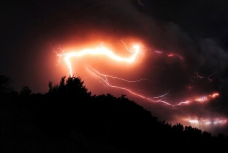
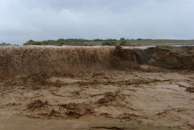

# 江山如画

＂皇儿！＂老皇帝向门外呼唤着。大雨下个不停，转眼水就漫过了石阶，在回廊外浸湿一片。

＂儿臣在。＂一青年男子淌过满地积水，跨过门槛。一道闪电斜砍过天边，冷风阵阵，纵使尚处伏天。

殿中二人，一烛，一屏。老皇帝衰弱的腰身像是庭前的火苗，忽明忽灭。＂皇儿，可知我等因何立朝？＂

＂奸佞当道，腐朽舞弊，加之苛捐杂税丛生，至使饥民彻野，饿殍相望。＂那青年抬起头，加重了一下语气。＂伪朝不堪，犹兴土木，奏九韶。我等当以普渡苍生为己任，内勤于政，外加于民……＂他顿了一下，想了想，又说：＂夏桀之谤，千古之积毁也。若……＂

＂很好，不必说了。＂老皇帝咳嗽一声。＂逢此大涝，加之苛政，灾乱兼备，北斗移位。＂老皇帝颤抖着双腿，站了起来。＂我儿可曾读史乎？天命玄鸟，降而生商……＂

＂儿臣略知一二：天命玄鸟，降而生商，宅殷土芒芒。古帝命武汤，正域彼四方。＂青年大声背诵着不知作于何年何岁的篇章，摇头晃脑。＂方命厥后，奄有九有……＂

＂皇儿明慧。＂老皇帝捋捋胡须，猛然一指被雷鸣覆盖的南空：＂揭竿之时，大雨似于今日。朕捞一龟于死潭，遍是十里穷泽，木摧而土崩，鱼鳖之辈尚凫于水，更何况人呀。＂老皇搓着手，眼睛眯成一条缝。＂祥瑞之兆，堪比玄鸟！＂

又一声雷响，梁木为之一震。＂父皇，常听太师提及所谓大道，何不授些兴国安邦之礼？＂青年眼中闪过一缕烛火的亮。＂古之先贤，尊儒尚礼，以德服众，我辈理当效仿，不是吗？＂

老皇摆摆手，一把推开身后的屏风，一张被乌墨朱批印染得斑驳地图赫然呈现在墙上，昏暗的微光中，土灰的墙坯上，如同一张画，山水挤出的脸。

＂普天之下，莫非王土。我儿切记，仁理二字，存于胸；萧墙之事，在于智勇。殷纣不顾箕子比干之言，行炮烙剜心，无仁；幽王烽火买笑，不理。可莫要忘了，太宗玄武门诛兄，在于智，开大唐盛世；明靖难之役，竖子少勇不敌叔，乱国体。＂说罢，老皇举起烛台，立于图前。＂民在市井，市井有疾尚可医治，若心腹有患，怎容你庙堂得保？＂

＂依父皇之见，是……＂

老皇抬笔在地图一隅圈了个圆。＂太师与朕自起兵时便不和，又常对你提些诸子鬼话，孰轻孰重，你未曾掂量吗？＂浓黑的墨汁沿着纸的边轴滑下，直滚到青年脚底。

＂今日召你，便只此一事。＂老皇一掌拍在桌上，蜡油溅了满身。＂朕身体欠安，自知大去之限不远，欲睹我儿临朝。

只是那太师口中有礼，恐他日不义。上月见他囤粮于河东，必期在兴兵伐于岭北，损我家国社稷。不如……＂老皇起笔，图上又是一抹。

青年老远瞅见一伙人奔河东而去，料想定是太师作乱的队伍，便亲领一班精锐，抄小路，直插中军，一刀劈了太师脑袋。果不其然，虚掩的柴木里，沉甸甸的净米白面堆了个满仓。

＂自古生有功德，没则为神，王道治明，神道治幽，虽乱臣贼子穷凶极丑亦往往敬畏神祗……＂青年嘴里又不知嘟哝些什么，只把那太师无头尸捆了，也倒没拿众喽罗怎样。一干小民哪里见过这阵势，纷纷作鸟兽散，顷刻，除了渐浓的雨声与淙淙流水，一切又恢复了干净。

＂瞧这伙疯子。＂嘈杂的警笛中，乡警老黄拉了拉雨衣的一角，掏出根烟来。

＂这地方也真够偏的，一村人竟拥个戏子在这里当起了土皇帝，也真够奇的，居然当了这么多年，要不是那个刚来的外乡人跑出来报案，怕是儿皇帝都立出来了哩！＂同事小钱笑了笑，若无其事地摸索着打火机。

雨越下越大，水从黄泥的墙体裂缝中一股股猛灌，洗掉了柴刀上的血，汩汩冲下北边的土丘，汇进东边的河沟去了，顺便浇了半坡歪脖子枣树。

被风吹开门的戏台后备间里，越过地砖上黑红油墨的污渍，那版过期的交通地图带着破胶带沾下的墙皮，哗哗地飘扬。

（采编：刘铮；编辑：季节扬；配图：季节扬；责编：刘铮）

[【小人国】狱霸田洪——](/archives/36651)那天早上，好伯伯（收审所的编外管理人员，一般都上了年纪，故被人犯们呼作“好伯伯”──老威注）开了锁，吆喝：“七班涨水！”我就应声推开铁栅门，拎贼进来。这是头肥猪，起码180斤，他一只手提一只鞋，弓着腰冲大家傻笑。这时满舍房二十多个光头贼，像少林寺的棍僧，分两排撑腰杆，打盘腿，绿眉绿眼地恨他。

[【小人国】幼儿园毕业后拉开差距的原因——](/archives/18018)一个人在年轻时经历磨难，如能正确视之，冲出黑暗，那就是一个值得敬慕的人。最要紧的是先练好内功，幼儿园毕业后这2年就是练内功的最佳时期，练好内功，才有可能在未来攀得更高。

[【小人国专题】政治暗杀](/archives/36807)—当朝是一个巨大的蛊盆，所有人都被养在里面，并且泡在各种毒物里，最后看谁最毒能够活着出来。万事都归一梦了。就当这是我对你说的最后的话吧。

[【小人国专题】叛徒、内奸、教贼张无忌罪恶的一生](/archives/36940)—此为新垣平博士《剑桥倚天屠龙记》出版时被删去的最后一个附录，堪称妙文，与君共赏。
