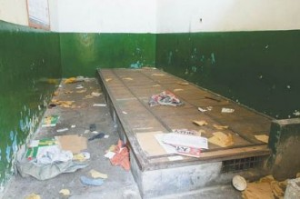
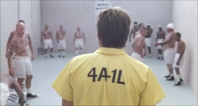
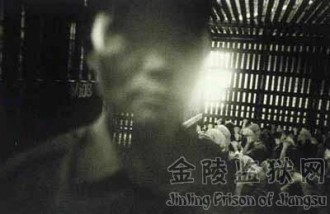

# 狱霸田洪

采访缘起：这是十年前的访谈资料，其间整理了好几次，或因为残忍，或因为恶心，或因为杂乱无绪而中断。2000年8月11日，我想结束持续了太久的底层工作，所以鼓足勇气完稿。

1990年7月17日下午3时，我在川东某市歌乐山中的一座收审所采访了28岁的田洪；大约一个月后，我又在市中区的某看守所再次采访了他，为了保持阅读上的连续性，我在整理时，做了一定的衔接与修补，这也是我在做其它谈话时的一贯方法。

某种档案是应该通过公布而永远保存，为了历史与社会的健康。再次声明，我做的不是新闻记者的工作。

老威：我觉得你不划算，本来按你的原罪判，扒窃三千块钱，最多三年，说不定还弄个劳教。可你在狱中行凶，打死了人，怪得了谁呢？

田洪：你觉得我还有救么？

老威：很难说。

田洪：我不是故意的，死者与我无怨无仇，哪个料得到他那么不经整？

那天早上，好伯伯（收审所的编外管理人员，一般都上了年纪，故被人犯们呼作“好伯伯”──老威注）开了锁，吆喝：“七班涨水！”我就应声推开铁栅门，拎贼进来。这是头肥猪，起码180斤，他一只手提一只鞋，弓着腰冲大家傻笑。这时满舍房二十多个光头贼，像少林寺的棍僧，分两排撑腰杆，打盘腿，绿眉绿眼地恨他。肥猪心虚了，双下巴抖得咣咣响。这叫“注目礼”，然后才是“下马威”，全房一齐吼：“贼！打死打死打死！！！”这种人造惊雷，肥猪哪听过？顿时懵了，膝盖一软，就卜地下跪磕头。我兜屁股一脚，他就顺着舍房中间的小路，一溜狗爬。四个蹄子翻得快惨了，脸眼就冲到最里头的墙角角，头抵着马桶，连叫“饶命”。

老威：监房里还留“小路”？

田洪：这是尺把宽的“界河”，把上面和下头隔开。上面是“领导层”，以老召为首，梁山好汉一般排定七个人，坐牢照样吃香喝辣，并且有人服侍。下头是毛贼，近二十条一堆，晚上打铺，上面七人的铺位宽度与下头二十条的一样。挤不下？就一头一尾地码人，各朝一个方面，腿微弯，屁股就刚好嵌合成不漏一丝缝的整体。如果哪个的狗脑壳伸出了界河，就要遭脚踢，这是“打楔子”。人肉的伸缩性大，所以每晚铺打完了，上面都要站在“界河”上弹墨线，直惨了，如果木匠锯子一路拉下去，绝不会伤着任何一顶头皮。

****

老威：你们这是在装沙丁鱼罐筒吧？

田洪：你说对了，人肉的味道蒸发上来，的确像臭鱼。所以，稍微会动脑筋的人，都要从毛贼堆里朝上奋斗。我奋斗了一个月，才从开水贼升为打手，专门管过手续和维持秩序。这手续人人必过，除非管理亲自出面打招呼。你想想，这传统的规矩我咋能破……

老威：谁定下的规矩？

田洪：我也不晓得。据老犯人说，自从盘古王开天地，神农尝五谷，牢里的规矩就有了。变了泥鳅你就只有在泥巴里翻，不朝上就朝下，不朝左就朝右，总之你要尽量做最大最粗的那根泥鳅，搅得其它泥鳅瞎撵着你转。在外人上人，在内鳅上鳅，社会层面不同嘛。

老威：这绕口令是什么意思？

田洪：简单地说，即使我发善心想饶肥猪，也不行，规矩是铁打的，贼的眼睛是雪亮的。所以我二话不说，先纵起给他上五份“贝母肘子”，然后打出“菜单”，叫他点菜。

老威：啥叫贝母肘子？啥叫菜单？

田洪：贝母肘子就是用手拐纵起砸贼的背壳。一般先要问：“贼，一二三四五六七八九，懂几？”如果回答：“懂四（事）”，贝母肘子就要上得粑些，下面的菜也要来得温柔些。我一见肥猪吓破了胆，就晓得不是道上的，也就懒得问。菜单以川菜为主，将近100种，明写着是美味佳肴，其实全部为整人的手段。四川人客气，朋友见面，老是请吃请喝，这种风俗引入牢里，就有了“点菜”一说。不知哪个烂秀才，还给菜单糊了个封皮，写上“民以食为天”几个大字，一翻面，才是正谱。分“家常菜类”和“工艺菜类”，计有贝母肘子、熊掌豆腐、油煎二面黄、猪拱嘴、猪下巴、润喉片、红烧牛鼻、磨豆腐、红烧里脊、锯子肉片、麻辣羊肉串、蹄花汤、炖团鱼、川味烟熏鸭、滚刀肉、大众排骨汤、宫爆肉丁、铁板回锅肉、麻婆豆腐、龟壳响皮汤、乌龟含情、松山缠丝兔……哎哟，我一口气背不下来。

老威：四川人也太幽默了，画饼充饥到这个地步。

田洪：啥子“画饼充饥”？全上真的。

老威：我不信。

田洪：你这种书呆子，我们房曾经进了一个，他自我介绍说是诗人。这太稀奇了，连老召都惊得从铺盖叠的虎皮交椅上站起来，提着裤子，围着他看了三圈。老召说：“诗人？写四言八句还是打油诗？虽说四川特产中有一样就是诗人，但是老子几十年都没亲眼见过。”诗人说：“我就是正儿八经的现代派诗人。”老召说：“你背几句来听听，把老子的心肝按摩舒服了，手续就过得温柔些。”诗人说：“你听不懂现代诗。” 老召说： “那就古代诗。”诗人说：“古典诗太简单。”老召说：“你酸个鸡巴，老子就图个简单快活。”于是诗人运气提肛，挥起一只手用焦盐普通话朗诵：“床前明月光，疑是地上霜……”不料才酸完这两句，全房20多条烂贼打雷一般接上了火：“举头望明月，低头思故乡！”反而把假诗人震懵了。

老召气得飞起一脚：“你妈卖逼！啥子破诗，三岁娃儿都会背，你拿这个来蒙老子！”诗人吓得惊抓抓地喊：“我还会背其它的！古典的现代的，随你挑！我能背100首以上……”但是已经没有机会了，老召说：“诗人辛苦，背诗背饿了，先给他上份猪拱嘴下酒。”我已守候多时，马上拿一双竹筷子夹他的上嘴唇，然后再夹下嘴唇。几个人把他按死在角角，由我和另外一个打手轮换夹了半个钟头，一份又青又肿的人造猪拱嘴就弄好了。诗人满身的口水、鼻涕、眼泪，嘴有半边砖头厚，除了哼哼，再也念不了诗。老召又说：“一份猪拱嘴咋个够呢？下酒菜嘛，再上份川味烟熏鸭。”这时诗人已吃了润喉片，喉管被铁砂掌砍了个包，想叫声音出不来，只有让我们剐了裤子，划火柴烧阴毛。一燃一大卷，看看要伤着肉了，急忙抓熄，淋点水，又烧。还剥开包皮，将龟头熏了，让这份烟熏鸭从外到里都焦而黑，并且透出熟鸭皮一般的油亮。老召说：“诗人生活讲究，所以菜也上得艺术点，不伤筋动骨。”

** **

老威：怎样才叫伤筋动骨？

田洪：这次我判死，就伤筋动骨了。那肥猪180多斤，看上去像一座水塔，把上衣一扒，肥肉就直往下淌，他的胸毛还分叉。若在外面撞上，我都得闪远点，怕碰着黑道保镖了。在全舍房，就数打手容易出事，稍不留神，就整爆了。七班离值班室远，动静大点没关系，但要懂得啥子人上啥子菜。老召经常不直接发话，全由我拿捏火候，这样万一出事，他也好推。这次冤就冤在我错误地估计了肥猪，按堆头，他受几个“地震”都没问题，可他才吃了三份熊掌豆腐，脸就青了，身体顺墙朝下塌。我以为他装死狗，叫两毛贼架住，又上一份。他的眼皮一下子就上翻了。口里的白沫喷了出来，接着是鼻孔和耳门的血，止不住了。他爬在地板上乱抓，我们把他翻过来仰起，掐人中，喊报告。听说医院还没拢，就死在车上了。

老威：啥子熊掌豆腐，这么厉害？

田洪：其实就是武打里的“黑虎掏心”，让人贴着墙，一掌接一掌打他的胸口。我还捉摸这么大堆肉，非要地震几下才过瘾……

老威：啥叫“地震”？

田洪：让他变狗爬，再跃起抓住两人高的天窗铁条，收腹提腿朝下坐，踩塌那狗脊梁。我没想到肥猪有心脏病，乱整不得。

老威：你把牢房变成屠宰场了，这些警察知道么？

田洪：以前不知道，现在知道了。七班是打击牢头狱霸的重点房。这次坐上面的判了三个，老召没发话，只判了五年，我不服！他整了那么多人，以前的旧账就不算啦？连我都被整惨了。你看，我脑壳上这大圈血珍珠，像孙悟空的紧箍咒。我刚过手续没几天，劲还没缓过来，老召就说我乱用手纸，给我上磨子豆腐。幸好不是小份，否则现在我就满口无牙，说话连风也关不住。

老威：你头上这圈肉疙瘩就是“磨子豆腐”？

田洪：对，这是大份。筷子头不断跺、跺，直到起一圈浸血的珍珠包，即用牙签一个个挑破，抹肥皂、盐巴止血。痛几天后，头箍烂成了溃疡，再挨个挤化脓的包。结疤了，就是永远的紧箍咒。小份磨子豆腐比这做工精细多了，也是用筷子头跺，门牙、尖牙和大牙，一颗颗地跺，哒哒哒好几个小时，牙血和口水牵着线直朝下坠，有时坠了一尺多长。这种整法开始不咋个疼，渐渐就加剧了，几天后，你会疼得受不了。一般牙疼吃点药，熬一熬就过去了；这种牙疼要持续到牙齿松动，摇摇欲坠。这脱牙的过程极其漫长，把人熬得啥都不想干了。恨不得一头撞死算了。

老威：亏你想得出来！

田洪：这不是我发明的，菜单上的东西，还不是烂贼东一份西一份凑出来的，咋能算在我一个身上？我也是受害者……

** **

老威：你当受害者时，应该及时向政府反映情况。

田洪：监有监规，贼有贼道，政府听汇报，还不是先叫老召出去，况且房中的毛贼已经被驯乖了，当一次叛徒甫志高，以后的日子就难过了。

老威：反抗是人的天性，咋会这样？

田洪：反抗是野兽的天性，人的天性是忍耐。收审所是中转站，人人都晓得呆不久，何必惹事生非呢？封建社会，地主剥削农民几千年，抽筋剥皮、强占民女都玩过，还不是忍了过来？清朝逼着男人留女人的大辫子，大家也一忍几百年，难道几个月就忍不下去？其实菜点过了，你就昏天黑地做根懂事的泥鳅吧，灵醒一点，瞅准上头的心思……

老威：你就是灵醒过头了，才走到这一步。

田洪：打手是一个坎，可上可下，我栽了，我认，但我要一直上诉。就是死，也要把申诉信留几份给家里，黄泉路上太冷清，我非要把老召拉来做个伴，他的屁眼儿比我黑，关五年出来，还会祸害人。

老威：法律讲证据，你是直接凶手。

田洪：他的证据已转监了。某某厂有个姓任的工会主席，犯盗窃罪，进来没几天，肋骨就被他弄断了两根。他模仿法官审案，高高在上地吆喝一声，任贼就被一顿“大众排骨汤”整了上来。由于任贼拒不交待问题，他就亲自把他的脑壳塞进大马桶“看金鱼”。那么臭，任贼居然吊起脑壳打瞌睡，把老召气个闭门，就把他的裤子扒开，一颗又一颗朝屁眼里塞花生米，塞一颗，还用筷子捅两下，把任贼舒服得满头大汗，脖子一回比一回伸得长，眼珠子都要爆出来了。这种整法，地下党都受不了。还有某某，吃过老召的“炖团鱼”，一盅接一盅开水，浇屁股，把两块大肉都烫蜕皮了。坐不得，偏要你坐，还要你端端正正。如果哼了动了，又另外“点菜”。我也是证据，我的样子长得像农民，所以手续过得狠，上了四菜一汤。一份松山缠丝兔，差点把人弄废了。你想，麻线从每根手指头密密匝匝地缠上来，一直绕到膀子，十来分钟，线就完全陷进肉里。我两条胳膊都失血得冰凉、麻痹，好久都没完全恢复。这是大份，小份是缠鸡巴，软时开始缠，然后搓硬，把人痛死。我敢说，随便把哪个毛贼脱光，都能看出点没点菜，但是，毛贼们都不敢出面。

老威：老召这么厉害？翻了天！

田洪：政府已经把老召转了房，号召大家揭发牢头狱霸，大会也开了，领导还讲了话。我们都被上了七十多斤的重镣。但这是中转站，人心散，即使检举，也是鸡毛蒜皮。哪个贼不清楚？这是下鬼门关，不死扒层皮，平平安安地出去了，还得烧柱高香。

****

老威：你不判死，也不会检举吧？

田洪：会，这是态度。骂人啦，政府已经处罚过的打架啦，等等。但菜单是传家宝，不会交。即使被查出来了，交了，也要多留几份底子。

老威：讲讲你在监房是怎样“奋斗”的？

田洪：我进房两个多月，从最底层的马桶贼开始，经过地板贼、洗衣贼、毛贼长到开水贼。又努力干了个把月，才正式跃龙门，跨入打手。铺位虽不是上面，可已经是迎门的第一位，行头与老七差不多。如果上面再走一个，我就升为老七了。

老威：这等级是谁定的？

田洪：大社会，小监狱，当然是外头有啥，里头就有啥。马桶贼的天职就是倒大马桶，每次放风，铁栅一开，马桶就得先出门。除了一天两次倒桶，马桶贼的另一天职就是不分昼夜地站厕所，只要有上面的拉屎，就得两人肩并肩，组成围墙挡在前头。如遇习惯蹲便的，还得把他抬上半人高的大马桶，待他蹲稳了，才转身挺立以肩头充当厕所扶手。与社会上一样，只要干的工作下贱，你的地位肯定就下贱，马桶贼没铺位，无论天气冷热，两人都一左一右抱桶睡。不怕你笑，马桶贼拉屎从不揩屁股。

老威：没纸？

田洪：有纸也不准用。在房里，手纸也有等级。老召，最高级的香水餐巾纸，我想百万富翁也不会在屁眼儿上这样浪费；上面的，高级卷筒纸；打手、管事和闲人，草纸；众毛贼，包装纸、字纸及五花八门的纸；地板贼，废纸；轮到马桶贼，当然就不用纸了。

老威：你在每个等级都干过，可谓五毒俱全了。

田洪：马桶贼才干一周，我就擦地板了，随时有可能涨水，换一泼贼你就成老贼了。我力气大，劳教过，所以会拿捏、舒背（按摩）。开水贼除了打开水，就干捶腿舒背的活儿。老召迟迟不升我，就因为我把他搞得舒服。有一回，我给他正捶得欢，墙外有女娃子说话的声音，嗲声嗲气挺性感，把他的鸡巴都听硬了。他让我给他搓，这下不可开交，上面七个人都脱了裤子让人搓。老召胀得不行，说就差那股向里戳的劲。我咬咬牙，豁了出去。我咬着他那玩意抽了几口，浆就卜地喷了，真他妈恶心，又不敢吐，只得硬吞了下去。老召坐起来，赏了我大半截红塔山。这是个信号，我晓得我熬到头了。因为在牢里，上面发烟也有讲究，一般性的立功，只赏烟屁股，吸两口就完事。如果把上面的马屁拍得顺，烟屁股就越赏越长，但最多不会超过半支。这次我得到大半截，意思是该升级了。

** **

老威：你还感恩戴德？真他妈够卑鄙。

田洪：你也骂人？

老威：我听不下去了。但愿明天早晨醒来，我能忘记这一切。

田洪：我还指望你帮我寄几份申诉书呢。我一定把老召拉下黄泉！明年清明，你就等着烧两个人的纸吧。

** ** **编者注：**

**此文为《中国底层访谈录》中一节。**

**作者廖亦武，现流亡德国。**

（采编：刘铮；责编：刘铮）

[【小人国】幼儿园毕业后拉开差距的原因](/archives/18018)——一个人在年轻时经历磨难，如能正确视之，冲出黑暗，那就是一个值得敬慕的人。最要紧的是先练好内功，幼儿园毕业后这2年就是练内功的最佳时期，练好内功，才有可能在未来攀得更高。

[【小人国专题】政治暗杀](/archives/36807)—当朝是一个巨大的蛊盆，所有人都被养在里面，并且泡在各种毒物里，最后看谁最毒能够活着出来。万事都归一梦了。就当这是我对你说的最后的话吧。

[【小人国专题】叛徒、内奸、教贼张无忌罪恶的一生](/archives/36940)—此为新垣平博士《剑桥倚天屠龙记》出版时被删去的最后一个附录，堪称妙文，与君共赏。

[【小人国专题】江山如画](/archives/37148)—看似简单的一则故事，实则蕴含深意。如今的世道有多少人浑噩于世而不知，却又笑他人不知世故。是是非非，真真假假，惘惘不知，未免太可悲可叹。
