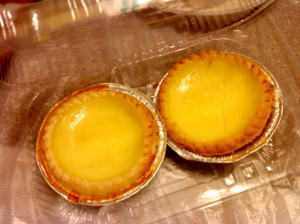
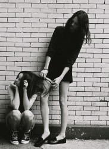
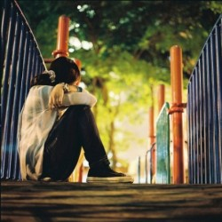

# 两只蛋挞

在旦苑点心部里看见玻璃柜台里摆着一只只黄澄澄的蛋挞，当即忍不住买了两只带回宿舍去，和室友分着吃掉了。

我父母是极讨厌甜食的人，所以我小的时候不要说蛋挞泡芙这一类高级的西洋点心了，就连糖果饼干也都是只有六一儿童节的时候才能在学校里领到，而亲戚来家里做客时带来的甜食也都被母亲以“你不爱吃这种东西的”为由带到单位去送给家里有小孩子的同事了。

我第一次吃到蛋挞，是在小学四年级的时候。我到一个朋友家里玩，她那在蛋糕店里打杂的母亲下班回来，给我们带了店里卖剩下的两只蛋挞。印有橙色花纹的纸盒里装着两只黄澄澄的，盛在锡纸做的小碟子里的，我从来没有见过的点心。朋友拿起一只两口就给咽进肚子里了，我坐在一旁端着那只锡纸碟子，像老鼠一样一点一点地啃掉在那时的我看来是很高级的点心。

我和那个朋友打小就相识了，只是不知道为什么大约四年级的时候才开始成为很亲密的朋友。我和她小学时是同班同学，也住在同一个政府大院里，她的父亲是我父亲的司机，但似乎只是一个临时的编制，所以收入也不算多；她的母亲没有固定的工作，倒是十八般武艺样样精通，有时在蛋糕店里打杂，有时在裁缝店里帮人改裤脚，有时是超市收银员，我甚至还见过她母亲往家里搬了两大箱花花绿绿的小珠子，一家人围坐在一起用玻璃线把它们串起来，似乎是在给某个服装厂做配件加工。

她家里条件并不宽裕，但她父亲抽烟喝酒起来却毫不吝惜，她的母亲有时候找不到零工可打，就在家里睡到日上三竿，然后懒洋洋地出去找亲朋好友打麻将。我记得有一天晚上她母亲打电话到我家里来，问班主任是不是说过要交钱订一套资料，因为她母亲怀疑她是在撒谎骗钱。第二天早上我在她家楼下等她一起去上学的时候，看见她的眼睛有微微肿起来的痕迹。

她是早熟而听话的孩子，家务活基本上都是她一个人在干，放假的时候也常常去帮亲戚带孩子。由于她的父亲经常不着家，母亲又常常要在饭点出去打工，她从很小的时候就开始学着做饭了，技艺娴熟得让我这个至今都不会做饭一进厨房必定打破盘子或者切伤手指的书生羞愧不已。我甚至还见过她杀鸡，在某一年的七月十四“鬼节”，我到她家去串门，他父母在厨房里忙着做饭，而她在卫生间里，里面传出极惨烈的鸡叫声。我贴着门框惊恐万状地探头去看，她正蹲在地上，一只穿着拖鞋的脚踩在用麻绳捆着的鸡爪上，一只手抓着鸡的两翼，另一只手里有一把银光闪闪的菜刀；那只鸡的身体已动弹不得，脑袋还在扭来扭去作困兽之斗，而她实在是腾不出手来了，于是就对贴在门框上的我说，过来帮我抓着鸡头。我鼓起那个年纪的小姑娘所能鼓起的所有勇气，走过去抓住那只鸡头，甚至还能感受到它喉咙里咕噜咕噜的颤动；然后她手起刀落，鸡血溅了我一身。此后我做了好几天的噩梦，梦见她对我说，过来帮我抓着鸡头。

她在学校里也是受欢迎的女生，却不是招蜂引蝶和男生纠缠不清的那一种；她热情开朗仗义执言，大家都很喜欢她。然而她的成绩不太好，数学尤其糟糕；放学后她常常到我家来我们一起写作业，我早早地写完了，而她却还在对着一道数学题抓耳挠腮，我试图给她讲解，却怎么也没法让她弄明白，最后也只好让她抄了我的作业了事。她曾经去上过一个月的补习班，后来她母亲觉得浪费钱就没再让她去上了，“反正也不是读书的料。”

升上小学六年级的时候，班上的女孩子仿佛在一夜之间变漂亮了，把两根辫子梳成了一束整齐的马尾，穿着颜色鲜艳的裙子，打耳洞，戴路边小店里买的廉价首饰，甚至开始穿三公分高的中跟凉鞋，在走廊里咯噔咯噔地走来走去。而我从小到大就没和“漂亮”这个词沾过边，因为家里人一直想要个男孩而不得，于是我就被当作男孩子来养，头发被母亲剪得短短的，穿着堂兄的旧衣服，但是又因为性格懦弱脸上总是带着怯生生的表情，所以别人一看就知道是个假小子。这样害羞又邋遢的丑姑娘不但不招男孩子喜欢，连女生们也不大愿意和我来往。

只有她不会嫌弃我。

那个时候的她并没有像别的女生那样打扮得花枝招展，大概是家庭条件不太好的缘故。但是有着一头乌黑柔顺的长发和匀称修长的身材的她，仅仅穿着廉价的棉布T恤和牛仔裤就已经很漂亮了。有时候我坐在教室里，一转头就能看见她站在走廊上和别人在聊天；她穿着胸前印有一只不知是熊还是狗的T恤，不戴任何首饰，长长的马尾在背后甩来甩去；她站在一群精心打扮过的姑娘中间，这样漂亮。

后来班上转进来一个据说是因为打架被处分而留了两次级、大我们两岁的男生。当班上的大多数男生都还是没长开的青瓜蛋子时，这个高大挺拔，喉结突出，白衬衫下隐隐现出结实的胸膛，说话声音低沉稳重却又偶尔露出一点痞子气的男生一下子成为了所有女生关注的焦点。

学校里流传着各种关于他的传闻，譬如他父亲是越南的黑帮老大，譬如他的家族和意大利黑手党有着千丝万缕的关系，譬如他被原来的学校开除是因为把校长的自行车气给放了。但是他似乎毫不在意这些传闻，很快就和一帮男生打成一片，每天放学后在学校那片被称作足球场的荒地上踢球，引来一帮女生在旁边的自行车棚里驻足观看。

我记得有一次他踢球踢累了坐在场边休息，仰起头来大口大口地喝着冰过的可乐，喉结上上下下地颤动，汗珠滑进他的衣领里，下午六点的夕阳把他湿漉漉的发梢染成金色。

临近小学毕业的某一天，以往一直都和我一起回家的她突然告诉我她有点事要晚一点回，于是我就一个人背着书包往家里走。走进大院里的时候，一辆自行车飞快地超过我向前驶去，微风吹起男生的衣角，后座上坐着一个穿着棉布T恤牛仔裤的姑娘，长长的马尾在背后甩来甩去；夕阳给他们都镀上了一层温柔的颜色。

我远远地看着他们在楼下简短地道别，然后他掉转车头离开时看见了我，冲我咧嘴一笑，你也住在这里啊。原来他也认得我。

后来很快就毕业了，我离开家到另一个城市去念书，她还是留在那个小镇上，而我再也没有听到过关于那个男生的消息。我和她的联系渐渐少了，升上高中的时候父亲突然向我提起她，因为办公室里已经决定不再和她父亲续约而另请了一个年轻的司机，“她父亲喝酒实在是太多了，年纪又大了，平时下乡考察的时候大家都不敢坐他开的车。”我考上复旦的时候，听说她去了某所三本的小院校。

到现在我已经整整七年没有见过她了。

今年三月的时候，我和一个高挑黝黑又漂亮的北京姑娘在万达吃饭，路上她一定要拉着我去一家点心店，“那里的蛋挞很好吃的！”她在柜台上买了两只热乎乎黄澄澄的蛋挞，拿起其中一只两口就咽进肚子里了；我把那剩下那只蛋挞捧在手里，花了很长的时间，像老鼠一样一点一点地啃完。

现在我依然觉得那是很高级的点心。

(采编：朱燚；责编：王卜玄)

[【小伙伴】我只告诉你](/archives/39031)——是我曾经闭着眼睛跟你描绘我的世界，是你指着几块青砖和几支莹白色的野花，无限骄傲和诡秘地说：这是我的花园啊，我只告诉你一个。

[【小伙伴】小旦 ](/archives/38964)——“丑角亦多情，莺啼啭啭如丝如缕；血刃总有义，屠彘嚯嚯救兄水火。”一钱难倒英雄汉，唱段激昂铮铮作响。

[【小伙伴】他们](/archives/38994)——他们承受着历史的剧变，几乎从未为自己而活。这个国家需要眼泪时，他们纵情地哭；需要歌颂时，他们真诚地笑；需要奉献时，他们拿出了青春和汗水；需要理解时，他们说无怨无悔。像入戏太深的群众演员，演完了所有的悲喜剧，拿着一份盒饭默默离开。

[【小伙伴】赵和苏](/archives/39105)——早年间逝去的同学，丧失成长中一切美好与痛楚的可能。同时亦得到赦免，不再被渐染和毁损。你还记得，你第一个离世的同学吗？
