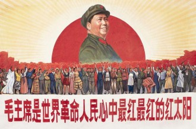

# 他们

### （一）

上海到蚌埠的高铁只需两个小时。九点刚过，我在蚌埠南站拦下一辆去怀远县的班车，然后换小巴到双桥镇，再换更小的小巴。车厢挤得满满当当，我和几只鹅坐在一起。窗外，初春的雨有一搭没一搭。下车，深一脚浅一脚地踩在烂泥地里。

晌午，一身泥巴的我站在张东村的村口。这段路，母亲当年要走上两天一夜。

我找到了张见本，四十年前的生产队长身板依旧硬朗，蹲在门口捧着大碗喝红薯粥。我问他是否还记得有个上海知青叫周建，她是我母亲。他楞了好一会，突然蹦出句“我滴个娘嘞”。

我滴个娘嘞，周建的儿子。

老队长放下粥碗，领着我去看母亲和她的同学们住过的土屋，早已是废墟一片。又指给我看他们耕过的地，走过的路。他对每个路过的老人吼，看看，周建的儿子。老人们张大了嘴，我滴个娘嘞。一位大娘攥着我的手不放，眼泪快掉下来。

三十多年，我是头一个回到村里的知青后代。

村里除了老人就是孩子，年轻人过完年就出门打工了。门框上的春联有些褪色，冬小麦在地里静静地抽穗。

带了一包巧克力作礼物。走的时候，巧克力换成了沉甸甸的一麻袋红薯和花生。

母亲是个平凡的人。我寻找的，不过是一段平凡的历史。

### （二）

母亲本不该去怀远。

六九年的秋天，十六岁的母亲和同样热血沸腾的同学们响应领袖的号召，“接受贫下中农的再教育，很有必要”。六九届的初中生“一片红”，统统下乡插队。母亲的第一志愿是黑龙江呼玛，只因要“到最艰苦的地方去”。外婆心疼她身体弱，偷偷去学校找老师，把志愿改成了离上海较近的安徽省怀远县。

名单公布那天，母亲哭着回家。有同学说她是“叛徒”、“逃兵”。和外婆大吵若干架后，七零年三月二十三日，母亲坐上了开往蚌埠的知青专列。上海站挤满了送别的人群，火车开动，哭声一片。十几个小时坐到蚌埠，迎接的人群敲锣打鼓。向最高领袖宣誓后，母亲和同学们坐上卡车直奔双桥公社，然后换驴车，最后步行12里，才来到张东小队，这个被称为“怀远县的西伯利亚”的地方。

迎接知青们的第一顿晚餐是绿豆籼米饭，黑乎乎一坨。上海来的姑娘们头一次看见这样的吃食，不知如何下口。一旁的村民悄悄咽着口水。六八届的老知青赶紧劝，快吃吧，以后连这个都吃不上了。

母亲诧异地发现，村里（那时叫生产队）的孤儿特别多。过了一阵，有老人悄悄告诉她，六二年断粮，树皮被扒光。年轻的父母听不得娃儿饿得整夜哭，一口稀粥留半口给娃。实在没力气了，就卸下门板，躺在家里等死。

母亲和另四个上海姑娘住进一间黄土夯的屋子。天不亮出工，耪地、除草、打谷、喂猪，夏天看瓜田，冬天磨豆腐。晚上点着蜡烛学习领袖著作，写心得体会。最辛苦的是抢收麦子。四点不到，生产队长张见本的起床号就响了。干四小时活，回村里吃早饭，红薯粥就着红薯馍馍，一抹嘴再往地里赶。午饭在地头解决，红薯馍馍拌辣椒。一望无际的小麦啊，母亲的腰酸到直不起来，跪在地上继续割。等收工号响，已是繁星满天。回到屋里啃两口冷馍馍，倒头就睡，话都说不动了。

母亲憋着一口气，苦活累活抢着干，为了不让农民看轻“城里来的姑娘”。滚一身泥巴，炼一颗红心嘛。她是五个女知青中唯一的“妇女全劳力”，一天工分8分8厘7。当时寄往上海的邮票8分一张，一天活干下来，寄封信都不够。年底回上海探亲，大队会计一打算盘，刨去饭钱和其他开销，总共挣了十块钱。可就连这十块钱都发不下来。张队长过意不去，凑些黄豆、绿豆、麻油、粉条，还有极其珍贵的芝麻油，装在驴车上，送姑娘们去火车站。

母亲年年是标兵、知青代表，有机会去双桥公社或怀远县城开大会听报告。开会是个美差，代表们自带面条，会场统一下锅，拌上公家的芝麻油，喷香。有人教育母亲，“开会前饿他娘两天”。知青们干瘪的肠胃长期不见油水，一吃就拉肚子，拉完接着吃。某男知青吃到“两头冒”，最后被担架抬走，成就了一段传奇。

母亲的榜样是苏联电影《乡村女教师》中的华尔瓦拉.瓦西里耶夫娜。她的梦想是复旦大学中文系，毕业后当一名瓦西里耶夫娜式的乡村女教师。那时上大学只有“工农兵大学生”一条路。七六年，公社下发一个读大学的名额，所有人都觉得非母亲莫属。公社领导找到她， 语重心长循循善诱，让她把名额让给另一个姑娘，“组织考验你的时候到了”，“明年一定送你读大学”。母亲答应了。七七年形势突变，“工农兵大学生”取消，恢复高考。母亲让外公寄来复习资料，每晚看书到深夜，白天照样下地干活。考前一个月，急性肝炎发作。病危电报发到上海，向来严峻的外公流泪了。

### （三）

母亲说，头一回听几个胆大妄为的男知青大谈最高领袖婚史，她目瞪口呆，随即痛骂对方造谣，恶毒攻击领袖。红太阳怎会有七情六欲？

母亲说，七六年红太阳驾崩的消息传到公社，她哭到昏死过去。那时她最大的梦想，就是在天安门广场接受最高领袖的检阅。像无数狂热的少男少女一样，挥舞着红宝书，喊着震天的口号，任热泪横流。

母亲说，她也曾迷茫，甚至动摇过。第一次是外公被“打倒”，第二次是听说饿死人的事情。第三次最为刻骨铭心。公社有三个上海男知青，出了名的落后分子，从来出工不出力，一有机会就躲在屋里看书。七七年三人全部考上大学，风光离开。母亲年年标兵年年模范，到头来只落下一身的伤病。

然而今天她依然相信，相信“英明伟大”，相信“光荣正确”，相信有一支“先锋队”代表了他们的“根本利益”，相信自己其实是幸福的，相信这世界上最壮丽的解放全人类的事业，相信人的一生应当这样度过。

她爱看老电影，看《地雷战》、《地道战》，看《小兵张嘎》、《平原游击队》，看《乡村女教师》、《瓦尔特保卫萨拉热窝》。看到《英雄儿女》中的王成一遍一遍呼叫着“向我开炮”，不觉已泪流满面。

她不在乎自己的户口至今回不了上海，不在乎每月15元的“知青补助”，不在乎“半文盲”的学历，不在乎过度劳累带来的膝关节劳损和腰椎盘突出。

她常对着我叹气，你们这代人啊，没有信仰。

我们不再相信，是因为你们什么都信。

我们人人为己，是因为你们没有自己。

(采编：王卜玄、张山骁；责编：刘铮)

[【小伙伴】我只告诉你](/archives/39031)——是我曾经闭着眼睛跟你描绘我的世界，是你指着几块青砖和几支莹白色的野花，无限骄傲和诡秘地说：这是我的花园啊，我只告诉你一个。

[【小伙伴】小旦 ](/archives/38964)——“丑角亦多情，莺啼啭啭如丝如缕；血刃总有义，屠彘嚯嚯救兄水火。”一钱难倒英雄汉，唱段激昂铮铮作响。

[【小伙伴】赵和苏](/archives/39105)——早年间逝去的同学，丧失成长中一切美好与痛楚的可能。同时亦得到赦免，不再被渐染和毁损。你还记得，你第一个离世的同学吗？
