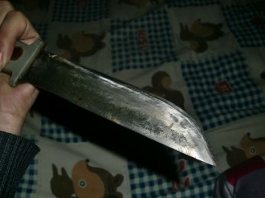
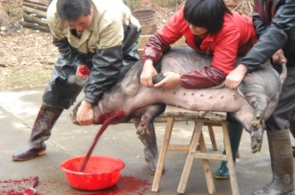

# 小旦

曹圩方圆十里的人家来了客人了，必然要到曹建明家去。过端午，七月半，中秋立冬廿四夜，大家都往曹建明家去。哪个人骑着脚踏车往西圩走，邻人问：“上哪儿去？”他要是答应：“去称点儿肉！”保准邻人会加上一句：“哦，上曹建明家去啊。”当然，一般他是不会说去称肉的。沙乡里的行当几乎都是父业子承，篾匠传篾匠，裁缝传裁缝，先生传先生，老早史家埭有个阴阳先生，看风水的本事在本县都是有名的，他没有儿子——干这行的据说都没有下人，我父亲想学，不肯传。

曹建明家里就是世代出屠夫，从什么时候开始呢？我奶奶同我说，以前猪肉五分钱一斤的时候，他们家卖肉，等我大了，肉现在十五块一斤，大家还是喊“上曹建明家去”。曹圩上的红白事少不了三个人，一个是大队支书，还有就是曹建明兄弟，他们来杀猪。以前养猪的人家多，到腊八头上，人口多的户上就会留一条杀了过年，养猪的人家不杀猪，也请曹家兄弟来杀——他们家里不也养猪嘛！兄弟俩一般不推辞，杀完之后照例把下水收走。有的地方杀猪用窄长而深的木盆，把猪抬进去，猪就动不开身，正好下手。他们杀猪只要一条绳子，一把条凳，把猪捆好抬到凳子上摁住，猪头下面放一个盆等血，建明捉刀往脖子上一戳，血汩汩的冒出来，猪凄厉地叫一阵，慢慢就不动了。这时看曹建明，身上手上一滴血都不沾，再看建明兄弟，满身满头的汗直流，哪怕冬天也是如此。

用大木盆杀猪虽然方便，可是要把猪血给弄脏，平白少了道好味道，太可惜。用条凳杀，猪血干干净净一滴不少，清爽又实惠，就是费力气。那么大个猪，摁死在凳上一动不能动，要出多大劲？怪不得建明的兄弟汗出如浆，那手上的气力也确实惊人。也就是他们喔，别处杀猪我也见过，四五个壮劳力摁着还要溅一身血，差得远了。

建明有时候也帮人杀牛。杀牛更容易，沙上讲得是“羊一钩牛一绳”，杀羊就是拿铁钩子钩住羊脖子吊在树上扒皮，杀牛只用一条绳子松松地系住前后腿，就同人的两只鞋鞋带绑在一起一样，然后抽一鞭子吆喝一声，牛踏步子朝前走，一走就倒了，倒了就再站不起来。乡下捱杀的都是老牛病牛，一世辛苦做了数不清的活计，临了还要杀它，它也通灵性，倒在地上眼泪止不住地流，也不吃草也不哀嚎，就是望着主人不停淌眼泪，泪串子跟自来水似的能淌出一大滩来。旁的牛看着了也跟着淌眼泪，主人不忍看，建明却是杀老了牲畜的，一声不吭捉刀往脖子上一戳，那血水就跟泪水一般汩汩的往外淌，淌出一大摊来。

建明的兄弟是从来不肯杀牛的。牛开始淌眼泪的时候他就开始淌眼泪，牛被戳了刀子要咽气的时候，他就仿佛是他自己捱了一刀似的嚎啕大哭。人家哭都是嘴张得大大地往外哈气，气哈光了再嗅一口继续嚎，他不这样，那哭声尖且细，低而深，呜呜地啼像是被打了一枪的狼狗惨嚎，一口气啼尽了再吸时会发出一声如物塞喉、欲喊不能的哀鸣，气越提越多哀声就越鸣越高，高到最顶上再仿佛憋不住痛似的，断断续续低低缓缓地呜咽出来，就同死了娘的丫头回家哭丧一个模样。建明兄弟哭得这样悲，杀牛逢到他在场，看的人多半是要淌眼泪的。

我奶奶同我说，老三小辰光得过小儿麻痹症，没人同他耍子，一天到夜就是同个牛作伴，恨不得困觉都在一块，看见杀牛能不嚎丧？那我就明白了，他哪是在哭牛，也是在哭自己嘛。

老三的大名是什么，没有看过他的户口簿子，不清楚。他行三，我奶奶喊他三儿，他喊我奶奶二娘，因为他小时候也被奶奶带过一阵子。旁人同他差不多大的喊他“三老娘”，我觉得这是侮辱，也确实证明了他小时候没人同他一道，都欺他。那些这么喊他的人估计只是觉得好笑——老三的声带可能因为少年时的病情被烧坏了，发出的声音同女子一样尖细，配上矮小纤瘦的身材，若不看脸面，全不像杀猪耕地的壮劳力，倒好似弄弦唱曲的小蛮女了。

他唱的倒确实好。

过了忙收好了稻谷，大家端碗到晒场上嬉闹，闹得兴起必定有人邀老三唱一段。老三摁猪如吃饭，这个时候却扭扭捏捏让在一旁不肯上前，非得要那些莽汉一齐推上两把，再由姑姑婶婶的哄笑一场，才抹一把脸皮朝中间跨三步。两块抹布权当了水袖，只是一收一收一收，忽的提手站定偏头侧目，他唱：“表~弟~啊！”

全场鸦雀无声。就好像是极远的天边传来的响雷，一阵一阵绵绵重重地击在人心头上，没有一点惊惶却是十分醒神，仿佛先前的闹闹嚷嚷全在梦中，此时这一声长调才叫人彻底沐了一场温凉的春风雨，万物惊蛰，而后万籁俱寂。

“你拿了这包干点心

一路之上要当心

白天将它拎在手

夜间枕边放安稳

憩息将它怀中抱

赶路须防身后人

荒山野岭绕道走

过河涉水待风平

未到黄昏先投宿

天光大白才能行”

老三一个抬手一点低眉之时，端碗的人都不吃饭，筷子伸到嘴里的忘了拔出来，抽烟的任凭烟卷烧，绝不肯低头去吸一口，似乎松一点神就要错过了最精彩的场面。

他唱：“表~弟~呀！”

“非是愚姐多叮咛

你要当心这包干点心

千当心来万当心

点心当中有点心”

看戏的人手里有碗的，这会儿都要抓的牢一点，拿筷子到碗里搅两圈，看看倒是有没有那包干点心。

只有这唱了戏的时候，那些不同他一块的人才不来笑他，个个实心实意地卖力叫好。老三这一条飘柔嗓子，不知道羡慕死了多少大小姑娘，前后九圩，谁不知道我们老三的木兰调，那是连县里的锡剧团都下来选过的。当然是没能选走。男子演青衣花旦绝无不可，可是老三实在是太丑了，真要选上去，除非是演双簧——站在幕后头卖嗓子，可是锡剧团的角儿，有哪个是不会唱的呢？

老三实在太丑，一点不像他二哥哥曹建明。建明常年杀猪，不论冬夏都是黑胶皮连鞋裤，脸阔胸宽，膀大腰圆，一看莫说杀猪，说是打虎的也叫人信。老三顶着癞疤头，斗鸡眼下凸出个大酒糟鼻，嘴倒是不歪不斜，偏生一口烂牙黄中带黑，因而绝不能开口笑，一笑定是使人愁。个头本来就矮，还有点儿麻痹后遗症，走路前后脚不太平，人又黑瘦，真是要多丑怪有多丑怪。真要比起来，这俩兄弟正像了武松和武大郎兄弟，我小时候常常以为老三能把猪摁得死死的，不唯手上有把子力气，更有他这副尊容的功劳，那猪被擒本已惊慌失措，再看到老三的奇异相貌还不要吓得屎尿齐流。

所以姑娘们虽羡慕老三，也在听戏时暗暗地叫好，却绝不愿意嫁给他做新娘子的。

老三不能靠唱戏吃饭，也不靠杀猪吃饭——和建明杀猪只是打打下手，他的本行是瓦匠。这个行当最得意的时候不是盖好了房子看人家上梁，那会儿早去赶下一趟工了，这热闹他们凑不上。瓦工每接一次活，开工之前要在主人家喝一回头酒，那又甜又香的小麦酒用面盆装上来，个个人两三碗下了肚，眼花耳热后，意气素霓生。他们开了腔了。长的三十载，短的十来年，近处维扬三镇，远方江南几城，他们酡红着脸，踏脚垒拳，闭目瞪眼，五指朝天历数这一二三十年来造下的屋房，呵斥争论谁人的手艺高低，谁家的房屋好坏。

老三向来不与人争，唯有这时，什么老师傅来了也不买账，唯有这时，晒场上陈素娥的风情万种消失得一干二净，他跨坐在条凳上，头微微的扬起来，一下变作金刀跨马的老令公了。他自豪且惬意，那么多人家的房子，那么多人的家都是他起起来的，二十年下来，多少人在这些房子里出生、结婚、老死，有多少故事从他手里的作刀开始，绵延出去。这是他的手艺。

我极想和他学瓦匠，他们绝对不明白什么力学原理，但是却能起出那么多漂亮结实的房子，给人家造出避风挡雨的家来，这是多大的功德。

“学手艺吃的苦大了，你还是好好读书吧。”老三歇了脚踏车坐在我家门口的路牙上，和我们搭话。

“做什么不苦，读书也苦。”

“你晓得我那时候学手艺受多大的规矩？学瓦匠的苦你吃不来。”

“受什么规矩？”

“我学徒的时候正好起你家这个房子，大早上被师傅拿洋锹追着打。”

“他做什么打你？”

“那是冬月里，先头早上冷人也穿得多，开工以后身上就出汗了，我要脱衣服，师傅一洋锹拍在我脑壳上：‘晓得要热起来，不晓得早把衣裳脱掉啊！’，他就不肯让我脱。”他把自己给说笑了，像是说起什么有脸皮的事来。

“师傅这么狠啊！”

“你当什么呢，夫妻是前世里的冤家，师徒是前世里的仇人，那一洋锹把我的头打瘪了一个塘，你摸摸，在这儿。”

他那个头拢共也没有几根毛发，亮亮的黄疤边上还冒着油水，我看了一眼，确实塌下去一块。怪不得手艺都是父子传，老子打儿子天经地义，哪个愿意和不相干的人结仇生怨呢。

“老三你是好运气，这世里只有仇人没得冤家！”有人开始取笑他，他只是笑笑，并不答话。

不过人家却不愿意放过他：“我看你倒是可以和马铁虎凑到一块嘛，正好做一对吕布与貂蝉！”大家哄堂大笑，马铁虎咧着嘴不知道北。老三更不答话，骑着脚踏车去了。

和他差不多年纪的都不爱和他好，小孩子除外，为的是他手里的花样太多了。竹窠里随意取一片叶子来，老三就能吹出一支曲儿！他也愿意和我们耍子，没有工做的时候就撵着我们到处疯，我们钓虾他去挖蚯蚓，挖好了还要给绑到线上，我们下河洗澡他就在岸上看，找软软的烂泥块往大伙头上砸，扑通扑通热闹的不得了。冬天里他带我去过一条野沟，头天晚上把沟里的水放得差不多，第二天早上去看，水都上了冻，大小几十条黑鱼像竹笋一样长在了沟里！我们下去拔萝卜似的一个一个收到篮子里，回家放进木盆倒上水，过一会儿竹笋们又活过来了。

老三欢喜孩子。

他抱了一个丫头过来养，差不多到了嫁人的年纪。

“你要望望什么样的人家，我给你打听。”我想要兔子耍，老三养了一大圈，算是副业，给送了一对过来。我奶奶常给人做媒，这回正好问到他。

“二娘，我家的不嫁到这里来，我们这里的女将，太苦。”

我奶奶不吱声了。他和我们说想给丫头在城里攒一套房子，现在还差一个卫生间。

人家都知道曹建明卖肉赚了大钱，赚了多少不清楚，但是看他赌钱能看出点事来。小镇上就属这一帮子人来的大，听说有一回建明开车带了整整一后备箱钱去江边赌。四个“2”牌照的宝马是建明最先买的，输掉之后等赢了钱又买了四个“6”，后来又换成了四个“8”，手脚敞，来去大，赢了就去化，输了就卖车卖房子再去赌,。

常赌不输说的是差不多固定的圈子里来，如果是外地赌客做链子，那就是逢赌必输。建明连赢了六天，第七场翻了船，被人送回来的时候打得不成人样，浑身透湿，那些人打累了逼着他去投江。老三捧着他哥哥，跟杀牛似的嚎丧。人家放出话来，不凑够了钱，下次上门，留不得性命。

曹建明家里连着三天没有卖肉，几十年来都难得这样冷清。第三天早上，两辆面包车载着好些人来了。

老三站在院子里，脚边放着平日杀猪的条凳，看着门外这群穿西装打摩丝的壮劳力，一言不发。他们要进来，老三突然抽出建明常用的尖刀来，门外人停住脚步，一言不发。老三不再看着门外，他一脚踢飞旁边的凳子，径直走去打开猪圈，放出好大一条猪来，肥猪绕着院子慢慢转，发出呼呼的声响。

门外的人提腿要进来。老三一手提刀往前猛跨一步，一手摁住转圈的猪，猪痛嚎欲脱，老三一刀往脖子戳下，血汩汩的往外冒，一下子淌出一大滩。猪脱手，走不到三五步，倒地不起。门外人又停步。老三刀不停，一刀剖开肚腹，肠胃肚肺泄了一地，又一刀，头身分离，再一刀一剜，左前腿飞起。老三的刀剐肉，像在分挂筒里的水泥，一刀泥抹一块砖，多了不能少了不行。这猪是他的冤家，砖是他的仇敌，要用尽全副心思去爱去杀。这是他的手艺。

老三的刀在肉里飞，像是在拔冬天野沟里的鱼，一条一条一条。一刀一刀一刀，像是晒场上飘飞的水袖，一收一收一收，像是要唱：“表~弟~呀！”大音轰鸣，万籁无声。只是刀不停。刀滚肉头人翻筋斗，刀走关节声转霄云，刀一挑戏一唱，就是惊心动魄人鬼俱寂。

刀停，全猪块碎。再看老三，上下不沾一点血，满身满头汗直流。院里人不吭不喘，门外客一言不发。

老三紧握住手里的刀，走到圈旁重重拎起个箱子夹到怀里，往门口走。那箱子太重，似乎都要压弯了他的腰，他的肩膀挑起过百十座房子，却被一个箱子压弯了腰。他护着那箱子在怀里，像是藏了一包干点心，要千当心来万当心。他往门口走，狠握住手里的刀，刀头有血朝地上滴，他只是走路，一言不发。他走一步，门外人退一点，到了大门旁停住，浑身的血气盖过了身旁的门神。

“拿了滚！”他拼尽全力把箱子砸出去，客人们一哄而散，离得远远的，老三发出极尖极细的嘶吼，“剩下的以后还，谁再敢来找我哥哥，”他喘出一口大气，看看手里的刀，眼里的痛苦瞬间化作一丝柔情，像在自豪自己的手艺：“这刀还只杀过猪。”

来人一言不发，上去一个拾起箱子，轰然一阵上车去了。

老三摸着刀靠着门板滑下去坐在了门槛上。他像是失掉了全部的精气，刚刚砸去那箱子像是砸掉了自己的魂灵。他又把刀握住，握得紧紧的，像是自己捱了一刀似的，发出尖且细，低而深的呜呜。

看戏的人家纷纷的叹气，不晓得是叹这操刀的男人，还是可惜那散落一地的猪血，少了一道好味道呢。

前后九圩的人家夜里端碗吃起了饭，谁不重重慨然几句，锡剧团的人望走了眼咯，这老三，原以为就是个孟丽君，哪想到能成个刘婵金呢。他们有时候也会怀念晒场上的三老娘，不过他已走了多时了，和他的丫头搬到远远的地方去了。我也这许久见不到他啦，不晓得在人家喝头酒的时候，那颗没有几根毛发的癞疤头，可还泛着红光高高地扬起来：“表~弟~啊，你拿了这包干点心！”

（采编：王卜玄；责编：王卜玄）
