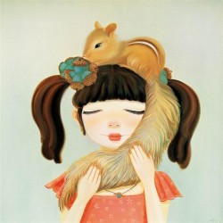

# 我只告诉你

跟损友聊天总能听到一些损笑话，传说某人在实习期间，因着家庭父母矛盾以及重重的感情困境，上班时无精打采效率低下，上司出于人道主义情怀或者对效率的不懈追求，把她叫到办公室，开头便是温情脉脉的：“你怎么了？是不是发生了什么事情啊，感觉你最近上班没什么精神。”

连日哭丧着脸却无人关怀，草草应付却只获得同事白眼的某人终于哭了出来，姿势语调都做了微妙的调整，一场山雨欲来的倾诉眼看在即。上司做了个手势，堵住了她的感情决口：“别，我们还是回来继续谈谈工作。”

小时候，我们多么乐于和亲密的伙伴分享秘密，下课时把她神秘兮兮地叫出来，动作手势眼神全用上，面部表情丰富得特写都唯恐不够，唯有声音轻而又轻，像是又细又长的虫子，痒痒地钻进对方的耳去，旁人的心也仿佛被一同挠到。

调皮的男生一定会凑过来嬉皮笑脸地要探听，他们那时候对女生的隐秘的对话很感兴趣。女孩子们挥挥手，半真半假地赶他，她们既为得到注意而愉悦，却也不想让这个秘密被探听者搅得掉价。

那时候我们用的最多的话是：“我只告诉你一个”，而对方的回应往往是一个斩钉截铁的眼神：“我绝对不说出去”。

后来她们因为一个铅笔盒或是一次作业本上的五角星而翻脸，后来她把这个秘密昭示众人，把秘密的细枝末节一一抖落，后来那秘密内容变得不再重要，后续事件反倒成了青春期的一道疤。

然而并不是嘴巴会背叛，纸张也会。小学时班里有个早熟的女生，身体和感情发育得都比同龄人早。那样的女生往往是有种莫名其妙的矜持的，她想要加入这群叽叽喳喳的小学时，却敏感地意识到自己的不同。我们都对她充满了好奇，跟她同寝室的女生喜欢发布些“一线消息”：她在厕所偷偷换卫生巾啦，她晚上到楼下电话亭打电话啦。好奇心愈燃愈烈，最终驱使我们班的男生趁她不在的时候，翻了她的抽屉，找出了一首诗。她的字迹清楚漂亮，纸也是精巧的信纸，上面写的什么我已记不清，但一定和爱情沾了边，也有一个女孩子的自怜。那些语焉不详的迷恋被指向情色，而自怜则被曲解成了自恋，人人都争抢那几张纸，兴奋得满脸通红。

秘密让一个人变得不同，而不同，总要付出足够多的代价。

有趣的是，不少秘密其实从来不期望被保密，正如“ 被封杀”成了一个明星的炒作，“被禁”成了一本书最好的推荐腰封，“被删减”成了一个电影最棒的噱头，有的时候，“被保守”的秘密，是最想要大鸣大放的消息。我的一个朋友被一个小姑娘收服得妥妥帖帖，他装得灰头土脸，跟我抱怨人身自由受限，再三叮嘱“不准跟别人讲我现在这么惨啊”。我看穿了他五大三粗外表下扭扭捏捏的小心思，咬紧舌头不透露一个字，他枯坐家中无处炫耀，过了一个月表扬我：“你还真是实诚啊。”

我这同学才实诚，真的只告诉了我一个。事实上，许多秘密被当事人吞吞吐吐地讲出来时，你以为你得到的是独家，要过好久以后你才知道，你拿到的不过是通稿。

大多数的秘密都不是裹着柔软花瓣的甜蜜糖果，更多的时候，它是流言、是不堪、是扭捏、是胆怯。它是刚来月经的小姑娘跟好朋友分享内心的胆战心惊，是喜欢上非单身的男士时的悲壮和忍耐，是对着某个看不惯的嫉妒的人放出的一支支冷箭，是平和表面下的细却深的裂痕，是所有该想不该说的事情的总和，是一切该讲不该瞒的事情的聚拢。

当你说出“秘密”这个词语，你就默认了它的不可见人，其实回过头去看那些事情又有什么大不了的，是你心虚的态度给了别人可以出卖的机会。

我不知道是不是每个人的成长期里，都有过背叛的经历。那时候我们还不知道“分寸”这个词的精准含义，我们就像一只小狗一样，对谁都敞开柔软的腹部，等着对方来揉。我们好起来就要到对方家里去玩，要一起过夜讲那些琐碎而无谓的心事，要同仇敌忾对付某个看不惯的人。可是为什么那些“好”都那么不堪一击，为什么你曾掏出的柔软心事最后都成了刺向你的匕首。只是因为年少吗？可恋人们在一起时候分享过的细节会被一方放大翻晒，同事间说过的老板的坏话会被拿来去讨好去献媚，秘密是你交出去的鲜活的心脏，在过后总变成冷硬的石头。

是因为年长的缘故吗？我觉得我的秘密越来越少了。发育期过去，不再对身体的细微变化大惊小怪，发情期过去，不再把手心的感情线展示给别人看，跟密友因着一场考试被冲散在各地后，连发怒期都要过去了。

那个探头探脑的小男孩也不见了，人人都有乱麻，哪管别人缠住的是哪一段，深夜痛哭的太多了，谁在意你的灯是不是亮着。秘密成了一种滑不溜秋的东西，从我们粗糙的指间掉了下去。

太多的事情你知道倾诉没有用，更多的事情，你倾向于把它开诚布公。阅历和经验给了你底气，你不再是那个为自己的不同而惶惶不安的女孩子，你不再需要一个人来分享你的情绪，分摊你的恐惧，你一个人也可以稳稳当当地站在大地上了。

后来你一定看到过这样的一句话，也许来自于你读的书，也许来自于你爱的人，他们说，一个秘密在脱口而出的刹那，就失去了真正被保密的可能。这话多么正确——冷酷的充满不信任感的话总是正确的，可是——

——我不知道该怎么表达，就像父母从小教导“沉默是金”你却仍然热衷表达，人生容易被记住的往往是那些错的事，是不该吐露的话，是不该交付的人，是“我只告诉你”的笃定和信任，是“我一定谁也不说”的那个一定。

是我曾经闭着眼睛跟你描绘我的世界，是你指着几块青砖和几支莹白色的野花，无限骄傲和诡秘地说：这是我的花园啊，我只告诉你一个。

——给你给我，六一快乐。

采编：刘铮；王卜玄；责编：王卜玄

[【小伙伴】小旦 ](/archives/38964)——“丑角亦多情，莺啼啭啭如丝如缕；血刃总有义，屠彘嚯嚯救兄水火。”一钱难倒英雄汉，唱段激昂铮铮作响。

[【小伙伴】他们](/archives/38994)——他们承受着历史的剧变，几乎从未为自己而活。这个国家需要眼泪时，他们纵情地哭；需要歌颂时，他们真诚地笑；需要奉献时，他们拿出了青春和汗水；需要理解时，他们说无怨无悔。像入戏太深的群众演员，演完了所有的悲喜剧，拿着一份盒饭默默离开。

[【小伙伴】赵和苏](/archives/39105)——早年间逝去的同学，丧失成长中一切美好与痛楚的可能。同时亦得到赦免，不再被渐染和毁损。你还记得，你第一个离世的同学吗？
