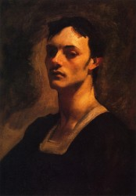
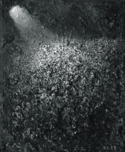

# 赵和苏

写下这个名字觉得像是一种叫做“昭和酥”的糕点。其实只是苏海和赵晓各自姓氏的合称罢了。尽管在一个年级相邻的两个班，他们生前没有任何交集。而现在，他们都已经死去了。是我初中所在的年级里，最早离世的。

**赵晓**

我对生前的她一无所知。

成绩很好，小小的个子，有一个哥哥，爷爷奶奶在家里做面粉加工生意，父母在外打工•••所有关于她的信息，在她死去后的几天里，传遍了包括我在内的整个小镇的人耳朵里。后续的消息被修正：父母火速赶回家也没能见到她最后一面，面粉作坊关闭，母亲精神恍惚到有些失常，怨恨爷爷奶奶没有照顾好她。

后来我在一张合影上看到她，真是小小的个子。乌黑的长发——这头长发直接导致了她的灾难。

起因不过是，加工面条的机器里卡了很多湿润的面团。她爷爷（一说是奶奶，无人敢去求证了）叫她把面团抠出来，晚上做“灰面坨坨”吃，类似于北方面疙瘩的吃法。她就去了，但可恨机器没有挺稳，齿轮尚在转动，她就俯身下去看面团。长发竟被齿轮狠狠咬合进去，头皮被撕裂都扯不出来。

次日我去冲洗照片，在照相馆碰到她的班主任。老师红眼睛，黑眼圈，一脸惨白。我局促找不到合适的话安慰。他却直说，女子，真的太可惜了！声音沙哑却仍响亮，有抑制不住的悲。他租用照相馆老板的相机去现场拍照取证，帮助她的家人争取保险公司的赔偿。

老板娘在一旁，一边装回相机，一边连声感叹可惜了。他看见了，突然急忙越过我，拿过老板娘手中的相机，连声道歉，说里面有些“不干净”的照片还没删，怕她们做生意的忌讳这个。

老板娘略有些惊吓，定定神，还是柔声说，这有什么，人总是要死的。

我大概猜到了那些“不干净”的照片是什么，有多惨烈。不敢再上前。

其实完全可以不发生的。

后来我知道，她本不打算把长发留着，想剪短拉直。自己存了几百块但舍不得用，“我要等我妈回家给我出钱！”她这样告诉后来是我室友的小原。

如果她及时剪了短发，如果那天她爷爷没有这样要求，如果机器停稳她再去抠面团，最重要的是，如果县医院的接线员没有把“新林乡”误听成“新星乡”，如果乡下的小路不那么难走，以致耽误了三个小时才赶到•••如果这么如果都没有发生，她很可能跟我们一样，高中大学一路念上来，恋爱分手•••那台运转的机器掐断了所有可能。

快中考时，女生们依依不舍惜别，晚上干脆不回家留寝室睡。床位不够打地铺，连席子都没有了。她走后，她家人去她寝室带走了她所有东西，却留下了那张席子。

我于是去敲她所在寝的门，把那张席子拖回来铺地上睡了。大家都玩笑说，赵晓今晚会来找你哦。但谁都不觉得阴森恐怖，好像她还仍是我们身边一个天真的小姑娘。

那夜我睡得安心极了，皮肤贴在上面，有竹编的凉席特有的凉。

**苏海**

苏海这家伙，其实我更习惯性地称他为“贱人”来着，要是他知道我“为死者讳”客气的叫他“家伙”，他一定会生气吧。

但没办法，他确实挺贱的。

初三赵晓离世时，他已不在我们班。但了解他的人都可以想象出他知道后的表情，“哦豁，嘿！你晓得不，我们年级有个女子死球啦！哎呀，你连这都不晓得哦？！硬是个瓜麻批！”他莫名把你骂一顿，然后得意地跑开了。

小学时，他们几个男生去洗澡。他穿着内裤下水，上岸后只穿外裤。把内裤拎在手里，像挥彩旗一样得意地挥来挥去。上课后，把湿漉漉的内裤跟扔炸弹一样，扣在前排倒霉男生的头上。

初一我不幸跟他成了同学，看他把避孕套带到教室，骗女生说是气球让她们吹。我阻止他，加之我们一直彼此看不惯，于是跟他大打了一架。我中学打架总赢，我自知不过是男生一般会让着女生些，反正也不是真打。但他不同，绝不谦让，手狠极了。激怒了我，操起板凳狠狠砸他头上。他瘫坐在地上，缓了很久。

而后我们竟相安无事。

他成绩奇烂无比，有一次竟在我这里借了一块钱买书。不久还了五毛，另外五毛假装忘记坚决不还。至今仍然欠着。嗯，不用还了谢谢！

2012年初，他在绵阳车祸离世。

我听说时全身一冷，不是说坏人活千年吗？这丫长大了绝对大贱人啊怎么这么早就没了？

我想起他的父母打砸多年才离了婚，母亲曾是英语老师，教书太烂做了宿管。我初中脾气暴烈，夜里隔壁寝室太吵。我起床出去，一脚踹坏了她们的门，转身回寝继续睡。她安抚她们，说我“张花事”，大意指自以为是爱出风头。我们寝的女生就集体不再叫她，但也仅此而已。我毕业后，一次在饭店里看到她与学校保卫处的一位男老师吃饭，他俩热情地邀我一起吃饭。我过去打了个招呼，莫名地，我知道了她现在的情人是谁。

苏海大概不知道也不关心吧。

记忆里的他，永远是那副黑瘦，痞气十足的模样。我以为他会跟另外常跟我打架的男生一样，去打架贩毒，然后去睡跟我们一起长大的某一类女生。或者某一天，他突然醒悟，退出江湖，过起家常日子来。黑瘦的皮肉变得松软可人，夏天里赤裸上身，挺着啤酒肚去街角和几个兄弟伙打麻将。

他给他几个兄弟伙留下的最后印象，就是得知他死讯那晚。他们几个一起喝酒，突然，他的QQ在线了。谁也不知道为什么，但都被吓得不轻。

其实被盗号哪个熟人帮他登陆了下之类的原因都不难猜，但大家都觉得，这是天性顽劣的他，跟我们开的最后一个玩笑。

我曾想，等我们初中毕业二十年后，我会组织我们那届的同学聚会。欢迎赵和苏来参加呀，如果你们没有往生。那个时候，我们已经成了面目可憎，皮肉黄软的中年人，一起抽烟喝酒聊孩子车子房子。而你们在一旁，却是永远年轻，永远清澈的模样。苏大概会焦灼亢奋地让我们给他点一支烟，小赵则微微笑着，侧过头听我们说话吧吧。

真希望那时你们还在，在被剥夺了一切可能后，看到我们被浸染的不堪，发现不再成长，便是上苍付给你们的，微微的补偿。

（采编： 刘铮；陈静 责编：王卜玄）

[【小伙伴】我只告诉你](/archives/39031)——是我曾经闭着眼睛跟你描绘我的世界，是你指着几块青砖和几支莹白色的野花，无限骄傲和诡秘地说：这是我的花园啊，我只告诉你一个。

[【小伙伴】小旦 ](/archives/38964)——“丑角亦多情，莺啼啭啭如丝如缕；血刃总有义，屠彘嚯嚯救兄水火。”一钱难倒英雄汉，唱段激昂铮铮作响。

[【小伙伴】他们](/archives/38994)——他们承受着历史的剧变，几乎从未为自己而活。这个国家需要眼泪时，他们纵情地哭；需要歌颂时，他们真诚地笑；需要奉献时，他们拿出了青春和汗水；需要理解时，他们说无怨无悔。像入戏太深的群众演员，演完了所有的悲喜剧，拿着一份盒饭默默离开。
