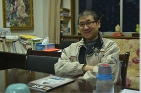

# 专访谌洪果：不断抗衡，拓宽自由的边界

2012年12月23日，西北政法大学副教授谌洪果老师举办了他的“公民自治与合作”计划的第四期读书会。经过谌老师等人的努力、争取和坚持，学校终于允许恢复读书会活动的正常开展，而这距离那场在冰冷楼道里，承受着巨大压力进行的读书会已经过去了近一个月。

12月13号的一个西安的寒夜，常识记者来到西北政法大学拜访了谌洪果老师。在两个多小时的采访中，谌洪果老师提到最多的，是底线和原则，是大学的自由和责任，是公民社会和公民意识。在采访的最后，谌洪果老师说，“我不知道23号的读书会能不能办起来，如果学校还是阻挠，那么我已经做好了辞职的最坏打算。”

**“我不愿意传授我自己不相信的东西**

常识：您最初为什么会学习法律专业？

谌：中国人最大的一个信仰就是权力崇拜。和大多数人一样，当初我报考法律，其实就是想以后做官，光宗耀祖。直到后来读了大学才逐渐发现自己不是当官的料，发现自己的兴趣其实是在文史哲等学问方面。

常识：在大学里有对你影响较大的人或事吗？

谌：我当初读大学的时候的确碰到过很多负责敬业的老师，但在知识、思维、视野和方法上，说实话，我没受到过太多的影响，在看书方面也没有人提供很好的指引。总之，我读书期间没有真正受过系统化的学术训练，全是靠自己努力和琢磨的。但是，好在我一直在学习在进步。不过，只要爱学，总是能跨越学校的围墙的。在我成长过程中，我得益于古今中外各个学科很多的学者和著述。但就当代中国法学家而言，有四个人对我影响最大，有心人从我的文章思考中是能看到他们的综合印记的。第一位当然是我的老师贺卫方，他那种社会关怀、人格风范、学术眼光和坚守，还有他的理性平和儒雅的谈吐风度、他对人的尊重和耐性等，都让我终身受益。第二个是梁治平，我认为他是法学界早慧而清醒，最具有学术自觉性的人。他的《法律的文化解释》以及《清代习惯法：社会与国家》是我大四到研究生期间都反复吟咏过的作品。第三个是朱苏力，九十年代中期他在中国法学界可谓横空出世，一举将中国法学提升到完全不一样的学术境界，开创了中国法社会学、法经济学、法律与文学等多个研究领域，更重要的是，这种开创根本不是跑马占地意义上的，而是认真地学术思考、清理及构建扎实的学术传统意义上的。第四个是冯象。他有优越的学术出身及训练，其作品问题敏锐，立意高远，其神性关怀、历史视野及写作风格，是我到今天都还在不断品味学习的。

常识：后来回到西北政法大学教书，您都做过哪些教学尝试？

谌：我从06年北大博士毕业，回到母校西北政法以后，每年都在进行各种教学学术的创新和探索，比如我不喜欢重复，即便同一门课，基本每上一次都会更新不同的内容和专题。教学对我而言就是永不止息的挑战，只有这样，才能教学相长。所有这些尝试的核心，都是践行大学精神，我不认为这些尝试有多么超前或标新，我不过是在维护一些最基本的本分和职业伦理。 比如这次读书会事件，我捍卫和坚持的不是某种统一的价值观，我捍卫的是多元。大学需要多元，大学需要允许很多不同的存在方式。我没有想过要改变别人，我只是坚守原则和底线。这次事情，我自己做了最坏的打算，但是心里一直有阳光，不因为周围是黑暗的，我就不成为一颗星星。我心里一定要阳光，我就是为了这一点点阳光而活着。我们都是卖火柴的小女孩，都想擦亮那根火柴。 大学老师的责任，我想非常简单，简单说就是教书育人，不要糟蹋学生。大学老师要保持职业伦理，也要坚守学术中立。对我来说，我不愿意传授我自己不相信的东西，这是我的一个准则。

**“权力就像在自由外面圈着的一张网，你越退缩，它收的越紧。”**

常识：您觉得读书会对校外开放是个问题么？

谌：开放本身当然不是问题。就像我给校领导的信中所说的那样，公开读书，是学校鼓励的多元教学方式探索之一，符合向社会传播理性宽容精神的公民教育主旨。在不影响正常教学秩序情况下，大学课堂、讲座、论坛、读书活动、教育资源面向社会公开，本就符合大学精神，也是大学的光荣，正如北大陈平原教授所说：“理想中的大学，应该是没有围墙的。”社会很缺乏公民精神，所以可以把读书的正能量辐射给社会。

常识：在读书会中您承受了很大压力，有让你难以忍受的时候吗？

谌：外在的政治压力当然不小，但真正让我最纠结最难受的，是我得像祥林嫂一样不断给我的学生和一些最亲近的人解释。如果是陌生人，那么我完全可以“彪悍的人生不需要解释”。对他们的质疑，我很欣慰，这体现了独立思考，也符合我和学生之间惯常的讨论风气。问题是我希望我最珍视的人们能明白我根本的出发点和坚守到底是什么，我不希望把我捍卫学术自由底线的被迫行动，误认为是勇敢的斗争，或者说我学术上不纯粹了。这是我最不愿意被人误会的地方。但无论如何，我是一个很彻底的自由主义者，我认为自由的代价就是包括接受批判。事实上，批判是我成长的重要动力。就像这件事情，你在漩涡中心，容易犯浑盲目，有时候你会觉得你的力量多强大，有时候又觉得自己什么都不是，你完全有可能陷入到自己的迷雾当中。这时，批评的声音是最好的良药，它们会使你很快清醒下来，正确看待自己的作为。

常识：您对于整个读书会最大的感受是什么呢？

谌：这个事最大的挑战是我自己，与你对外要实现什么无关。我不愿意碰见这种事情，我更愿意安安静静地读书、做事。但既然遭遇了，我就要坚持到底。我也确实从这样的经历当中收获很多，终于战胜了我自己的一些恐惧、软弱。如果我在底线和尊严被践踏的情况下不起而抗之，那么我从博士毕业到西北政法大学，苦心经营、苦心传播和苦心实践那么多年的基本理念，以及我人生的价值观，都有一下土崩瓦解的危险。那一刻，我不得不做出抉择，对我来说真是个巨大的挑战，退还是进？退，也许暂时我不会卷入那么大的风潮当中，但是从长期来说，我的生活境况肯定会变得更糟糕，因为这里再没底线了嘛。所以只能硬撑前行。权力就像在自由外面套着的一张网。你越缩，它收的越紧，只有不断地抗衡，才能够拓宽自由的边界。 “大学自治的第一步，是去行政化去党化”

常识：真正的大学应该是怎么样的？

谌：真正的大学是追求真理和自由的所在，必须体现多元和开放的精神，学生在这里，能得到开明的教育和健康人格的塑造，能在独立自由的氛围中开发自己的创造力、想象力和行动力，只有这样，大学才能为整个社会提供真正文明的核心价值观。今天的大学里，读书会、讲座、社团活动、办刊物、社会服务、支农支教等等都是公民自我教育的有益方式，而且，就像我前面提到的那样，大学是不应该有围墙的。在我看来，今天的人人网、微博就是一个非常好的大学。在社会越来越走向开放多元的时代，大学体制下的师生再不能固步自封，做井底之蛙，否则大学不仅无法实现引领社会的功能，反而落后于社会落后于时代，这才是最可悲的事情。

常识：您曾说大学里有种“控制”，这种“控制”指是什么？

谌：控制包括对于大学里的讲座、学术活动的干预，尤其是普通教师和学生社团的教学学术活动处处受到冲击、阻碍。每每你想做一点真正有益的事情，总会被有些人高度警惕，视为洪水猛兽，甚至会蛮横阻止。学术活动不能自主创新，多重实践，那还叫学术吗？可是偏偏有人这时的心中就只有政治，没有大学。他们放大了各种恐惧，反而带来更大的关注和更多的恐惧。这就是恶性循环。在这种维稳思维下，今天的大学被控制得很紧。从我的观察来看，这种控制一直是存在的，但自1989年那场学潮后，控制在加强，到了2008年以后，控制进一步严密。我认为这是没有必要的。我仍然对今后大学走向自由持谨慎乐观态度。只不过自由的实现，还得靠我们这些大学中人的争取，不能一味期待政策的调整。

常识：能谈谈泛政治化思维么？

谌：好的。今天不仅官方，而且社会中的太多人都沾染上了某种泛政治的思维，大家对于自己熟悉的视野之外的事情，都怀着敏感和恐惧的政治化想象，主要体现为三种政治化的误读：第一，只要你关心公民的自治和自组织的民主管理实践，就认为你可能是在搞政治的联合或党派。其实公民的自治与合作这样的方式，是最有利于社会的理性和谐的，但很多人不这么想；第二，只要你关心推动事关中国的自由、民主、人权、法治等的公共问题，就认为你也是在搞政治；第三，只要你关心政治现实和时代处境，就认为你也想搞政治。殊不知如果是这种思维，谈政治色变，那中国的所有政治学专业以及大多数社会科学专业，恐怕都得取消了。人文社科的学术思考不关心时代发生的政治现实问题，怎能提出真问题？我们每个人都得做这样的脱敏工作，消除非此即彼的敌对思维，不断反思，以免一不小心，就陷入那种泛政治化的思维当中。

常识:在中国这样的环境下，我们大学面临的问题在哪？

谌：这个问题其实前面的回答都涉及到了，总而言之，今天的中国大学受到政治化和市场化的双重冲击。我们有很多的禁区、边界，你不敢去触碰，大学不能畅所欲言地讲追求知识，追求真理。再者，现在的就业形势很难，大学在很大程度上已经沦为一个技术培训学校。没有精神，传授的知识也都是临时的，无根的。 我甚至可以说极端一点：真正的大学本就应该探讨没有实际用途的东西，观念、思维、视野、情怀、人格、责任等等，永远比具体的知识和技能要重要得多。大学有理由展现这样的精神高度。法乎上，得乎中，我们既不能放大政治化的恐惧，也不能放大生存化的恐惧。

常识：您怎么看现在一些大学提出的去行政化？

谌：这种口号本身毫无问题，问题仅仅在于如何践行。今天各个大学的校长在公开场合，我看都在呼吁要去行政化，呼吁学术自由，但真正做到的，微乎其微。这里面当然有现实和体制的复杂性，但人的努力也很重要，不可轻视。制度从来不是不采取好行动或采取坏行动的借口。今天的现实是，一点点的风吹草动和上面压力，就让学校的管理者们闻风而动，毫不抵挡，立马忘记了这是一所大学，忘记了他们平常倡导的去行政化。我说过，我们不是要等到大学完全自由独立的那一天才能奢谈自由和独立，那还有什么意义？争取自由本身就是人生的目的，用托克维尔的话来说，自由本身就是最大的善，最大的正义。 中国大学自治的第一步，是去行政化去党化。大学里才最应该体现党政分开的原则。其实很多老师比我有勇气得多，比如华东政法大学的张雪忠老师就给教育部长写信，要求不开思想政治课。这里我只想廓清一个误区，即自由独立与责任伦理的关系。很多人说，如果大学独立，如果司法独立等等，那么大学和司法是不是更腐败更堕落了。这是毫无根据的推理。稍稍看看那些真正实现大学独立和司法独立的地方，都是大学和司法最纯净、腐败最少的地方，同时也是出产一流学术和人才、实现司法公正最多的地方。独立并不意味着乱来，自由并不意味着放纵。在中国大学里，腐败、抄袭太普遍了，甚至老师带着学生一起抄。而国外那些学术自由独立的大学，如果出现抄袭，那简直是重大新闻，不需用法律惩罚你，你一辈子都别想在这里混了。自由的大学形成了规范的行业自治、行业伦理，自动把你就淘汰了。所以，真正的自由才是避免这样的腐败、堕落的一个重要的法宝。 当然，大学如何实现自治自由，是没有一个恒定的标准的。西方很多大学所谓的教授治校等，也有它们自己的许多问题。科学的管理、学术纪律和秩序等，都是必要的，不过，只要能够真正确立根本，即以学术为本、以学生为本、以大学独立自由的精神为本，那么什么问题都好解决。

常识：我们该怎么理解真正的自由呢？

谌：真正的自由是和每个公民的自我成长成熟联系在一起的。自由就意味着责任，意味着人格的独立。如果没有责任，没有理性和良知的内在约束，那叫被奴役，或者被你的情绪、偏见、本能、主观好恶所驱使，或者因为失去人格、判断而盲目听命于外在的政治社会的权威。 说到自由，我还是想对学生们多说两句。我以前曾写过一篇文章，叫《学生有逃课的自由》，现在看来，基本观点我没变，但我有了些修正。大学以学生为本，并不意味着学生就可以为所欲为，像文革期间一样。学生自己也要善待自由，要在自由中逐渐提升自己，尤其是要有基本的职业本分。无论你毕业后做什么，学生的本分就是学习，就要有对学术和知识的起码的敬畏和尊重。自由与纪律是统一的。真正的自由体现在思想上和创新上，学生课堂上可以保持自己的观点，可以大胆提出教学方面的建议，可以对老师进行无情批判，但是你不能整天睡大觉，影响别人，不能把课堂当做市场。而现在大学里这些恶习很严重，对大学的学术风气造成很糟糕的影响。

常识：大学校园里的社团也属于自治的一部分吗？

谌：学生社团对于学生的综合素质及健全人格，对于校园文化的自由活力，具有不可替代的，甚至在我看来是最为重要的作用。越是一流的高校，它的社团文化越发达。美国最好的大学哈佛大学，社团文化是最繁荣的，中国的北京大学之所以好，也是因为它的社团文化比别的高校更加繁荣。社团文化的发达，不仅体现在数量和领域的多样，也体现在学生的参与、自治和竞争的程度。以这个标准看，中国大学的社团不仅数量少，结构活动范围单一，而且真正的自治管理的空间也很狭窄。我们大学里的很多社团，成为了争权夺利的机构，已经官僚化了。学生在社团里学到的是那一套争风吃醋，勾心斗角的东西。但是，学生通过自己的勇敢行动来丰富和拓展社团文化，其实是大有可为的，比如你们的《常识》团队就是一个很好的典范。按托克维尔的说法，社团这样的东西，是公民教育的母亲，是真正的自由基地。真正的公民精神就是从社团自治中培育起来的。

**“我关心人们如何成为一个公民”**

常识：您建立了一个“公民合作与自治计划“，这个名字在网上争议很大，这是一个什么样的计划？ 谌：“公民自治与合作计划”其实就是我的系列学术教学活动的一个主题性名称而已，反映了我基本的关怀和理念。有感于西安9.15事件中打砸抢等暴力行为对社会的破坏，基于我对这个民族动辄付出流血代价的忧虑，我确定了这样的主题，试图通过这样的公民自我教育，来传播理性、宽容和爱的公民精神。所谓自治，无非是强调公民的自我管理，自我教育、人格独立、心智健全等；所谓合作，无非是弘扬建立在个体基础之上的公共关怀、理性交流、团队合作精神等。主要的活动就三方面：第一个是读书活动，分为公开的读书沙龙和私下跟学生一起读书。第二个是讲座，我请人来讲座和我自己走出去讲座；第三个就是有针对性的进行社区自治服务。比如我现在也是有些小区的业主委员会聘请的专家顾问，那么我今后可以带着学生帮他们探索如何开会、如何讨论协商、如何根据法律来维权等方面的咨询和培训。这是很好的互动，完全有利于和谐社会。

常识：您觉得什么是公民社会？

谌：最严格意义的公民社会就是指公民的自治公益组织，NGO之类。但我理解的公民社会，很宽泛，就是指在国家和个人之外的公共领域中，公民作为独立、自由和负责任的主体所从事的各种各样的活动的统称。如何学为公民？当然有人格的要求，比如要有爱心、公益心，但这种道德诉求是远远不够的，必须从小事做起，必须有制度的平台，让公民的行动内化为一种基本的意识和习惯。这方面自治与合作就是重要的制度创新的平台。大家为了完成一件事，发挥自己的行动力、创造力、想象力以及团队合作能力，逐渐达成基本共识，这就是公民社会的建构。自由不是恩赐，制度的创新不能光靠顶层设计，公民社会的土壤和底盘更加重要。只有广大公民都以独立、自由、尊严和负责的姿态，在一件件具体的事情当中去自主管理和实践，才能形成一套越来越清晰的、可操作的理念和规范。 我提倡温和理性、良性互动的社会制度的演进过程。中国今天正处于一个大历史变革下的转折点。让我最寒心就是，这个社会围绕每个议题，总是出现各种对立和仇恨，每方都有一种非要把对方给搞死的姿态。这还是泛政治化，是站队，敌我立场分明。面对今天中国各种纷繁复杂的问题，我个人不关心那种斗争意义上的政治，但是我关心具体的公民，具体的生命，我关心每个人如何成为一个公民。我认为我的努力是有价值的。

常识：公民意识该怎么培养呢？

谌：由于缺乏公民自治与合作的训练，所以中国人遇到事情，经常会走两种极端，一种是极端忍受，毫无尊严；一种是在忍无可忍时爆发极端暴力。要么是臣民，要么是暴民。我们没有第三个领域，就是公共空间的领域。不下水，永远不知道如何游泳，公民意识的发育，除了公民的自治合作的长期训练和积累，别无他途。中国人都太焦虑太着急了，都只关心宏大的问题，而忽视了最重要的东西，即建设公民社会。没有公民社会，什么原则与妥协、什么理性与自由、什么乌托邦梦想、什么民族复兴大业，都是白说。

常识：您怎么看我国法治现状？

谌：改革开放三十多年来，中国的法治建设取得了很大的成就，但还是一路坎坷，光明总陷入黑暗，进步常伴随挫折。尤其是2008年以来，中国全面进入维稳控制模式，司法独立丧失，法律权威不再，所以累积和暴露出越来越多的矛盾与问题。我们的立法体系虽然已经宣布完善，但还是存在许多坏法恶法，比如劳动教养条例和导致城管综合执法的规定。要我说，现在是该到触底反弹的时候了。更重要的是，我们欣慰地看到，由于公民意识和权利意识的觉醒，由于一批又一批人悲壮的抗争，包括那些一线的访民、维权者、劳苦担重担者、刑辩律师群体等付出的艰辛代价，我们的法治生态已经有了可喜的变化。中国的法治，一方面需要自上而下的制度建设和实施，就像习近平总书记在纪念宪法30周年的讲话中说，实施宪法是宪法的生命和权威所在。但是我觉得另一方面，自下而上的社会与民情的基础才是最关键的。戈登•伍德和托克维尔都观察到，美国的革命与民主的成功，就在于其公民社会这个民情土壤的深厚发达。 我们中国人一直有一种情结，就是想一劳永逸地解决所有问题，而且总想找到某种唯一正确的方案。这些都是我们的误区。哪有什么唯一正确的方案，哪有什么一劳永逸的结论，人生就是个未完成时，你要在人生的每一个阶段不断地创造自己、不断地谱写自己。社会与制度的进步，也是如此，所以我们要时刻准备着，为自由为权益而斗争。 ————————————————————————

常识为大学生自办新闻实践平台

（采编：吴子衿 责编：欧阳银华）
