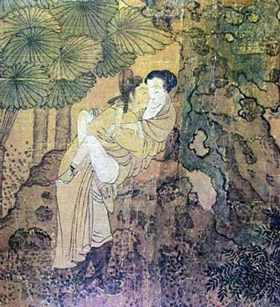
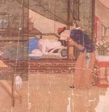

# 第七十一期：房中术

**词条简介：** 房中术又名房术、房中、房内、房室养生、黄赤之术或男女合气之术，今人称之为性中医学，房中属于性行为学和性医学的范畴。“房中”一词，最早见于《前汉书·艺文志》，列举《容成阴道》，《天一阴道》，《黄帝三王养阴方》等房中八家，“房中者性情之极，至道之际，是以圣王制外乐以禁内情，而为之节文……乐而有节，则和平寿考。及迷者弗顾，以生疾而陨性命”[1]。  **目录：** **1、****房中术简史** **2、****房中术文献列表** **3、****房中术的意义** **4、****房中术的局限性** **5、****参考文献** **6、****推荐阅读**  ** ** **1****、房中术简史[2]** ** **

**1.1 ****春秋战国时期**

跟老子同时的有关尹喜，著有《文始真经》九卷，刘向《别录》称之为《关令子》，《汉书·艺文志》称之为《关尹子》。关尹喜曾为关令，老子西行过函谷关，关尹喜请他作《道德经》五千言而去。随后作《文始真经》阐扬老子之道，并倡阴阳栽接论和龙虎金丹论，为后世房中养生家阴阳双修之理论根源，故道教文始派尊之为始祖，奉《文始真经》为教经。刘向、葛洪对《文始真经》皆有高度评价。

战国中期，有人在手杖的把头上套了一个玉制的装饰品，玉为青色，有灰黑色晕斑，为十二面棱柱体，高5．2厘米，长3．4厘米，未穿顶，顶部为圆形平面，棱之一面下部有一孔与内腹相通，棱面刨光，每面自上而下阴刻篆文三字，有重文符号九，合计四十五字，首二字为“行气 ”，故今定名为《玉饰杖把行气铭》:“行气 :吞则搐，搐则伸。伸则下，下则定。定则固，固则明。明则长，长则复。复则天。天其本在上，地其本在下。逆则死”。这是我国现存最早的专论房中术的历史遗物，是一篇极有价值的房事交合术的韵文。玉石是远古男根的崇拜物，玉器柱状，是男根的象征。文中讲了房事动作、交合快感、男女的体位及弱入强出、固精不泄的方法。是一篇极有价值的房事气功的手头铭。

把它译成今语:男女交合之时，男子先深吸一口气，随即将玉茎抽出，抽出以后就又立即伸进，如此一抽一送，反反复复。玉茎伸进，就将所吞之气下沉，用意念送至伸进之玉茎上；所吞之气下送至玉茎就默念不移，意守丹田；意守丹田之后就固守精关，抱持不泄；男子固守精关之后，就会神光出眦，眼中出现一种奇异的光明。男子眼中出现奇异的光明之后，就行胎息功，气息微微悠悠，绵长不绝。男子行胎息功后就将绵长不绝的胎息之气反复运至全身，周而复始。男子行胎息功后就能炼精化气，遂将此真气运至头脑泥丸宫而还精补脑了。

** **

**1.2 ****秦汉之际**

秦汉之际是指战国末期至西汉立国之前这段时期。此时期道家学派发展成为黄老学派，即道学家们假托黄帝立言，对老子学说加以改造和发展，并综合先秦各家学说的重要内容而形成的一种新道学的理论体系。这一学派颇重医药、养生和人体生命学的研究，于房中学的研究尤有建树，其主要著作有《马王堆房中医书》、《黄帝内经》、《黄帝外经》等。这一时期中国房中学的研究有以下特点：（1)房中学的研究已经成为中国养生学的重要组成部分。由于黄老学派的不断努力，中国医药学已有高度发展，《黄帝内经》的问世标志着中医理论的基本形成，对于房事中的七损八益问题已有专门论述，1973年出土的15种医书中有五种房中医书，即《十问》、《合阴阳》、《天下至道谈》、《养生方》、《杂疗方》，其中涉及到药补、食补、治疗阳痿、女阴冷等症。(2)房中术的内容更加丰富，有性前戏、性交中有十动、十修、十势、八动，且有仿生学的运用。(3)麦齿、琴弦等名词的出现，说明已有解剖学知识;四至、无征、五欲等问题的提出已涉及性生理、性心理等方面的知识。

**三、两汉时期**

西汉刘向《列女传》中提及《素女经》五卷，但《汉志》不载，至六朝时复见于葛洪《抱朴子·遐览》，不过已非西汉刘向所撰原书，因其中杂出了《玄女经》、《玉房秘诀》、《玉房指要》，显然原书已经失传，后人将这几本书的残卷汇合在一起，冠以《素女经》之名。《素女经》是房中术专著，可看做中国古代房中术发展到成熟时期的代表作，故对后世影响甚大。从性前戏到四至、五征、五欲、九气、九法、十动，以至七损八益、房中节度、养生除疾等一系列问题，此书对后世影响极大，中外学子无有不知《素女经》者。东汉时房中学著作甚多，《汉书 ·艺文志》录有房中著作八家，只是都荡然无存了，唯从《马王堆房中医书》中可约略知其内容。东汉末年张道陵创天师道，行男女双修之功，虽为房中术增加了新的内容，但有人斥之为秽污不堪。

**1.3 ****魏晋六朝时期**

东汉以后佛教传入中国，在汉武帝“罢黜百家，独尊儒术”的国策下而转入地下的黄老学派，此时祭起老子的旗号，以《老子》为教经，成立了中国自己的宗教——道教。道教的兴起，使中国房中学的研究走向了全面发展的辉煌时期，《素女经》(并《玄女经》)、《玉房秘诀》附《玉房指要》这些房中著作在社会上广泛流行，著名道教医学家葛洪、陶弘景等都有专门的论述，葛洪《抱朴子》有《至理》、《微旨》、《极言》、《释滞》等篇是专论房中的，他还撰有《玉房秘术》一卷。陶弘景有《养性延命录》、《御女损益篇》等房中学专著。这些著作的中心任务是研究爱精惜液，以求延年益寿。而《黄庭经》的问世，又为后世丹经学派企求长生久视之道开启了先河。

**1.4 ****隋唐五代时期**

隋唐时期房中学著作广为开放和流传，《隋志》、新旧《唐志》都载有不少房中学著作，但新作不多，孙思邈《千金方》卷二十七有《房中补益篇》，另外还有《洞玄子》一书，也都是先前这类著作的总结。

洞玄子，姓名里贯不详，其自言曰:“至于玄女之法，传之万古，都具陈其梗概，仍未尽其机微。余每览其条，思补其阙，综习旧仪，纂此新经。”故可知此书是综合古代房中著作，补阙阐微的，其内容出入于《隋志》、《唐志》所载《素女经》、《玉房秘诀》之间，语言多似六朝人绮语，则可知为唐人之作。书中运用阴阳五行之理，论述房中养生之道，详拟仿生动作，曲尽房中气功导引之事，旨在保寿康宁，养性延龄，这方面的内容胜过了古代其他房中书。

五代末，著名道士、哲学家陈抟老祖 (?－989年)在华山山洞里留下一部《陈希夷房术玄机中萃》，直到明代才被坎宫道人任东明从守洞道士手中抄得，更名为《房术奇书》。这是一部专供贵族士大夫淫乐女色并企求延年益寿的房中术专著。全书共分八节:(1)筑基 :指修炼闭精不泄的功夫，能与女子长久性交。(2)铸剑:指修炼使玉茎坚挺的功夫。(3)调神 :指选用十六七岁之美貌健康之少女，取以人补人、以气补气之法，以调神接命。(4)聚财:指购买五金石之药、家具摆设、购买年轻貌美之女子、柴米美食、建造修练丹室及香帛等物所需的资财。(5)结女:指结识的女子要志同道合，情意相投。(6)择地:指选择有甘泉美陵的环境建造双修的丹室。(7)择鼎:指选择眉目清秀、唇红齿白、身全体健情投意合之处女。(8)其他:收录了五十五首采战春方。

此书堪为贵族上流社会的荒淫腐败提供了妙方。

**1.5 ****宋元时期**

宋元时期的房中学以丹道学派为主流，修炼闭精不泄，还精补脑，采阴补阳，阴阳互补的长生久视之道。其主要著作有李简易的《玉溪子丹房语录》、张伯端的《悟真篇》，元代陈子虚、薛道光、陆也子所作《紫阳真人悟真篇三注》，以及宋代紫团道人编撰的《紫团丹经》等。

 **1.6 ****明清时期**

道教丹鼎学派到明代有张三丰的《无根树词》、《三丰丹诀》、孙汝忠的《金丹真传》等，提倡阴阳双修，闭精不泄，返精还脑。流传在民间的房中术著作有朱全的《房中炼己捷要》、洪基《摄生总要·房术奇书》、邓希贤《既济真经》、《修真演义》、浣香主人的《紫闺秘书》及集辑前人著作而成的《素女妙论》等。

 **2****、房中术文献列表** ** **

由于多方禁毁，中国古代房中术文献经典多已在本土失传，叶德辉发现日本古代医书《医心方》辑录了部分中国古代房中术经典，辑录为《双梅影暗丛书》在中国出版，才使今日后人得以一窥房中术之玄妙。

古代著名的房中术著作（依字数排列）：

两字：《十问》、《七发》、《论衡》（记载于【气寿篇】、【命义篇】）

三字：《合阴阳》、《玄女经》、《洞玄子》、《抱朴子》（记载于【至理】）、《素女方》、《素女经》、《养生方》、《杂疗方》、《黄庭经》

四字：《遵生八笺》（记载于【延年却病篇】）、《房中补益》、《玉房指要》、《玉房秘诀》、《记济真经》、《素女妙论》、《妇人良方》、《黄帝内经》、《医方类聚》、《类修要诀》、《养生四要》、《修真演义》、《房中切度》、《房术奇书》、《房术玄机》、《容成阴道》（遗失）

五字：《天下至道谈》、《黄帝内景经》、《黄帝外景经》、《御女损益篇》

六字：《延寿第一绅言》、《双梅影暗丛书》（叶德辉辑录）

七字：《三元延寿参赞书》

九字：《天地阴阳交欢大乐赋》

 **3****、房中术的意义** ** **

房中术作为人类“文化进化”的一部分，在其形成和发展过程中，深受古代代哲学和文化思想的影响。同时，作为性哲学的一部分，对世世代代中国人的性观念有着根深蒂固的影响。

 **4、****房中术的局限性** ** **

由于历史、时代的局限，房中术作为一门方术，也难免被披上一层神秘的色彩，更由于传统世俗、儒学伦理道德及到家的轻轨戒律的束缚，使“房中”这个在古代本来十分常用的字眼，或被宗教套上一层神秘的外衣，或被“正人君子”之流蔑视、误解和抨击，无论做儒学学问、搞政治，研究养生的人，都讳言“房中”二字，似乎“房中”就是荒淫不正经，就是淫秽。这种讳莫如深、避之如蝎的做法，使有关房中术的资料长期湮灭在古代典籍之中，甚至产生出种种误解，致使这一领域至今还极为封闭，雾里看花，一般人难以了解房中术的真面目，更远远说不上被现代人正确认识和利用。包括当今一些养生大家也很少在公众场合介绍性的保健养生方面的知识。****

 **5****、参考文献：** [1].汉班固《前汉书》卷三十 《艺文志》350页.中华书局,2007,ISBN:987-7-101-05703-4. [2].中国性科学,2012年8月第21卷第8期.The Chinese Journal of Human Sexuality August，2012 Vol.21.  **6、****推荐阅读：** [1][揭秘古代房中术：男子如何“夜御十女”](http://cul.cn.yahoo.com/ypen/20120111/808846.html).雅虎文化． 

（助理：张涛 编辑：朱燚 责编：戴青）

[【床笫之私】<七星说法>第九十四期：橘色边界](/archives/40854)

[【床笫之私】<七星视点>第四十五期：阳光下的桔色成人——性文化与成人用品市场的前世今生](/archives/40835)
