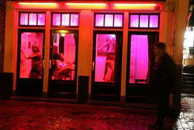

# 第四十五期：阳光下的桔色成人——性文化与成人用品市场的前世今生

### 成人用品市场现状

桔色成人是国内一家以“阳光时尚”运营理念著称的成人用品连锁店，自2006年开设第一家实体店至今，已经在全国开设850家分店，遍布大江南北，并正以每月新增20多家的速度发展。

桔色成人为什么能够成功？我们首先从中国传统的性文化说起。“谈性色变”，性文化在[中国](http://www.chinaiiss.com/military/view/18-43)文化里是禁区。自有书籍以来，禁书便应运而生，其中因涉“性”被禁的书不在少数，有的位列中国十大禁书。《金瓶梅》、《剪灯新话》、《国色天香》等明清小说遭禁，原因众多，比如秽语过多、格调低下、扭曲情欲、展示各种偷香窃玉手段等。在影视方面，谈性说爱的电影一直是审查重点。近些年来，不乏因涉“性”被广电总局或禁映、或删节的电影。比如《色戒》、《断背山》、《苹果》等等。自1978年"性解冻"至今，国人对性仍闪避。公开谈性不受待见，性博物馆月均访问量仅十几人；只有文艺冠名方敢大方，性文化节观众爆棚。好奇又害羞。这些都反映了中国人对性纠结的态度。

中国[性用品](http://www.chinabgao.com/k/xingyongpin.html)市场发展经历了许多波折。伴随着性用品市场的快速发展，在终端[零售商](http://www.chinabgao.com/k/lingshoushang.html)和[消费者](http://www.chinabgao.com/k/xiaofeizhe.html)都发生了许多的转变。近年来，成人用品商店如雨后春笋般出现，但这些传统的成人用品店都表现出各种不规范的经营。纵观这些成人用品店，主要存在以下几方面的经营方面的混乱。

乱象之一：口服产品过多，包装煽情，对人体隐患大。

乱象之二：无证产品来路不明。

乱象之三：一证多营真假难辩。很多成人用品店既经营性用品，又经营其他商品，比如零食、冷饮等等。营业执照上营业范围却是食品。有的则干脆没有营业执照。

而桔色成人恰恰克服了以上经营上的不规范。桔色的经营心得，核心在于“用规范的手法操作本不规范的行业”。

首先，桔色成人对加盟商的筛选十分严格，加盟商必须认同其经营理念。其中一个重要的理念是明令禁止出售口服产品，这样就彻底杜绝了成人用品中口服药物可能对人体造成的危害。

其次，是关于桔色成人的店面装修。桔色成人的店面装修，无论面积多大，一定要带大门头，写上桔色网的网址。穿着情趣内衣的模特摆在橱窗，从外面看，就像便利店一样灯火通明。这样就会给消费者强烈的安全感。

此外，成人用品行业的显著特色是：消费者认同的商品品牌很少，全球范围内，只有NMC、Polylion、CEN、Docjohnson等几个品牌。而成人用品多接触于人体的脆弱、隐私的部位，对其卫生性、安全性有极高的要求。桔色是众多一线知名品牌的中国区顶级代理，桔色拥有中国最健康的连锁体系，全球知名品牌大多已经与桔色达成紧密合作。

### 理念的转变

此外，桔色成人把“暧昧生意”做成“时尚生意”的经营理念也是很成功。

愉悦的性爱有助于身心健康，提高工作效率；和谐的性生活有利于情侣感情的稳定，有利于缓解情侣双方的压力。女性应当拥有和谐健康愉悦的性生活，主动去了解有关性爱的知识，看爱情动作片，与自己的伴侣探讨性爱的技术性问题。男人都喜欢“厅上淑女，床上淫娃”。“荡妇”是一个有吸引力的词，可能是因为它够女人，身体里有更多的女人。

古语有云“女人三十如狼，四十如虎”。这是一个只符合古时境况的观念。古代人刚结婚时女性会比较羞涩，等生育以后就放开了。其实事实是年轻人的性需求、体力、精力才是最佳的。笔者虽然属于外表时尚思想保守的人，但不支持禁欲主义，大好的青春时光就该用来释放体内荷尔蒙，总比上了年纪后力不从心要好太多。

对于性这种话题，“越开放，就越自然、越正常、越健康”，笔者游历欧洲各国对此深有感触。去荷兰阿姆斯特丹，此城以“性都”著称，有著名的红灯区，性博物馆。红灯区的建筑风格是两层或者三层的小楼，大大的落地窗，跟商场橱窗一样，里面会布置一张粉红气息的小床，各种芭比一样的美女穿着夜间可以发光的比基尼，在窗口走来走去，做着各种性感撩人的姿势，向游人示意，尤其是人群中的年轻帅哥示意。本人就没有如此待遇了，因为是个女人嘛。不过当我走过那条街道的时候，有年轻帅哥向我说中文“你好”，据说红灯区也有专门向女性提供服务的公司。当然变性人、以及为同性恋提供的各种伪娘也是有的。

除此以外还有一排排的、各种各样的琳琅满目的性用品店，店面是穿着情趣内衣的女模，或者是各种形状男性的生殖器模具，又或者是各种各样的避孕套，有一家店展示的避孕套居然有上百种，各种颜色各种型号。两两三三的顾客很自然的走进去买各种用品。除了各种各样的性用品以外，还有各种各样的性录影带。除了常规的情趣内衣啦、避孕套啦、情趣按摩棒啦、各种润滑油，还有满足顾客特殊喜好的，比如SM用具什么的。

跟朋友谈起，我们一致认为荷兰的性犯罪率绝对很低，因为开放，所以破除了性的神秘感，性爱以一种健康、正常的方式呈现给人们，自然没有人再去犯罪。

去海滩的时候也一样，欧洲的海滩上有好多女女都半裸，根本没人去注意，因为很习惯、很正常。倒是我们某些在国内比较压抑的国人会专门去看哟。

所以一个社会愈是开放、对待性的态度就愈是健康，自然，正确。而一个阳光下的运营的成人用品店不仅提高了自身的销售业绩，也为社会风气的健康产生了有利影响。

（编辑：姚丽婷；责编：刘迎）

 [【床第之私】<七星说法>第九十四期：橘色边界](/archives/40854)

[【床笫之私】<七星百科>第七十一期：房中术](/archives/40978)
