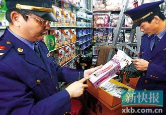
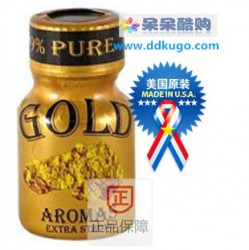

# 第九十四期：橘色边界

人们常常用黄色表示淫秽，红色表示警示。成人用品作为观之羞涩听之神往的物品，无形中被套上了橘色的外衣。正如它的属性一样，模棱两可若即若离若隐若现，退一步砒霜进一步蜜糖。

今儿，咱说法就和您聊聊成人用品的弯弯道道。

## **1.淫秽物品和成人用品的区别**

淫秽物品和成人用品在很多普通老百姓的心目中差不了多少，但实际上这两者的概念还是有较大的区别。

淫秽物品在刑法中的禁止性体现主要是《刑法》第九节的内容上，以制作、贩卖、传播淫秽物品罪为类型化罪名，其中淫秽物品多指具体描绘性行为或者露骨宣扬色情的诲淫性的书刊、影片、录像带、图片以及其他淫秽物品。

但是有关生理和医学知识的科学著作不包含在内。

虽包含有色情内容，但是有艺术价值的文学、艺术作品不视为淫秽物品。

举这么个例子好了，小泽老师和苍井空老师演的步兵骑兵片儿属于淫秽物品，而李安同志拍摄的《色戒》属于虽有色情内容，但是又有艺术价值的文学作品。

至于咱们所说的成人用品，则分为三类，分别是计生用品，性保健用品，器械类情趣用品。这三类都属于正常贩卖的商品，与淫秽物品并不具有直接关联。比如安全套，壮阳药，按摩棒等，只要是按照相关商品规定生产销售，就是在法律允许的范围内。

### **2.成人用品交易现状及管理**

根据我国成人用品交易数量统计可得知，我国成人用品的年销售金额已经达到了500亿元人民币，并且保持着每年百分之二十的增长幅度。 那么面对如此与日俱增的迅猛需求，成人用品市场当然是要多多生产，多多牟利的。然而我们的市场监管是否能够跟得上步伐呢？

据某成人用品店老板介绍，开一间性用品店手续很简单，只要有工商执照，国税、地税手续齐全就行了。在他经营的二三年里，除了计生部门间接过问外，没遇监管部门查过。在他的售货柜里赫然摆着国家明令禁止销售的“苍蝇粉”。店主辩称，被禁售的“苍蝇粉”是药品，而这个是食品。只要把这类产品当做食品卖，就不必再去办另外的营业执照了。

除了实体店之外，网上店铺由于其快捷方便及隐私保护性，获得了更多青睐。然而由于国家对成人用品法规的缺失，只要网店办理好公司工商证件，取得销售资格，就可以销售绝大部分成人用品了。

无论是实体店还是网络店，其所销售的性用品质量大多参差不齐，比如武昌火车站附近一成人用品店，该店女老板被问及产品质量时，这名女老板毫不掩饰地说：“很多是‘三无’产品，厂址、电话都没有，更谈不上什么检验证明了。即使有的产品注明了产地和厂址，但也都是商家胡乱写上的，电话和地址很多都对不上。”

她表示很多药商自己弄配方，因为迷幻药都能起到催情作用，很多人买回去只图一次作用，基本上没有回头客，都是做一次性生意。

然而就是面对产品质量毫无保证的混乱情况，消费者的投诉仍然几乎为零。

因为大多数消费者认为，对此类似成人性用品的使用属于个人隐私，就算买到的性用品是伪劣产品，也不好意思真刀真枪的和店家对簿公堂。许多商家正是抓住消费者这一心理，以次充好，牟取暴利。

而在少数的消费者投诉情况下，问题也没能得到解决。对于成人用品用品的管理，国家一直没有明确归口管理部门，所以尽管有消费者举报或者投诉，仍然不好处理。实际上，成人用品目前面临着“大家一起管，大家都不管”的尴尬现状。成人用品表面上是由卫生、药品监督、计生、工商管理部门负责其资质审核与经营行为的监察。然而国家相关规定却并没有就具体职权进行划分，比如卫生部门负责对食品保健品的相关执法，成人用品中很多产品属于药品范围，就已经脱离了其执法范围。

所谓成人用品并不是一个明确的分类概念，其包括范围很广，涉及到食品、化妆品、消毒产品等多种类型产品，有些产品无明确归类，同时注册形式也多样。

在我们所能想到的，有可能对成人用品进行监管的几个部门中。

卫生部没有审批成人用品的权力，卫生厅则只能审批消毒产品。

对食品药品监督局而言，药品归药监部门审批和管理。但药品又和成人产品中的保健品具有很大的差异，许多省份没有审批过性药，药健字号的审批权也在药监局，但对于市面上所流传的各种保健品均未审核通过。

而工商只查广告违法。如果性保健品制造商将产品作为药品宣传，就属于违法广告，工商部门一旦发现将予以查处。如果对性保健品盲目夸大疗效，出现超出说明书功效的承诺，大量失当的“改善性功能、提高免疫力”等说法，都将严厉查处。若药品商、广告包装人、广告发布人三方责任属实，都将依法进行处理。

因此，我们所能给出的建议是：

首先应组织一支由性科学、社会学、医学、婚姻学、法律学等学科的专家组成的队伍，就成人用品用品内容、功能、适应范畴等制定细则，并将有关内容纳入国家相应法规中，科学界定正常人使用的成人用品与色情物品的界限。

其次设立统一的行业质量标准及检测标准，对产品各环节进行严格把关。

同时，净化广告宣传，规范性用品广告，以避免不良诱导，从而使性用品的生产经营逐步向正规方向发展。

最后以卫生部门为主，工商和药监局为辅，对相关成人用品进行监管。

### **3.成人用品与“我们”？**

作为已经拥有性伴侣或者即将拥有性伴侣的小伙伴儿们，如何正确的对待成人用品就是一个很值得关注的问题了。

首先，谨慎在网店购买进口药品。（如口服类，外用类）绝大多数标榜国外原装的药物类，都未经过我国严格审批和药品检验，使用后的结果无法得到保证，甚至还可能造成身体的危害。曾经在国内出现过这么一个案例，某地消费者使用了网店购买的据说具有持久能力的药水后，出现了头晕目眩下体肿痛的现象，后经医院检查，确定是由口服药水引起，而该药水经过化验并无任何有益作用。因此针对此类型内服或外用的成人产品，作为消费者，尤为重要。

其次，对于设备型成人用品，在购买前验证其安全性能。所谓的设备型成人用品，多是指充气娃娃，按摩棒等一系列电动式样工具，其本身与用户肉体接触，所以安全性能尤为重要。在2012年已经发生多起成人用品漏电或者设备机能不完备导致用户伤害的案件。欢愉事小，但是无后为大，为了自己“小兄弟”的安全，还是应当认认真真挑选。

最后，万一出现事故，保存好网店或实体店购买记录，以进行维权之用。

孔老夫子说食色性也，面对成人用品，也祝大家“吃”的放心，“玩”的开心。

（编辑： 戴正阳；责编：林骥）

[【床第之私】<七星视点>第四十五期：阳光下的桔色成人——性文化与成人用品市场的前世今生](/archives/40835)

[【床笫之私】<七星百科>第七十一期：房中术](/archives/40978)
