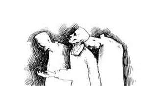
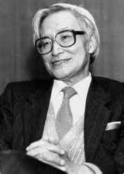

# 东西方政治思想史研究的同调变革——以“斯金纳革命”与“新儒家学派”为核心

该文发表于复旦大学日本研究中心编《日本研究集刊》2013年上半年刊

20世纪初，鲁宾·科林伍德（Robin George Collingwood）的理论开启了“历史·哲学”的研究范式，并将政治哲学纳入到了历史研究的范畴之中。20世纪40年代，丸山真男在日本开创了政治思想史这门学科。然而，20世纪50年代中叶伊始，历史学者彼得·拉斯莱特（Peter Laslett）与波考克（J·G.·A·Pocock）在继承科林伍德的基础上，将“语境”、“辩论”、“概念”等重要论点引入到“历史的”政治思想研究中，昆廷·斯金纳（Quentin Skinner）采两者之长并加以系统化，形成了独特的“概念史”研究范式。60年代以降，在日本，尾藤正英、源了圆等学者则从历史的维度出发对江户思想进行“再解读”，并在很大程度上推翻了丸山诸多“经典”论断，形成了所谓“新儒家学派。”

概言之，20世纪60-80年代，东西方历史学界产生了一场针对政治哲学的“同步变革”，以史学史的形式对这一过程重新梳理并加以反思，或许可以在方法论层面上给予我们启示。

一、概念、语境、辩论——西方历史学对政治哲学的再解读

林伍德是西方首先在方法论层面上讨论政治哲学与史学关系的史学家，从某种程度上说，科林伍德可谓是历史人与哲学人的结合体（他是考古学家）。他指出“在20世纪，哲学的主要工作就是认真看待20世纪之历史。”[1]而科林伍德历史•哲学研究范式的关键点在于一种问题逻辑——“某某人想要把这一命题作为什么问题之答案？”[2]。所以对于科林伍德来说，“政治理论的历史并不是将不同答案给予同一问题之历史，而是一个问题本身不断变动、答案随问题不断变化之历史”[3]。就此，科林伍德提出了将历史语境作为文本理解基础的观点，他强调在使用相同概念的时候，语境可以作为理解差异的条件。[4]

而拉斯莱特与波考克则进一步继承并发展了科林伍德的这一观点。1956年，来自剑桥的历史学家彼得•拉斯莱特编辑了《哲学、政治和社会》系列丛书第1卷，在《导言》之中他提出了著名的论断——“目前，政治哲学已然终结”[5]：

“在我们国家思想生活中有这样一种假定：吾等之中当有名曰‘政治哲学家’之人存在。哲学家本身是对哲学敏感之人他们尽可能在宽广、概括的层次上关注政治与社会之关系…在吾等三百年之历史中，可用英语写作的人物层出不穷从17至20世纪，从霍布斯到鲍桑葵，然今日，吾等似乎不再拥有他们了。”[6]

实际上，50年代早期开始的、以列奥•施特劳斯（Leo Strauss）、艾里克•沃格林（Eric Voegelin）等为代表的诸多政治哲学家的名著的问世已经显示了政治哲学的复兴。而拉斯莱特的解读，从某种程度上带有一种历史学家式的意味在其中，“实际情况可能依然是，吾等没有政治哲学之原因在于政治学已然太过严肃，以至于未给哲学家再留有余地。”[7]但是拉斯莱特也认识到了“在这些微弱的信号里，或有人希望建立一种复兴传统政治哲学的基础。”[8]其后，在《哲学、政治和社会》系列丛书第2卷的《导言》中，拉斯莱特与鲁西曼（W•G•Runciman）承认“（现在）对政治理论…出现了新兴趣的征兆。”[9]而在第3卷中，他则认为政治哲学的复兴已是不可争议之事实矣。[10]

由此我们不难看出，拉斯莱特并非否定政治哲学或曰政治哲学复兴之意义，而是不满于那些“政治哲学者”的研究模式。基于此，他试图通过对洛克的研究建立出历史学领域内对政治学者（或曰政治思想）进行研究的“新范式”，他在编辑1960年版本洛克《政府论》的《导言》中指出：

“在历史书籍与政治理论的著作里，洛克针对英国革命之论述依然是显示政治事件与政治思想相互作用的最高典范——这个信念太过根深蒂固且有效——但是事实完全不是这样的。”[11]

拉斯莱特反对以往洛克解读并采取的方法是：将《政府论》最主要部分的写作定位于菲尔默出版《父权论》以及对1680-1683年“排斥法案”危机的反击，这样一来，“《政府论》实为对革命到来之呼唤，而非为革命将至进行理性辩护。”[12]于是乎，拉斯莱特得出结论，将《政府论》作为政治哲学著作是错误的：

“就吾等讨论之维度而言，《政府论》作为对当时政治文化氛围之回应，源于1679-1680年秋冬之际，比传统认定之著书时间早了整整十年。其乃是一篇关于‘排斥法案’之檄文（exclusion tract），而非一本革命小册子。”[13]

拉斯莱特的这段论述中包含了这样一种倾向——“历史”应当介入政治学文本，并做出与哲学家不同的解读：

吾等之首要任务必是作为一个谦卑的、历史学家的工作，建立洛克自己想要的、原本含义的文本，并将其置于历史语境中——洛克自身之语境，然后去展示其自己所思、所写与产生了历史影响的洛克之间的微妙联系。”[14]

这种把历史语境作为文本理解基础的观点来源于科林伍德，但是，拉斯莱特明显在其基础上又向前走了一步，而他将《政府论》作为介入洛克时代语境的文本，其目的在于通过这种研究方式对同时代的英国哲学家轻视“纯粹历史学家”的言论进行辩驳。

拉斯莱特与波考克有着深厚的合作与友谊，后者曾经在拉斯莱特主编《哲学、政治和社会》丛书第2卷发表了关于政治思想史研究方法论的文章，拉斯莱特颇为欣赏其“不同思想家是在不同抽象思维水平中进行思考”的论点。[15] 不过，与拉斯莱特不同的是，波考克将政治思想理解为一种论辩，就此，波考克指出了作为特殊门类的——即“智识化传统”的——政治思想史在研究过程中所固有的“二元主义”：

政治思想可以被认为是社会行为的一方面，是人们对彼此及社会制度的行为方式——或者被认为是‘智识’（intellectuality）之一方面，人们试图获得对自己经验和环境的理解。”[16]

考克强调之处在于政治思想与政治活动的统一，思想史研究必须“追问它的抽象的理论与实际经验到的实践是否吻合。”[17]与此同时，波考克在讨论政治思想与行动之关系时引入了对于政治语言的研究，要“把政治思想定义为政治讨论的语言。”[18]

集拉斯莱特与波考克之大成的昆廷•斯金纳[19]在两者的基础上提出了完整的“历史的”政治思想研究模式，即“斯金纳概念史研究”范式。1959年，昆廷•斯金纳通过牛津和剑桥联合入学考试，进入剑桥大学康威尔和凯鲁斯学院并获奖学金。[20]而斯金纳在大学最喜欢的著作之一便是波考克的剑桥大学博士论文《古代宪制与封建法》（1957年出版）。[21]与此同时，昆廷•斯金纳的导师约翰•邓恩（John Dunn）向他推荐了拉斯莱特版的《政府论》，这对其日后的研究产生了决定性的影响。[22]后来，斯金纳将拉斯莱特式的思想史诠释方法应用到了对霍布斯的解读之中：

“我已深受其著基础研究方法论影响，认为它乃是先验的、能够运用到霍布斯研究之中，并准备尝试这种研究。”[23]

1961年，斯金纳发表了自己的学术处女作，描绘了一位1790-1815年期间参政并长期担任下议院议员的、来自贝德福德的政客。这篇论文引起了学界的广泛注意，而斯金纳后来指出，时他的兴趣点在于“把已经尘封的历史宝藏再度发掘”[24]，“（《怀特布雷德文集》）向吾等展示了作者对于简•奥斯汀时代的英格兰生活那难以猜透又令人沉醉的研究。”[25] 利用怀特布雷德家族档案，斯金纳写作了一篇关于约翰•布雅恩的论文并在其中展开了其日后研究的主题之一——对于“自由”概念的辩论：

“吾等难以确定其为何方战斗，麦考莱相信其必为自由而战，意为其立于国会一边；弗朗德虽亦相信其为自由而战斗，但是相信为自由而战促使其成为了保皇派。”[26]

1962年6月，斯金纳获学士学位，他选择了霍布斯作为研究方向。1964年，他发表了《霍布斯的<利维坦>》，在这篇书评性质的文章中，斯金纳针对胡德（F•C•Hood）以及麦克夫森（C•B•Macpherson）展开了批判：

“研究沿着文本的自身含义的方向展开，当‘教义’阐释清晰后，研究便结束了；研究并不完全要考虑霍布斯著作与同时代其他政治著作之思想联系。”[27]

而在批判胡德的过程中，斯金纳将“历史”用于政治理论的规范化论证中：

“假设政治理论研究要成为合理的历史研究，其必要把政治理论解释为社会活动，这些活动在特定的时代、在多种互相关联之抽象层次上进行……增加一个历史维度即增加评价文本的任何相关资料。就《利维坦》而言，忽视此定位的恶果就是那些就历史学而言荒谬的结论会招揽大量信众。”[28]

1966年，在《霍布斯政治思想的意识形态语境》中，斯金纳完成了科林伍德的论述——即哲学与历史的二重维度：

“本项研究意图强调历史学家与哲学家活动之间的关联，而这通常是被否认或者忽视的。理清一组文本之意识形态语境以及建构出围绕在文本间的、适当思想环境之框架，是本项研究之尝试，此即意味着这样一种缺少经典文本本身的框架可以为哲学家以某种方式加以接受，历史地看来这些方式完全是荒谬的。研究之目的在乎显示，历史学者理解舆论背景之任务不可与哲学家解读文本之努力分割，且历史学家亦必须指出：即便是哲学家看来最可靠的解释亦需要历史的经验来验证，甚至可能被抛弃。”[29]

在这里，斯金纳再次强调了哲学研究与历史研究在政治思想史研究中的统一，要通过语境、争论、概念对政治思想家及其文本加以解读。1974年，在《政治思想行动分析中的问题》一文中，斯金纳继续了“严格的历史学方法对于研究政治思想史的巨大价值。”[30]1988年，斯金纳提出“事关社会及政治思想的纯粹历史研究将会被证实更加正确。”[31]可以说，昆廷•斯金纳研究的核心问题即“我们对历史的需要究竟达到了何种程度。”[32]

综上所述，拉斯莱特、考波克与斯金纳的政治思想史研究的强调点在于，对政治思想文本的解读过程中不能只限于纯粹“理论的”、“形而上”的哲学式研究，而要从历史学出发，关注文本所处的修辞背景（即历史、概念、辩论、修辞），探究文本作者其政治思想与其实际历史活动的关联。

二、宋学、徂徕学与国学——日本历史学对政治哲学的再解读

与拥有漫长的政治思想史研究传统的西方不同，在日本，“政治思想史作为一门学科出现，始于1940年，由丸山真男先生开山，奠定了这门新学问。”[33]而藤田省三便将大冢久雄的西方经济史、丸山真男的日本政治思想史与川岛武宜的法社会学并列为战后日本思想界的先驱。[34]故这里首先要对丸山创立政治思想史学科的过程进行简要回顾。[35]

“丸山真男于大正三年（1914年）3月22日出生于大阪府，其父亲幹治，笔名侃堂，是一个刚毅的记者。”[36]青年丸山所处的大正民主时代，是日本历史上的一个重要时期——“大正时代的政治思潮源于明治时代，延续至昭和时代”[37]——“战后日本民主主义的发酵，其直接源于大正德谟克拉西的思想遗产。”[38]丸山在日本政治思想史方面所取得的巨大成就，与在这种时代背景下形成的深厚西方政治哲学素养密不可分：

“我在高中时，可谓是文学青年、哲学青年…所读的书，主要是新康德主义的文德尔斑、李凯尔特的。”[39]

1934年4月，丸山真男进入东京帝国大学法学部政治学科学习……1937年4月，丸山留校任法学部的助教，在指导教师南原繁的劝导下专攻日本政治思想史。”[40]这期间，“时值中日战争激化，右翼与军部势力抬头……丸山改变了原先对资本主义性质的蔑视，重新审视起基本人权的理念。”[41]基于此，丸山从荻生徂徕（德川时代）与福泽谕吉（明治时代）的思想入手开始了自己的政治思想史研究生涯，其中在德川思想方面取得的成就集中体现在《日本政治思想史》研究一书中。“构成这部书（《日本政治思想史研究》）之三章，原来均为独立之论文，分别发表于1940至1944年之间《国家学会杂志》上。”[42]

可以说，这部著作乃是日本政治思想史学科创立的标志——或者说，这部著作代表了日本政治思想史研究的最初“范式”。在全书第一章《近世儒学发展中徂徕学的特质及其与国学之关联》与第二章《近世日本政治思想中的自然与作为》，丸山以荻生徂徕“制作”的理论特质出发，展开系统论述，他指出：

“无论是朱子学还是徂徕学，它们在绝对认同封建统治这一点上并无太多差异。然而，两种绝对认同在逻辑上却刚好呈现出‘对立’，并表现为‘中世的社会=国家制度观与近代市民之社会=国家制度观’之间相互对立这一世界史课题。”[43]

难看出，丸山的关注点在于“逻辑的”哲学演绎而非历史的归纳，在此基础上，丸山将日本近世思想的发展历程做出了如下概括：

通过儒教内部的发展，其思想‘自解体’，进而从内部萌生出了完全异质的要素。”[44]

于是乎，“儒学（宋学）—徂徕学—国学”成为了丸山对德川政治思想史的高度概括，但这与历史发展本身似乎并不相符：

“丸山的观点无法解释近世后期，即18世纪以后的儒学，尤其是朱子学的普及化、官学体制化（宽政异学之禁）的历史意义……由于天明、宽政时期的日本社会的动荡和民众反叛，促使幕藩体制重新确立了朱子学作为武士和一般民众的道德规范和秩序重建的基本原理来应对当时的社会矛盾（道德学与经世论），这导致了近世日本幕藩政府武士阶层的文官化，也促进了武士和一般民众以儒学为中心的道德教化。”[45]

这段话揭示了丸山学说最致命的缺陷——在理论层面的、哲学式的论证政治思想发展的过程（逻辑）不能取代政治思想本身的发展过程（历史）——这与前文斯金纳提出的政治哲学与历史的“互依性”辩证问题（见前注29）是极其类似的。丸山真男自己也承认“这里面包含有超过纯粹学术关心的动因。”[46]

然而，20世纪60年代以降，日本史学界开始反思并批判“丸山式”德川政治思想史研究，转而进行“历史的”的梳理与分析，其中最突出的代表便是所谓“新儒家学派”，其研究从三个方面展开。第一，对江户时期儒学（宋学）的历史意义进行再界定。第二，进一步探讨徂徕学与儒学之间的关系——所谓“朱子学”与“徂徕学”之间的“正相反问题”，即徂徕学的非儒性质，并探讨徂徕思想内的近代性问题。第三，进一步探究儒学（宋学）、徂徕学与国学之间的内在联系。[47]其代表学者主要有尾藤正英、源了圆、子安宣邦等，本文主要以徂徕学研究为线索论述这些“历史学者”对“政治学家”丸山真男的批判。

东大文学部国史科出身的尾藤正英与政治学出身的丸山不同，他一开始便是彻头彻尾的历史学者，日本学士院官网对尾藤正英先生学术事业进行了如下概括：

尾藤正英先生通过将江户时代儒学家之思想与中国儒学进行比较，阐明其异质性，并通过对构成其背景的生活意识及社会观念、社会构造进行比较，探讨了日本历史固有之内在逻辑。先生对‘役人’‘役所’等中文中不存在的‘役’的概念给予关注，阐明了近世日本国家制度之特色，另外又结合古代历史形成过程第一次阐明了容易被误解的日本人宗教的性质。”[48]

从上述论述可以看出，尾藤正英的关注点在于“探讨日本历史固有的内在逻辑”，即从日本历史本身出发解读江户思想及其特质，这集中表现在对徂徕学“祖型”的探讨上：

“徂徕试图专门通过构建制度解决问题……徂徕思想的立场就中国思想谱系而言更接近于法家。因此，作为道德思想的儒学，在徂徕而言反倒流为异端。可以说，产生于徂徕门下的某种道德颓废的情绪已然成为徂徕学的必然倾向。”[49]

这种将徂徕学“祖型”向中国思想定位的“历史的”尝试，让尾藤正英把荻生徂徕思想中的“职务限定”与“机能分化”要素与近代政治学理论相通连。[50]这与丸山真男单纯从哲学逻辑的角度分析徂徕学对宋学的背离及其近代性、却未曾思考徂徕思想源头的方法是大不同的。

但是，尾藤依然没有摆脱丸山“荻生徂徕—近代”的理论构建，尽管他试图去“历史地”而非“哲学地”阐述这一图式，却还是难免论证逻辑上的“超历史”性，正如平石直昭指出的：

“（尾藤正英）所谓从组织化方面看，徂徕的近代性中已然存具适才适所、职务权限体系化等法家之思想。然而这岂不是说中国古代官僚体制之逻辑成了‘近代式’之逻辑了吗？”[51]

这种德川思想“近代性”的困扰在源了圆的研究中亦普遍存在。他曾在《德川思想小史》中写道：

“江户时代是一部‘被推迟了的近代’的历史，在其之前的安土桃山时代，日本在精神层面上已然达到了与文艺复兴前的欧洲相差无几的高度。然而，由于封建社会的重组以及幕府锁国令的颁布，德川社会开始踏上一条与欧洲不同的发展道路……德川时代的儒学，作为奠定身份制的一种伦理，着实发挥了作用，但还有一个不逊于此的重要作用，即它作为世俗社会之伦理对日本人认识层面发挥的启蒙作用……德川时代可以说是由‘封建性和近代性’这一双重性格构成之时代。而这种双重性格，在明治维新之后，依然以不同的形态在接受西方文明并独立完成近代化的明治时期长期延续。”[52]

这种既有近代性要素又非近代的结论决定了源了圆站在历史学立场对于丸山批判的不彻底性。一方面，他与尾藤正英一样继续了所谓徂徕学近代性，即“越儒教革命论”：

“（徂徕主张）‘圣人之教尽人情而已矣’，故本被视为异端之诸子百家、佛释、老庄，皆可纳入圣人教义之范畴，可以发现，其已然超越儒教之范畴。”[53]

与尾藤、源了圆的研究不同，子安宣邦的研究彻底否认了丸山通过逻辑演绎得出的徂徕具有近代性的结论，首先，他否认了丸山所谓的徂徕思想的“公私分离说”：

这一（公私相分的）说法源自于作者（《日本政治思想史研究》作者丸山）已有的近代观念，若是去掉了作者近代的、历史哲学的立场，便无法找到可以使其结论正确的任何证据了。”[54]

在此基础上，子安宣邦否定了徂徕学具有“近代特质”，即丸山的理论已经超越了“历史的”徂徕学思想本身：

“按照作者（丸山）之逻辑，与中世纪自然秩序观对立的、‘作为的’秩序观便成为了社会契约式的‘作为的’秩序观。然而，即便是有可能性，欲于徂徕理论中捕捉到社会契约的痕迹恐怕乃是不可能之事。”[55]

实际上，在以“新儒家学派”为代表的反近代主义思潮的冲击下，丸山自己也已经认识到其日本政治思想史研究模式的不足，他坦言道：

“写作这些论文（《日本政治思想史研究》中的前几章）时，在知识界，正是‘近代的超克’大行其道之时代……对于这种‘近代的超克’论及在背后支持它的全体主义思潮感到强烈不满的知识分子与研究人士都觉得有责任在各自领域内为被作为‘替罪羊’的‘近代’作出辩护。”[56]

p style="text-align: center;">于是，以《日本的思想》为肇端，丸山在20世纪60-80年代转变方法并提出了新的范式——“原型•古层”理论，限于篇幅限制，这里不加赘述。

综上所述，新儒家学派的徂徕研究表明，他们强调对德川时代的政治思想文本进行“历史的”解读，即尽可能还原儒学（宋学）、徂徕学与国学本身的历史发展线索，而不是人为地利用已有的近代理论去“形而上地”“构建”思想史。正如黑住真指出那样，“以往的思想史研究，多将徂徕学定点于可与西欧理论进行比附的位置上。然而看上去气派而一贯的说明，很多都属于与实际的思想史大相径庭的无稽之谈和虚构”。[57]

三、历史学与政治哲学的辩证——东西方史学理论的“同步变革”

从上文论述可以看出，20世纪60-80年代，东方（日本）与西方几乎同时产生了历史学与政治哲学在政治思想史范畴内的碰撞，而碰撞的结果，皆是在历史学领域内形成了全新的研究政治思想发展历程的“范式”——然而两者发生的背景（尤其是学术与社会背景）几乎是完全不同的。西方“概念史研究”是在政治思想史研究复兴、行为主义哲学大行其道的背景下产生并发展起来的，而日本“新儒家主义”则是在政治思想史研究刚刚创立并兴起不久、以“日本图示”对抗“近代（西方）主义”的时代需要中迸发的。在相同的时间、不同的空间与时代背景下，历史学在方法论上却产生了近乎相同的变革——即将政治思想的文本进行“历史的”解读——而这种方法论的研究对象又是各自国家的、完全不同的政治思想文本与思想者——这种“巧合”着实值得我们关注并研究。 与此同时，史学理论的研究应当为自身研究服务，即葛兆光先生所谓“走出汉学界”的命题：

“通常, 研究中国思想史的中国学者会比较关注国外汉学界的研究成果, 这当然无可厚非。不过, 最近研究传统中国的文史学界, 开始有了‘走出汉学界’的愿望, 有人提议, 研究传统中国的文史学界, 应当把自己的视野, 从外国专门研究中国学的领域, 扩大到其他方面,比如研究中国文学史的人, 可以与研究欧洲文学史的人互相讨论, 研究近代中国史的人, 应当和研究近代印度史的人互相磋商。同样, 研究中国思想史的人, 也应当走出欧美和日本的中国学界,与研究欧美、日本思想史的学者互相对话。道理很简单, 外国的‘中国学界’, 他们研究的中国, 是一个作为‘他者’的‘外国’, 和中国的外国文学、世界史、西方哲学史之类研究‘外国’的专业其实比较接近, 而在他们研究自己本国的历史、思想与文化的时候, 其研究的心情、思路和问题意识, 倒可能成为中国人研究中国历史、思想与文化的借鉴和资源。”[58]

这段话的深层含义在于：一个国家对于本国某个领域展开的研究，对于另一国就自身在同类型领域内展开的研究，具有方法论上的可借鉴性，但是国内西方史学理论学者与日本史学者并没有注意到彼此研究之间的关联性（或说可比较性），而上述20世纪后半叶同时发生在东西方、在各自学科领域内影响巨大却又不为对方领域所知的史学革命能否给予国内学者以方法论上的启示，方是接下来应当探究的重要命题。

（采编：彭程；责编：彭程）

注 释：

[1] Robin George Collingwood, An Autobiography, Oxford Clarendon Press, 1978, p.79.

[2] Ibid., p.39.

[3] Ibid., p.62.

[4] Ibid., p.113.

[5] Peter Laslett, “Introduction,” in Peter Laslett ed., Philosophy, Politics and Soctety, Oxford Blackwell, 1956, p.ⅶ.

[6] Ibid., p.ⅶ.

[7] Ibid., p.ⅶ.

[8] Ibid., 1956, p.ⅹ.

[9] Peter Laslett and W.G. Runciman, “Introduction,” In Peter Laslett and W.G. Runciman eds., Philosophy, Politics and Soctety, Second Series, Oxford Blackwell, 1962, p.ⅷ.

[10] Peter Laslett and W.G. Runciman, “Introduction,” In Peter Laslett and W.G. Runciman eds., Philosophy, Politics and Soctety, Third Series, Oxford Blackwell, 1968, p.1.

[11] Peter Laslett and W.G. Runciman, “Introduction.” In john Locke, Two Treatises on Government, Cambridge CUP, 1960, p.46.

[12] Ibid., p.47.

[13] Ibid., p.61.

[14] Ibid., p.4.

[15] Quentin Skinner, “On Encountering the Past: An Interview with Qnebtin Skinner by Petri Koikkalainen and Sami Syrjamaki,” Finnish Yearbook of Political Thought, Vol.6, 2002, p.48.

[16] J•G.•A•Pocock, “The History of Political Thought: a Methodological Enquiry,” In Peter Laslett and W.G. Runciman eds., Philosophy, Politics and Soctety, Second Series, Oxford Blackwell, 1962, p.185.

[17] Ibid., p.186.

[18] Ibid., p.197.

[19] 关于昆廷•斯金纳的研究综述，可参见 [芬兰]凯瑞•帕罗内：《昆廷•斯金纳思想研究》，李宏图、胡传胜译，上海：华东师范大学出版社，2005年，第193-216页。

[20] Quentin Skinner, “On Encountering the Past. An Interview with Qnebtin Skinner by Petri Koikkalainen and Sami Syrjamaki,” _Finnish Yearbook of Political Thought _Vol.6, 2002, pp.34-36.

[21] Ibid, p.42.

[22] Ibid, p.42.

[23] Quentin Skinner, “An Interview with Quentin Skinner,” _Cogito, _Vol.11, p.70

[24] Quentin Skinner, “_Liberty before Liberalism_,” Cambridge CUP, 1998, p.12.

[25] Quentin Skinner, “The Whitbread Papers from Southill,” _The House of Whitbread,_ Vol.2, No.11, 1961, p.21.

[26] Quentin Skinner, “John Bunyan,” _The House of Whitbread_, Vol.21, No.4, 1962, p.15.

>[27] Quentin Skinner, “Hobbes’ ‘Leviathan’,” _The Historical Journal,_ Vol.7, 1964, p.330.

[28] Ibid, p.333.

[29] Quentin Skinner, “The Ideological Context of Hobbes’ Political Though,” _The Historical Journal,_ Vol.9, 1964, p.317.

[30] Quentin Skinner, “Some Problems in the Analysis of Political Thought and Action,” _Political Theory, _Vol.2, 1974, p.281.

[31] Quentin Skinner, “_A Replay to My Critics,” _In_ _Janes Tully ed., _Meaning and Context_, Cambridge Polity, 1988, p.287.

[32] Quentin Skinner, “Visions of Civil Liberty,” In Janes Tully ed., _The Future of the Past_, _Big Questions in History_, London Pimlico, 2002, p.112.

[33] 松本三之介：《致中国读者》，松本三之介：《国权与民权的变奏—日本明治精神结构》，李冬军译，北京：东方出版社，2005年4月，第1页。亦参见 松本三之介：「先生の学問的姿勢について憶う」、『未来』（361）、東京：未来社、1996年10月，8-9頁。丸山于日本政治思想史学科上的开创性地位，是得到日本学界广泛地认可的，亦参见 「丸山真男氏死去——政治思想史の第一人者」、『東京新聞』1996.8.19朝刊、東京：[東京新聞社](http://rrurl.cn/uQJMpl)、1996年8月19日。

[34] 藤田省三：「社会科学者は考えた」、久野牧、鶴見俊輔、藤田省三：『戦後日本の思想』、東京：劲草书房、1966年3月、150頁。

[35] 关于中日两国丸山真男研究综述，参见拙作：《天平两端的丸山真男——以中日两国之研究为视野》，复旦大学日本研究中心编：《日本研究集林》，2012年上半年刊，2012年6月；《中日两国“丸山学”再研究》，上海市世界史学会、上海大学历史系编：《上海市第七届世界史青年学者论坛文集》，2012年11月。

[36] 平石直昭：《中译本<日本的思想>序文》，丸山真男：《日本的思想》，区建英、刘岳兵译，北京：三联书店，2009年5月，第2页。另参见 「丸山真男略年譜」、松沢弘陽、植手通有編：『丸山真男回顧談（下巻）』、東京：岩波書店、2006年10月、311頁。

[37] 冯玮：《日本通史》，上海：上海社会科学院出版社，2008年3月，第509页。

[38] 田中浩：『近代日本と自由主義』、東京：岩波書店、1993年8月、Ⅷ頁。

[39] 丸山真男：『丸山真男集』巻15、東京：岩波書店、1996年、157頁。

[40] 平石直昭：《中译本<日本的思想>序文》，丸山真男：《日本的思想》，区建英、刘岳兵译，北京：三联书店，2009年，第2-3页。另参见 「丸山真男略年譜」、松沢弘陽、植手通有編：『丸山真男回顧談（下巻）』、東京：岩波書店、2006年10月、317頁。

[41] 平石直昭：《论丸山真男之“市民社会”》，徐静波、胡令远主编：《战后日本主要社会思潮与中日关系——复旦大学日本研究中心第十二届国际学术研讨会论文集》，上海：上海财经大学出版社，2003年11月，第71页。

[42] 丸山真男：《英文版作者序》，丸山真男：《日本政治思想史研究》，王中江译，北京：三联书店，2000年1月，第1页。

[43] 丸山真男：『日本政治思想史研究（改訂版）』、東京：東京大学出版会、1983年6月、197頁。

[44] 丸山真男：『日本政治思想史研究（改訂版）』、東京：東京大学出版会、1983年6月、14頁。

[45] 张翔：《隔离的政治体与共生的文化圈——日本近世后期的儒学官学体制化和东亚海域的交往》，复旦大学文史研究院主编：《复旦文史专刊·世界史中的东亚海域》，北京：中华书局，2011年12月，第157页。

[46] 丸山真男：『日本政治思想史研究（改訂版）』、東京：東京大学出版会、1983年6月、397頁。

[47] 关于就日本近世思想（尤其是徂徕学）展开研究，韩东育先生已经作出了极为细致的梳理与综述，参见韩东育：《日本近世新法家思想研究》，北京：中华书局于2003年，第404-412页。

[48] [http://www.japan-acad.go.jp/japanese/members/1/bito](http://rrurl.cn/fgtUjl) masahde.html

[49] 尾藤正英：『日本封建思想史研究: 幕藩体制の原理と朱子学的思惟』、東京：青木書店、1961年、282頁。

[50] 尾藤正英：「解説：国家主義の祖型としての徂徠」、尾藤正英編：『日本の名著16荻生徂徕』、東京：中央公論社、1974年12月。

[51] 平石直昭：「戦中・戦後徂徠論批判：初期丸山·吉川両学説の検討を中心に」、東京：東京大学社会科学研究所編：『社会科学研究』、1978年8月。

[52] 源了圆：「序」、『徳川思想小史』、東京：中央公論社、1973年1月。

[53] 源了圆：『徳川思想小史』、東京：中央公論社、1973年1月、74頁。

[54] 子安宣邦：『「事件」としての徂徠学』、東京：青土社、1990年4月、33頁。

[55] 子安宣邦：『「事件」としての徂徠学』、東京：青土社、1990年4月、34-35頁。

[56] 丸山真男：『日本政治思想史研究（改訂版）』、東京：東京大学出版会、1983年6月、396-397頁。

[57] 黑住真：《序言（中文）》，韩东育：《日本近世新法家思想研究》，北京：中华书局，2003年1月，第7页。

[58] 葛兆光：《谁的思想史？为谁写的思想史？——近年来日本学界对日本近代思想史研究及其启示》，《中国社会科学》，北京：中国社会科学杂志社，2004年，第4期，第53页。

（采编：彭程；责编：彭程）

[【开学季】漫话人吃人](/archives/41983)——在现在的一般人看来，吃人的原因无非是荒年没别的东西可吃，或者是在少数情况下恶棍为了体现自己的残忍。但是吃人是可以有非常多样复杂的、乃至截然相反的动机。

[【开学季】荐书单列：二百年后再思托克维尔](/archives/41906)——“作为我国古老贵族的一分子，我对贵族制完全没有天生的仇视和嫉妒……家庭的记忆、个人的利益都不能使我对民主制产生天然和必然的好感。”——托克维尔

[【开学季】英文系怎么办？](/archives/42040)——随着中国经济文化发展，英文系旧有的培养体制，已经无法继续吸引大量的优秀学生。原本还算热门专业的英文系早已风光不在，日渐没落了。究竟是什么原因让英文系走向低迷？英文系的出路又在哪里呢？
