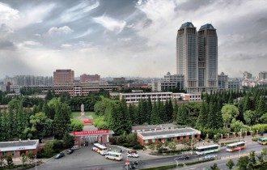
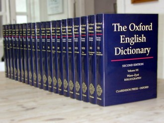
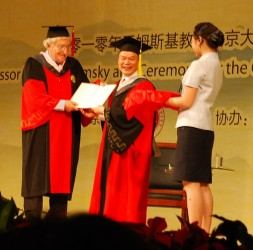

# 英文系怎么办？

本文献给洗刷我三观的老师们

献给在我深爱的母校度过的日日夜夜

1998年，我怀着文青梦，心心念念要考大陆某名校的英语语言文学系（原本打算考历史系和文科基地班，老师父母劝阻，理由是将来就业会成问题，遂放弃），也考进了，十年后还留在系里，求到份教职。十五年过去，山山水水看得渐渐清晰。

**  **

要交待一句，我在同一家大学的英文系，从本科念到博士，成绩始终不好不坏。留校后，职业发展则是同辈中比较落后的。所以，体制内，我不能算既得利益派，心怀怨望，发发牢骚很正常。而且，我素来偏激，年纪不小，依旧出言轻狂。尊敬的读者请务必注意：在主流价值日渐遭到怀疑的时代，牢骚、轻狂不一定是对的，需要批评看待。

本学期开学时，开明的领导组织我们开会，畅议教学改革的方向与步骤。当时我有一点粗浅的想法，加之最近因为教学与两位师长发生小小误会，有所触动。所以，趁周末，趁我还没彻底心寒，就这个话题多讲几句：英文系怎么办？反正想到哪儿，扯到哪儿吧。只谈本科，研究生我没本事管。挂一漏万，各位包涵。

那次会上，我记得自己说过：“办学宗旨是要确保每个学生在毕业时获得一次为权贵资本主义剥削的机会。”也就是要保证就业。这当然会遭到鄙夷，鄙夷我主张培养文化精英、风雅之士。“文化精英、风雅之士”谁不想做？可多数学生来自普通家庭，其中相当的比例还是离异或单亲家庭，经济上不允许他们过于“理想”，必须先端稳饭碗。但是，残酷的现实是，大陆市场的就业越来越难，对学生家庭背景和外貌体征的依赖度随之提高。我是寒门出身，读研究生穷过一阵，皮夹里一张大团结都找不到，超市购物出来，呆坐在路边叹过素衣风尘，末路穷途。那时地上捡到只塑料可乐瓶，都如获至宝，因为可以卖1毛钱废品，这还是08年经济危机之前的好价钱呢。若非几位恩师接济，势必无以克成学业。所以，至少对我而言，读大学，读英文系，第一个目的是在社会上求生图存，而不是弄月吟风。我记得，去年有个女学生为此和我吵过，她是大富之家的小姐，当然和我这种无产阶级世界观是有冲突的，反正吵到后面，我劝她把博文里的那句“狗善被人骑”改掉，因为我很胖，压死那条狗不雅。

英文系学生里，上头有人的，便有工作；长得好点的，也有工作。如果你不巧，两样都不沾边，那靠什么呢？大概，只能指望英语水平了吧。找工作时，你的竞争者和你一样没后门，没姿色，那你英语比她好，必定占优势，录用概率也大了。所以，英语好，是草根学生值得努力的方向。至于你说你有驾照，有CPA证书，有登山、滑雪、潜水教练上岗证，百样俊俏，能否遮住英语不好这一丑，那我还真的不知道，乐嘉和万峰，你挑一个咨询下吧。

可惜，并不是所有师生都深刻明白这一点。我也是读完博士后，才恍然大悟。先来说说学生。

现在的学生和我读书时大不同了，因为英文系不再是个吃香的专业。之所以不吃香，一是许多学生不满足于以单一外语，尤其是一门各国普遍通行的外语为专业。你也会，我也会，我拿什么超过你？我自然要去学点别的，经济啊，管理啊，哪怕再掌握一门外语也好。二是随着中国改革开放深入，经济文化发展，英文系旧有的落后培养体制，无法吸引大量优秀学生。不少高中生，寒暑假去海外牛校念过班，烧过钱，眼界很高，来读英文系一两周，马上知道水深水浅，如何安心？好苗子还是有的，主要是各地外语学校输送来的保送生，她们绕过了高考，但一进英文系，就渴望转专业的，恐怕不在少数；不想转的，也多是贪个清闲。招生大概会成为未来大陆大学必须面对的一个头疼问题。以我高中母校为例：我高考时，清华北大最牛，但尖子生未必都愿考，上海本地的还是喜欢复旦，交大稍逊些。十五年后，清华北大不足炫耀，港大中大（香港大学、香港中文大学）也平常，哈佛耶鲁、牛津剑桥才打得响牌子。据说有个极优秀的高三理科女，收到美国某名校录取通知书，当场大哭：“我要去哈佛呀，我要去哈佛！这普林斯顿，谁听说过啊！”这就是上海，这就是精英，这就是现实。

高招生源质量巨变，在本科教学中引起了新问题。有的学生大舌头，有的学生说英语严重受到家乡方言干扰，有的学生本身在高中里英语单科很差，选专业纯粹为了能迈过这所大学的门槛，接受了专业调剂，于是雄赳赳气昂昂来了英文系。在我就读和工作的大学，只需调出二十年来的高考录取分数线做简单对比，就可发现，原先还算“热门专业”（当时学费都要比文史哲等“基础学科专业”高出10%强）的英文系，已在各专业中频频垫底。显而易见，如此背景下，我所在的英文系，招到的学生大致是四流中的末品。

这样进来的学生，其资质和用功，是可想而知的。何况在所谓的名校，英文系学生普遍沉浸在一种或文艺或小资或清新或自恋的庸俗氛围中，不读英文报纸，故很少为社会现状触动，也不晓得香港大学一年级就在功《麦克白》原文了，更不用说为超英赶美、中华崛起而读书。系内课程，仗着高中底子，稍加突击，基本都能应付。一下课就忙着去夏朵喝下午茶，去万达看《泰囧》，到沃尔玛买吃食，到法租界的街旁小店买裙子、拍点靓照再美图秀秀移个轴、拉个油画效果。天长日久，想要振奋上进，也都难了。大四的学生，你问问她可仔仔细细读过哪几部英文名著？能不能独立翻译一份商业合同？敢自信满满地说读过，说能翻译的，寥若晨星。我不求你翻开过莎士比亚和《圣经》，尚且知道Sydney Morning Herald《悉尼先驱晨报》不是什么《悉尼晨曦来临》的，就谢天谢地了。当然，这里面，教学负有较大责任，因为根本没有清晰的培养目标。

生源决定一切吗？至少决定0.99切。在大陆，谁都知道，所谓好学校，就是生源好。否则我们单位干吗要和本市西南某高校为了抢生源争得面红耳赤，迭出奇招？反正甭跟我说什么“人人平等”，这话爷不信。没读过二十四史，还没看过《甄嬛传》吗？做老师的都清楚，有些学生是要成器的，有些只好祝福她，祝福她，使劲儿地祝福她。在大学扩招，阿猫阿狗都能上大学的年代，我这个论调大概很逆潮流。

我很幸运，在英文系能遇到几位看得起我、拿我当回事的好老师，包括我从高中就奉若神明的导师，他们改变了我对人生和学问的看法。但也有几位，让我和我的同学们总感觉姿势水平乏善可陈。据我一位在外省某校读英文系的忘年交说，他们学校有些老师，从口语到写作，甚至不如高中老师。上起课来，就是发张纸，让学生翻译两节课，下周又是一张纸。要么让一个学生读，读完了让同桌读，读到下课，读到可以收工吃饭。学生拿读的东西去问她：“老师，这个词是介词还是副词啊？修饰句子的哪一部分呢？我看不明白……”她当场愣住，也说不出个所以然，下周再见，顺势忘记，不了了之。极少数还不回答提问，不接受指正，学者姿态毫无。英语是比较好糊弄的学科，同样是讲课，用中文讲如果内容烂，早给臭鸡蛋砸出禽流感了，但用英语哼啊哈啊这么一忽悠，隔了一层符号的包装，就比较容易接受。我有位学生，研究生考取了哈佛全额奖学金，他爱听其他文科院系的课，总在我面前抱怨英文系学术含量低，比历史系、新闻系、社会学系差了一大截，大概就是看破了这层包装吧。我还是希望这些反面例子只是个案，虽然也不大可能。

等我自己做了老师，才明白，不能全怪这些个案。因为学校对教师的考核里，教学占的比重微乎其微，而职称晋升制度中，干脆降为零。我在接受入职教育时，人事处长对我们百来号人指示：“上课，过得去就可以了。重点要放在科研上！”所以，大学里，谁都明白，教书是个良心活儿。不过，现在看来，处长——哦，他已经因经济问题免职了——说的不是没道理，这几年国家一重视科研，果然莫言立刻就拿了诺贝尔文学奖。反正，咱谁都别怪体制哈，谁怪体制谁公知，谁全家都是公知！ 事与愿违，科研指导教学的愿景目前在英文系还没有实现。学生普遍的状况是不懂如何做研究，而英语技能又不怎么高。说白了，就是高不成，低不就。我起初并不觉得这样有什么可怕的，后来接触了管理学院、经济学院、数学学院几位学生，听了他们做的关于英语文学的课堂报告，我就理解为何教育界内部时有取消英文系的呼声。2011年圣诞节，我在香港大学男生宿舍借住了几晚，借给我床的那个男生满桌子弗吉尼亚•伍尔芙原著，而且都读完了，他的专业是会计。所以，我们真的要使劲儿地祝福大陆名校英文系的广大学子啊，哈利路亚。 我是反对大众教育的，一个年级五十几号人，值得花心思的，总不出十个。就这十个人，能不能出息，还要两说。一说是周围人的平庸会传染她们，二说是课程设置从理论上几乎杜绝了出息的可能。说到后者，现在是在执行十六字的反动方针：“苏学为体，美学为用，零敲碎打，无法贯通”。

** **

英语系的课程多是精读、泛读、听说……前苏联那一套。初衷是很好的，夯实语言基础，再怎么强调都不过分。乾嘉学派“由字义入经义”，是英文系永不能倒的大纛。但实践起来，竟是如此效率低下。一篇外国二流报纸杂志上的无名氏文章，要学一两个月，重细部之词汇，轻语法之整体，器局狭促，但考起试来，却天马行空，准备和不准备差不多。学生自然不会复习课堂内容，而不复习是学英语的致命伤。即便是词汇，看似说得细，实则不少老师就是拷贝金山词霸，书里是形容词，那就说个副词，再 “Ctrl+V”几句例句给学生，仿佛你这辈子就是吃观音土长大的，没摸过键盘。这还是有点敬业精神的，没好气的就干脆操起所谓教参，包打天下了。教参是什么？就是你不懂的地方，它永不解释；你懂的地方，它反复解释；你懂都不用懂的地方，它拼命解释，再配图配表配CD。更糟糕的是，英文系这些语课之间没有任何关联。我一直主张，设定一些重要的文化话题，譬如海明威与巴黎，不贪多，每学期几个话题，精读、泛读、听说、翻译同一时段内，全部围绕着来，这样滚瓜烂熟，效果深刻。现在非但不能如此，连年级之间的难度梯级都体现不出。“吾道一以贯之”的大成圆融，做梦都不敢想了。真的去考托福、GRE，非要另下一番苦功不可。所以，新东方、新航道、新疯狂的听众里，英文系的学生不乏其人。究其原因，还不是伤在自我感觉良好的散漫无度么？

语言基础失守，那科研呢？科研之于大学，即稳定之于社会，压倒一切。这是美国风吹的。我且问你，读不懂《资本论》，你敢谈马克思吗？好吧，很多人是能谈笑风森的。其实，科研的基础可以在一二年级打下。譬如，学生在老师的带领下，读一本《动物庄园》这样文字浅近的名著，然后读几本美英出的论文集，然后自主去图书馆提供的外国学术网站搜近几年的论文，分析比较，看看谁说得在理，谁论得无据，过去意见如何，现在看法怎样……进而读到乔治•奥威尔其他作品，并熟知其生平，有个综合的了解，从大二开始实施，到大四下学期，写出篇三五千字且有些学术含量的论文，应该不难。大一则训练学术写作的基本规范。我以前不懂，后来才明白，写论文一不是炫耀文采，二不为弘扬文化，而是训练说理的能力。会写论文，将来即便不吃英语语言文学研究的八宝饭，也在文职工作中大有用武之地。这一点上，科研和语言基础是浑然一体的。可现实呢？论文多是个把月赶出来的急就章，有的学生还以三天写完八千字自豪。我带过一位“才俊”，他在交稿前一周，提出换题目，觉得写悲剧太难，改成研究罗伯特•弗罗斯特的诗歌。那您写得倒是有点人模狗样啊。结果，正文一个注解和引用都没有，通篇格式是报一段段弗氏简历，抄一首弗氏原作，衬几句 “I think this is a very good poem, because it moves me a lot. I have read it many times, and even today when I re-read it, I cannot help but being moved by it, which is really a very, very great poem.” 到底给不给过？我不给他过，家长、学校都会向我施压，万一他想不开跳楼，你肯代我偿命吗？万一他和我同归于尽，你肯代我奉养椿萱吗？万一他半瓶硫酸泼来，你肯用东航里程为我换张来往韩国的飞机票且保证不给大浦洞击落，万一击落你代我奉养椿萱吗？够了，给他过吧，但不能给好分数。结果，他拿到分数，就来怒斥我：“Tom写得比我还水，人家拿B+，凭什么你给我C-啊？跟了你，真是晦气！”而我顿时名声在外。“连Jerry学长那样的臭水平都能过，老师，您就收了我吧！我怎么也比他强呀。”现在来找我带论文的，都是这口径。我自作孽，不可活。和语言一样，科研的强度一定要加大。师怒生怨的《世界文学史》这种课，上一两个学期，天南海北，古今中外，什么都说，等于白说。学生书没看一本，张三李四名字记一大堆，要是背出几个外国人名简介去星巴克打折也就算了，不然有这功夫，看花，晒太阳，滚草坪，望夕阳，跑跑步，减减肥……干什么不比这个强。倘若用这时间改教《傲慢与偏见》和《裘利乌斯•恺撒》，宁可本科就读这两本，嚼碎了，吃透了，一定胜过四年囫囵吞枣，半解一知，这样精耕细作，对老师科研也有好处。当然，某些学生会说：我们忙啊，我们要搞社团啊，我们要把妹、搞基、腐出翔啊，我们要上《星相学导论》啊，等等等等。对于她们，就“放手哥”那句狮子吼：“负分滚粗！”

再说实用。这个更是脱节得离谱。一提“法律英语”、“商务英语”，阳春白雪派恨不得寝皮食肉。但究竟毕业生里，有几个会做语言文学研究呢？我那届50来号人，只有两三个还在吃本专业的饭，多数都是在商言商，有的英语写份简历还要找我。不要小看法律英语、商务英语，他们自成一格，法度精严，要学出个子丑寅卯，没三五年功夫难成。况且这能给学生温饱乃至富足，何乐不为？北窗苦吟，万言杯水，不是教育的目的。私心里，我巴望他们个个升官发财，将来我的房啊，车啊，特供啊，僵尸单炖绿茶婊啊，追悼会大号花圈啊，都有个着落。（真心话。）

所以，我理想中的英文系课程设置，应该分为三大块：（一）语言（二）实用（三）科研。其中语言第一，实用次之，科研看学生底子吧。在这三项之外，如果还有什么需要加入英文系的，那就是“文明观”，姑称之（四）“风雅”。英文系的学生，于英国议会、美国宪法乃至希腊罗马、宗教改革、文艺复兴、工业革命均茫然不知，这是很可悲，也是很可怕的。至于（五）思想，那实在不是课堂能教的，找个你崇拜的老师，帮他拎包提鞋，牵马坠蹬，陪他午饭在清真食堂吃5元一碗的牛肉拉面（面要宽的那种），吃饱出来再美图秀秀拍两朵樱花吧，这样你自然不会像三流学生那样纠结于文学翻译是李继宏嗲还是郭敬明赞，这样你很快就能成为新时代的丰臣秀吉。

说笑了，下面是我在假定师资充足、学生赏脸用功（也就是说，以下造起了一片乌托邦）的情况下设计的英文系课程设置，可根据情况，分快慢班，酌情增减教学内容。一般的笔译，包括文学翻译（盖此类翻译，各凭所感，如人尝菜，你咸我淡，多无定判，不宜专学，且矛盾攻伐，贬人而褒己，极易流俗成弊，益以华辞淫巧，昧于大道，殊非正学立德之门），纳入《文学经典》。口译，纳入《媒体看世界》，如需训练更专业的同传、交传，可在三到四年级开设选修课，恕此不赘。整个计划估计漏洞百出，且大改教材，动人乳酪，开罪同行，纯属自娱自乐，拍砖引玉，以待来者吧：

一年级第一学期（除注明外，每门课程均每周两课时，每课时**45分钟）**

学术写作入门

掌握MLA、APA、Chicago等主要学术写作规范，至少一种，同时学会如何利用网络、图书馆寻找学术资源。我在大四时，一位老师上课就给我们说这些，我毫无兴趣，甚至反感，用逃课、迟到早退应付，直到我要动笔写博士论文了，发现这个才是当代学术研究的正道，肠子都悔青了。

2. 现代语法（上）

不要Chomsky这种“神汉巫婆”（我不是否定乔老爷的学术地位，我压根没这资格，我只是说，他那套对学习英语浑然不奏效），要讲得清“主、谓、宾、定、状、补”的，Randolph Quirk那种。“现代”是个宽泛概念，从文艺复兴起算。所以，现代语法（上）这个部分，只负责当代英语（PDE），把中小学的顺便复习一遍，发音有问题的也正正音，正不好的建议转西南某高校附属第九人民医院。特别要注重用法讲解，培养学生精准使用语言的意识。考试一律客观题。

3.文学经典（一）（每周四课时，下同）

有梯度地安排，大一每学期一种，寒暑假二种；大二、大三每学期二种，寒暑假四种；大四每学期一种，寒假一种。凡十九种。畅销书配合阅读。和语法一样，由今及古。作业布置文本和相关论文阅读，辅以名篇背诵（不必局限于所读之书，可另行择取，如诗歌等）。结合课堂报告、书面阅读报告。期末考试闭卷，试题为二十道解析，均摘自所读作品，词汇、语法、文意都要考。（参考书目见附录1）

4. 世界文明（一）

用牛津通识读本，大一每学期一册，寒暑假三册；大二、大三每学期二册，寒暑假六册；大四每学期一册，寒假二册。凡二十三册。（参考书目见附录2）

5. 思想政治、法律基础等课（上）

附属于学校公选课体系，全部改用英文（包括英译）教材。（参考书目见附录3）法律基础可把英国、美国、中国香港等国家地区的法律简史讲一遍，把“民主”、“共和”、“公平”、“正义”这些概念也理理清。

6. 第二外语（一）（每周三课时，下同）

不同语种不要安排在同一时段授课。允许学生多选。务必达到旅行交流无障碍和借助词典阅读当代报纸的效果。

一年级第二学期

现代语法（下）

适当扩展到早期现代英语（为读莎士比亚、弥尔顿打基础），并纳入适量的语义学、语用学等语言学基础内容。

2. 文学经典（二）

说到这套书的教材，我推荐[Norton Critical Editions](http://books.wwnorton.com/books/Subject-detail.aspx?tid=11202)、[Cliff Notes](http://www.cliffsnotes.com/)和Harold Bloom编的论文集（爱问知识人上很多，一搜即得），[SparkNotes.com](http://www.sparknotes.com/)供参考。可以结合具体作家，展开介绍断代文学史。

3. 世界文明（二）

这门课和《文学经典》，如果感觉课名四年都叫这个，不够拉轰，可以把书名当课名，如《莎士比亚悲剧四种》、《佛教伦理》。

4. 思想政治、法律基础等课（中）****

5. 媒体看世界（上）****

纳入原有的听说课、英美概况课，以事实话题为主线，形式以学生课堂报告与讨论为主。同时培养学生从媒体搜寻新鲜语料的能力。

6. 第二外语（二）

二年级第一学期

文学经典（三）

所读文本应以英文名著为重，但不妨涉及法俄意西等DWEM（死白欧男），如《巴黎圣母院》、《安娜·卡列尼娜》、《神曲》、《堂吉诃德》等。

2. 世界文明（三）

3. 思想政治、法律基础等课（下）

4. 媒体看世界（中）

5. 翻译应用（一）

以法律翻译为主，虽然这个我也不懂，但是感到极有必要。此课程可以找法学院一起开。据说美国好的英文系，都成了法学院研究生项目的预备役。

6. 英语史（上）

可用Robert Burchfield的English、BBC的The Story of English、David Crystal的The Stories of English为教材，兼顾英语词典的历史与使用。

7. 第二外语（三） ** **

****

二年级第二学期****

1. 文学经典（四）

2. 世界文明（四）

3. 媒体看世界（下）

4. 翻译应用（二）

5. 英语史（下）

6. 第二外语（四）

7. 一期水平考试（不授课）

英语专业四级。不合格者考虑劝退。

三年级第一学期

文学经典（五）（每周六课时，下同）

之所以安排比较多的课时，一是学业进入最后的攻坚阶段。二是我始终觉得，课后自觉完成阅读固然重要，课堂教师深入地，有体会地讲解，而不是照本宣科，在本科阶段尤为要紧。

2. 世界文明（五）

3. 翻译应用（三）

4. 第二外语（五）（每周四课时，下同）

5. 语言学

不仅说英语，也要说汉语，在英汉对比的研究中，体现两种语言的共性与差异。

6. 毕业论文（一）

提早准备，每一节点都严格考核。按文学、语言、翻译方向，分组授课，学生汇报论文立题、材料准备、每周进度等，老师点评。对基础很差的学生，建议分流，“以译代文”：现在某些学校，搞什么翻译硕士（MTI）创收，乌七八糟收一大堆，交钱发证，结果毕业论文不够人手带，犯了愁，叫学生英译汉，译出万把汉字了事。这一对策，不妨借用到这里。但译文必须英译汉、汉译英都做，量要翻十倍，内容由老师严格把关，不得自行选取。

7. 二期水平考试（上）（不授课）

雅思。 ** **

** **

****

** **

三年级第二学期

1. 文学经典（六）

2. 世界文明（六）

3. 翻译应用（四）

4. 第二外语（六）

5. 毕业论文（二）

6. 二期水平考试（下）（不授课）

托福。

四年级第一学期

1. 文学经典（七）（每周四课时，下同）

2. 世界文明（七）

3. 翻译应用（五）

4. 第二外语（七）（每周二课时，下同）

5. 毕业论文（三）

6. 三期水平考试（上）（不授课）

GRE.

四年级第二学期

1. 文学经典（八）

2. 世界文明（八）

3. 第二外语（八）

4. 毕业论文（四）

现在某些学校，搞什么翻译硕士（MTI）创收，乌七八糟收了一大堆，交钱发证，结果毕业论文不够人手带，犯了愁，拍脑袋想出“以译代文”，叫学生翻译万把字了事。其实，对英文系底子不佳的学生，用这个土法代替毕业论文，很不错。

5. 三期水平考试（下）（不授课）

英语专业八级。第一到三期水平考试，凡低于一定标准者，不发学士学位。

这样教育出来的学生，如果她合格毕业了，是不是就业问题解决了呢？我哪里敢保证？但是，肯定竞争力会好很多。至少，她申请海外大学研究生项目时更有自信，大约知道研究的方向和路径，或者可以去律所当个文员，或者或者再不济，去补习学校教英文也得心应手一点，不会以己昏昏，使人昭昭。这样，教育者也算尽力而为了。

我是英文系的毕业生，也是职工，没错。但我这里说的，讨论一斑窥见的全豹，不针对任何个别的人与组织，如果针对，那只有感恩之情。我始终相信一句古话：“鼓天下之动者，存乎辞也，”也就是说，我信仰语言的力量。啰啰嗦嗦，说了这些话，是真心希望这个专业能好起来，越来越好，尽管有人会怪我说风凉话，搏出位，抛来一句“你行，你上啊！”之类的——反正我也习惯了。还有关心我的前辈说：“你写这么多，完全没用的，当权者不会听。”谢谢她的提醒。我当然知道没人会听，一开始就没打算有人会听。我谈不上什么“业界良心”，自己上起课来，也是疲疲塌塌，任性而为，学生讨厌，同事嫌忌。我只是想比较完整地记录下身处这把年纪对周遭世界的想法，自己看，自恋，顺便涨点粉。

就此搁笔，有机会根据大家的反馈再做修改。此时想起大学同窗老友留美归来，对我说的那句：“英文系的教育，简直是儿戏。”此话，我长引以为警策

** **

以下书目，仅为举例参考之用，并非制定：****

附录1:

以下英语文字，选自美国某大学比较文学系任教的一位前辈给我的学妹写的一封信，提到了他向我推荐的书：

As for a recommended list for Dr Boarhead, here is kind of an unconventional one from me--one that I'd like to use if I were in his place, a list of books that I personally find more intriguing to teach:

Mary Shelley, Frankenstein (Gothic / supernatural / pre-Stephen King)

2. Walter Scott, Ivanhoe (historical romance--essential for Chinese students, Jin Yong fans in particular)

3. Charles Dickens, Great Expectations (social fiction, containing important message for the current Chinese young generation)

4. Oscar Wilde, The Picture of Dorian Gray (fin-de-siecle decadence / superb study of the English language)

5. E. M. Forster, A Room with a View (American-European cross-cultural study)

6. Virgina Woolf, Orlandao (fantasy and gender study) or

7. James Joyce, A Portrait of the Artist as a Young Man (modernist fiction)

8. Henry James, The Turn of the Screw (supernatural, pre-King) or

9. Arthur Conan Doyle A Study in Scarlet or The Hound of the Baskervilles (detective fiction)

10. Ernest Hemingway, A Farewell to Arms (war novel) or

11. ---. The Old Man and the Sea (No. 1 Hemingwayesque)

Note that for various reasons, either for personal preference or for pedagogical practicality, I've not included the following all-time classics:

British:

12. Laurence Sterne, Tristram Shandy

13. Jane Austen, Pride and Prejudice / Emma

14. Charles Dickens, David Copperfield / A Tale of Two Cities

15. Charlotte Bronte, Jane Eyre

16. Emily Bronte, Wuthering Heights

17. William Thackery, Vanity Fair

18. George Eliot, Middlemarch / Mill on the Floss

19. Thomas Hardy, The Mayor of Casterbridge / The Return of the Native / Tess of the D'Urbervilles

20. Joseph Conrad, Heart of Darkness

21. Somerset Maugham, Of Human Bondage / Razor's Edge / Moon & Sixpence

22. E. M. Forster, A Passage to India

23. Virginia Woolf, Mrs. Dalloway / To the Lighthouse

24. Aldous Huxley, Brave New World

25. Geroge Orwell, 1984 / Animal Farm

American:

26. Herman Melville, Moby Dick

27. Nathaniel Hawthorne, The Scarlett Letter

28. Mark Twain, The Adventures of Huckleberry Finn

29. Henry James, The Portrait of a Lady / The Wings of Dove

30. Scott Fitzgerald, The Great Gatsby

31. William Faulkner, The Sound and the Fury / Light in August

32. J. D. Salinger, The Catcher in the Rye

33. Saul Bellow, The Adventures of Augie March / Seize the Day

34. Toni Morrison, The Bluest Eye / Beloved

If he likes, Dr Boarhead could certainly pick any of the shorter ones on this list as replacements. The most important thing, in my humble opinion, is that the instructor has to find some kind of 'communion' between the prospective choices and her-/himself, because only in this way will s/he find challenge and charm--the two always come together, hand in hand--in the texts, and make her/his course a success.

** **** **

附录2

[牛津通识读本书目](http://ukcatalogue.oup.com/category/academic/series/general/vsi.do#.UWsML6JkNDY)

这一书系题材纷繁，可自行确定书目，但应以构建对西方古今文明的宏观认识为要务，例如应选《罗马帝国》、《圣经》、《文艺复兴》，而不选《古埃及神话》、《博弈论》、《畅销书》。 附录3（皆英文原版或英译，可配合附录2）

1. 共产党宣言

2. 毛泽东选集

3. 邓小平选集

4. 剑桥中国近代史

5. 庄士敦著 日落紫禁城

6. 傅高义著 邓小平传

7. 彭定康著 东方与西方

8. 安东尼·比弗著 柏林的陷落

9. 郑念著 上海滩生死劫

10. 何伟著 江城

11. 美国宪法（其余法律、政治类书目待高明拟定及补充）

（采编：韩忠楠；责编：彭程）

[【开学季】漫话人吃人](/archives/41983)——在现在的一般人看来，吃人的原因无非是荒年没别的东西可吃，或者是在少数情况下恶棍为了体现自己的残忍。但是吃人是可以有非常多样复杂的、乃至截然相反的动机。

[【开学季】东西方政治思想史研究的同调变革——以“斯金纳革命”与“新儒家学派”为核心](/archives/41944)——在20世纪60-80年代，东西方史学界产生了一场“同步”的变革，历史学介入到政治哲学的领域之中，并试图构建出一套政治思想史研究的“新范式”。

[【开学季】荐书单列：二百年后再思托克维尔](/archives/41906)——“作为我国古老贵族的一分子，我对贵族制完全没有天生的仇视和嫉妒……家庭的记忆、个人的利益都不能使我对民主制产生天然和必然的好感。”——托克维尔
