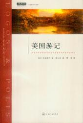
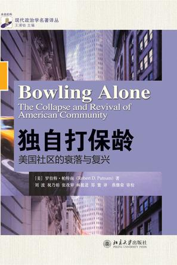
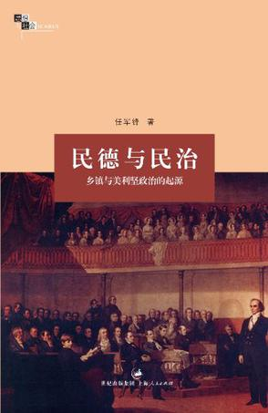

# 荐书单列：二百年后再思托克维尔

在给《论美国的民主》的英译者亨利•里夫的信中，托克维尔说：“作为我国古老贵族的一分子，我对贵族制完全没有天生的仇视和嫉妒……家庭的记忆、个人的利益都不能使我对民主制产生天然和必然的好感。”如果不是托克维尔和他的《论美国的民主》和《旧制度与大革命》早已名留史册的话，我们恐怕难以相信这样一段话是出自一位以研究民主制度而名留史册的学者之口。

我们不得不承认，托克维尔对于民主的看法是复杂的。因为他的外祖父和外曾祖父都是在法国大革命中丧生的，因而托克维尔对于民主和民主可能带来的“多数人的暴政”总是怀着浓浓的戒惧之心。

无论是《论美国的民主》还是《旧制度与大革命》，都透露出托克维尔对于“社会秩序”一以贯之的推崇。在他的眼中，革命或者说对于自由民主的追求，只能在特定的社会条件下才能得以最大程度地实现，这从他对法国革命和美国革命的不同态度中就能看得出来。 在《旧制度与大革命》一书中，托克维尔指出，传统法国的社会结构有三层：国家—贵族—家庭与个人。而路易十四所引领的法国国家改革，将原本属于中间阶层——贵族的特权收归国家，这使得法国贵族丧失原先社会中层的纽带作用，沦为国家的寄生虫，加剧了社会断裂。在一帮崇尚空谈的知识分子（托克维尔讽刺的是启蒙思想家们）的错误引导下，以“自由、平等、博爱”为口号的法国革命从国家集权的土壤中开始，而革命的最终结果，则是加剧了国家的集权程度。

而在大洋的彼岸，新生的美利坚合众国则是托克维尔心中完美社会的样本，在广袤而富饶的新英格兰，无数的村庄和社区中孕育了大量的独立于社会之外的中层组织，这成为了美国民主制度的摇篮和基础。正是通过这些社会组织，美国才得以最大程度地动员民众积极地参与到公共生活中去，社会有自生的力量，国家才能顺利地运行。

值此托克维尔诞辰208周年之际，重温托克维尔，不仅要看到他所描述的如何规避“多数人保证”的美国民主理想，也不能仅仅关注他对于法国革命与改革的描述能否成为当下中国的“资治通鉴”，更应该关注的是潜藏在这背后的一贯逻辑：良好的“民主”到底需要一个怎样的社会土壤才能得以实现？

1. 托克维尔：《美国游记》，上海三联书店，2010年

关于《旧制度与大革命》和《论美国的民主》已经被人谈得太多，这里就不重复推荐。这部《美国游记》是非常好玩儿的东西，非常值得看看，这本书可以说是《论美国的民主》一书的素材库。两者对观，《论美国的民主》是以学理性的表达来描述美利坚民主制度，而这本书则是托克维尔在美国的所见所闻所感，读起来甚为亲切可爱，能让我们这些读者对美国的民主制度有一个感性的直观认识。

2. 罗伯特•帕特南：《独自打保龄：美国社区的衰落与复兴》,北京大学出版社，2011年

随着现代化的展开，托克维尔所描述的那种美国结构现在如何了？美国当代学者帕特南为我们描述了当下的美国社会情况：“美国人社会交往的频率越来越低，在过去二十多年，参与俱乐部活动的美国人下降了58％，连请朋友做客的人也下降了35％。美国人互相信任的程度也在不断下降，从1960年的58％降到1993年的37％。”作者以美国社会曾经最为流行的社区活动——“打保龄”为例，探讨了美国底层民众的集体活动的衰落。这时候我们不禁想问，“社会资源的衰落会使美国的民主衰落么？”

3、任军锋：《民德与民治：乡镇与美利坚政治的起源》,上海人民出版社，2011年

与帕特南对于美国社区衰落的认识不同，复旦大学国际关系与公共事务学院的任军锋老师却强调，美国社会最令人啧啧称奇的，便是新英格兰地区200年不变的村社传统。在任军锋在美国访问期间，他走访了托克维尔当年观察的新英格兰乡村地区，发现今日美国乡村的社群和托克维尔时代并无不同。或许，任军锋和帕特南的不同在于，现代化的大潮淹没了城市社区之中社群联系，而乡镇地区却仍旧留存了托克维尔时代的共同体性质。在那里，我们才能感受到托克维尔所颂扬的那种社会结构，如果有一天踏上那块土地，我们能否体会托克维尔在《美国游记》里的那种感情？

（采编：彭程；责编：彭程）

[【开学季】漫话人吃人](/archives/41983)——在现在的一般人看来，吃人的原因无非是荒年没别的东西可吃，或者是在少数情况下恶棍为了体现自己的残忍。但是吃人是可以有非常多样复杂的、乃至截然相反的动机。

[【开学季】东西方政治思想史研究的同调变革——以“斯金纳革命”与“新儒家学派”为核心](/archives/41944)——在20世纪60-80年代，东西方史学界产生了一场“同步”的变革，历史学介入到政治哲学的领域之中，并试图构建出一套政治思想史研究的“新范式”。

[【开学季】英文系怎么办？](/archives/42040)——随着中国经济文化发展，英文系旧有的培养体制，已经无法继续吸引大量的优秀学生。原本还算热门专业的英文系早已风光不在，日渐没落了。究竟是什么原因让英文系走向低迷？英文系的出路又在哪里呢？
