# 朝鲜十章

（一）

回到丹东，眼前的情景一时有些陌生。

灯红酒绿的饭店，琳琅满目的货品，水果店的小伙染着黄发，声嘶力竭地叫卖；成人用品店挑出大大的“性”字；傍晚的鸭绿江畔，人来人往，熙熙攘攘。

一江之隔是朝鲜新义州，灯火暗淡，仿佛已经沉睡。

（二）

四天前，丹东火车站，寄存了手机和电脑，踏上“国际专列”。驶过鸭绿江铁路大桥，当年被美机炸剩一半的“断桥”一掠而过。十分钟后，抵达新义州车站。

我怀疑列车是不是超光速了，仿佛回到几十年前。简陋而干净的站台，瘦削沉默的人民军战士，车站大楼悬挂着领袖大慈大悲的笑容。墙上一行大字，我只看懂“21”。一问才知，原来是"21世纪的太阳金正日同志万岁"。

换乘直达平壤的旅游专列。护照被收走，几位安全人员带着电子探测器走进车厢，主要是检查手机和GPS。有人带的地图上标有“韩国”，被当场没收。朝鲜人民不承认"韩国"，他们只说“南朝鲜”。

中方导游反复叮嘱，火车上不能拍照。一小男生偷偷按了几张路边的田野，被便衣发现。一名人民军战士冲进车厢，生硬的手势要求交出相机。半小时后，相机送回来了，内存被清空。

火车开开停停，250公里，开了近8小时。稻田、河流、丘陵、标语、永生塔、嬉水的孩子、排着队下地的农民，风景重复着风景。傍晚，田野退去，高大的建筑物出现了，金字塔般柳京饭店在夕阳下闪光，平壤到了。

[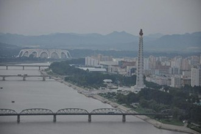](5f90731c-b9ee-4197-af93-a877004f60eb.jpg)

主体思想塔和五一体育场

（三）

平壤人有一种优越感，这里的市政建设和物资供应远超其它地区。这座城市像一台不停工作的抽水机，抽调着全国的资源和财富。即使在饥荒时期，平壤市民依然可以获得充分的粮食配给。朝鲜的奥运冠军，最高级别的奖励不是勋章或汽车，而是平壤户口。当然，出身不好的人，政治不可靠的人，在“南朝鲜”有亲戚的人，身体有残疾的人，都不能住在平壤，以免损害国家形象。

平壤的街道干净整洁，马路宽阔空旷。即使没有车辆通过，漂亮的女交警依然一丝不苟地做着指挥手势，仿佛奇怪的独舞。所有的阳台都摆放着鲜花，窗户没有装玻璃，黑洞洞的，像深陷的眼窝。奇怪的是，我没有见到一户人家把衣服晾在窗外，导游解释说，朝鲜人民自古就有把衣服放在室内阴干的习惯。

导游是平壤的另一盆鲜花。我们车上配着两位导游，大导游姓白，小导游姓朴，都是外语学院毕业，职业素养很高，回答问题滴水不漏，还会给大家唱中文歌《大海啊故乡》。在朝鲜，导游是上层的职业，代表了国家的脸面，除了年轻漂亮，政治表现和家庭出身也很重要。白导的父亲是医学院的教授，母亲是百货公司经理；朴导的父亲在朝鲜航空公司工作，母亲是医生。相比之下，随队的中方导游显得潦倒草根。有人对白导的“浪琴”表感兴趣，白导说，是他父亲的朋友送的。

[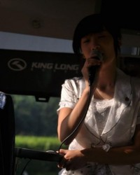](888bce3d-2a37-4e4c-99bc-6df8c0f0a3c0.jpg)

大海啊故乡

（四）

羊角岛饭店是朝鲜三家特级饭店之一（另两家是高丽饭店和妙香山饭店，柳京饭店建了30年，尚未完工）。大厅富丽堂皇，房间设施略显陈旧。没有网络，只提供收发E-Mail服务，25RMB/20K。从四十七层窗口望去，大同江、五一体育场、主体思想塔尽收眼底。饭店建在大同江心的小岛上，有一座桥连接平壤市区。桥头有便衣，时刻防备擅自离开的游客和企图接近的市民。

[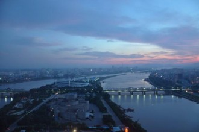](15d4f5e7-8eb8-44f0-99ed-63179f731bae.jpg)

羊角岛俯瞰

事实上，即使逃离羊角岛，也寸步难行。每个朝鲜人胸口都戴着领袖像章。像章由国家统一分配，规格不一，是身份的标志。没有像章，“无组织”的游客很快会被认出、举报。所谓人民战争的汪洋大海，大概就是这感觉。

每天的行程是规定好的，导游会告诉你什么地方可以拍照，什么地方不行。领袖的雕像必须拍全，仿佛领袖也活在我们的相机里。不能模仿领袖的动作，那样会“伤害朝鲜人民的感情”。

去板门店的路上，我的相机被扣留半小时，一个军官摸样的人紧张地跟上级打电话汇报，原因是相机中发现了军事机密——大巴上随手拍到的路边哨所。

（五）

妙香山是朝鲜五大名山之一（白头山、妙香山、金刚山、七宝山、九月山）。我们并不是去游山玩水，而是参观山下的国际友谊展览馆。那里专门陈列着国际友人赠送给金日成和金正日的21.3万件礼物，这当然也是主体思想光耀全球的有力证明。

身着盛装的解说员告诉我们，“如果折算这些礼物的价值，我们的领袖是世界上最富有的人。但是我们的伟大领袖爱人民，把这些宝藏无私奉献给朝鲜人民观赏。”

一间大厅的中央，安置着一尊金日成的等身蜡像。这是中国国际友好联络会在1996年赠送的礼物。每位参观者必须先瞻仰这尊蜡像，并在解说员的带领下向蜡像一鞠躬。（不能三鞠躬，三鞠躬是对死者，而伟大的领袖永远“活在”朝鲜人民心中。）她说，每一次带领客人进入这个大厅的时候，都仿佛受到伟大领袖金日成的亲切接见一般，不禁热泪盈眶。

来自中国的礼物很多，有毛泽东送的金日成双面绣像和豪华防弹车厢，周恩来送的茅台酒，邓小平送的景泰蓝花瓶，江泽民送的刺绣，也有一些旅行社和外贸公司送的小工艺品。其它兄弟国家也不含糊，斯大林送的三辆“吉斯”防弹轿车，菲德尔·卡斯特罗送的纯金盒装雪茄和鳄鱼皮箱，西哈努克送的象牙宝塔，齐奥塞斯库送的翡翠钻石和熊头标本，萨达姆送的纯金制金日成头像，穆巴拉克送的整套金币，卡扎菲送的黄金腰刀，叙利亚的老阿萨德送的银茶壶，一尊镶嵌着黄金和钻石的宝座来自尼日利亚。最吸引我的是一具托着饮料盘的鳄鱼标本，由尼加拉瓜的桑地诺民族解放阵线领导人赠送。解说员告诉我们：“鳄鱼是一种从不向人低头的动物，但这头鳄鱼却为伟大领袖金日成服务。”

相比之下，西方政治家的出手就寒碜了许多，法国前总统密特朗送了一套茶具；1994年美国前总统卡特访朝，送了一个烟灰缸；2000年美国国务卿奥尔布赖特来访，送了一个乔丹签名的篮球。礼物虽轻，也一并展出，重要的是连“美帝国主义”的领导人都向朝鲜人民的领袖送礼了。讲解员自豪地说：“这说明我们伟大的将军是伟人中的伟人。”

（六）

正午，万寿台。

两尊巨大的铜像俯瞰着众生。一对对神情肃穆的新婚夫妇，身着盛装走到像前。献花。报喜。一鞠躬。

天气酷热，仿佛两个太阳同时炙烤着大地。

1972年4月，为庆祝金日成60岁寿辰，“在朝鲜人民的强烈要求下”，朝鲜政府在万寿台建造了一尊23米高的金日成铜像，铜像与左右两侧的群雕式纪念碑、背后的白头山壁画组成了万寿台大纪念碑广场。2011年12月金正日去世，次年4月13日金正日铜像落成，与他的父亲并肩站立。

据“南朝鲜”媒体统计，金日成父子的封号总有1200余个，如：自天而降的英雄、世界人民的救星、地球守护神、百战百胜的作战家、将军中的将军、天下第一领导艺术家、不败的司令官、电脑天才、建筑大师、音乐天才、世界大文豪、哲学巨擘等等。众多封号中，金家似乎对“太阳”情有独钟，金日成是“全人类永远的太阳”，他的生日被命名为“太阳节”，是朝鲜最大的节日；金正日则是“21世纪的太阳”。

英雄的祖辈都是英雄，神的子孙也是神。中国人还在为“金正恩”还是“金正云”争论不休时，朝鲜举国在传唱着一首歌——《脚步》

嚓嚓嚓，脚步声，

我们青年金大将的脚步；

2月的朝气多磅礴，

向前进，嚓嚓嚓！

脚步声，脚步声，

每步都坚实震天宵！

普天下，江山哟，

喜开颜，嚓嚓嚓！

第三轮太阳正在升起，嚓嚓嚓的脚步声由远而近。朝鲜人民相信，任何邪恶的力量见到领袖的雕像都会颤抖。嚓嚓嚓，代表太阳消灭你。

[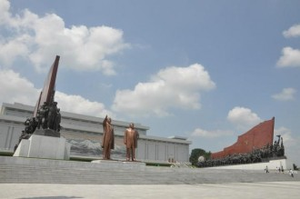](33dd0f00-2339-4aa3-b28b-d63725ed2846.jpg)

万寿台

[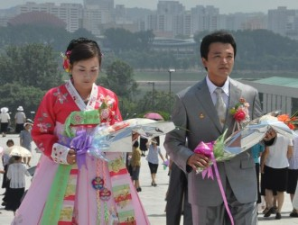](c5b3195c-f17b-4db3-aeb6-5b7f3834d57e.jpg)

报喜

(七)

有一对清贫但恩爱的朝鲜夫妻，丈夫总想让妻子过上好日子，一天夜里悄悄离家打工。妻子很漂亮，丈夫走后，村里的地痞不断骚扰。一年后丈夫回家，两人正高兴，地痞又来了。丈夫起了疑心，又想起村里传着妻子和地痞的闲话，一气之下又要走。妻子怎么解释都没用，只好流着泪在丈夫身后追。实在追不上了，妻子唱起伤心的歌，“我的郎君啊”，唱完就自杀了。丈夫追悔莫及，也跟着自杀。

“我的郎君啊”就是朝鲜语“阿里郎”。从这段故事或许能找到一些朝鲜人的性格特征：自尊、敏感、固执，以及朝鲜妇女的忍耐和坚强。

阿里郎传唱至今，成为朝鲜民族的象征。2002年，为纪念金日成诞辰90周年，十万人大型团体操《阿里郎》在五一体育场首演。今年是上演的第十年，也是最后一年。

想起了我们的歌舞史诗《东方红》，曲调改编自陕北民歌《骑白马调》：

“三八枪，没盖盖。

八路军当兵的没太太，

待到那打下榆林城，

呼儿嗨哟，一人一个女学生。”

冠冕堂皇的背后，往往是泪水和荒诞。

走进五一体育场，口号声如同山呼海啸，“金日成万岁”，“金正日万岁”，“主体思想万岁”，这是演出前最后的彩排和热身。来自平壤60所中学的2万名学生翻动彩色纸板，拼出巨大的背景，根据情节整齐地变换着各种图案。这些孩子两年来每天只上半天课，下午都用来排练。

宏大的拼图中，个体是一格小小的像素。

然而，阿里郎的演员是幸福的，参演者能感受到领袖的无限关爱，每天可享用丰盛的午餐和晚餐，“有肉、海鲜、蔬菜和鸡蛋等营养搭配”。在朝鲜遭遇严重旱灾，数百万人食不果腹之时，这份恩情是那么宝贵。

演出共九十分钟，分《民族阿里郎》、《先军阿里郎》、《幸福阿里郎》、《统一阿里郎》、《友谊阿里郎》、《复兴阿里郎》六大章节。今年特别增加了金正恩关怀人民的场景。当2万人拼出金日成和金正日的“太阳像”时，全场起立，掌声如潮，经久不息。身旁一位老阿妈已是热泪盈眶。

2007年，以卢武铉总统为首的“南朝鲜”代表团访问平壤，观看了《阿里郎》。代表团有人提出疑问，在朝鲜遭遇“天灾”，粮食严重依赖援助的时候，为什么还要投入巨大的人力物力进行这样的演出。得到的回答是：“我们为我们的国家自豪，关你们什么事。”

几束烟花照亮平壤的夜空，演出顺利结束。五一体育场外，刚散场的小演员兴奋地向我们挥手，我的心中是难以言说的酸楚。

[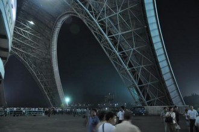](baa10914-9860-4268-8b0d-0c9b968f5b0b.jpg)

五一体育场

[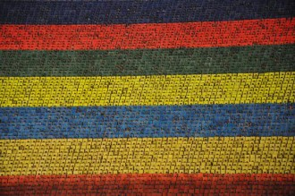](075c5376-ad7c-4fdf-8dfc-2378dc713358.jpg)

背景

[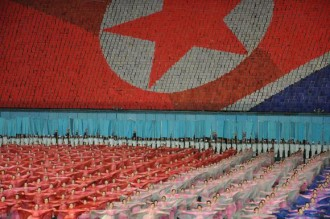](034362fe-b9ad-4345-a776-1e693eca0ed3.jpg)

国旗下的舞蹈

[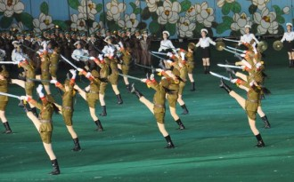](7951a437-911e-46ac-a283-b39a9abffe16.jpg)

女兵列队

专注

[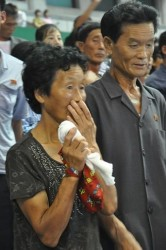](e36fc282-22c2-4b37-81c1-4cdb1f5a3735.jpg)

热泪

（八）

我问白导，对中国的“改革开放”怎么看，白导很有涵养地笑笑，那是你们中国人自己的事情，只要中国的老百姓觉得好，我们没意见。朝鲜人相信，只有自己才是纯正的社会主义。在金正日时代，“改革开放”一度是修正主义的代名词。

很多中国人自以为是朝鲜人民的兄弟，尤其是看着《英雄儿女》、哼着《卖花姑娘》成长起来的一辈。朝鲜官方近年来也多次表达“朝中兄弟友谊”的意思。仔细想想，要真是兄弟，有点不够意思。入朝后，第一件事就是收走“兄弟”的护照。相机随时会被检查，手机和电脑不能带，政治类图书不能带，带有“韩国”字样的地图不能带。“兄弟”还必须花800元（三等座）观看《阿里郎》演出。当2万个像素拼出巨大的“朝中友谊，深远流长”时，很多中国“兄弟”感动了。他们纷纷起立，使劲鼓掌。我偷偷瞄了一眼身边朝鲜大妈的门票，80朝元。这在平壤的黑市换不到五毛人民币。

一路上，我们被刻意和普通民众隔离，总有几双警惕的眼睛盯着我们，不得走远一步。唯一和普通朝鲜人接触的机会是乘坐平壤地铁。地铁建于1968年，由苏联设计，中国援建，为此大大拖延了北京地铁的通车时间。平壤地铁有两条，“千里马线”和“革新线”，最深处达200米，乘电梯上下需要3分钟，据说是为了防御核攻击。地铁是平壤的骄傲，也是一个专门的旅游景点。候车室悬挂着苏联式的黄铜吊灯，壁画描绘着金日成带领朝鲜人民前进的情景。看到我们这群“兄弟”，孩子们显得很好奇，成人的眼中则更多的是躲闪和畏惧。甚至有人刚想上车，一看见我们，立即换了一节车厢。仿佛我们身上携带了某种致命的病毒，一旦沾染，就会被白细胞吞噬。

[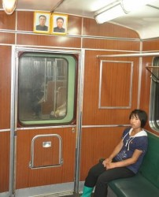](f895c824-772c-498b-ae51-1653bcba3772.jpg)

地铁

[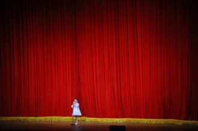](771b1cef-9f3c-4664-94d5-9e71b2655809.jpg)

报幕的女孩

[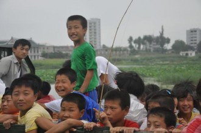](f1469bec-d796-4a68-9769-27bee3168b19.jpg)

卡车上的少年

（九）

板门店停战谈判处，只有联合国军代表处和朝方代表处，没有中国代表的位置，谈判桌上的中国国旗也被拿走。几个房间的展览图片，从领袖的生平到美军的罪恶到胜利的辉煌，唯独没有找到志愿军的痕迹。朝鲜仿佛以这样的姿态向国民和世界宣告，是他们独立打赢了这场战争。

朝鲜教科书是这样描述“祖国解放战争”的：在金日成主席的英明领导下，朝鲜人民军的英勇抗击保护了中国不受美帝国主义的入侵。

59年过去，光荣也罢沉默也罢，年轻的鲜血已经风干。到底没能去看一眼他们的陵墓，洒一碗酒，点一支烟。

148977名阵亡志愿军战士永垂不朽。

148977名阵亡志愿军战士死不瞑目。

三八线

（十）

学了几句朝鲜话。

阿尼哈西米瓜——你好。我怎么都学不会，因为搞不懂朝鲜人民到底是喜欢西米还是西瓜还是哈密瓜。有人提出疑问，不应该是“阿尼哈塞优”吗？白导说，那是“南朝鲜”的叫法。

糖瓜苦瓜——党和国家。是糖瓜还是苦瓜，外人无从揣测，朝鲜人甘苦自知。

万岁——万岁。发音和中国完全一样。

我来到了朝鲜，可我不确定是否看见了它。传闻太多，分不清真假；掩饰太多，看不透真相。几万人拼出了“伟大”、“光荣”的字样，可纸板后的脸，你看不见。你说到处是欺骗和谎言，可对于终日生活在谎言中的人们，谎言是他们触手可及的现实。

我为追寻历史而来，却发现这里深陷在历史的死循环中，找不到通往未来的路。唯一的出口，是那条连接丹东的铁轨。

记得叙利亚诗人阿都尼斯说过：当一个民族只信奉唯一的真理，那就意味着，这真理不过是鲜血。

我至今不知道，那些震耳欲聋的口号是不是真实，舞台上孩子的欢笑是不是真实。我只知道，吹过三八线的风是真实的，流过脸颊的泪是真实的。

[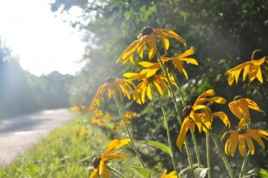](ce123eef-2f7c-4e32-bf0d-28f880d79f41.jpg)

（采编：张山骁；责编：王卜玄）

[【异域感】香港宵夜](/archives/43414)——宵夜是上不了檯面的。這種時候，高貴冷豔的法國菜、意大利菜早就偃旗息鼓，豪氣上檔次的中餐酒家也大多消停了。

[【异域感】广场](/archives/43399)----“您不用感谢我，这只是件小事而已。” “那让我替你祈祷，为你祝福吧年轻人，我相信这个世界上一切因缘终会有报的，你会得到上天的报答的。”

[【异域感】渔船上的陌生人](/archives/43464)——“媚俗就是对大便的绝对否定。媚俗就是制定人类生存中一个基本不能接受的范围，并排拒来自它这个范围内的一切。”这种禁区比比皆是，希帕索斯死于科学的禁区，媚俗的是当时毕达哥拉斯学派狭隘的信条；耶稣死于信仰的禁区，媚俗的是罗马的多神崇拜和暴政，多年后，又有无数异教徒，死于基督教的媚俗。
