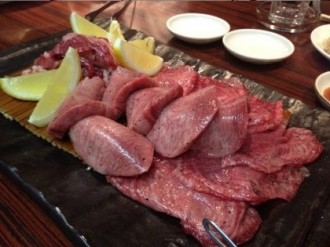
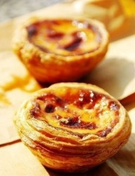

# 香港宵夜

開著冷氣的雙層巴士中最叫人難受的，無非一身“茶餐廳味”的乘客。試想，在擁擠吵鬧不透風的室內，一個彪形大漢隨手抓起一把肉菜，“擦”地一下丟進滿滿一鍋熱油裏。巨大的衝擊引起一次小爆炸，黏糊糊的油脂瞬間飛散到空氣中，老化、發臭，見頭髮就粘見衣服就蹭，最後全部粘在你眼前這位中年女子身上。她滿身腥膩的小惡魔鑽進你的鼻孔，讓你陣陣作嘔。

深夜11點半的車，無法苛求太多。這位女士，想必她也很累了。

找了份夜班工作的我，每天下班都把心思全花在吃宵夜上。從港島到九龍的路程，猶如看一朵鮮花凋零：11點出頭，店面的夥計開始抹桌拖地，收拾殘羹剩飯；11點半，店家還亮著，但燈牌已經收入室內；12點不到，連色調溫暖的連鎖超市也把它明黃色的燈關掉；最後我下了車，沿著一道道冰冷的鐵閘門走過整條街，今晚吃什麽？

天天如此。

宵夜是上不了檯面的。這種時候，高貴冷豔的法國菜、意大利菜早就偃旗息鼓，豪氣上檔次的中餐酒家也大多消停了。“有身份”的人，莫不作息飲食健康，因而深夜食肆大多服務草根你我。一天轉了十幾個圈的小巴司機，在燒味檔切了一天肉的師傅，加班加到深夜的小白領，卸下一天疲憊，享受片刻鬆弛。你肯定見過，熱火朝天的排檔裏，熾燈亮得宛如白晝，大廚瀟灑地撒一把辣椒蔥蒜下鍋爆香，趁著蔥蒜翻滾之際，迅速將炸過一次的瀨尿蝦丟進去大火翻炒，說時遲那時快，他避過濺起的飛油，加入一點椒鹽粉後猛地扣上鍋蓋，焗了個一分鐘，味道盡入蝦肉。好個焦脆金黃的椒鹽瀨尿蝦！食客必得一手操著那冰鎮啤酒，才可抵得住這沖天熱氣。下個回合，大廚又使出一招爆炒田螺，香氣逼得食客節節敗退。

這種宵夜通常是極有男人味的，無論是海鮮排擋、燒烤檔、茶餐廳，都要夠鹹夠香夠辣，刺激麻木了一日的味覺，再有酒杯在手，喝他個滿臉通紅，口中不時屌一屌這個世界，才能打得過白天那個渾渾噩噩的人生。還嫌不夠勁？划個拳如何？西裝狗們，鬆開你的領帶，一口肉來一口酒，凡塵皆在腦後，任爾喧囂到天明，供銷萬古俗愁。宵夜是一種生活方式，若不曾在深夜穿街過巷，那就不能洞察。

廣州傳媒人大鬍子北風，因政治原因在國內過不下去，來了香港搞雜誌，後來當局在赴港簽證上也百般刁難，最終他連香港也呆不住，要遠走美利堅。他離港前，大家去柴灣那間他最愛的日本燒烤吃宵夜，我、冠旭伉儷都在，老沈也特地從廣州趕來。是夜氣氛詭異，北風帶著他晚飯時就喝出來的一身醉意而來，還未點菜已談吐不清。他說自己不餓，又推薦大家一定點這裡的烤牛舌。那些切得四四方方的深色牛舌，剛烤好的時候，在碟子中冒著帶有炭氣的香味，香料鋪在面上，鮮美而不油膩，蘸點日式醬料，擠上幾滴檸檬汁，一口一塊，塊塊分明。再配上無色無味的日本清酒，當下隱然無感，卻後勁十足。醉了的北風還要再喝上幾盅，大家一如既往地在街邊嬉笑怒駡，也沒什麼煽情橋段，但空氣中卻有股隱忍的清酒味，讓人只覺得慘烈異常。大概是每個人都知道，之前從廣州被趕到香港，隔著一個口岸，還算有點念想；而這回不得不漂洋過海，眼前的漢子恐怕是永訣於家鄉和故友了。這可怕的墻！這吃人的墻！今日一別之後，我何日才能再與北風吃宵夜？與北風吃到熟的老闆也知是最後一餐，不肯收他飯錢，二人在門口推搡得幾乎是快打起來，有不知情的朋友上前，說是不是少了錢？我給！老闆說，不是少了錢，是少了點感情。末了，他指著我們怏怏地對北風說，他們難保還會來，我還會交上新朋友。老闆最後和北風合影，合影完又說，你可別放上網！你出名我知道，我在電視上見過你。轉眼之間，大半年都過去了。

前座大姐的氣味著實太重，我假意避冷氣換了個位子。要知道，某件東西的氣味，就是那東西的分子在空氣裏運動，當你聞到一種氣味的時候，其實已經通過鼻子把這東西的一小部份“吃”了進去。進出站間，已來到港島繁華地段。前排多了個眼妝濃重的少女，酒氣中混雜著香水味。

我是很喜歡蘭桂坊的。某夜，我們一群內地生從一間酒吧出來，其中一位少年連聲作嘔，山泥傾瀉呼之欲出，而我們七八人身上竟一張紙巾都找不到。我們各自翻箱倒櫃，嘴裡都用普通話重複著“紙巾紙巾”，在這生死存亡關頭，一位少年從我身邊飛快路過，遞過一包紙巾，身體不減速地繼續前進。我下意識接過來，他已走到前頭，從打扮上看是個本地少年。眾人對著他的背影喊“唔該嗮”，但見他沒回頭，伸出右手悠哉地揮了揮，瞬間發哥朝偉上身，消失在人海之中，深藏功與名。來港兩年，從本地青年身上，看到的白眼多，幫助少，因此那一刻內心格外明亮。他爲什麽會出手相助說普通話的人？大概是喝醉了。從此我就格外喜歡老蘭了，因為每個人都又醉又善良。

11點多，天色尚早，少女為何現在就離開，怕是餓了？就算餓了，此處也有美食相守，何必早歸？《志明與春嬌》都有教，蘭桂坊的通宵翠華，是深海中的燈塔，是戰無不勝的照妖鏡，這裡的眾生醉態，可觀性怕不亞於幽暗舞池的美人光影。你這廂飄飄欲仙，手可摘星辰，認准了眼前這個三世情緣，說不定一碗熱騰騰的湯河粉下肚，人間煙火瞬間把你雙腳拉回堅實大地，耳邊的吵鬧也突然清晰，眼前可人兒的影像也逐漸清楚起來。一扭頭，一起來覓食的仁兄正趴倒在桌子上呢。

這是另一種宵夜的功能，清淡暖胃，如一個溫柔擁抱，助你進入夢鄉。難得有幾家深夜粥店，仔細熬出燙口的生滾粥，米也無米形，肉也入了味，只消一口，整顆心都融化其中。

某夜下了車，家門樓下的麵包作坊居然12點半還亮著燈，隱約聽到老闆娘的罵聲。香港的麵包店大多9點就收，上夜班的我很久沒有聞過麵包的香甜。我循味走了進去，老闆娘正抱怨著客戶下了多少個明天就要的禮餅單子，害得他們趕工至今。熱量才能加速分子運動，放了一天的冷麵包已經沒有出爐時的襲人香氣，卻也給我足夠的幸福感。我問她，還有沒有剩餘的蛋撻，她笑言，妹妹仔，怎麼這麼晚才回來呀，我告訴你，蛋撻過了下午6點都不要買，你要就買點餅類的回去吃，我也做完就走啦，尤其是夏天，爲什麽呢，雞蛋、牛奶都易壞，擺久一點都不新鮮，你以後早點回來啦，不要玩那麼晚啦，早點休息，對身體不好。

說到底，有什麽比甜食更叫人幸福呢。

巴士過了海，“味道女士”匆匆下車，消融於夜色之中，空氣也清爽起來。我突然想起，這已是我第三次遇上她，同樣的時間，同樣的巴士路線，同樣的氣味。在她上車的地方，有個營業到11點多的茶餐廳，想來她是那裡的員工，是店面的？還是後廚的？每天上車時，估計也在油煙居室裏勞動一整天，送走最後一批吃宵夜的客人，在空蕩蕩的巴士上尋求片刻的安寧。當她躡手躡腳走回漆黑的家中，去偷看一眼熟睡的子女時，恐怕也來不及換裝洗澡吧？對她的孩子來說，這被我嫌棄的油脂味，恐怕是母親辛苦掙錢養育他們的味道吧。

搵食艱難。

今晚吃什麽？我回到家，也實在累得不行，於是簡單粗暴地燒了開水，撕開包裝袋，把麺塊扔進去煮幾分鐘，然後加上兩包調料，如同調製魔藥一般，轉瞬香氣撲鼻。我閉眼深吸一口氣，只覺上了雲端。這是香港之於我最初的味道，初戀的味道。

出前一丁豬骨濃湯麺。

晚安，香港。

（**采编**：张山骁 ；**责编**：王卜玄）

[【异域感】朝鲜十章](/archives/43336)----回到丹东，眼前的情景一时有些陌生。 灯红酒绿的饭店，琳琅满目的货品，水果店的小伙染着黄发，声嘶力竭地叫卖；成人用品店挑出大大的“性”字；傍晚的鸭绿江畔，人来人往，熙熙攘攘。

[【异域感】广场](/archives/43399)----“您不用感谢我，这只是件小事而已。” “那让我替你祈祷，为你祝福吧年轻人，我相信这个世界上一切因缘终会有报的，你会得到上天的报答的。”

[【异域感】渔船上的陌生人](/archives/43464)——“媚俗就是对大便的绝对否定。媚俗就是制定人类生存中一个基本不能接受的范围，并排拒来自它这个范围内的一切。”这种禁区比比皆是，希帕索斯死于科学的禁区，媚俗的是当时毕达哥拉斯学派狭隘的信条；耶稣死于信仰的禁区，媚俗的是罗马的多神崇拜和暴政，多年后，又有无数异教徒，死于基督教的媚俗。
