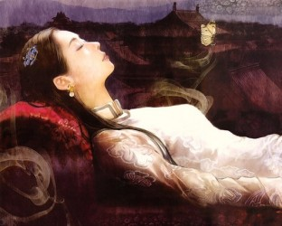
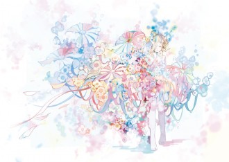
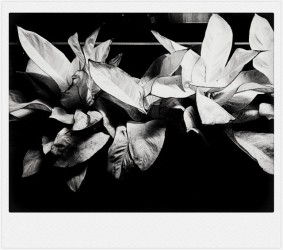

# 往事（上）

正月没过完，父亲就去世了。从确诊癌症到去世，刚好是三个月。死亡是他这一生做过的最顺利的事情。

他一辈子都不太顺。家庭出身不好——其实也只有奶奶是地主家的小姐，嫁过来的时候，爷爷只是一个乡下私塾教书的先生，家里有几十亩田，认了两个干儿子养在家里，还给娶了媳妇，解放后被定性为地主，两个干儿子也成了长工。爷爷当年是个儒雅的小个子男人，也许只有一米六，骨骼清奇，一副公山羊的长相，脸上总是似笑非笑——客家男人容易长成这种模样。他读了一肚子的书，脑子奇快，国民教育考试总是考全区第一名(当时区相当于一个镇)，后来参了军，入伍几个月，开始黄埔军校的学员选拨，他又是全区第一名入选。家里算卦，说他从军必死，于是连夜逃了回乡，隐姓埋名，老老实实地在私塾教书。跟他一起选上的同乡学员，后来都战死了，不是被日本人打死就是被共产党的军队打死。唯独他一人活到九十岁，儿孙满堂，还有一个孙子是同性恋——不过现在估计变成两个了。

奶奶年轻时是个美人，身高一米七，幸亏是大脚——客家女人都不缠脚。三伯四伯都说我二姐长得像奶奶，二姐听了挺不高兴，气鼓鼓的，因为我们第一次见到奶奶时，她就已经是个干瘪核桃驼背老太太了。奶奶一辈子都在生孩子，一共生了十个孩子，活下来五个，三个生下来的时候死了——那个年代的乡下女人都是一边怀着孕一边干活，也许在地里或者在灶边，突然就生了，生下来就地用镰刀或者拨火钳把脐带割断，谁能活下来全靠运气。幼年赶上三年大饥荒，为了保住男丁，只好饿死了两个女儿。最后生的是六叔，那时她已经四十来岁了——其实认真算起来，爷爷也并没有能操奶奶多长时间，她的前半生都在怀孕分娩坐月子和哺乳中度过，后来总算绝经了，但因为生了太多孩子导致钙质严重流失，四十多岁已经开始驼背干瘪。

三伯四伯生得早，五十年代高中毕业，考了大学。父亲高中毕业时，还在批林批孔，因为出身不好，没法上大学，只好回到镇上中学教语文。父亲家一众男丁都聪明，会念书，体育也好，都打篮球，三伯四伯和六叔身高都有180，父亲最矮，只有170——他五六岁开始长身体就赶上三年大饥荒，一天一顿糠饼。父亲文史地数理化都极好，连年考全校第一，踌躇满志要当个知识分子。成为语文老师那年，他还不到二十岁。因为家庭成分，也没有女孩敢跟他搞对象。白天教书，晚上撸管，周末打打篮球，我想他当时的生活就是这样的吧，跟现在的屌丝差不多。

语文老师也没能当多久，再次因为家庭出身被学校免职了。他跑去参加修铁路，赚工分，顺便逃离小镇生活的窒息。修了几年回家，比他小三岁的六叔也高中毕业回家了，俩人就一起下地干农活。老家是噶斯特地貌，跟《葫芦娃》里画的差不多，在三四十年前还极为闭塞，遍地石山，见缝插针地种些水稻玉米花生，抬头只能看见缓慢的流云，和山间的雾霭。这样的日子看不到头，也许一辈子就只能这样了。父亲应该有些失意，但未必会怨恨——怨恨谁呢？至少他父母没有被打死，他也从来没有走路上突然一泡屎砸脸上。他们一大家子人，一辈子都是毛粉，毛主席放的屁都是香的，抢着要闻，每次说起来都还是一副“毛主席英明，杀的全是坏人，毛主席恩情比天高”的振振有词模样，全然忘了自己饿死的亲人和被葬送的一生。有次父亲又在缅怀毛时代，歌功颂德，那时我上中学了，知道了一些历史，说了一句“你的毛主席是个杀人魔头”，他横眉竖目地眦着我，几乎就要像京剧里的老生悲愤地摇头“呀呀呀”唱起来。我心想：真无聊。从此不在家里谈论此类话题。

熬了几年，文革结束，恢复高考，父亲和六叔赶紧报名。报考者不能超过22岁，父亲就去派出所把年龄改小了两岁。考下来，两人英语都不及格，上大学没戏了，但分数线还是上了中专——那个年头，中专还是很热门的。一家考出了两个人，而且都是同一个学校，在小地方是个大新闻。当时的村支书不让他们出村，说他们跟不正苗不红，怎么可以出去上学！但无奈大势所趋，父亲一生中短暂的黄金时代开始了。

父亲学的是农学，其实就是种植水稻，六叔学畜牧。热闹的八十年代喧哗着汹涌而来。文艺之风大盛，父亲天资过人，在学校里自己学会了拉二胡，拉小提琴，我七八岁的时候，有天他从市里的百货大楼兴冲冲地买回来一把二胡和一把小提琴，从此每天晚饭后要拉半个小时的二胡，或者小提琴，《二泉映月》或者《梁祝》，拉完了看新闻联播。他也喜欢唱歌，音准节奏感都好，是和缓的男中音，最爱唱各种红色歌曲。也大概是我七八岁时，他买回来一个录音机，早上起来放红色歌曲的磁带，他一边刷牙洗脸喝粥一边跟着哼，带着深情的颤音。我和姐姐主要是用来放《笑话大王》，或者四大天王周慧敏。父亲不喜欢流行歌曲，每次我们听的时候，他就在一旁嗤之以鼻：唱歌跟念的似的，难听。

他在学校里人缘极好，交了一群朋友，还跟两个同学结拜为兄弟。他喜欢文史地理，过目不忘，关注国家大事（以毛左的立场），是个美帝阴毛论者，健谈，又是文艺爱好者，写得一手好书法和好对联，除了英语渣烂，他精通三种平话，以及客家话，桂柳话，粤语，壮语。好像他们那一辈人，学什么东西都是无师自通。我们这一辈，除了上网和看片学会更多性交方式，好像也没什么能超越的了。

父亲躺在清晨的光晕中睡着了，他不知道自己的生命还剩下多少时间。

这是我第一次这么近距离观察生病后的父亲。他瘦得只剩下一把骨头和一肚子的腹水，苍黄的脸皮裹在颅骨上，勾勒出一个完整的骨骼轮廓，脸上的惫态沉重，下陷的眼窝紧闭，满满的两窝疲倦，鼻孔随着呼吸张大——他鼻孔本来就大，配合前突的上颌，像极了历史课本上的元谋人，不好看，遗传到我身上，也不好看。他还没什么皱纹，头发也尚浓密，略带花白，染过的地方还是黑色，有几根眉毛尤其的长，出挑的一簇——长眉主寿。他今年五十九岁。

2月2号我从机场到家，父亲已经被送到医院了，我放下包就开始帮我妈卖货。两个姐姐都在医院。我妈一边卖货一边对我数落父亲：“救护车都到家了，他跟我说最担心他死了我怎么办，你们三个都在北方，那么冷。我说你担心什么，你死了我就吃耗子药跟你一起死，下去帮你洗衣服。你担心我就别死那么早。”我妈威风凛凛地把硕大的被子“啪啪”甩齐叠好，装袋，找钱，一气呵成，买被子的乡下女人目瞪口呆。

我们家的女人就是这样，大嗓门，一口血。两个姐姐前后脚回到家，凑在一起嘀嘀咕咕说父亲怎么爱撒娇，爱演。说早上救护车到家，父亲马上呻吟着作势挣扎站起来，给身边的老伙计使眼色，他的老伙计就跟他肚里蛔虫似的，一把揽起他。两个护士说还能走吗，要不要去抬上车。我妈说不用不用，还能自己上三楼上厕所。父亲瞪了她一眼，摊在老伙计身上长吁短叹地虚弱地挪，护士赶紧推着床车下来了。——他简直是太迷恋这种被照顾的，病人的感觉了。到了医院，父亲跟大姐说：“我刚才还想骂你妈！救护车都到家门口了还说能自己走！”大姐边说边笑，二姐翻翻白眼，没做声，我笑死了。

他有几天肚子胀得难受。二姐刚到家第二天一大早，大姐冲上三楼拍她起床：你爸要死了！躺在床上倒气！快起来！——我们都这么说，“你爸”，好像不是自己亲爹似的。我妈也以为他要不行了，跑去买了屎盆尿盆，预备搬地上。结果父亲只是胀得厉害，丝丝吸气，入戏太深，一副垂死的样子——他以前牙疼，都要躺在床上愁眉苦脸好几天。

二姐撇着嘴：“他现在还只是腹水胀，一点都没疼，就已经这样了，要是真的开始疼了，岂不是没几天就垮掉了。天天长吁短叹，吃什么药都是心烦腰子胀（我们的土话），吃了几天没看到明显效果就心灰意冷，吵着要换药。一个月换了七八种药。又不是仙丹，怎么可能吃两天就见效。第一个月吃利尿片排腹水，吃了几天又不吃，说排尿多体虚，然后胀得不行了又吃几天，又停。自己跑去找各种中药偏方，吃了就拉泻，没几天就瘦得不成人形了！医生说要是坚持吃一个月利尿片，腹水早就排得差不多了，怎么可能像现在，积了八升腹水！现在腹水那么多，吃什么药都没效果了！现在还吵着要抽腹水，医生不让，说抽腹水之后食道会出血。他现在只是腹水就已经这样了，要是真的看见自己吐血，岂不是要活生生吓死了。他在医院不停叹气，我跟他说不要给自己心理暗示，要往好的方向想，六叔也骂他天天叹什么气，都还没怎么严重，结果他闭上眼，头一偏，表示不想听了。他不想听我也懒得说了。他要是死了也是被他自己折腾死的。”二姐咽咽口水，一脸厌恶的表情。

嘀咕完，她又把大姐的女儿抓过来，试验新买的卷发棒，烫了一头卷毛，小女孩儿屁颠颠跑上楼去找外婆炫耀，我妈看一眼，皱皱鼻子：“难看死了，卷毛狗。”继续麻利地炒鲶鱼。大姐跑去借了一辆电动车，她预谋着穿我那件驼色的带风帽学院式大衣，戴上眼镜和口罩，吃了晚饭骑去县医院守夜——巴士最晚是六点。出门前她认认真真地上了一脸的粉底，防灰尘，黑色短裙，黑色丝袜，黑色高跟鞋，不知道还以为她去偷情。末了她跨着电动车出门了，后座上是一大包守夜工具。抱怨归抱怨，该照顾还是得照顾。

大姐是父亲最疼爱的孩子。那是他一生中唯一辉煌的时期。中专毕业，分配到镇上的农业推广站，铁饭碗，收入不低，娶了镇上唱歌最有名的前文工团女队员，一年之后生下粉粉嫩嫩的女儿，吃用都舍得花钱，抱出去，镇上的人看见了，都叫她“白兔”，爱不释手。

我看过父亲年轻时候的照片，不高，结实，宽肩，留着一个愣头青的寸头，高颧骨四方脸，五官长得不好看，鼻子太扁，嘴巴太突出。我妈矮矮圆圆像个俊俏的小母鸡，天生的波浪卷发，高鼻梁，深眼窝，丰满的嘴唇，在文工团的时候有不少男人喜欢她。但我妈是个头脑简单的女人，在文工团里只顾唱歌，有点儿一根筋，谁也不理，最后成了大龄女青年，相亲认识了一个在推广站工作的男人，觉得各项条件尚可，就嫁了。我记得有一年，大概是小学四五年级，有天家里来个客人，个子高挑的叔叔，一双桃花眼，高鼻梁，好看饱满的嘴唇，我妈跟他说话客气，他看我妈眼神暧昧忧伤，父亲站在一旁，臭着脸，说，时间不早了。我偷偷问我妈：妈，那个叔叔是谁，我爸为什么这么讨厌他。我妈说：那是我在文工团时候的同事，追过我，但那时候我觉得他轻浮，没理他。我说，妈，你好傻啊，你跟他结婚多好啊，他比我爸好看多了，这样我们也比现在好看。我妈捏我鼻子：“跟他结婚，就没有你们了。”

我妈不聪明，好歹念到高中毕业，因为家里成分不好，是破产地主，终于不用上大学，鬼使神差进了水利文工团当歌手。她是柔和的女中音，唱歌余音袅袅，演得最多的是《红灯记》，跟着修水利的大部队一直到处跑，一有机会回到离家里近的地方演出，就把文工团化妆打底用的凡士林偷挖一大块带回家给外婆抹脚。演了几年退下来，回到镇供销社当店员，接小老太太的班——外曾祖父的小老婆，我妈五岁就来跟着她一起生活。外公在乡下，要管一个中学，外婆体弱，带不了六个孩子，我妈遗传了外婆的体质，都说会夭折，外曾祖母就把我妈带出来了。后来大姨三姨四姨提到这个都觉得自己委屈，遗憾自己为什么没有摊上一副病体。她们中学没念完，就要下地干活，种水稻甘蔗红薯木薯，喂猪喂鸡喂鸭，砍柴拔草，一年累死累活做牛做马挣几个工分，供我大舅小舅上学。

生了大姐，父亲虽然疼爱，但仍然不甘心。三伯四伯都有两个儿子，他这一支也不能让香火断掉。计划生育开始了，他工作后已经转成非农户口，只能生一个。纠结了一年多，他终于决定破釜沉舟，冒着被开除公职的风险，再生一个。母亲怀了三四个月的时候，终于瞒不住了，领导把我爸叫去，问是要打掉还是要开除。当时镇上尚无B超，算命婆子都说我妈这胎怀的是男孩，我爸一咬牙，说不打了，直接收拾东西，跟着我妈回俩老太太那儿。老太太已经把她们工作一辈子的百货日杂店盘下来了，以前叫做供销社合作店，公私合营，盘下来了留给我妈，让她回来接班。

我妈怀胎十月，在冬天最冷的时候分娩，生下来一开腿，是个黝黑瘦小的丫头，哭声巨大，手舞足蹈，后背一片浓密的胎毛，像足了小猴子。我妈长叹一声，让接生婆子拿去茅坑里淹死，随即又抱回来，把嗷嗷大哭的小丫头靠在自己的胸前，一边喂奶一边掉眼泪。父亲进来，看到如此这般，面色死灰，知道自己大势已去。

工作丢了，生的又是女儿，还罚了三千元——他工作几年的全部积蓄。他恨自己刚出生的小女儿，把一切都归罪到她身上。二姐脾气爆烈倔强，爱哭闹，一哭就被打。到了两岁会说话了，父亲再要打她，她就叉开腿站在床上，用婴儿的嗓门恶狠狠地威胁父亲：再打我就尿你们床上！又是拎起来一顿好打，二姐屎尿横飞，鬼哭狼嚎，大老太太心疼，流着眼泪过来拦，抢了抱走。从此二姐跟着大老太太睡。大姐在父亲被开除回来之后，跟着小老太太睡。两个老太太带着两个女儿，父亲酝酿生第三胎。

父亲脾气大。两个老太太三十多年没跟男人一起生活，家里突然多了个大男人，诸多不便。小老太太说话不好听，终于忍不住说了句“老覃住进来以后，屙尿都要顶着门”。我妈气极，回嘴“你都老皱了，谁还要看你”。小老太太年轻时也是个美人，虽然老了些，快七十了，但也还总疑心别人对她不怀好意。父亲知道后，二话不说，收拾了行李，跟着几个朋友到了外省，收兔毛，最远到了湖北，在武汉长江边的黄鹤楼前照了张照片，穿着阴魂不散的文革式绿军装，神色郁郁。

但是贩兔毛这门生意最终还是做不下去了。父亲东奔西跑了一年多，没赚到一分钱，落魄地回来了，穿着灰绿人字呢西装，蹩脚的领带，镇上的人看见他这副模样都笑他“扎鹅喉”。他咽不下这口气，继续操我妈，我妈又怀上了。都说这次肯定是男孩了。不过父亲也不怕了，如果还是女儿，就继续操我妈，继续生。反正他也不用再担心被开除。顶多罚钱。

生下来就是我了。出生那天刚好是清明，父亲进来，一看是儿子，立马飞奔去买了一箱大轰天炮，跟着族里的兄弟去祖坟扫墓，告诉先人自己没有断子绝孙——他真是太乐观了。

生完我，他们夫妻俩就被拉去结扎了。这样也好，一辈子不用戴套，省钱，环保。而且还省事。我跟男人们上床，经常口交了半天，他们硬到了极点，手忙脚乱要戴套，一下子就软了，一整夜再也硬不起来。我总疑心是我的原因，后来才知道戴套会分散注意力，他们由是软下来。

我给父亲喂粥。一小口一小口，不能急，不能烫。他啄着吸进去，在嘴里回溯了半天才咽下，非常像大猩猩。他因为之前乱吃中药催泻排腹水，导致电解质紊乱，患上厌食症，每次只能喝几口粥，喝多了会反胃呕吐。

小时候我生病在家，也是父亲喂我喝粥。幼时体弱，动辄扁桃体发炎，发烧（现在深喉多了还是会扁桃体发炎）。病了不想吃饭，父亲就一口一口地用白瓷勺子喂我，怕烫着我，还每一口都预先连勺在他嘴里过一下，舌面贴着勺底，确定不烫了，再取出来喂我。不知道这是哪个时代遗留下来的传统。父亲抽烟，一口黄牙，我虽然年纪小，心理上也觉得不舒服。但我又怕他，只好跟他面对面坐在小板凳上，任由他喂完。

我从小跟父亲不亲。我出生后没多久他就去了海南。当时海南开发刚开始有点苗头，父亲拎着一个行李包就过去了。他一个学农的，在一个地产浪潮里，能做什么呢？找工作确实不易，尤其是父亲这种，还有心气的。他住在十几块钱一天的小旅馆里，每天为钱紧张，这种恐怖的心理，我大学之后也有过好几年，掰着手指头过日子，深夜想尖叫，而且不敢哭，绷着背，一哭就崩溃了。

我妈带我睡到三岁，我喝母乳也喝到三岁。都说是最后一个孩子，喂久一些也无妨，于是喂到了三岁，这才紧张了。我出生的时候大姐快五岁，二姐快三岁，她们也央着要喝奶，我妈就顺便喂了几口，味道不像她们断奶后喝的奶粉，就不再闹着了。我牙长全了，也有记忆，记得我妈为了让我戒母乳，听别人的支招，把饼干放在马桶盖上让我去捡了吃。我果然捡了吃了，似乎也没有再闹着吃我妈的奶。

三岁开始跟小老太太睡。二姐还是跟大老太太睡，她睡觉闹，大老太太就掐她屁股。小老太太睡觉轻，会时常醒来给我盖好被子。她其实一辈子也没有孩子，但比大老太太好些。大老太太一辈子都是处女，她是童养媳，丈夫还没来得及成年就被拉壮丁，上了抗日战场，战死了。她从夫家逃出来，入了拜佛会，跟小老太太结拜姐妹。

小老太太背上有一个巴掌大的肉瘤，形状和手感都像乳房。应该是良性的淋巴肿瘤，长了几十年了。我尚未完全脱离哺乳期，晚上要摸着那个肉瘤入睡。我妈怀了我二姐，小老太太帮着带我大姐的时候，大姐才一岁多，也没完全断奶，晚上哭闹，小老太太就用自己干瘪的乳房喂大姐，但她不出奶，大姐吸了几回，小老太太觉得火辣辣的疼，就不敢再喂。

不多久，我妈就摔伤了大脑。她早上空腹洗衣服，低血糖，突然晕倒了，向后仰去，后脑勺磕在大石块上。我在旁边看着我妈向后倒去，也并没有知道害怕。大老太太看到了，奔去叫人。然后是手忙脚乱地抬去医院。醒来后有一阵是疯的，谁也不认识，什么也不知道。我趁乱跑去找一个远房的表姐玩，那时候女人流行在头上戴大朵的绢花发夹，我就跟着表姐去挑花发夹。满满一摊的各色绢花，看得我欢喜极了。

1990年，家里没有电话，给父亲拍了个电报。一个傍晚我们正在吃晚饭，小老太太跑进来跟我和姐姐说，你爸回来了。我们都放下筷子，只见一个高大的男人（那时候我们都矮小）拎着旅行包急匆匆跨进门来，嘴唇上是一把刷子似的黑胡子，身上是绿军装。这就是我对父亲的第一个记忆了。他从海南买回来一旅行包的青芒果，酸涩，我们都不爱吃，硬着头皮吃几口就扔了。

父亲开始带着我妈四处看病。先去了柳州，那时小舅已经调到了柳州的医院。父亲带母亲去了柳州精神病院，治了一个月，精神分裂的病情控制住了，但留下了后遗症，每半个月会犯病一次，胸闷，透不过气，用我妈的话说，就像是“被鬼打了”。他们在柳州的期间，小老太太在厨房滑了一跤，一条腿断了。当时我也在场，但同样没有害怕，又跑出去找表姐买花去了。

父亲带着我妈赶回来。只记得那是一个上午，阳光非常亮。我坐在门店的木沙发上，几个街坊的女人跑进门说，“弟弟，你爸和你妈回来了。”我抬头一看，先是我妈进来，逆着光斜斜靠在卖货的玻璃柜台上，瘦骨伶仃，要飘起来的感觉，父亲拎着大旅行包跟着旁边，外面明亮的街道在他们背后，如梦似幻。

父亲从此就在家里住定了，不再外出找工作。有一阵他四处寻找偏方，找到一个，睡前用一只碗装小半碗酒精，把一只鸡蛋连壳放入其中，点燃酒精，蓝莹莹的火焰，非常好看，也非常香，像鬼把戏，把鸡蛋烤熟以后给我妈吃。我偶尔也闹着吃，我妈就给我掰一小块，其实也没多好吃，但因为觉得是治病的东西，有种刺激感。我妈吃了半年，也没见什么效果。

我也该上幼儿园了。开始是父亲每天骑自行车接送。赋闲在家的父亲，除了帮忙店里的生意，就是下象棋。他每天中午在隔壁理发店跟各种棋友下象棋，声势很大，都是摩拳擦掌的样子。到了时间，我就要去催他，催着催着，我也厌烦起来，索性跟姐姐走路去学校。

小时候家里只有自行车，一辆是父亲的大二八，一辆是我妈的二十六寸永久。每次回乡下老家，或者外婆家，父亲就后座载着两个女儿，前梁搭一个藤编的小椅子，载我，我妈的后座是鸡鸭鱼肉。一路骑十几公里回去。那时候都是黄土石子路，一个小时颠簸下来，谁都屁股疼，中间要下车走两次，放松臀部肌肉。路边全是《葫芦娃》里的那种石山和岩洞，似乎还停留在上古时代，有山妖，山鬼，和各种采药砍柴的奇遇。

我五岁那年，父亲又听说百色有个医院，治好了许多我妈这类的病人，又兴冲冲要过去。刚好我暑假，就带着我一起去。第一次一大早坐长途大巴出远门，很兴奋。路上看到什么都是新鲜的，在宾阳的车站转车，觉得这个地方大而繁华。中午到了平果县，在车站吃饭，是快餐，配着淡寡的汤，漂着几片葱叶子，由于从未喝过，我也觉得是天大的美味。过了平果就开始修路，堵了几公里长的车，我们寸步难行，一旁是各种大头工程车忙碌地来去，我也是第一次看见这种车头如此庞大的卡车，非常着迷，全然想不到二十年后自己会在这种工程车上跟司机性交。父亲焦急地跟旁边的人打听，都说这些日子都这么堵。他担心不能在天黑前到达百色。

晚上到了百色，医院在市区的一座小山上，山下是一个水电站，就着路灯慢慢走上山，办了住院手续，分到一间病房，雪白宽敞的大床挂着圆形的纱蚊帐，像是旅馆。第二天开始给我妈检查身体，医院的过道有称体重的称，父亲站上去，140斤，我妈站上去，78斤，我妈一只脚还在称上，我就抢着跳上去，结果变成一百多斤，三个人都哈哈大笑。

检查完，父亲带我妈下山逛百色市区。白天有许多小孩子在水电站的水库游泳，套着花花绿绿的小游泳圈。我看见了很是羡慕。百色市区不大，除了几座七八层的苏联式建筑，剩下的全是拥挤热闹的骑楼街，卖百货日杂，或者芒果香蕉荔枝龙眼，也有卖玩具的，店面挂着许多小游泳圈，我因为想要，印象尤为深刻。但我知道不应该在这上面花钱，咬着嘴唇，死死忍住不说出来。

回到医院，医生说小孩跟着影响治疗。父亲第二天又把我送回家。傍晚到了家，大老太太正在收摊，把木板窗的木板装回去。父亲吃了饭，洗澡睡觉，第二天又赶去百色。这一路风尘仆仆，不知道什么样的希望在支撑他坚持下去。

在百色一个月，效果不错，出院回来了。到家也是傍晚，我妈晕车，还在头晕，但脸色红润，坐在天井洗头，洗完头，蓬松着大卷发给我们拿小面包，大白兔奶糖，还有好吃的杨梅，我妈抱着我，大家都喜气洋洋的。回来有半年我妈没有犯病，都以为好了。突然有天，我妈又“被鬼打了”，父亲又开始打听医院。

我上一年级了，父亲终于打听到太原有家医院，专治脑部神经受损。又买了南宁到北京的火车票，一张硬座一张硬卧，晚上我妈睡，白天换父亲过去睡。坐了三十六个小时到北京，再转车去太原。同样是治了一个月，以为治好了，又出院了。在北京停留一天，父亲趁机去了故宫，我妈不爱游玩，在中山公园的长椅上独坐了一上午。父亲出来，他们又去了毛主席纪念堂，排队看了他们敬爱的毛主席。又在天安门广场的四个方向拍了四张照片，现在回想起来，我知道是宝丽来相机拍的，相纸颜色透着淡淡的绿，非常美丽。父亲还是那件文革式的绿军装，鲁迅式的髭须，浓黑的头发梳成背头，港片里黑社会老大的模样，我妈是麻花辫，白色涤棉衬衣，靠着父亲的手臂，浅浅的笑容里有倦意。

在火车站，他们第一次看到有人卖草莓，尝了觉得好吃，又便宜，七块钱一斤，买了五斤，装在塑料袋里，夏天，没到半路，草莓就全都烂了，他们只好忍痛扔掉，心疼极了。到家了还一直在说，草莓是如何红艳欲滴，如何酸甜可口。他们描述得太美好了，以至于我第一次真正吃到草莓时，略感失望。

这一次又是只好了半年，我妈又再次犯病了。她打算不再去治了，就吃一辈子药吧。两个老太太干不动了，店里全部交由父亲和我妈打理。父亲每三天去宾阳进一次货。当时镇上百货日杂店寥寥无几，生意好。我妈每次治病都花掉一万元。我们三姐弟开始上学了要花钱。但是小学一年级那年暑假，镇上建成了一条街的商品楼，全是两层的小白楼，总共两百平米，五万元一幢，我家也买了一幢——可见当时赚钱多容易。

父亲这一生是不可能大展宏图了。他昔日的同学都已经开始成为各个县的农业局局长。他守着一个百货日杂店，一个身体有病的妻子，三个孩子，两个老人，他的希望只能在我们身上。搬入新房那一天，父亲让我们凌晨四点起床，五点天还未亮，他挑着一箩食物和一箩衣物，举着火把，带领我们姐弟三个穿过还在睡梦中的旧骑楼街和旧浮亭，走进新房子。他相信这样能让神明祖先保佑衣食无忧，三个孩子都聪慧如启明星——但他其实是无神论者。

父亲和我妈没有搬过来。他们还住在旧房子里，守店面做生意。我们姐弟三个和两个老太太住新房子。我跟小老太太住在一楼的房间，二楼的大房间有四十平，可以放两张床，一张床大老太太睡，一张床大姐和二姐睡。还有两个房间，一间是客房，一间是杂物间。新房子后面是池塘，我们在后门的小半岛上种了凤仙花，指天椒，和木瓜，二楼的卫生间直接通池塘，拉屎全都让池塘里的鲶鱼吃了，它们都由此长得异常肥大。

每天在旧房子吃晚饭。小老太太腿瘸了，走路不方便，我们吃完就用保温饭盒装了饭菜过去给她，她吃不完，我再吃一顿。家里买了彩色电视，装了闭路线，可以收到香港的中文台。那是我印象里，家庭生活最美好的一段时期。

（未完待续······）

（采编：孙晓天，责编：佛冉）
