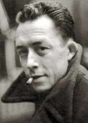
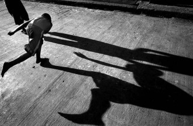
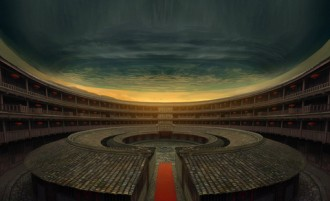

# 往事（下）

守坐到上午十点，我困得不行。这些天每天都睡不够，随时都能歪着睡着。我妈让我先去睡一会儿。我就进了房间。床上也睡着一个人，是五堂兄。

他这些天也是每天只睡三四个小时，前一晚更是几乎没睡。我上床，他醒了一瞬间，看见是我，就把身体让了让，我爬上床，贴着他后背睡下了。

迷迷糊糊睡了一会儿，我翻身，习惯性地把手放在他身上——手冷，和男人睡觉我都会下意识把手搭在男人的身上。五堂兄没有避让的意思。我就心安理得地搭着他睡着了。

没多久，五堂兄也翻身了，仰躺，我正要把手拿开，他的手就一下把我的手抓住了，紧紧握在指掌间，非常用力，简直是想把我捏碎，安放在他的肚子上。我心里一惊，瞬间明白了。脑子里一阵电光石火，像是放烟花，十分喜悦。但父亲刚去世，这么喜悦不合时宜，我抬眼，向着天花板道歉了几句。

五堂兄的手大而温暖，他一直用力地紧握我的手。从前小冰和猪也喜欢拉着我的手，在下晚自习走回宿舍的黑暗里，在课堂上的抽屉里。但他们都没有五堂兄这么用力。所以他们最后都离开了我——当然，五堂兄也会离开我的。

突然有人进房间，我们两人都一惊，仰起头来，但是装出梦中惊醒的样子。是几个兄长开始把客厅的东西搬进来，准备入木了。但是五堂兄仍然一直紧紧抓着我的手，转过脸温柔地对我说：没事，我们继续睡吧。

我点点头，又继续睡着了。但其实是半悬着，一线意识始终停留在五堂兄的手里，像是风筝，一举一动都受他牵制。我知道我在这个时候需要一个人给予安全感，他应该也这么觉得，所以才会这么一秒钟都舍不得放开我。

终于二堂嫂进来把我们叫醒了——棺材装好了，要开始入木仪式了。我跟五堂兄爬起来，出了房间，我对他又是一副淡漠的样子，几乎不看他一眼。

村里一个善作法事的堂伯父吩咐三堂兄用石灰浆把棺材的缝隙和洞眼都糊住，防止漏水。然后倒入一整麻袋早上烧好的草木灰垫底——吸水。然后铺上黄裱纸，一层一层，大概有二三十层，又用香棍在黄裱纸上摆了交叉十字的形状，每个交叉处摆一个硬币，然后又继续铺十来层黄表纸。在头部的地方压了三片瓦，敷上黄裱纸，就算完成了。

棺材非常小，而且薄，看起来只有一寸厚，我忍不住在心里惊笑：怎么会这么小！现在的人真是会偷工减料。小时候看到的棺材，都是两寸厚的油亮大木。旧小说里写的都是穷人家才用这么一寸薄棺。红色油漆也上得非常潦草（当地习俗，男红女黑），棺材两头的“福”和“寿”字也像涂鸦。父亲肯定觉得自己死后被亏待了。

堂伯父叮嘱我，一会儿我要站在父亲的头前，用手托起他的头，跟其他人一起把他放入木中，放定的时候要低头“唉唉唉”悲叹三声，以示哀切。

入木时辰到了，我走到父亲头顶，姐姐在两旁，堂兄们在腰间和腿部。我蹲下，把手插入父亲头下，顿时又是一惊——怎么这么湿漉漉的！人死之后都要排出身上的液体，父亲又是带着这么多腹水去世的，身上排出的体液把裹尸布都浸透了。

堂伯父在父亲耳边一拍惊堂木，大喝了一串经文，然后说“起！”我们就同时将父亲抬起来了，慌乱地移到棺材中，怕把他碰坏。手里是一把湿湿的沉重。百忙之中我还记得扭头看地上的草席，已经濡湿了一个人形印子。放好父亲，我低头“唉，唉，唉”悲叹了三声。对着父亲被白布层层裹住的脸，我突然又想到那天晚上他炙热的眼，眼泪一下就出来了。

入了木，堂伯父就招呼旁人把棺材盖好，钉上。黄表纸垫得太厚，父亲的头部有点盖不下，堂伯父就用力往下压了压——我心上一震：该把父亲的脸压扁了。但他们也顾不了这么多了。

我去洗了手回来，堂伯父又用惊堂木在棺木上一拍，大喝一串经文，然后喝“升！”——这叫“升棺”，如果不这样，棺材就跟粘在地上一样，起不来。旁人一下抬起棺材，放在两块大水泥砖上。这时就可以哭了。满屋的女眷“哇”一声集体哭起来。我一个人站在棺材头，默默流着泪。有些茫然。

一闭上眼，就是父亲那双炙热的眼。他知道我不希望他活下去。

他如我所愿死了，我又在伤心什么？

我不出声地流着泪向棺材里的父亲道歉。为我这些年跟他的冷战道歉。为我的每次负气道歉。为我不能满足他的心愿道歉。为我对他的不耐烦道歉。为我前一天还在跟他赌气道歉。为那天晚上他的炙热眼睛道歉。

也为一个小时前跟他最忠厚，最尽心的侄子捅破了窗户纸道歉。

我妈和我姐站在女眷最前沿放声哭着，十分委屈的样子。她们不管说得多难听，心里仍然是万般不舍。我妈身体不好，哭久了会抽筋，我姐她们俩哭了一会儿，就开始给我妈抹眼泪，让她收住。我妈哭着说：“以后你们就没有爸爸可以叫了。”

我始终没有说一句话。后来我搬了把椅子，坐在棺材的左边。五堂兄也坐下了，给我点了一根烟。我拿着烟对着棺材发愣，突然想到《局外人》里的男主人公，在母亲去世的时候抽烟，由此成为他被判死刑时的佐证之一。我现在不止吸烟，还对父亲的侄子下手了，我又会遭到什么样的审判？

灵堂架好了。棺材两边都铺了草席，男左女右，我们就坐在草席上守灵。地上太冷了，姐姐从家里搬来一个电取暖，放在女眷那一边取暖。又偷偷把火盆搬到了最里面，我们就轮流过去烤火，吃橘子，或者玩手机。不知不觉就天黑了。管饭的人端了饭菜摆在地上招呼我们吃饭。我们就蹲在地上围成一团吃饭。吃完饭，法事就开始了。

做的是三教超度。我知道一个是佛教，一个是道教，还有一个看不出来是什么教，估计是某种本地教派。轮流念唱了一夜。我们一直在草席上坐着，有人来上香，我就领头跪在草席上磕头，他们拜一下我们就磕一下。到了十点多，开始颂往生经文。三个法师班分别领着我到屋外的颂经处，带着我诵经。我头戴三角孝帽，右手持孝棒，孝棒抵在右脚面上，弓腰捧着香炉跟在他们身后，亦步亦趋。还在下小雨，他们用彩色帐篷遮在外面的菜地上，地上摆着供奉的桌子，墙上是三教的神像，释迦摩尼佛，玉皇大帝，还有一些其他神明。三个回合下来，就该行孝了。

行孝是超度法事最重要的一个环节。逝者的所有子女，侄子侄女，孙子辈都要上阵，手持一根香，跟在法师身后，绕着棺材一圈圈走，每走一圈向棺材上的簸箕放一张纸币，五毛或者一块，意喻还父母恩，直到法师将一整本行孝经文唱完。一般走一轮需要两个小时。当然，这也是做法事的师傅的收入之一。

照例是我打头阵，身后是二堂兄，三堂兄，五堂兄，六堂兄（大堂兄01年出车祸死了，四堂兄是另一房的，已经多年不跟我们这一房联系），然后是大姐，二姐，二堂嫂，五堂嫂，剩下的几个堂姐，和几个堂兄堂姐的孩子。

第一轮下来，休息十几分钟，大家排队上厕所，喝粥补充体力。二堂兄和六堂兄走完第一轮就去睡觉了。我们继续走第二轮，开始有人体力不支，陆续离队休息，然后再回来继续走。二姐也进我妈休息的房间休息了。我走了一半，困得不行，到我妈休息的房间睡了一会儿。大姐继续走着。第二轮走的人少，听说法师有些不高兴。第三轮开始，大姐进来把我和二姐叫起来。开始是必须有亲生子女的。

又起来走第三轮，走完一炷香，五堂兄也撑不住，进房间睡觉了。我又坚持走到身上的钱终于用完了，觉得再继续走也没有意义，也进房间睡觉了。最后就只剩下一群女眷在走。已经是凌晨五点多。

六堂兄在躺椅上睡死了。五堂兄在床上睡。我爬上床，他醒了，替我掀开被子。我见他脱了外套孝衣，便也脱了外套孝衣。钻进被子里，挨着他睡，手很自然地放在他的肚子上，他的两只手也很自然地紧紧抓住我的手，给我取暖。我就靠着他的上臂睡着了。

睡了大概两个小时，我醒了。四处静悄悄的，行孝的仪式已经结束了。我突然想到葬礼结束之后，就没有机会再和五堂兄睡了，有些不舍，于是整个翻身过来，抱住他的腰，他手臂张开，把我揽到他的怀里，一只手抚摸我的头发。

我搁在他小腹上的手臂正好压在他的下体。我感觉到他在剧烈地勃起。一下一下地跳动，似乎要挣脱出来。我把手掌覆盖在它上面。它持续跳动着，我大致感受了一下，不是很大，跟我的差不多。我们家果然是祖传的小鸡巴啊。不过四十多岁了还能勃起得这么用力，看来五堂兄的性能力不错。我用手指压了它一下，它又一下弹起。“真顽皮。”我想着，又按了一下。五堂兄在我的头顶兴奋而又紧张地不停咽口水——我知道，这是男人感到刺激时的生理反应。后来他把双腿屈起了，因为秋裤压着难受。

我想：我爸刚闭眼，我就跟他侄子搞上了，真是不要脸。

于是拼命忍住了没有给五堂兄口交。到处都是人，口交完又没法吐精液和清洗，只能咽下去，起床还得糊着一脸唾液精液继续守灵和做法事，对父亲太不敬。还是不要口交好了。迷迷糊糊又睡着了。

不多时，六堂姐进来叫我起来。我扑腾跳起来，不知道她有没有看见我跟五堂兄抱作一团。要给父亲过十殿了。法师领着我，在十幅神明的画像前诵经，大致是在每个殿前为逝者消除生前的罪孽，免下地狱。又唱了一个小时，休息了一会儿，吃早饭，又开始过奈何桥了。

雨终于停了。法师在院子里用椅子和床单搭了一座桥（还真挺像一座斜拉索桥），在上面用香棍交织成菱格状，手持雄鸡，诵着经领我们一圈圈绕着桥走，照例是我领头。每走一圈也都要往桥上放一张零钱，意喻为亲人买通道路，顺利往生。又走了一小时。终于结束了。

重新回到灵堂，给大批赶来上香的亲友跪地磕头。大舅小舅也都来了，我照例要跪在他们面前，悲叹三声，他们再将我扶起，嘱咐节哀。如此这般到中午。期间五堂兄一直在我身边照顾，细致到帮我把脱下的鞋子拿回房间放好。六堂兄不知道起床时有没有看见我们在床上的样子，总觉得他看我的眼神有些狐疑。

吃过午饭，就要准备出殡了。先是起幡，法师在屋后砍了三根竹子，竹子上挂着写满经文的长长的白幡，插在地上，呈三角形，竹根捆绑一只雄鸡，我们跟在法师身后绕着三根竹幡鱼贯而行，最后法师将白幡点燃，灰烬随风散去。起幡前二堂兄叮嘱我说一定要哭号，但是人太多了，我觉得很难为情，死活哭不出来。

起幡之后，我需要去给两个舅舅跪拜敬烟，然后他们还礼，把我扶起。两个姐姐同样要给两个舅妈跪拜。之后是临行敬酒。法师诵经，我听从他们的指示，跪在父亲灵前，给父亲倒酒，敬酒，最后一杯我要喝下。突然又想起那天晚上，他说敬我，说“祝我父健康长寿”，那双灼灼逼人的疲倦的眼。我这一生都在辜负他。仰头把一杯白酒喝完。此生不再见。

其余人也依次下跪倒酒。之后，旁人将灵堂拆了，挪到大厅的左侧。大厅中间就只剩下棺材。二堂嫂把我名头的新床单，我妈名头的新床单，我姐名头的新床单覆盖在棺材上。她又叮嘱我说，出殡的时候是棺材脚先出门，我一定要紧紧跟在棺材头的左侧，把手搭在上面，起棺的时候我要踢一脚垫棺材的水泥砖，同时回头看大厅的祖宗灵台一眼，并且，要一路哭号。

大概是她从来没看见我为父亲哭号，也觉得心寒。

村里十个青壮劳力来抬棺材，人称“十字军”。法师照例唱了一段，最后惊堂木在棺材上一拍，大喝一声“起！”，十字军就一股气将棺材抬肩上，大踢一脚水泥砖，快步出门，我扶住棺材头左侧，踢了一脚水泥砖，扭头回望一眼，紧跟着他们出了门。哀乐四起，戴着草帽女眷们跟在后面哭号奔走——也是习俗，亲人去世，出门都要戴草帽。大舅的儿子，我表弟贴身跟着我，给我打一把黑伞。

太阳出来了。十字军走得飞快。我在他们身后手扶着棺材，低头快步跟随，却死活哭不出来。不知道为什么，没有眼泪。当着这么多人的面哭号，我也觉得难为情——几乎从来没有让别人看见我哭。

到了山脚下，我和二姐就要返回了，而且不能回头看父亲。我站在路边，突然忍不住开始抽噎，二姐也过来了，她也在抽噎。表弟给我打伞。我们三人慢慢走回去，需要跨过一个燃烧过的稻草堆。舅舅和舅妈在稻草堆旁等我们，到了两个舅舅跟前，我照例要跪下。跪下的瞬间，我突然哇一声哭起来了，眼泪再也止不住。舅舅们把我扶起，安抚了我几句，我就一路哭着走了。表弟跟着给我打伞。五堂兄也跟上来了，随我身旁，默默无言地担忧看我。我一路用两只袖子轮流擦拭眼泪。世界上从此没有父亲这个人了。

回到祖屋，看到我妈，也是眼睛红红的，但也感觉一件冗长繁重的事情终于到了尽头。有种解脱感。因为我要回北京上班了，不能戴满一个月的孝，法师就给我念经洒水，解了孝服。

然后就是招待亲友们吃最后一餐，送客。作鸟兽散。照例我还应该继续守灵，直到头七。但是我太想回家洗澡睡觉了，于是就跟着我妈他们回了家。堂兄们晚上在灵堂打地铺守着。

回家洗澡，把全身的衣服都换了，坐在沙发上打开电脑查收邮件。两个姐姐和我妈在旁边算账，她们说六叔做的帐不清楚，多算了几千块钱，也不知道花到哪儿去了。姐姐非常气愤，说六叔就会做嘴上人情，做什么从来都是赚的。葬礼上的菜色小里小气，别人都说得难听死了。这样的菜色都不值一百块钱，结果却算出来这么多钱。她念中学时一度在六叔家搭伙，吃尽了他们夫妻俩的白眼。

二姐又翻箱倒柜，居然找到了父亲珍藏的存折，一算，居然有十几万。大概是我大学毕业之后存的。我妈都不知道他居然存下了这么多钱。“怪不得你爸之前老是说，再做几年生意，我们就去县城买房。这个狗屌的，我之前说每天存十块钱，留给你上大学，你爸还骂我，说你这叫什么攒钱！”我妈说着又哽咽起来。

大姐的公公，二姐的男朋友都还在，家里人太多，房间不够睡，我就在沙发上睡了。第二天一早起来，赶回乡下给父亲扫墓。到了老家，六叔嫌我们回来晚了。我妈生怕我二姐又跟六叔吵架，于是率先跟六叔争辩起来。说人多车少，怎么也得分两次才能回来。

父亲的墓在三伯的墓旁。三伯在父亲查出肝癌之后一个月去世，先走了两个月。两座新坟在一起，不寂寞。

扫完墓，回二堂兄家里吃午饭。满满一屋的亲友坐着，五堂兄没跟我坐一起。我疑心他可能是对我父亲有了愧疚感，于是开始远着我。我也便不理他，坐在了女眷那一桌，自顾自吃起来。吃了两大碗饭。

吃完饭，回到祖屋坐在地铺上。大姐的女儿和七堂姐的儿子在玩扑克牌，三堂兄睡着了，五堂兄在一旁躺着。大姐的女儿突然说：“谁的脚好臭啊！”五堂兄就抱歉地笑着说：“是五舅舅的。五舅舅十天没有换袜子了。”我一直没理他，后来开始教两个小屁孩玩拱猪。玩了几轮，他们要回家了。我留下来，再守一晚上，就该准备回北京了。

其他人都在外面不知道忙些什么。五堂兄睡着，我坐在一旁抽烟，玩手机。不多久三堂兄起来，出去了。祖屋里就只剩下我和五堂兄。我脱了外套，钻进他的被子里，贴着他睡，他翻身过来，一把抱住我。

还以为你不再理我了呢。我想。没说话。我们两人都没说话。祖屋里静悄悄的，能听到外面飘飘散散的人声。

我们相处的时间不多了。他应该也觉着了，抱着我，不愿意睡着，也不愿意说话，想多停留在这时间里一会儿。这人生转瞬即逝，即使在手里的，也很短暂。

我抬眼看他，迎面撞上他的一根鼻毛，长而粗黑，搭配他白净丰润的方圆脸，近视眼镜和络腮胡渣，我竟不觉得粗俗——看来是爱屋及乌。换了别人，我早就一把拔下。当然我也很有帮他拔下的冲动。

我把脸贴在他胸口。这么些天下来，五堂兄累瘦了，四十岁的腰身悉数消失，变回了我小时候第一次在老家见到他，白面书生的体型，当然他打篮球，也是有些肌肉的。

他低声说：“我十天没换衣服裤子了，有味道。”

五堂兄的声音低沉厚实。这一大家子的男人声音都这样，唯独我是尖细的，到底是从哪儿蹦出来的怪胎？

我说：“没事，我不觉得难闻。”为表诚意，假装深深吸了一口气。确实不难闻，有股烟味。五堂兄在这一点跟父亲最像，皮肤白，干净。父亲在世时，不管多冷，每天都要洗澡。

想到这里，我不禁倒吸一口凉气。我曾经一直讨厌跟父亲相似的人。我讨厌他自以为是，自己永远是正确的，而且喜欢夸夸其谈，空想家，做事情三分钟热度，缺乏耐心。有一些炮友，我总是能迅速在他们身上找到父亲的影子，于是再也不跟他们联系。

我想起有一年，大概是我上大学之后了。有一回，四伯病重，我去他家看他，五堂兄也在忙前忙后。其实之前每年回老家都能见到他，那一次却突然发现，他变成一个宽大的中年男人了，宽肩，有些肚子了，穿的裤子跟父亲一个面料款式，脸上跟父亲也像，方圆脸，鼻梁不高，不过比父亲好看，没那么宽扁，嘴巴也是平的，不突出。我认真想了一下，觉得他像兵马俑，小眼睛，扁平的脸和鼻子，丰满的嘴唇。

他的命运跟父亲也挺像。都是中专毕业，进了国家的单位。娶了一个漂亮老婆，第一胎生的是女儿。但他比父亲胆小，隔了十年，为了安慰病重的四伯，他终于下定决心生第二胎——生下来也是女儿，被开除公职，赋闲在家，跟着老婆一起经营一个文印店。他显然不敢生第三胎。万一生出来又是女儿，他不敢赌，现在超生罚款又这么高。既然生了两个女儿，就认命吧。他对女儿们倒是很疼爱，大女儿牙齿不好，也开始整牙，花了一万多，放在我们家，这是不可想象的。

当然他比父亲温柔多了，几乎没有一点脾气，也更有耐心。也许这是我喜欢他的原因。我想起在医院轮流照顾父亲的时候，二姐就跟大姐说：夜里就安排五哥吧，他脾气好。大姐说：有多好？打他也不会生气么？那我去打他一下。

而且对他第一印象太美好。小时候，印象中的奎哥哥（五堂兄名奎）永远是在祖屋的木槿花树下，一身阳光的白衬衣书生模样。总是温和地笑着，对弟弟妹妹非常好。

五堂兄肯定也在困惑，为什么他会对自己最小的弟弟产生这样的感情。“乱伦”，“同性恋”，这些词太大了，他一定会害怕的。

他太忠厚了，以至于我担心他在想清楚我们两人的关系之后，会吓得落荒而逃。老实人往往都是胆小的。他们经不住诱惑，同时又最容易背叛爱人。比如许仙，当他知道自己在跟一条蛇交配之后，就吓破了胆。

但他现在还不舍得放开我。他一只手抱着我，另一只手和我十指相扣。父亲的遗像正对着我们。我在心里说：爸，事到如今，您就睁一只眼闭一只眼吧，我向您发誓，一定不会当着您的面跟奎哥哥做爱的。

外面的阳光照在遍地的油菜花上，金碧辉煌，映进屋里，就像镀上了一层金子。这样的下午，说过去就过去了。

光线渐渐暗下来，祖屋像慢慢沉入水底。二堂兄上来叫我们下去拿饭菜了。五堂兄起来，洗了把脸。他穿着藏青色的秋衣秋裤，我居然也不觉得反感了——人果然都是会变的。

一起下去拿了晚上吃的东西，用板车拉上祖屋。在人前我们永远不亲近，不说话。我喜欢这种感觉，仿佛拥有一个天大的秘密。看着五堂兄一副若无其事的样子，我又忍不住想：看他这么老实，原来也挺能装的，没准外面也有情人什么的。男人没一个好东西，都靠不住——看我就知道了。

二堂兄，三堂兄，还有村里的几个兄长一起吃。他们都来一起守夜。兄长们都问我什么时候带女朋友回来，我还没来得及想如何搪塞，五堂兄先替我说了：“明年就带回来。”他是想为我解围，避免难堪。以前猪刚认识我，班上的男生问我为什么从来都不去公厕尿尿，猪也是这么心急火燎地替我解围。他说：人家尿不尿关你们什么事。我就是那时候爱上他的。

吃完了，我又跟着五堂兄推着板车送回二堂兄家。返回的时候，我突然问五堂兄，我们家的祖屋是不是村里地势最高，风水最好的。五堂兄就带着我上楼，说告诉我地势，一路说着风水，几个兄长听着也不会疑心。

摸黑上楼。五堂兄一路拉着我的手，说小心。我心里雀跃，却装作不动声色。

到了楼顶平台，他一手拉着我，一手给我指点四周的地势：祖屋在山脚，坐西向东，背面是一座屏风似的山，但又不能建在正中间，因为正中间有一个岩洞，存放先人的骨殖，所以只能建在中间偏南。正面是一片连绵不绝的山，龙头在这边，龙尾在那边，你爸之前给爷爷奶奶找的坟山就在龙头那边，特别好，一个干净亮堂的天然石室……

我突然想到，父亲在一年之前就在找坟山，在山里转了几个月，有天跟几个叔伯一起进山，叔伯都走过去了，父亲突然叫住他们，说去那边看看，一砍开灌木丛，一个四四方方的石室豁然出现。几个叔伯都说，多少人每次经过这里都没发现，看来注定还是你们家的啊。找到这个坟山之后，父亲就开始说腿软乏力，腹胀。最后一次进山，爬到半路就爬不动了。其实他那时候就已经开始病了，只是谁也没当一回事。

我和五堂兄肩并肩站着，我们挨得非常近，我觉得他随时都可能一下子把我抱住。我能感觉到他的渴望。但他显然忍住了。下面院子里人来人往，随时会被看见。

然后我们又摸黑下了楼。灵堂里灯火通明，来了十个村里的兄长，开始打牌炸金花了，五堂兄也加入了他们。守夜是为了让灵台上的香火不能断掉。但他们忙着打牌，我忙着写稿，还是断了几次。也许这就是天意。

中途不断有人睡睡起起。我打字到两点多，撑不住了，给父亲上了新的香，钻进地铺中间的被子睡下。但是睡不着，打牌太吵。三点多，五堂兄也过来睡下了。因为人多，只有三床被子，都是两人盖，所以他跟我盖一床，也没人起疑心。我们也不敢动作太大，也只是两手相扣，放在他的肚子上。两人并不挨着，盖着被子也看不出来。

他睡得迷迷糊糊了，又习惯性地翻身抱住我——才两天，就已经形成习惯了。为了防止被人看见，我只好整个钻进被子里。一只手放在他的下体。他又勃起了，非常硬。我就把手一直放在上面。他又开始咽口水——半梦半醒间的欲望最蓬勃。

我想着，这也许是跟五堂兄睡的最后一晚。以后再也没有机会了。心里有些悲哀。但是还能怎么样呢？他有老婆孩子，大女儿都16岁了，肯定不可能真的和我在一起。而且再过几年他就五十了，我也要过三十岁——人变老真的是非常快。我肯定不忍心看见他变老的样子。也不忍心让他看见我变老的样子。不过，他还能遇到几个一抱着他就会勃起的人呢？我这一生又能遇到几个一抱着我就勃起的四十几岁老男人呢？如此这般想着，我就渐渐睡着了。

就这样抱了一整夜。别人也许看见了，也许没有。但我们都想着是最后一次了，所以也没有再顾忌太多。先得过且过吧。况且，别人看见了，也许会想，这只是一个哥哥为了安抚刚刚失去父亲的弟弟。

第二天醒来，已经是十点。我随便吃了点东西。坐在餐桌前，两人都是默默。吃完，我给父亲上香，告诉他我要回家，准备回北京上班了，清明再回来给他扫墓。随后收拾了东西，下去找二堂兄骑摩托车送我回家。

上车前，五堂兄追下来，找二堂兄拿东西。二堂兄进屋了，他和我面对面站了一会儿，都没有说话。我知道他是想来跟我告别。但不知道该说些什么。我们从来没有说过一句表情达意的话。又能说什么呢？难道我说：五哥，我爱你。然后他亲吻了我一下说：七弟，我也爱你。感觉就跟《倚天屠龙记》里张翠山和莫声谷互诉衷肠似的，想起来就头皮发麻。

我也不能用我一贯的狠劲儿对他说：奎哥哥，希望你在操你老婆的时候会想起我。对于他这么温柔的人来说，这太不人道，也许会就此阳痿。还是什么都不说了。无言总是最好的结局。

最后我上了摩托车，对五堂兄说：奎哥哥，我走了，清明再回来。

他说：嗯，再见。

（采编：孙晓天，责编：佛冉）
