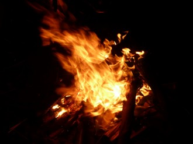
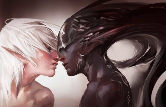

# 往事（中）

父亲去世的半年之前来过一次北京。这是他第三次来北京。第一次是二十年前，带我妈去太原治病，第二次是2004年九月，送我来北京上大学。

和同乡的远房伯父一起来。已经是初秋，父亲穿一件米白色棉麻唐装，看起来瘦了一些，但是精神还不错。那时还没多想，都以为是他最近一阵天天上山看坟山，累瘦的。

这时我已经和两个女孩一起租房，又有一个小受朋友来借住，一屋子人睡沙发睡地铺很是热闹。父亲和伯父也没看出个所以然来，他们白天一大早跟团去游玩，晚上回来吃饭。当然我们说话也非常小心，不再敢讨论各种性话题。父亲显然想问我找对象的事情，但又害怕我不高兴。他们先前在西安玩的时候，是二姐跟她男朋友接待，据说父亲各种嫌弃，食物，住宿。但来我这里，我每晚做饭，白天也没时间陪他们，他也没有说不好的——不知道什么时候起，父亲变得有点怕我了。

小时候我很怕他。大概是因为他总是不大说话，总是阴沉着脸。同时对他又有些崇拜——他能说出许多国家的名字，它们的首都，风土人情，还有历史上的许多人物和故事。青年时候他买许多文学杂志，《收获》，《啄木鸟》，《花城》之类。有次收拾屋子，收拾出一大箱子，我每天放学回家，就看那些八十年代的文学杂志。有一本登载的长篇是路遥的《人生》，还有一本载有何世光的《草青青》，看着看着就联想到了父亲。不知道他当初看的时候，会不会自伤身世。那时候还小，但是对父亲还是有一些怜悯。还有一些当年的淫秽小说，比如《玫瑰梦》，和《军妓》，前者现在看来非常纯情，后者显然比较淫秽，但是套上民族大义和伤春悲秋，里面的日本男人都非常性感——我大概就是从那时候起知道自己喜欢男人的，小学二三年级。

在新房子里住了一年，大舅要跟朋友合伙在凭祥开旅馆，贷款几十万，需要房产抵押，他便游说外婆来央求我妈和小老太太，求到了我家旧房子和新房子的房产证。旅馆开了一年，父亲隔三差五去凭祥找大舅和他朋友要钱，预备赎回房子，但每次都空手而归。再后来，大舅的朋友卷款潜逃了。旅馆关门，银行把我家两套房子都收走抵债。

还记得那个清晨，我们姐弟三个出门要上学，在新房子的门口发现了银行的大字报，大意是限于X月X日前搬出云云。我们都非常震惊，一路上都沉默不语，我感到有些愤怒和羞耻，晚上回新房子睡觉，左邻右舍都跟我们打听，分不清是惋惜还是幸灾乐祸。我低着头，不肯说。

母亲那时跟外婆和大舅都闹翻了。父亲一咬牙，拿出几万元，把旧房子赎了回来。我们姐弟三个，和两个老太太又搬回了旧房子住。两个姐姐和大老太太住阁楼，我和小老太太住厨房后面的后屋。父亲没说什么，但那几年我们都没回外婆家。我妈和小老太太也时常吵架，为了房子。她怪我妈把房子给了大舅，但当初大舅来央求，她又非常支持。

那是家里最艰难的一段日子。父母都在卖力赚钱，不然生活无以为继。姑婆家的猫生了两只小猫，都说“一龙二虎三猫四鼠”，有一只从灶台上摔死了，剩下那只当然从“虎”升级成了“龙”。姑婆说要送给我们养。是一只黑灰斑纹的小母猫，秀气的瓜子脸，绿圆眼睛。小猫刚到家那天，脾气特别大，拴在柴堆边，叫了一天，不肯吃喝。终于我鼓起勇气过去，摸了摸它，它反抗了一会儿，渐渐顺从了，我给它喂水，喂吃的，它也听话，把绳子解开，它也不闹了，乖乖呆在我的大腿上，睡着了。从此它跟家里每一个人都亲，我妈负责喂食和换猫砂，我和姐姐负责逗它玩。唯独父亲对它视而不见。以前我妈养猫，都活不过一个月，死了的小猫由父亲拿到镇子外面的乱坟岗埋掉，他由此讨厌猫。

冬天到了，我们用旧纸箱做了一个猫窝，旧棉被铺了厚厚一层，旧床单从箱口垂下，像个门帘。猫窝放在阁楼，姐姐的床边，猫咪每天晚上从门帘钻进窝里睡觉。它乖巧，干净，漂亮，除了父亲，每个人都爱它。春天到了，它开始发情，跑出去，被吊死了。找到尸体那个傍晚，全家人都很肃穆，父亲说，以后不要再养猫了吧。

住了一年，家里又攒够了钱，把旧房子的前半部分推倒了，建楼房。父亲又去银行央求，让我们在被银行收走的新房子暂住半年。银行答应了。那半年，父亲和我妈住在旧房子的后屋里，还有一屋子的货，前面是在修建的楼房，赶集的日子，父亲和我妈就在工地前的街上摆摊。我上四年级之前，楼房修好了，一家人搬进去，新的生活开始。搬家那天，我跟姐姐坐在新的门厅玩那种掌上游戏机，俄罗斯方块。

但父亲的压力并没有变轻——大姐开始上中专了，二姐上初中，我过两年也要上中学，每年的学费生活费也要一两万。好在我们姐弟三个从小都学习好，考初中都是镇上第一名，给父亲挣足了面子。我和姐姐都考上了县城的中学。

第一次离家上学，我才11岁，身高136，体重不到70斤。住校吃食堂，第一天就没吃到早饭，排队到最后，没有饭菜了。早读课上一边读书一边掉眼泪。中午也是被挤到最后，买到了一份青菜。打电话回家，刚接通就开始哽咽。我妈也哽咽，说怎么办，两个老太太也心疼。我跟父亲说，吃不上饭，想转回镇上的中学。父亲笑我：干脆让学校搬来我们家楼顶吧。

我咬咬嘴唇，不再提这件事。后来渐渐跟宿舍的人熟了，又勾搭上小冰，他每天陪我上下课，排队买饭，不适期也就过去了。也是因为小冰，我渐渐跟家里人什么都不说，从心无城府的孩子一下变成了有秘密的少年。

初一的暑假，大老太太肺癌去世了。我住进她的房间，不再跟小老太太睡——我直到初一还跟着她睡，有时候晚上吃饭慢，还要她给喂完，整个一大婴儿。初二的第二个学期，我带着小冰回家过端午节。晚上我们一起睡。我的房间就在父母房间隔壁。黑夜里小冰抱着我，我背对着他，感觉到他勃起了，硬硬地贴在我的臀部上。但我不知道如何为他解决，就这样僵持一晚上。我直到14岁那年，高一，被同宿舍的一个男生插了，才知道有性交这回事，也突然想起来，小时候有时候跟父母睡，有些半夜惊醒，恍惚间看见父亲趴在我妈身上动着，不知道发生了什么，心里有些害怕，又不敢说话，迷迷糊糊又睡着了，第二天早上，父亲若无其事的样子，我妈心情轻快地张罗卖货。

家里生意渐渐不好了。镇上的百货日杂店越来越多。到了淡季，父亲就骑着摩托车到公路边载客，一天赚个几十块钱。后来他不知道跟谁学会了修煤气灶，又骑着摩托车到乡下，给人修煤气灶，一天也是能赚几十块钱。我知道他们赚钱不容易，也从来不要求买什么东西。父亲似乎从来没有给我买过东西。我小时候喜欢看《十万个为什么》，特别想拥有一套，想得心脏都疼了，第一次强烈要求，父亲说太贵了，我妈也这么说。我哭了一下午，后来就再也不提要求。

衣服也都是捡姐姐的旧衣服穿，旧牛仔裤，旧毛衣，还有老太太给买的儿童套头衫。到了初二，有一天我说，想去宾阳买衣服，姐姐的旧衣服穿不了了。父亲答应了。到了他去宾阳进货的日子，起大早，一起去坐班车。天还没亮透，墨蓝色的天空晨星寥寥，我突然想起小时候跟父亲去进货，也是这样，清晨的骑楼街黑黝黝，说话有回音荡漾，到了宾阳，跟着父亲去各种批发市场，也很无趣，中途吃一碗云吞面。最初的几次新鲜感过去，也就不再跟着去了。

也是初二，有一阵我懒得坐班车回家，就到了周五晚上，打电话让父亲骑摩托车来接我。十几公里的路，二十分钟就到家了。最后一回，天已经黑了，走到一段窄路，迎面一辆大车，车灯晃眼，父亲避让，没看到右边一堆碎石子，我们连车一起倒在碎石子上，大车从一旁呼啸而过。起来一看，两人的右臂右腿都在流血，父亲的右手被一块石子扎了个洞，又坚持骑回了家。父亲责备我，说非要他接。我非常内疚。后来就还是自己坐车。

初三之后，我就越来越少回家了，一个月回一次。后来上高中，索性非常享受这种没有人管束的校园生活。回到家也不怎么说话——说什么呢？说自己新近被哪个男生插了，还是又给谁口交？而一般的校园生活，说来说去也就那些，说多了无聊。他们要问，我也就随便敷衍过去。总觉得自己的生活和想法还是不要让亲人知道好了。这是一种双向保护，什么也不知道，对彼此都比较安全。

高一跟猪勾搭上了，寒假回家，他几乎一天一个电话打来，我满心欢喜，又要防着家人知道。后来有一天晚饭，父亲说：“你那个男同学怎么天天给你打电话？”他低头吃着饭，说话间假装不经意地抬眼看看我，眼里有些怀疑。我很尴尬，埋着头说：“他学习不好，我在学校时候给他补习英语。”二姐伶俐地接茬：“他该不会想跟你搞同性恋吧。看你像女孩。”父亲沉声说：“呵！”过了一会儿又不放心地问：“你跟他就是正常的同学关系吧？我们家可不能出这些乱七八糟的事。”我点点头，不说话，但心里也很诧异父亲居然知道同性恋这么时髦的词。

其实父亲是不太管我和二姐的。他最疼爱的是大姐。记得大姐刚发育时，脸上背上都长了许多青春痘。父亲着急，四处找治粉刺的药。那时我上小学三年级，大姐洗完澡了，吃过晚饭，父亲就在饭桌前给大姐拉开后领，检查粉刺，然后在背上擦药，我看见了也有些尴尬。后来二姐上初二时，有一回在学校打开水，被旁边的人泼了一背，一路哭着回家，父亲找回了烫伤药，让我妈给她擦药，又把她训了一大通——他对这个女儿还是有怨气，二姐做了什么，他向来是要责备的。这件事，二姐每次跟他吵架，都还会提起，说自己从小就不像是亲生的，意指他偏心。

外出打工的人越来越多，镇上的生意越来越难做。时常一整天都不开张。忙碌了十几年，突然一下子闲下来了，父亲似乎有些不适应。我高二那年，镇上开始流行六合彩，父亲也开始跟着买，每天各种看报纸看资料预测，十分入迷，像是算卦。我知道这种东西不可靠，跟父亲说了几回，他不理睬，我也就不再说。他最开始每天买几块钱，到几十元钱，到后来几百元。有一回，要博大彩，压了四千元进去，好歹中了一两股，小赚了一两千。但几乎都是赔的。一年下来赔进去几万，我妈跟我说，原本生意就不好，还这么赌，眼看家里的现金就从厚厚一把变成了一小叠。但是她拦不住。我对父亲不满，但一直忍着不说，渐渐就成了怨恨。回家更少了，也更不愿意说话。

那时大姐已经中专毕业，在市里工作，每个月拿一千多块钱，勉强养活自己。二姐上大学了。学费加上生活费每年要一万多，我一年学费生活费也要五千。那阵子，家里经济非常捉襟见肘，但是父亲仍然继续买六合彩，做着一夜暴富的美梦。我心想，他真是不见棺材不掉泪。

我几乎是一夜之间对父亲从崇拜变成了厌恶。我厌恶这贫瘠的生活，他作为一名父亲，从来没有让自己的孩子过上略微宽裕的生活，而且他还要如此挥霍。新仇旧恨一起翻涌上来，连小时候不让买《十万个为什么》都算上了浓墨重彩的一笔账。

有一回，我生病了，请假回家看病，吃了药，在楼上刚要睡觉，他们俩人在楼下不知道为什么吵起来——父亲迷上六合彩之后，屡买屡输，脾气变得很坏。他们吵得非常激烈，都是吼叫。我心里难过，觉得这个家真的没法呆了。就起来下楼，当着他们的面摔碎一个玻璃杯，转身回学校了。我感觉到他们的愕然而止，但我没有理会。

从此决定了要考到一个远远的地方，再也不用回来。在网上看了《北京故事》，觉得，那就考来北京吧。那时候幼稚，以为来了北京，能被某个高干子弟包养，从此荣华富贵，锦衣玉食。我想学画画，考服装设计，但父亲反对。那就索性考中文系。北大清华是笃定上不了，只有北师大了。我就一心冲着北师大中文系。父亲也支持，说那就以后当老师吧，工作稳定，还有寒暑假。但我其实并不想干任何工作，也不想太费力气。中文系最省事。

高考分数出来，我考了全县文科第二。但是分数尴尬，不知道能不能上北师大中文系。填志愿时，我想冒死填北师大，父亲和班主任都觉得不必冒险，不如看其他学校——但北京的其他大学中文系也没有好的，要考中文系只能去其他城市，我又一心要去北京。父亲说那就换个专业，看政法大学或者财经大学，或者对外经贸。我很厌恶。急火攻心，跟父亲大吵一架，离家出走，住到一个朋友家里。最后我忍痛填了首师大中文系，跟北师大中文系差两个档次，就为了来北京。

就来了北京。父亲送我来，买不到卧铺，飞机票也买不起，就买了两张硬座，坐27个小时。这是我第一次坐火车。父亲到了夜里四仰八叉睡着了，我靠在窗前，一直看着外面飞驰的黑夜，心里泛着丝丝窃喜。

到了北京，刚下完一场雨，天阴沉沉，建筑物灰扑扑，到处都是人。找到了去学校的公交车，374路，破旧的大公交车，中间还有一节风箱似的环节。售票员都不耐烦地说着听不懂的卷舌音，一点也不像电视上那样。车堵了一路，满街都是胖子。

学校里湿漉漉，冷冷清清，满地落叶。还没开学，父亲跟我拉着箱子找招待所，在林荫道遇到一个男孩，他一个人住了个三人间，想找我们平摊。就住进去了，一晚上60元。招待所是公共浴室。洗澡的时候另外一个男人进来了，也是学生家长，江苏人，个子不高，但是阴茎非常地粗长，垂到大腿中央。我第一次看到这么大的阴茎，很吃惊，忍不住想多看几眼，但是又觉得不礼貌，说话时尽量看他的脸，眼神忍不住地向下坠。

我从来没有看过身边男性的性器官，除了发生过性关系的。从小都是单间洗澡。上中学之后，有一阵开始知道性事了，在家父亲洗完澡，一般都是只穿着短裤在客厅，我看着觉得羞赧，但又忍不住看了看——即使隔着内裤，也可以看出不大的样子。高中时跟我性交的男生也都不大，普遍十二三厘米，有个十四五厘米的，我都觉得稀罕，但那个男生很讨厌，也就没有跟他做过几次。初一时宿舍卫生间门有道缝，小冰洗澡的时候几个恶作剧的男生在外面偷看，招呼我也过去，我凑过去一看，一根粗长的阴茎从乌黑的毛丛里垂下来。他比我大两岁，十三四岁，居然已经发育得这么好，我现在都还在遗憾没能跟他发生过性关系。

第二天父亲带我去了长城。人挤得密不透风。我身轻，飞快爬到了最高的烽火台，等了半天父亲才爬上来，气喘吁吁。我突然想到，2004年，父亲50岁了。我始终还以为他四十出头。整个人一直固执地停留在童年时期，不愿意跟着时间走，始终幻想自己还是个未成年人。有时听说那个小学同学结婚了生孩子了，都会忍不住一惊：这么快！本能地抗拒进入成年人的世界。选择性地忘记自己其实也早已经被人插过无数次。

隔天就开学了。办了入学手续，同宿舍有个北京男生还没住进来，父亲就睡了那张床。同宿舍的还有一个山西男生，一个北京男生，都老实，对父亲很尊敬，没有丝毫看不起的意思，当然父亲也非常客气，说话进出处处赔小心。住了一晚上，早上起来我陪父亲去了天安门广场，两人站着拍了张照片，父亲就去火车站坐火车了。我一个人坐公交车回学校。从此要一个人在这个城市生活。我知道自己非常开心。

上大学之后，我开始四处寻觅兼职，到了大二，终于可以自己赚到每个月的生活费。学费也是助学贷款。我沉浸在这种自食其力的成就感里。大学几年，跟父亲的关系也缓和了一些，但仍然回家不爱说话。父亲已经不再买六合彩，开始迷上打麻将——他提前进入了退休状态。大二那年，大姐结婚了，嫁给了一个安徽男人，父亲的一桩心愿算是了结。大姐一生都按照他设想的轨迹生活。二姐大学要毕业了，寒假回家，说她想去英国念硕士。父亲不同意，说家里出不起钱。两人吵起来，二姐声泪俱下，说父亲从来就没爱过她。她跑去找小舅，借到了两万块钱，又找一个远房的姨妈借了一万块钱。开始准备考雅思。半年后，雅思分数下来，offer也拿到了。父亲没办法，给了二姐两万块钱。二姐就拿着五万块钱，去英国，投奔她的高中男同学——她出国的担保金也是他出的。

二姐出国之后，父亲也渐渐开始心疼这个女儿。二姐在英国一边上学，一边打两份工。打电话回来，父亲也会温情脉脉地叮嘱她不要这么辛苦，身体要紧。但二姐有时候给我打电话也会抱怨：你爸恶心死了，问我什么时候还钱给他。

我大三开始自己学做衣服。到了大四，决定毕业后做衣服为生。父亲很不希望看到，但他知道我一定会跟他赌气，也就不太劝说我，只是偶尔谈起，说还是找个稳定的工作好。我大三开始在外国专家局做一个陪同的兼职，他希望我能留在那里，时常要我试探对方。每次他说起这个，我就不耐烦地打断他。我不想过他设计的那种生活。

大学毕业，我没有找工作，开始做衣服，在淘宝上接受订制。非常艰难，每个月赚一千块钱，房租也是一千。吃自己的积蓄，一天三顿速冻水饺。三个月后，终于撑不下去，这时好朋友介绍一个在泰国教书的工作，我立时答应了。打电话回家，父亲也非常喜悦——他大概以为我终于回心转意了。

在泰国一年，回家了，又报名国家汉办的志愿者项目，培训半年后又到泰国一年。即便如此，父亲仍然一直为我的未来操心。他希望我能一直从事这个工作，成为一份“铁饭碗”。但我始终一意孤行，当汉语教师到第二年，我已经完全对这个职业失去耐心，只等着任期结束，拿着一年的存款回北京，重新做衣服。结果阴差阳错，回北京之后成了自由撰稿人。父亲觉得我不务正业，极力劝说我回家考公务员，找女朋友，结婚，生子。我一概不理。他也觉得我们之间的关系再度紧张，也就不再提起，转而让我妈打电话给我，叹息自己年纪大了，打悲情牌。我不为所动——我知道自己非常自私。我不愿意为任何人牺牲自己。

我渐渐不再打电话回家。有时候两个月过去，我也浑然不觉。这是二姐一个电话打来：你爸说你好久没打电话回家了。虽然父亲从小对她最不好，她却比我对家人感情更深。我就打个电话回去，随便说几句，眼看又要扯到那个令人难堪的话题，我就迅速结束了对话。

他这辈子没怎么得到过国家的好处，所以希望我代劳，满足他进入国家系统的愿望。但这恰恰是我最厌恶的事情。我觉得，他这辈子的愿望估计都要落空了，不管是让我进入国家机关，还是让我结婚生子。其实我害怕这一局面的到来。我不知道应该如何面对他。有一个时期我一直在想着消失，如果父亲不能消失，那就我消失好了。

在医院里每天都有人络绎不绝地来看父亲。有时候他醒着，能点点头说几句，有时候他睡着了，看望父亲的人往他枕头下塞一些钱，就走了。他生病以后，收到几千块钱。我们这边有这样的传统，看望上了年纪的亲友，一般都会给钱。

二姐说：“别看你爸病着，心里精着呢，谁给了多少钱，花了多少钱，他都记得一清二楚。我现在给他管钱，帐都要记清楚，等他出院了给他看，省得各种不放心。”

送他入院的时候，钱和医保卡都在他羽绒服的口袋里，二姐去挂号了，需要钱和医保卡，问他，他犹豫了几秒钟才拿出来。“带了六千块钱，就给我一千。”二姐显然是在说父亲奸。

医院给他吊利尿剂，需要测量每次排尿的量。尿在尿壶里，登记时间，毫升。然后洗尿壶。我和两个姐姐，和三堂兄，五堂兄，六堂姐轮班在医院陪同。在医院住了几天，他排了不少尿，食欲也恢复过来，渐渐能走动了，每次能喝半碗粥，有时还会呕吐，是抗癌药的反应。

腊月二十八了。父亲想回家过年，医院也同意了。于是办了出院手续。出院前，六叔托人找来一包岩黄连，说是治疗肝癌的奇药。父亲兴冲冲回到家，刚坐下，就吩咐我妈给他做面汤，烧开水。吃完小半碗面汤，他抓了一把岩黄连放在杯子里，吩咐我泡上。喝了几口，他就躺在躺椅上休息了。

晚饭时间，我拿了一小碗粥去房间喂他。他吃了几口，又开始反胃，我以为是抗癌药的反应，眼疾手快，拿了垃圾篓在他嘴下接着。父亲一张嘴，哇一声，喷出一大股鲜红的东西。像是血液。

我第一次见到这种，手有些抖。他又吐了几口，全是殷红的粘液。我为他擦干净，叫来我妈和姐姐。她们也都很紧张。父亲吐完，虚弱地靠在躺椅上，面色苍白，徐徐地喘气。过了几分钟，他又挣扎起来，大姐抢过去用垃圾篓接，又是一口连一口的鲜红色粘液。我在旁边为他抚后背，心跳得厉害，震动鼓膜。我妈让二姐给小舅打电话。父亲吐完，擦干净，气若游丝地对我说：给你六叔打电话。

电话打过去，父亲说：“这个岩黄连药性太烈了。喝下去肚子一直在搅。刚刚吐了好多红色的水。”六叔说：“不要紧，可能是它起作用了。”

二姐打完电话下来，把我拉到客厅悄悄说：“小舅说，你爸可能是消化道血管破裂，肝腹水的并发症。如果还继续吐血，马上送医院。”

后来又吐了两次。姐姐冲去要打电话，父亲不让，说他没事。扶他躺床上了。他有没事咳痰的坏毛病，我说：“小舅说你可能是胃出血，你先别咳了，怕震动到内脏血管，出血更多。”

躺床上之后，他又吐了两次。每次姐姐要打电话叫救护车，都被他制止了。父亲躺在床上幽幽地说：“清啊，别慌，爸没事，爸自己的身体自己知道。”姐姐带着哭腔：“那你就忍着，就算想吐，也不要随便吐，我们撑过今晚就好了。好吗？我们都坚强一些。不要咳，不要动，不要吐。”父亲点点头。一晚上没有再吐。到了半夜，我困到极点，先回去睡了。我妈和姐姐继续留着，伺候父亲排尿排便。

天亮了，我妈跑出门找来镇上诊所的医生，来给父亲吊止血药。他一晚上没吐，但躺着不动，身上酸疼，就要我和两个姐姐轮流给他按摩。我给他按摩一上午，中途又吐了两次，深红色的血块。中午，我上楼吃东西，换姐姐和我妈按摩。吃到一半，突然听见二姐大叫我名字。我飞奔下楼，进房间就是弥漫的腥臭，扭头看见父亲身上的被褥掀开，我妈贴着趴床上，手里一只塑料袋在屁股下接着，手在抖。姐姐颤抖着声音给医院打电话叫救护车。父亲几乎是喷射出一大股粘红的液体。我脑袋发懵，给我妈递纸巾，擦父亲的腿部臀部。又拿了温水毛巾给擦干净。做完这些，我妈又跑下楼，找了隔壁几个男人，过来帮忙把父亲搬下楼。救护车到了，医生护士要先输液，扎了半天，护士找不到血管，来回扎了几次，手都在抖。最后终于扎上了。我跟那几个男人用棉被把父亲托住，四个人将他小心搬下楼，放在担架上。我跟二姐上了救护车，上车前，我匆忙回头看了一眼我妈，看见她在擦眼泪。

在车上，我看着担架上的父亲，扭头看看姐姐，想到我妈那一瞬间的样子，眼泪又要满出来。姐姐也在忍着眼泪，不敢哭。到了医院，姐姐跟父亲说：“我们来医院，是想让你恢复得更好。你也要继续像昨晚一样坚强。”父亲闭着眼睛，点点头。办完住院手续，三堂兄，五堂兄也都到了。我一天没吃东西，饿坏了，于是出去买些吃的。大街上十分萧条，空旷无人，刮冷风，鞭炮声四起，家家户户都关着门，在吃年夜饭。我走了两条街，找到一家便利店，买了两包饼干，在无人的大街上边走边吃。

到了傍晚，小舅开车带着我妈，还有姨妈舅妈表姐来医院了。一群人在病房里围坐着。小舅把我和二姐带回家，吃了饭洗了澡，又把我送回医院，接我妈回家。舅妈姨妈表姐坐着姨夫的车回外婆家了。除夕夜，我和五堂兄在病房守着父亲。

五堂兄对我很呵护。父亲暂时稳定下来了，眯着眼睛在睡。五堂兄就让我先在躺椅上睡着，他先守着。他非常谨慎，父亲一有动静他就飞奔过去。五堂兄是四伯的二儿子，却长得一点儿不像瘦高的四伯和二堂兄。他相貌和体型都敦厚，面色白净，络腮胡渣，戴个眼镜，像个斯文的杀猪匠。他比我大许多，女儿已经十六岁。我猜他至少有四十岁了。但是看起来还是只有三十出头，没有一根白发。

五堂兄跟我说话时有些拘谨和紧张，不时偷看我，眼睛里有抱歉的神色。我也感觉到了，并迅速将之转化为暧昧——我也不时看他，眼睛里充满无辜和忧虑，并在跟他一起给父亲换尿布的时候进行身体的接触。他并不排斥，似乎还有些期待。

父亲一晚上持续拍出深色的血便，又持续吐了几次凝固的血块。每次都是我收拾尿布，五堂兄用温水毛巾给擦洗下体——父亲似乎也忌讳我看到他的下体，坚持只让五堂兄来擦洗。但我还是看到了。在我见过的尺寸里，中等偏下。

父亲有一阵睡着了。我和五堂兄到外面抽烟，两个人在夜色里默默相对，没有说话。我突然很想抱住他，从他身体里获得一些能量。

凌晨我睡着了一会儿，五堂兄也躺在病床上睡着了。父亲也睡着了。

不多久，父亲开始恢复排尿，我们又开始忙碌地换尿布。头脑都是懵着。我只想好好睡一觉。天亮了，我妈坐班车来医院，换下我回家。大年初一，我一个人坐着班车回到家。洗澡，睡觉。

如此过了几天，父亲不再吐血，也不再排血便。但排尿变少了。医院开的止血药，我们看了，说明是对肝肾有损害。父亲每天都只排出两三百毫升的尿，腹水涨得厉害。他要我们不停给他按摩。二姐按摩了一晚上，气鼓鼓地回来了，一肚子抱怨，换大姐，按摩一白天，回来换我，按摩一整夜。我们都觉得，父亲不会体谅人。我妈说，你爸真心毒，非要搞得每个人都讨厌他才行。说归说，还是得继续。总不能眼睁睁看着他难受死。

初五，在医院的最后一晚，是我守着。父亲一整晚都在想排尿，但死活排不出来，而且一喂水就反胃。他烦躁之极，开始踢被子。他这一天只排出了一百毫升的尿。到了半夜，我饿了，出去买了两桶泡面吃。吃完回病房，父亲责备我：我说过不能离开我身边的。我说：我饿了。你想排尿吗？他点头，又尝试了一次，仍然排不出来。我安慰他放松。盖好被子，在躺椅上迷了一会儿。迷迷糊糊间听见他在呻吟，爬起来问他：怎么了？疼吗？他摇摇头。我躺下，他又继续呻吟，我又爬起问：哪儿不舒服？我去找医生。他又摇摇头。如是再三。我终于不管他，去找值班医生。值班室里只有一个护士。找了半天，值班医生终于像个傻逼一样摇摇晃晃的来了。先是抽血化验。父亲已经有些神志不清。化验结果出来，说是肾衰竭，尿毒症，肝性脑病。我问：那有没有治疗的方法？医生说：现在医院里没有。我说：那怎么办？医生说：估计没几天了。

我给家里打了电话。我妈天亮了坐头班车来医院。到了医院，她让我给小舅打电话，小舅也说，估计是没几天了。我妈眼泪扑扑往下掉，擦不住。我给她擦眼泪，自己也来不及擦。

三堂兄也到了。医院下了病危通知书，三堂兄签了字，要把父亲带回乡下老家。我又给六叔打电话。让他来医院。二姐也到了医院。我困极了，跟所有人说，我先回家睡觉了。又担心睡醒了就再也见不到父亲，不顾路上行人的惊诧，一路哭着走去了车站。

一觉醒来，父亲已经在乡下安顿好了，地上铺了稻草，棉垫，挂了蚊帐，临死前的装置。三堂兄开始试着用中医。他用白茅根熬的水一点点喂着，父亲居然连续尿了三次，整个人轻松多了。但还是奄奄一息的样子。下午时分二姐气呼呼地回家了。去祖屋看父亲的人川流不息，在父亲的帐前抽烟聊天，二姐劝说几次无效，当场发作，将满屋的人骂了个狗血喷头，跳脚骂，一路鼓着腮帮子从老家走回镇子——十公里路。我赶紧洗了澡回乡下，跟大姐，三堂兄，五堂兄，二堂嫂守着。因为不知道是不是最后一夜。

乡下特别冷，北风凛冽。五堂兄让我先去房间睡。我睡了一会儿，三堂兄也进来，一起睡。睡到三点，我们起来，换五堂兄去睡，大姐，二堂嫂也去另一间房间睡了。半夜还下起了雨，冷得够呛。天亮了三堂兄才想起搬来火盆，点燃木炭烤火。

父亲一晚上排了几次尿，到了天亮，终于睡过去了。又排了几次尿。我回家洗澡，睡觉，换二姐。大姐的老公，公公都来了。轮流了几天，父亲又渐渐恢复了一些。眼看就要好了，那两天我要赶稿子，就回家了。他又心急，想早点恢复元气，半夜闹着让三堂兄五堂兄找医生来给他输液，葡萄糖和氨基酸。二姐打电话问小舅，小舅说还不能输液。父亲不听，执意要输。两个心软的堂兄拗不过他，清晨五点找了村里的医生来输液。输了两个小时，五堂兄打电话来说又难受了。我在电话里跟五堂兄说：马上把输液停了，拔针，告诉我爸，如果他不想死那么早，就不要输液了。他肾脏还很虚弱，两瓶葡萄糖下去，他的肾脏又受不了了，再次肾衰竭。五堂兄唯唯诺诺地答应了。拔了针头。我早上坐三轮车回乡下。看见他又肝病入脑了，昏睡着，两个堂兄和二堂嫂给他按摩手脚，我妈按摩头。我突然觉得心酸。三堂兄四十八岁了，五堂兄也四十三岁了，二堂嫂也差不多五十了。他们都憔悴。

二姐悄悄拉着我说：“我看见你爸的耳朵缩皱起来了。他这次估计撑不过去了。”

晚上二姐的男朋友也到了。他开着车不认路，我跟二姐去镇外面的公路等他。正赶上镇上要放鞭炮炸龙，我们俩人一路冒着枪林弹雨，狼奔豕突。

到公路要经过一片黑幽幽的坟岭。走着走着姐姐突然跟我说：“你知道吗？昨天四姨跟我和肥（大姐）说，你爸那时候在外面勾搭了个小三，就是在我出生后，他怪老妈生不出儿子，所以找了个女人要给他生儿子。三姨知道了，拿着刀在后面追着要砍他，他才回来了。你不知道，老妈生完我之后，你爸连理都不理，老妈在医院里没人照顾，三姨和四姨只好来照顾他，还有家里两个老太太。”

我突然感到身上一阵凉意，心里有些恐怖。夜空变得出奇的黑，什么也看不见，毛骨悚然，只有一两辆汽车晃着灯一闪而过。我心里有什么东西啪一声熄灭。我知道，因为父亲生病而重新对他生起的一点感情，就这样死掉了。

“他难道不知道，生男生女其实是要由精子决定的吗？”我说。心里却说着：我讨厌这个人。

“你爸就是个有知识的文盲。”二姐说，我能猜到她鄙夷的表情。

“老妈就是太傻了，才会一辈子被他欺负。”我说。心里的厌恶膨胀起来了，像恶魔狞笑着站在身后。

“可不是吗。他想去哪儿玩就去哪儿玩，老妈想去哪儿都不行。那次她跟老同学聚会，才出去一天，他就电话不停催。老妈跟一个男同学拍了张合影，回来他看见了，不知道骂得多难听。以前每次他把老妈骂得一分钱不值，老妈只能去找四姨三姨偷偷哭。四姨还说，在生你之前，你爸还想勾搭四姨。”

我心里有种巨大的恐怖。“我从来都不知道这些。”我低声说。

“不过这些也都是四姨说的，也不能证实真假。”二姐似乎感觉到我冷漠的情绪了，试图挽回一些。

我说：“四姨肯定不会跟你们编织这些。何必呢。”我心里冷笑想着，怪不得他生了儿子还是同性恋，怪不得他生了病，原来都是为以前的事买单。

说话间，二姐的男朋友开车到了。我们上了车，回到家，一路没有说话。二姐和男朋友连夜回老家，把我妈接出来吃晚饭，五堂兄也跟着出来。我坐在沙发上写稿，他就坐在旁边，陪着笑和我说话。吃完饭他们又回老家。

第二天早上我回老家服侍父亲，已经是强忍着厌恶。回南天，潮湿温热，他非常烦躁，要求人二十四小时不停按摩，，连大姐的公公都上阵了，不然一停他就踢被子。二姐说：“昨晚按摩了一晚上，我的手没劲了，他还不让停。我问他，按摩能舒服些吗？他说不能。我气极，说既然不能为什么还要按。他说按着解闷。”我一边按摩，一边厌恶地想，这个男人，一辈子自私，专横，固执，不会体谅人。我已经对他毫无感情。

我妈说：“他这么烦人，看来就这几天了。再不死几个孩子都被他拖累死了。”说话时假装冷着脸，但眼睛又红了。

我心想，真不知道我妈图他什么，又小心眼，又专横，又没钱，鸡巴还这么小。

白天到夜里，他不停挣扎，翻身，叹气，踢被子。到了半夜，他的难受到了极点，开始说胡话。我给他喂水，他喃喃说，你敬了我，该我敬你了。我不说话，他抓住我的手腕，睁开惺黄的眼睛，眼里闪着炙热的光。“快说，祝我父健康长寿。快说，祝我父健康长寿。”我咬着嘴唇，和他直直对视，不说话，继续给他喂水。他晃着我的手，黄眼睛继续盯着我，就像溺水者抓住水面的稻草：“快说啊，祝我父健康长寿。”我咬咬牙，心一横说：“快把水喝完。”我内心惊恐地发现，我此时其实希望他死，一了百了，这样我不必再为能否保住工作而焦虑，而且我不用再担心被他逼着结婚，生子。父亲灼灼的眼睛一下子熄灭了。他仿佛读懂了我的心思，手松开了，“唉”地叹一口气，闭了眼继续踢被子。

到了天亮，南风转北风，一下干冷起来。父亲终于沉沉睡去。

我到二堂兄家里喝粥，全村人看见我都说，明年带个老婆回来，给你爸生个孙子。再把祖屋加盖一层。我嘴上笑着答应，但我知道，这没有可能了。

喝了粥回去继续给他按摩。五堂兄进房间睡了。剩下我和三堂兄。九点多四姨夫开车带着我妈和四姨回来了，六叔也起床。我跟我妈说，想让姨夫一会儿带我回家，洗个澡睡会儿。六叔制止了，说洗澡睡觉就在老家，现在没这么讲究。可是老家什么都脏兮兮的，做的东西吃了都拉肚子，卫生间根本没法用。我脸一沉，出去抽烟。

在外面听见我妈跟六叔说“……他前两天回家也是为了赶稿子。总不能因为他爸丢了工作吧。”原来六叔在怪罪我前两天不回来。我在心里冷笑，掐了烟回去。不说话，继续按摩。不正眼看任何人。

六叔也觉得了，他也没再说话。快中午了，他带着姨夫和我妈他们去二堂兄家里吃饭——来人统一在那里开伙。只剩下我跟三堂兄。

我按摩得累了，停一会儿，父亲又踢被子。我忍着气继续按。按了一会儿，他隐约睡着了，我又停下歇会儿。他又踢被子。我没好气地低声吼道：“别踢了，我就歇一会儿。”三堂兄抬头惊讶地看我。我有些窘，低头按摩，不说话。

我妈吃完饭，跟我说，跟四姨他们先回家洗个澡睡觉，晚上再回来。我就直接拎了包，头也不回地出门了，也没跟父亲说一句话。没想到，这一别就是永久。那句愤怒的低吼，也成了我跟父亲说的最后一句话。

后来三堂兄对我就淡漠了许多。大概他也觉得，亲生父亲病成这样，我还这么不懂事。他也有些失望。幸好五堂兄不在场，不然他对我的好感也都全没了。

回到家，我洗澡睡觉。晚上大姐回去换我妈。我说我不回了，明天早上再回去。我还在跟六叔赌气。晚上在家里看了《被解放的姜戈》，然后心安理得地睡觉。

睡到半夜，突然家里电话响了。我妈接了，我听到“啊？不行了……马上回去……”我一下子坐起来。我妈挂了电话碎步跑进房间说：“你大姐说你爸快不行了。要你们回去。”楼上二姐也起来了。我心里想着也许没那么严重，估计是他又在烦躁，看不见我。他那几天总说，七弟每天都不能离开身边。“七弟”指的就是我。

我缓了缓，起来，又去洗了个澡，才清醒了。二姐男朋友开车带我和二姐回去。我妈要在家陪大姐女儿——她也没想到有那么严重。到了半路，二姐手机响了，是大姐。大姐说：“你们到哪儿了？老爸去了。”凌晨四点四十分，挂了电话，我们都没有说话。

下了车就一路跑上祖屋。地上散落大炮仗的碎纸，围墙上插着一根竹竿白幡——送行的意思。气喘吁吁地进门，父亲已经一身素裹直挺挺在地上了。三堂兄，五堂兄，二堂嫂和大姐已经给他擦洗干净，换了寿衣，裹好白布。二堂嫂说：“七弟，十一妹，来给你爸合眼。他在等你们来，你十姐给他合不上。”她扒开白布。父亲的眼睛还睁着。我和二姐跪在地上，流着泪说：“爸我们回来了。”

用手抚他眼睛，他一下就合上了。以前总听说人死了都会等到他想见的人，才能闭眼，一直不相信，这回终于信了。二堂嫂用硬币盖在父亲的七窍上，重新裹好白布。我们坐在旁边守着。三堂兄和五堂兄洗了把脸，又招呼我们过去洗脸。然后套上白色的寿衣——白色化纤面料的衬衫，五堂兄穿着羽绒服，衬衣撑得像个白面包。他们似乎也有些如释重负，但三堂兄脸上有些懊丧，他在遗憾没有能把自己的叔叔治好。

坐在父亲的尸身前，他一动不动。我想着跟他的最后一面，说的最后一句话还在怄气，眼泪又下来了。

村里的兄长渐渐挤满了祖屋。我茫然四顾，突然想起那晚父亲炙热的眼睛，充满渴望地盯着我，心里猛然像是被烫了一下。我知道自己并不完全是悲伤，但拼命不让自己心里那一丝喜悦流露出来。

还不敢打电话回家告诉我妈，怕她一个人在家，太刺激，她会崩溃。六点了，二姐坐着他男朋友的车回去，把我妈接回老家。顺便采购一些葬礼用的东西。六叔和村里的长辈们开始商量着葬礼的置办，请什么师傅，做什么法事，知会哪些亲朋，白案的菜色，买多少菜，烟酒糖果，谁去买木（棺材），谁负责待客，谁负责帮厨，谁负责抬木上山。

天色大亮。我妈回到祖屋了。她一进门就跪在父亲身边，唤他名字，眼泪纷纷打在白布上。眼睛合上就不能掀开白布了。她这辈子唯一死心塌地的男人，她没能看到最后一面。

我们姐弟三人扑上去，跪着扶我妈。大姐流着眼泪说：“妈，我爸走的时候很平静，一点也不辛苦。”我妈擦着眼泪颤颤巍巍起身，和我们坐一排，我看见她的头顶，刚染没几天的头发转眼间又花白了。

大姐说，父亲白天的时候还挺好，排了几次尿。不过还是那么烦躁，一整天都在问七弟去哪儿了。而那时我还在家里赌气。到了晚上，就没有再能排出尿。夜里十二点，终于有尿意，使劲排了半小时，结果排出了一大滩黑色的粪便。那时我刚入睡。夜里一点，三堂兄和五堂兄都去睡了，大姐和二堂嫂守着，父亲又排了一次粪便，开始问，七弟在哪里。那时我在睡梦中。三点多，又排了一次粪便，排完这一次，他就非常虚弱了，说把七弟叫来。大姐把三堂兄和五堂兄叫起来。四点多，他排了最后一次粪便，用尽了最后的力气。但他还是很清醒，要喝白茅根水。三堂兄抱起他的头，大姐要喂他，他说了最后一句话：“这到底是什么原因呢？”说完，嗓子里开始“咯，咯”地倒气，一大股浓黑的液体从口鼻处涌出，大姐和二堂嫂撕了纸巾慌忙擦，最后纸巾堆了他一脖子。只见父亲的眼睛渐渐往上翻，定住了，呼出了最后一口气。

大姐用手抚父亲的眼睛，合不上。他在等我回来，见最后一面。

说着又哽咽起来。

但是说起来，我和二姐跟父亲同一个时辰出生，都是辰时。按照我们当地的风俗，同一个时辰出生的亲人，断气的时候不能在场，出殡的时候也不能跟到坟前下葬，不然会撞晦气。偏巧我们两人都没赶上父亲离世的时间。这辈子他最疼爱大姐，大姐跟他也最有缘，最后的时刻能陪在身边，下葬也能送到坟前。

（采编：孙晓天，责编：佛冉）
