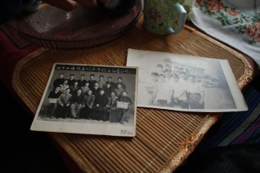
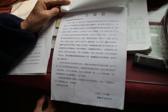

# 灾难与爱情----专访文革受冤老人王文成

_红色混乱十年，往事并不如烟。文革时的一句话，打翻了一个家庭，改变了一个普通年轻人的一生。冤情未洗，苦难犹存，记忆凝固成老人的执念。幸而，还有你在这里。_ _瓢虫君专访文革蒙冤老人王文成，记录这段历史中的—灾难与爱情。_  

**灾难与爱情**

----专访文革受冤老人王文成

1967年，王文成还是一个高中毕业后在北京铁路局做临时工的毛头小子。“这是我们当时的‘反革命集团’。”王文成指着手上拿的老照片说，照片上是六个青涩阳光的大男孩儿。听到王老这么称呼自己年轻时的朋友圈，老伴儿嘿嘿一笑：“都是那个时代造成的。”

王文成坐在儿子以前的房间里，这间私自搭建的板房现在成了王老的书房。王文成的儿子已在日本工作落脚，虽然经济状况不好，但不愿回国。老伴泡了一壶茶水，抬头抱怨北京的雾霾天气；又抱怨自家的老头子，紧抱着文革的事不能释怀。

**一句话与一辈子**

“我就说了一句话：毛泽东是当代的朱元璋。”红色年代的某一天，王文成在与哥儿几个闲扯之时直抒胸臆。他所在的小小“反革命集团”里还有五个粮行工作的兄弟，对时事的看法有很多相近之处。聚会后不久，那五个年轻人被抓起来，几番问询之后，“供”出了王文成。

“之后我就被定为‘现行反革命’，接受群众监督，不仅丢了工作，而且什么活都做不了。”王文成一边说，一边从一堆文件中抽出当年的情况登记表，皱巴巴的登记表上赫然写着：“该王在无产阶级大革命运动中，坚持地主阶级的反动立场，恶毒攻击、咒骂伟大领袖，仇视无产阶级专政，攻击社会主义制度，对现实不满。上述问题，王曾一度找同伙订立攻守同盟，企图以经济问题掩盖政治罪行。在经革命群众反复批斗交代政策，坦白交代自己的罪行。”

老伴在一旁细细地听，静静看着老头子吐苦水。

谈起那个年代，王文成语调平静，像在叙述遥远的梦境：“那个年代真的是人以群分：你是革命，我是反革命，夫妻两人因为政治问题离婚的大有人在。那个年代政治生命是第一生命。我是被‘群众专政’，这也是文化大革命新的发展，公检法全都没有了。”

在北京生活无望的王文成收拾行装回到山东老家，和先前被打回老家的父母团聚，凭着原先的手艺做一些零活，修修电器。回家没多久，北京市公安局三个警察就夹着公文包到了村里，找到民兵连长调查情况。“他们本意是，发现我不老实就直接带我回北京，可是民兵连长，也就是我不出五服的兄弟，说我回来以后没有做什么坏事、祖上没有反对政府的行为，结果公安局就回北京了——还不如那个时候直接给我带回来呢。”显然，王文成对当时的生活一点都不满意：找不到工作，平日无所事事，至多帮忙做些农活。

时间在空虚与绝望中行走。到了“不当老爷兵”的大串联时期，王文成终于回到了北京，但因为“现行反革命”的身份，一直都没有找到正式工作。街道革委会的老太太得知他能缝皮，扔给他几张满是窟窿眼的兔皮。王文成细数当年的生活：“缝一张皮2分，一天12个小时，到手两毛钱。”幸而当时物价低，且王文成还有个三弟在北京干活，有工资，偶尔还能接济他过日子。

“这一生就这么毁了，就因为‘现行反革命’的帽子没有摘，想转正都没法转。”一旁的老伴长叹一口气，瞪大眼睛使劲点头，摊开微颤的双手。她转头又说，老头子总忘不掉这事儿，叫我们别怪他烦。

王文成抬高声调，盖过老伴：“我的徒弟，师兄弟，好多被关了几年的，出来都顺利找到了工作；我的技术好些单位都需要，但是因为敌我矛盾，一直转不成。”没有正式工作的王文成做过瓦工、工地负责人、预算员和施工员等等，在王文成递给我们的工作简历表上，这些工作经历满满写了一页纸，还附有相关证明人的联系方式。

令王文成哭笑不得的是，曾经跟他作对的“左派”青年也并未落得个好下场。

“我们的片警，跟我一般大，前年死的，当时那叫‘左’啊，‘左’得出奇。盯着小偷小摸的孩子，今天送一个，明天送一个，都上纲上线，送到少管之类的地方，得了各种荣誉。”就是这个片警，曾因为“功勋卓著”迅速升官，等到中央风向一变，开始清理像他这样坐火箭上升的官员时，命运急转，哪里都不要他，最后被安排在老太太们糊纸盒子的工厂里跑业务。再后来，他大概脑子受了刺激，“精神有点不正常”，有一日跑上马路去拦美国大使馆的公车，破口大骂‘美帝国主义’，“结果被警察抓到安定医院给打了两针，呵呵”。

现在王文成还在为自己的退休金到处奔波上访，夫妻两个只能靠着老伴每月2000多元的退休金度日，不仅要应付吃穿住行，还要应付两人的医疗费用。

“他是因为文革的事拿不到正式工的退休工资。我是信佛的，觉得都还好。他是一直放不下。这人就是这样，挺倔。”老伴解释说。

**毁灭中萌生爱情**

在“红卫兵走向社会”的年代，王文成的姥爷是地主，因而全家被抄。王文成是家里的长子，为了照顾家庭，急忙跑去丰台区找自己的师傅，并从之前参加的“互助会”里取钱。互助会类似于自发的民间借贷组织，由乡亲朋友出资筹建，困难时期互相借用。这笔钱款此时成了王文成唯一的救命稻草。

王文成并不知道，在他跑去丰台的这一天，有个兰州大学的党委书记流窜到北京，通缉令已遍布大街小巷。红卫兵、工人纠察队整兵布阵，守候在各个街角。他们到处盘查行人，凡形迹可疑者一律扭送公安局。

那天，王文成的师傅下班特别晚。晚上9点多，没路灯，胡同里黑压压一片，王文成坐立不安，来回走着等师父回来，被红卫兵发现了。“哟，这和那人（流窜的书记）差不多，很可能是乔装打扮的，先送到公安局再说。”于是王文成进了丰台市公安局，一关就是45天。

王文成在拘留所里遇到一位被严重打伤、腿伤处已血肉模糊的男子。他帮男子清理、包扎伤口。闲聊时，王文成发现，这名男子竟是自己仰慕的一位业余作家。他们聊得很投缘，总算也熬过了一些时日。

日子一天天过去，王文成担心家里的情况，再也耐不住了。“那时候我着急啊，家里到底怎么样了！”心急如焚的王文成开始绝食，三天后被看守发现在吐血。“可能是怕我死在里面，总算把我放回去。”王文成倚靠着书桌，举起茶杯喝了一口。

临走时，那位作家嘱托王文成去新街口看望自己即将生宝宝的爱人，代以转告自己平安的消息。

先赶回家的王文成发现，家已经没有了。第二天，为履行承诺，王文成来到新街口，看望朋友的爱人，在那里遇见了这位嫂子的妹妹。说到这里，老伴笑了：“因为看他挺热心，人又老实，家里人一撺掇，我们就在一块儿了。”九年后，两人喜结连理，相依至今。

**陪你走尽上访路**

“我就是有这一口气，我不甘心，”王爷爷靠在写字台上，坚定而愤愤地说：“我会一直上访下去，不然我死不瞑目。”

王文成承认自己作为临时工工龄不足十年，但他强调造成这一事实的原因是文革期间革委会的错误处罚。如果没有这个处罚决定，他即使没有在北京铁路工程段干满十年，还是能够找到其他工作并转为正式工。他认为原单位应该承担错误决定带来的后果。中铁六局在接受上访时认为：他并没有满十年工龄，不符合相关规定，不得转为正式工，也就是说不得享有退休金和医保。

“但愿全国像我一样的只有我一个，上次帮过忙的律师也说我这种情况是时代的悲剧。”说着，王文成翻出当时这位律师帮他草拟的上访信，并一字一句朗读出来。

__

今年大年三十，心里憋着一股气的王大爷又一次到公安局上访。话还没说几句，警察同志就把他送上警车，拉到龙线胡同的一个四合院里。所幸他年满70岁,公安局不得拘留过夜，晚上即被释放。

两会期间，已成为上访专业户的王文成试图前往天安门广场、中南海等地上访。街道的片警劝王爷爷说：“老王，不要去上访了，再上访我的工作就要丢了。”

王文成也尝试联系过各路媒体，但最终都石沉大海。

“我现在也这么大岁数了，不知道哪一天就没了，但是我还是抱着希望。”

临了，老伴悄悄对我们说：“这么多年了，他心理就是扭不开，活得太别扭了。我们现在生活也不容易，他身体也不好，我都看开了，只希望家里人都能好好的。”说完，她向老头撇了一眼，泛出泪光。

（记者：邓哲远；责编：郑萃颖）
