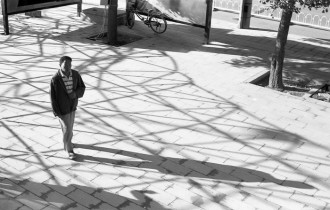

# 孔大牙

外面狂雨狂，雨水连成片，雷声轰鸣，由远及近，一层层响。空间充斥着水声，鸣笛声。某一处街边，一个白脸汉子，长颈，平头，露一口大牙，紫色短袖绣暗金色纹理，三色格子马裤，一双绿条黑底旅游鞋，高帮白袜子，摇摆奔跑，水花溅的四处飞。

此人姓孔，孔姓在山东是大姓，姓孔的这位汉子每每提及自己的姓氏很是得意的。他去年谋得职业，正式的职业听起来有面子，国家养着他，他更得意。他的长相与其职业两隔。眼窝是深的，眼睛双眼皮长睫毛，鼻梁又不塌下去，也算是挺起来的，一张白脸，痣多了几颗也无妨，单单这一张嘴坏了一番上帝的好意、爹妈的辛苦。嘴唇厚也就罢了，却上下翻着，再罢了，可即便是悄声言语，牙龈也总是露着，一笑起来，斑驳的牙龈暴露出一整条，几乎忽略了牙齿，眼睛也眯成了缝隙，多余的鱼尾纹，高耸的颧骨，可笑又可怕。

重点小学教师孔大牙，穿梭在儿童的欢笑声中行走，校广场播放欢快儿歌，七彩墙绘，梦幻场景。他走起来如踩高跷，手臂肩膀僵硬扯动大腿，远远见到，三十米一脸严肃，二十米斜眼嘴角上翘，露出粉色牙龈，十米时，扬声高喊，音似狼嚎，刺耳且悠长，说：“你怎么这个赖样。”他将脸扭作一团抖着讥笑别人，借此与对方熟昵，这样狎邪的举动颇适用于流氓无赖间的交流，如今，多数初入社会的年轻人也惯用如此伎俩。孔子尚礼，崇文，孔大牙尚武，好恶，看来姓氏就是个姓罢了。

孔大牙家住老城新建材市场西北角村落中，四合小院，干净豁亮，有磁瓦有琉璃，一家和睦，日子闲适。晨起上班路上，他开着新买的汽车，打开音乐与车窗，驶过喧闹的街铺，活脱脱建材城五金店小老板。如今人的装扮与仪态跟职介渐渐疏远，福尔摩斯先生善于通过人的举动穿着猜出人的经历与职业，假使福尔摩斯来，观孔大牙甄别其职业，必败。

孔大牙的经历，我见到过的，初中、高中，十几年前，他学画，技艺佳，才情少，为人干练耿直，虽长相奇异，却抱得美人，青涩亦情色，美人学声乐，双双出入琴房，常远远看到二人着校服摇摇晃晃似企鹅滑稽可爱轻轻漫步。琴房里，美人弹琴嗡嗡琤琮响，大牙靠墙陶醉喁喁牙龈露，琴声曼妙，荡的遥远，操场上一对对同样青涩情色的男男女女耳悦人动。一天又一天，一年再一年，时间过得快，一转三年，各奔东西，大牙去了南方一所美术院校，美人在省内一所师范院校，异地恋孤单难免，成长使得二人变化迥异，通讯的便利并没有让人心便利，人往往词不达意。老人言门当户对是指人的志趣能否相同，村里的大牙与机关大院的美人，南方的大牙和北方的美人，错综冲突，乱离隔阂，肉体精神双双远，大牙终于戴上绿帽子。得知消息，他踏上北上行程，一路站在绿皮火车箱里颠颠簸簸风风火火，抵达，狂奔，见到美人，二话不说先动手，几个耳光后，大牙迎着风，忍着泪水，满腔委屈，一拳击中无辜的大树，血顺着手指流到地面，美人蹲着哭，浑浑噩噩，就此诀别。

返回学校，削发，一脸横肉，牙龈变黑，人见人惧。猖狂上身，颠倒梦想，他对艺术没有追求，亦没有才华，没有好作品，也不向往艺术家的生活，仿佛没有贪婪，其实是自己无知，家境平平，独子，老父老母盼他回家娶妻生子度晚年，如今，连娶妻的梦也破了。

四年的专业美术学习带给他的悲多于喜，恋情断，所学的版画专业在老家又是偏门，一手寒窗技艺返乡培训艺考学生。

艺考老师闲不住，白天夜里都有课，他尽心又尽力，博得老师与学生的彩，工资不算少，花的快，赚得也快，朋友常常嚷着要他请客，大牙善酒，斤八两白酒不在话下，白的喝完喝啤的，酒足饭饱赶夜场，大城里的夜总会姑娘来自小城，小城里的夜总会姑娘来自县城，一口乡音，一头糟糕蓬蓬发，钱不少花，大牙心狠手不狠，将姑娘从里到外一把抓，再喝，再唱，再去洗浴中心，冲洗，更衣，等待，入房，姑娘来，做爱。一夜把钱花完拉倒。

听说酒后的大牙很疯狂，有几次跑到初恋美人家楼下大声叫骂，如今不敢了，重点小学的美术老师也可谓堂堂了。

前几日大牙突来我画室，照面后仍是一通讥讽，牙龈上多了一条歪歪扭扭的黑线，半笑半狰狞的嚷着：“你个死赖样。”当时在场还有两位友人，他也不拘谨，一屁股坐下大声地说：“你们俩怎么找他啊。”两位朋友笑笑，大牙大声笑。一席话，整整一席，恰有一位朋友与他是校友，大牙与他聊起旧时与现时美院老师的八卦，多是些“某某升了系主任，某某几个女人”，无一句话关乎艺文，大牙满足的将头仰在靠背椅上，淡淡的说：“回家后再也没有人能够和我说说艺术，今天真痛快，以后要常来聊聊。”

此时日已入暮色，落日的黄光笼进斗室，大牙的牙泛着一层油油的黄光，他叹了一口气，蓦地转身，匆匆告别，开着车喝酒去了。

(采编：王卜玄；责编：王卜玄)

[【微列传】莉昉 ](/archives/39252)——糖果和鼻涕都没了，一身轻的她，居然翘起兰花指，咿咿呀呀地唱着什么。我那时不懂。后来听游园惊梦，想到她，惊起一身汗。

[【微列传】我最喜欢的柬埔寨人](/archives/39272)---那一刻我觉得我是一个语言艺术家，完美衔接了中外桥梁，总有一天世界各国会通过我和我的小伙伴们把手紧紧握在一起。

[【微列传】镇魂锁](/archives/39335)---在烧的人一声不吭，站着的人不敢出声，两个孩子被砸到地上，还活着，吓傻了，人们只听得到火焰灼烧皮肉的声音。然后，那火人跳入了天堂般的河流。
