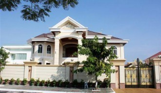
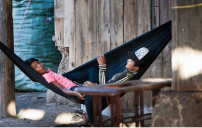

# 我最喜欢的柬埔寨人

说阿宾是我最喜欢的柬埔寨人其实有点勉强，因为我就只认识这么一个柬埔寨人。

阿宾曾经是我们班智商最奇特的一个孩子。我之所以用了奇特这个词，是因为他的思维之蜿蜒曲折导致我根本无法估测出他的实际智力。他可以在学习流体力学的时候问我，大便的在马桶壁上的阻滞系数是多少，小便冲击在墙壁上是否会产生边际层分离，海贼王里乔巴的鹿角是长在头上的还是装在帽子上的，这世界上是否存在有着一米长鸡巴的男人等等。每当我认真思考完这些问题然后告诉他答案的时候，他都会皱起眉头，说：

" That's gay, man"。

这句话翻译过来就是“你个基”，虽然正确的翻译应该是“这太疯狂了伙计”。文雅一点的话，我们可以用中央六配音的语气说，“哦查理这可真是太糟糕了”。

这本来不是一句夸赞的句子，经常用会让人觉得使用者是一个像我一样的low逼。但是在四年的学习生涯里，阿宾养成了见到什么都要说这个的习惯。比方说有次好学的阿宾去问老师矩阵变换的事情，老师一个神奇的变换以后阿宾看傻了，老师拍了拍阿宾的肩说小伙子这个步骤不太容易想出来没有事，阿宾说你个基，老师说呵呵。

阿宾的名字很奇特，叫Sokmeanheng Pen。第一次见到这个名字的时候我吓尿了，我说哥们儿请问你这个amazing的名字怎么读，阿宾用极其嘶溜嗯啊的东南亚口音告诉我了一个神奇的读音，据我回忆应该读骚克米央昂哼硬。虽然我舌头很灵活，但却永远发不出那几个好似脑袋里装了三斤痰液的名字，如同加藤鹰见了欧美女优，手指头往进一伸发现深不见底还没到三分之一，任你功夫之好也无从施展。

我试了两遍以后放弃，问大哥你有昵称吗。阿宾潇洒的撩了一下头发，说，Pen, Sokmeanheng Pen. 你知道Bond, James Bond吗，就这么读，伙计。

我绿着脸竖起大拇指说果然有底蕴。我的基友罗伯特默默重复，嗯，Suck My Heng。

阿宾来自一个富有的柬埔寨银行界家庭，当然据他的描述，他家应该是做民间集资也就是高利贷的，所以阿宾基本上就是二流子业巨子。

我曾看过阿宾家的豪宅，一坐东南亚式的钢铁侠老家style的建筑坐落在画面的中央。阿宾给我说，你看，我们柬埔寨很有钱，能造出这种堪比堡垒的房子。但目光如炬我的我和罗伯特立刻发现，在豪宅的外面是一跳连柏油都没上过的堪比月球表面的泥土路。

我问阿宾说既然你家这么牛逼那为什么不把门口的路修一下呢，我们社会主义国家的富豪发财了以后都爱给家乡修路，一修修大几十公里，让山里的孩子们都走着大路去上学了。

阿宾解释说这没有必要，你们社会主义想的就是太多。我们家人都开悍马，越野性能强劲，跨越这等土路如履平地。

我说那既然你如此不喜欢社会主义你一定来自于共产主义的过度，那买不起悍马的人呢，给他们一人发一辆吗，顺便再发个媳妇吧。

阿宾一时语塞，曰那就让他们淹死在泥土里吧，反正他们经常在那一带闹事犯罪，有时候还想冲进我家，可都被保安赶跑了。

我点头说做的好，就该饿死他们淹死他们，剩下你们这帮有钱的，这样你们柬埔寨就提前实现共同富裕了。这些暴民居然还想闯进你的家里，真是一帮螳臂当车的暴徒，开你的悍马压扁他们。

阿宾有一个15岁的女朋友，这让我们一度怀疑这是第三世界国家人口买卖生意的结果，可是阿宾说，这可是我母校里最可爱的女孩子。

我说，既然这么可爱那一定是男孩子吧。

没有上过ACG网站的阿宾义正言辞地说，不，虽然我还没干过她，但是我很确定是女的。

我说我操你怎么知道啊，这可不好说。我给你点互联网第二大搜索机构自带论坛的伪娘图片，再给你点他们正常的样子，你来玩个连连看试试。

阿宾说，我就是知道，我抠过。

当然阿宾不会说抠这个词，于是他形象地使用了动作描述这一动词，在说“我那个过”的时候手掌向上，中指不停地冲我抖啊抖。

我说看不出来啊小伙儿练过。

阿宾自豪地说我妹是个拉拉，她悄悄教我的。

我恶心劲儿缓过来以后我说，阿宾，伦理关系我们不谈，以后不要做这个动作了，它有专门的名词。

阿宾一下来了兴趣，问我是什么词这么先进，让我赶紧识字进步一下。

我说，在我们中国，我们把这个动作叫抠逼，就这么读。

阿宾说，啊怎么拼，我要上网学教程。过去我都苦于没有引路人只能自己摸索，如今终让我见照世明灯，善哉善哉。

说罢，自称是佛教徒阿宾来了个阿弥陀佛。

我说哦可简单了，K, O, B, E。

我还告诉他，今天你就是我们金手指组织的一员，我们的口号就叫”Swallow My Squirts”。

随即想去认真学习教程做到“世界惊奇、女人满意”的阿宾就立刻坐在机房的电脑前开始了认真的搜索，且用Kobe一词google出了满屏幕的拿着篮球的黑人。

随即不甘心的他又想尝试google那个口号，结果因为直接出现了黄色信息导致账号被封禁十二小时。

抑郁的阿宾问我这是为什么，我说你看，你先搜索出来的是一个黑人，哪里有黑人，哪里就有幺蛾子。

阿宾把大腿一拍说那他妈这群黑鬼是晒黑了的韩国人吗。

有天阿宾看我在和一个中国同学聊天，对博大精深的中文产生了兴趣，加上曾经在广东地区呆了两三年，所以经常来向我讨教汉语言相关事宜。

我看他谦虚，就说好你要从哪学起。

阿宾一开始坚称学习一门语言应从学骂人开始，并坚持自己会的第一句英语是从好莱坞电影上学得的Fuck You。我说我们中国骂人的话你肯定得学到你这15岁的老婆大学毕业，我汉语博大精深岂是你一个蛮夷可以领略的。

阿宾不服，我道你知道日你妈的主语是什么吗，你知道为什么iPhone叫肾机吗，你知道为什么姚明和我们一个作家的合影只有一个人吗。他想了一下觉得确实难，学习时间可能确实需要很久，于是说那从我的名字Sokmeanheng Pen开始吧。

我说这个too simple，Pen的音译就叫宾，你以后就叫少年阿宾。我们中国有一部挺厉害的文学巨著就叫这个名字，顺便你女朋友的中文名我也起好了，就叫白洁，和你是一套中华文学巨著三部曲。喏，我们这代人全都是看这些长大的。

阿宾很受用，觉得热心如我的人在当代社会实在是不多见了。于是面带笑意接着说那Pen的中文是什么呢。我说，笔。

他开始模仿，说，逼。

我说，不是逼，是笔。你以后给人自我介绍，就说，我是笔。

阿宾说，我是逼。

我说，操你妈，不是我是逼，是我是笔。

这时在中国呆过俩月的基友弗莱彻也说，你发音时候人先向下沉，再往起抬。

我补充说没有错就像刚射完又看见了斯嘉丽约翰逊一样。

于是阿宾和我卯上了，憋足了气，先蹲下，再猛地站起，一口气说道：

“我是逼我是逼我是逼，我~~是~~~逼~~~~~~~”

当时我很庆幸阿宾不是一个美女，如果是的话，一个美女不停地对我说，我是逼我是逼我是逼，然后还带着~~~这种充满色情意味的音尾，这简直就是等于高跟鞋轻踏在地的声响，和带着体香的胸罩的味道，我是会把持不住的。

但是看了看阿宾的脸，我立刻回到了现实，你才不是一个有脑子的男同学。五个回合后我放弃了教他说这个简单的语句，然后阿宾问我，既然不好发音，那我把我名字的意思告诉你，你帮我翻译一下，也算我对自己的名字和人生有一个清晰的认识，不要和他们这些白人一样都不知道自己名字有什么高深的含义。

我说好，但是你他妈的好歹告诉我Sokmeanheng是什么意思行吗。

阿宾说，基本上就是Smart, Handsome and Rich。

我说哦所以你看我们中国人都说名字和人生都是相反的。你看我名字里有个严字，所以我一点都不严肃。

阿宾说：“那你翻译，Smart是什么。”

我说：“机智。”

“Handsome呢？”

“炫酷。”

“Rich？”

“屌炸天。”

那一刻我觉得我是一个语言艺术家，完美衔接了中外桥梁，总有一天世界各国会通过我和我的小伙伴们把手紧紧握在一起。

唯一的遗憾就是阿宾没有听懂。

我说我教你个全中国人都会说的吧，你往我国随便一个地方一站，说这句话，就会有人过来和你击掌相庆。钓鱼岛是我们的这话有点儿长，给你弄个短的。

阿宾说有此神技你怎能独自保留，快告诉我。

我说，可简单了，来，跟我读：

“国足傻逼！！！！”

我和阿宾变得亲近的主要原因是我俩被分到了一个项目里。这个项目的主要目的就是给定地震带来的地面加速度来预计一下地震中混凝土建筑的损失价值。

其实阿宾在大四之前一直充当着学习小组的下限，就像人大老师会告诉学生们“不好好学习大学就去隔壁上”一样，我们一直互相鼓励曰不好好学习你就只能去给阿宾上课。不料在挑选毕业设计的时候，机智的电脑系统将我和阿宾的名字紧紧联系在了一起无法分离。

于是第一天，我和阿宾去找我们上遍了亚洲所有结构工程专业牛逼的大学的教授。教授给我们了10篇论文，让我二人好生研习一番来日做一下深刻的思想汇报。英语烂的一逼的阿宾在第二天找到了我，说我看完了，我们去找他吧。

我被震精的程度堪比我第一次上黄网，就是一种“我操这世界上还有这么大的奶”的感觉。当时我还在第三篇上挣扎，英语烂的一逼的阿宾居然读完了，这让我感叹我真是见的世面太少了。阿宾的英语有多烂呢，他问出过what the fuck does WTF mean这种简直是自我悖论中扛鼎之作的作品。有次阿宾写的论文挂了，需要改，于是罗伯特自告奋勇上前去。三页的文章让西洋小雷锋罗伯特花了将近四个小时才分析出来阿宾想说什么，其中有一句是这样的：

So dear Professor, guess who am I and what I am thinking about?

教授批阅时回复：I don’ t care.

有此前车之鉴，我怀疑地说阿宾你真的看完了么。

阿宾说，你不相信我，我好难过，我要哭。

我说好你别哭乖给我两天让愚蠢的我看完这些，我们后天去找老师吧。阿宾说，好，但是你别说你别哭，你个基。

于是第二天晚上我看到了智商奇特的阿宾不出意料地把和教授会面的时间安排在了我们上课的时间，在听我说了这件事情以后，大家全部扶额摇头，并轮番拍了我的肩。

后来经过我的一番交流，我们换了个时间去找教授，阿宾信心满满挺起小胸脯说我已经通读全文并能大声朗诵，颇有一种我右拳打开了天化身为龙的风范。坐下以后教授说，来，给我说说你们都会了些什么。

阿宾把大腿一拍，”这世界有很多种不同的天花板！“

教授一楞，说，嗯没错，hmmm interesting。还有呢？

当然，这句interesting在英语里的地位同等于“呵呵”。

阿宾说，没了。

一片死寂后，教授把视线从已经开始捂脸的我身上调转，望向窗外。

我觉得他当时的内心一定是：负分快他妈滚。

阿宾内心很敏感。从KOBE那件事以后，阿宾对黑人产生了一定的心理阴影。然后波士顿爆炸案一发，阿宾又开始害怕中东人。

他有多害怕呢，举个例子，我们坐在一间教室里，前面有个助教包着头巾，是个典型的阿拉伯国家妇女。

阿宾看到后紧紧抓住我们说，那里有个穆斯林，操的咧我们教室要死啦！

尼克实在忍不住了说操我们教室他妈的不会爆炸的你坐好。

阿宾说你个基。

那天我们去找教授汇报进程，我嘴贱给教授汇报了一种测量方法，教授说，啊你这个对我一个PhD的Project很有帮助，于是拿起电话，说，啊那个谁谁谁，你叫穆罕默德上来一下。

于是我看到我们亲爱的阿宾虎躯一震。

过了两分钟上来了一个两米高的黑人，效果叠加以后阿宾脸都绿了。

我还琢磨说卧槽怎么能有黑人叫穆罕默德的时候教授说，咦怎么是你上来了，我叫另一个默罕默德，不好意思你下去把他叫上来吧。阿宾长出一口气。

又过了两分钟，上来了个中东哥们儿。

也两米，据阿宾描述，“他脸比我屌都长”。

此时阿宾脸又绿了。我安慰阿宾说没事儿没事儿一会儿咱就走了，快放下阶级仇恨，为了科学我们先从五湖四海走到一起来。

教授看了一下我们的报告说，你们的Project还挺合拍的啊，来来来默罕默德，从现在开始到年底你就和他俩合作了，你们握个手吧。

握手的时候阿宾简直是在笑着哭。

出门的时候我问阿宾，你没事儿吧。

阿宾说，我去你妈，他胳膊上的毛好长，扎的我快阳痿了。

由于信息量太大，我懵了。我问阿宾，那你的意思是，你刚才在开会的途中硬着？是见了教授硬了还是见了穆罕默德硬了？

阿宾说都不是。

我仔细一想恐怖至极，没敢问下去。

阿宾说啊我只是想到了前几天看的那个swallow my squirts，你个基。

虽然在阿宾身上，我第一次体会到傻逼这个词不做骂人而纯做形容词是什么意思，但是由于太傻逼就显得可爱了，所以我们都很喜欢阿宾，同时也因为阿宾的节操和我应该一样没有什么下限。

由于我和基友安德鲁才被封为学院历史上最种族主义的亚洲人，好胜心强的阿宾觉得他才应该是第一，于是有一段时间跃跃欲试展示自己的下限。比如我们看到有一群印度人，阿宾就会叫他们咖喱俱乐部。我们对阿宾这种行为批评了一阵子以后，发现其实还是很具有娱乐效果，于是就任他去。阿宾很感谢我们，向大家诉说他和我们是一辈子的好朋友。

有次下雨，哥儿几个又冷又饿困在图书馆，阿宾带着雨伞和麦当劳杀来。我们紧紧握住了阿宾的双手。

我说，阿宾你真是个好人，We fucking love you.

阿宾说seriously? 但是fucking这个词不好，你个基。

我说, yeah truly

“Madly”， 尼克补充道。

“Deeply”，罗伯特总结性发言。

正当我们准备合唱一首这支歌，阿宾听到Deeply脸色一变，捂住屁股说，

哦罗伯特，你个基，我才没有那么深呢哼。

（**采编**：王卜玄；**责编**：王卜玄）

[【微列传】莉昉](/archives/39252)----糖果和鼻涕都没了，一身轻的她，居然翘起兰花指，咿咿呀呀地唱着什么。我那时不懂。后来听游园惊梦，想到她，惊起一身汗。

[【微列传】孔大牙](/archives/39233)----前几日大牙突来我画室，照面后仍是一通讥讽，牙龈上多了一条歪歪扭扭的黑线，半笑半狰狞的嚷着：“你个死赖样。

[【微列传】镇魂锁](/archives/39335)---在烧的人一声不吭，站着的人不敢出声，两个孩子被砸到地上，还活着，吓傻了，人们只听得到火焰灼烧皮肉的声音。然后，那火人跳入了天堂般的河流。
