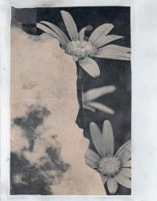
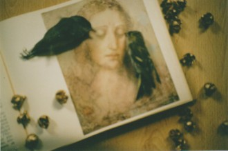
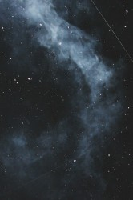

# 爸爸

十二岁那年，我第一次见到爸爸的照片。

在这之前与之后，他于我，都是以一座孤坟，乡邻口中的哀叹惋惜，同学的嘲笑这样的方式存在和印证的。

不过，故事可以用美好的方式开头。

而最初的美好，要从我妈妈说起。

母亲至今嫌弃我不好打扮，每次打电话必催我买衣服学化妆，宣称那个爱美的表姐才该是她的亲生女儿！“怎么可能，我不收拾也比她好看多了，都是您生的好。”

“那是，”母亲很受用，倏尔又黯然，“生的好个屁！你爸的高个子白皮肤，你一样都没有学到。”

父亲母亲最初的相遇，就与母亲的美有关。

** **

****

** **

那是1990年的春天。

80年代末的风云剧变，对小镇的人没有太大影响。尤其是我父母这样，根本没有接受过高等教育，最大的人生梦想不过是去南方淘金的年轻人。更何况，镇上第一次有了电影院，可以烫头的理发店。南方每吹过一阵风，年轻人的心都跟着躁动兴奋一番。

我时髦的妈妈，开风气之先的烫了大波浪，每个发卷都乌黑明亮。然后时髦地去电影院看电影，看的什么她已经不记得了。因为她遇见了我的父亲，一个毫不掩饰直盯着她看的年轻男人。22岁，刚刚长成的女性的妩媚与天真，打动了父亲的心。

母亲每次讲到这里都轻描淡写，羞怯地模糊了所有细节。只说烫头发闷热，烫出来的头发果然很久都不变形。我侧过身子，把手放在她松软的小肚子上，轻轻地抚摸她，窗外，夜晚很深了。腰肢已爬满赘肉，不知道父亲第一次搂着她，是什么感觉。

后面的故事顺理成章，机敏的父亲先与母亲聊天，问到了她家地址，很快就请媒人上门提亲了。带了丰厚的彩礼，那还是91年，他是出色的木匠，头脑灵活，一个人一天挣到过五千多块。

再后来，就有了我。

他深爱母亲，性格温和，凡是都迁就着这个脾气暴烈的女人。二姨多年后见到我还愤愤地说，母亲与继父打闹亦是活该，以为谁都会像父亲那般迁让她。小两口吵架，父亲被抓得满身是伤不敢还手，让母亲把家里连泡菜坛子都打碎了，怒气冲冲地回娘家。反正过不了几天，父亲会上门道歉把她哄回来的。

高中三年，食堂饭菜都难吃，我却独爱白菜，每顿饭只打它。我有个好朋友，热爱土豆，也是三餐只吃土豆。到后来，我们都不愿意与彼此一起吃饭了——看到对方碗里的亘古不变的菜都要吐了。

后来母亲告诉我，她怀我时，跟所有孕妇一样，爱吃一些奇怪的东西。比如白菜，爱吃到了偏执的地步。但偏偏92年家乡异常干旱，种不出白菜。爸爸守着她不愿出去工作，家里经济状况很紧张。见她想得厉害，干脆背起一个大背篼，跑了很远的路，去人家地里偷了满满一背篼白菜回来，回家就被爷爷痛骂了一顿，奶奶就更伤心了，觉得他疼媳妇疼得连脸都不要了。他倒是无所谓，每天变着法给母亲做饭。

我终于知道爱吃白菜也可以遗传。

****

** **

再后来，他就因车祸过世了。

那是1995年的7月29号。

因为死于意外，他被葬在荒僻的远山树林里。离家很远。从此，当我渐渐有了记忆，他已经是一座孤坟了。

我曾幻想，他没有死去，他会衣锦还乡地归来，给我们道歉。又或者，狼狈不堪地回来也行，只要还活着。甚至有个私生子都好，至少我可以从那个孩子身上，看到一些他的影子。不像我，完全不像他。高个子白皮肤，安和的性格都不像。

但很快就不再幻想了，目睹了母亲与继父打、闹，被指责，我在亲友家轮流过夜，被嫌弃和教育，爷爷奶奶晚景困顿凄凉，而我无能为力。幻想就变成了怨恨，凭什么？凭什么这样不负责，凭什么让我和妈妈吃这么多苦？可他已经什么都不能做了，他不过是一座孤坟。

所以母亲说，我与他命里没有缘分。我还是婴儿时，只有他一走进房间，我就痛哭不止，很少对他笑。这让他恼火不已。所以有族亲会去算命，猜我克了他。所以幼时我担了很多指责。

不过没关系，不关你事对吗？我知道你也不想这样的。爸爸。

其实我更习惯称他为生父，“爸爸”这个词，对我而言陌生而别扭。我习惯了这样长久的缺失，无法想象将来如何称呼爱人的父亲。只有春节时，被强拉着敬酒，给一个本可以陌生的男人。低着头不敢看继父的反应，彼此都尴尬，端起酒杯一饮而尽。

他大概亦尚未习惯已经做了父亲。不知道当时我是否已经学会说话了，叫过他“爸爸”。95年那个七月的事，在后来与族亲的聚会中被反复提及。倒不是对他们而言多重要，只是时间已过去太久，对我这个偶尔归乡的陌生姑娘，大概也找不出更多的话题了吧。

正值收获玉米，母亲与舅舅舅妈急忙坐飞机飞往深圳。爷爷奶奶每日只是昏天暗地的哭，谁家来帮忙收了我家的玉米，谁家每日给爷孙俩送饭，乡邻是怎样的反应，葬礼如何的凄惨，在日后他们的复述中，当日参与其中却浑然不知的我，才有了一点概念。

有一位伯伯，甚至给我讲了他如何为父亲梳洗，打理遗容。车祸离世的人，可以想象有多血腥。他说，别人都害怕，只有我，自家兄弟怕什么。我该感谢他的我知道，但我还是不想知晓太多的细节。

我已经知晓太多了，爷爷如何如何颤抖地扶着小铁锤，在纸钱上敲出繁复美丽的花纹，说希望他能喜欢；认真地在每一张纸钱上都写上他的名字和生辰忌辰，怕他收不到在阴间过得不好。奶奶如何切好每一块“刀头”，装满小兜，带到坟上做他的祭品；如何虔诚地一边点香，一边跪下颤颤巍巍地求取菩萨原谅——她是佛教徒，长辈给晚辈上坟是不合教义的

奶奶慢慢地把一碟一碟祭品依次摆开，叫他，“少华，来吃嘛，你在那边吃得饱不饱？”等很久，连坟头的香都是静的。奶奶又默默地，把一碟一碟祭品放回提兜。爷爷从不随我们来，只是回家时，他必定呆坐在门口，痴痴地等着我们。

再后来，爷爷，奶奶，都相继离世。他们没有葬在一起，也成了一座孤坟。

****

而我唯一一次为父亲流泪，也与他的坟墓有关。

2010年的清明节，我与妈妈去给他挂清。却看到他旁边立起一座大坟，坟前有石狮和柏木，非常气派。却把他的墓给完全挡住，树林本就阴黑，更不见阳光了。

我一下子暴怒异常，把香蜡纸钱扔给妈妈就冲上前去，一脚踢在石狮上，“我日你妈，欺人太甚了！”又空出手来想扯掉柏木，又踢又抓，“你妈子孙都是贱人，我要连坟都给你们炸了！”

妈妈急忙拦住我，安抚我不要太冲动，说有个人作伴也是好的，我气什么？

我忍住不想在她面前流泪。

我气什么？他与世无争地活到28岁就过世了，守在这么个破地方，冷，阴。孤孤单单待了十多年，突然冒出来一座坟，连最后一点阳光都想跟他争？凭什么？世道为什么这么不公平？凭什么，他什么都没有你们还要这样欺负他。

我已泣不成声。

我知道，如果他还在，大概会比他当年提携的三爸还要出息——三爸已经有自己的厂子了。然后他大概会想有个儿子，会更宠爱那个儿子。我在青春期会激烈地跟他吵架，我会厌恨他，我会跟他和解，我会看着他一点点变老，变得越发慈爱，会催我找个好对象，会劝我别太挑，会逗我孩子玩。不，都不会的，他已经离世了。所有的可能都被掐断了。从那辆大货车失控地飞驰开始，从他后座那个同事跳车逃生开始，从他回头发现自己已无法逃脱时开始，一切都已经结束了。

我一点点长高，他的坟一点点变矮。年节那一点香火，呛人的烟尘很快散尽，就是我们之间唯一的交集。

何伯伯是他的好朋友。他告诉我，92年的那个夏天，村里一头牛从山崖滑下来跌死了。因为是全村的共同财产，大家决定选几个年轻人，把牛弄到镇上卖了换钱。最后选了何伯伯与父亲。

牛肉是那时的稀缺品，很快卖了好价钱。何伯伯与父亲高兴地下馆子，吃菜，喝酒。他不胜酒力，醉倒了。在山路上开心地摔了一身泥，被伯伯背回家。回家时已近黄昏，母亲焦躁地等候太久，看见他满脸绯红一身烂泥的回来，怒不可遏，不顾旁人在场，立马上前抽了他一巴掌。

****

他却不怒，醉醺醺地跌坐在母亲怀里，抚摸着她的肚子，带着醉酒的人特有的微笑，与腹中的我说话。眼里是无限的怜爱与满足。

**采编**：王卜玄，陈静；**责编：**王卜玄

[【微列传】莉昉](/archives/39252)——糖果和鼻涕都没了，一身轻的她，居然翘起兰花指，咿咿呀呀地唱着什么。我那时不懂。后来听游园惊梦，想到她，惊起一身汗。 [【微列传】孔大牙](/archives/39233)——前几日大牙突来我画室，照面后仍是一通讥讽，牙龈上多了一条歪歪扭扭的黑线，半笑半狰狞的嚷着：“你个死赖样。 [【微列传】我最喜欢的柬埔寨人](/archives/39272)——那一刻我觉得我是一个语言艺术家，完美衔接了中外桥梁，总有一天世界各国会通过我和我的小伙伴们把手紧紧握在一起。 

[【微列传】镇魂锁](/archives/39335)——在烧的人一声不吭，站着的人不敢出声，两个孩子被砸到地上，还活着，吓傻了，人们只听得到火焰灼烧皮肉的声音。然后，那火人跳入了天堂般的河流。
