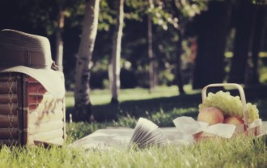

# 莉昉

我站在姥姥家的后窗旁用爪机刷微博，一抬头，突然看到一团肉呼呼的脸。睫毛很浓，黑色挤满整张眼球散发诡异的光，下巴贴在玻璃上变了形。“妈啊”，手机直接被摔到地上，姥姥进门也没管我，一边向窗外那个肉团招手一边拿粗嗓门喊，“哎哎，丽芳，美佳回来啦。”

十多年过去了，我不知道她的名字到底怎么写，丽芳，立房，还是莉昉。总之她离开后，姥姥又好几次絮絮叨叨说，她特别想我。

哈哈哈哈。

姥姥看我无动于衷，又夹起小板凳到房山头打麻将去了。房山头是个宝地，全村最凉快的几平米，当然，你懂的，这种地方也是各种闲杂碎的传播中心。

后来我跑到菜园子里跟死党打电话，收线之后就后悔了。我发现自己走进一大片玉米地里，刚下过雨，玉米的胡须还依依不舍沾着潮湿的雨水，算了，没心思理会这些描写，因为我怕雨后的癞蛤蟆。我小时候喜欢把癞蛤蟆抓起来放在罐子里养着，尽管姥爷总说，它们的尿只要溅到眼睛里就会瞎。

“啊……”

丽芳跟癞蛤蟆一个姿势蹲在那儿，朝我傻笑。左手插在腥湿的泥土里，右手握着一只挣扎的蚯蚓。“来，给你，你来掰断它。”（好吧这是我小时候最爱的游戏之一。）

我下意识地后挪一小步，就算真的野性不改，好歹我也刚做了指甲。我总不能像孩子一样扭头拔腿就跑吧，但也不能跟她说“对不起，我真的做不来”，我怕她理解不了“对不起”。于是我愣在那。

她大概看我太可怜，就蹭地站起身，一撂胳膊把更可怜的蚯蚓甩到某根玉米杆上，拍拍裤子说，我带你去个地方。 我竟然跟她走了。

小时候，她也是这么跟我们说的，我就带着一伙人半信半疑地跟她走。我们有时候捉鱼，赶海，挖荠菜，路过房山头，撑着脑袋玩泥巴的她偏要加入我们，那时她妈妈也在，碍于情面我们就默许了。等离开房山头，立刻变小跑让她追不上。那时候不待见她，她身上有种戾气，幽深又骇人。她带我们去一个地方，停下来，撑着腰踮着脚尖画一个范围，让我们挖洞，竟然能挖出糖果和几毛钱硬币。这样短暂的时刻，她就取代了我，成了神气的孩子王。当然我心甘情愿。

我们每天都缠着她去挖宝，她每天领我们去不同的地方。挖到了，就跟她玩耍，有时候指头都磨秃了也毫无所获，我就率先跑回家看电视去了。这一天她脚尖画圈的地点比平时都要远，她躲在一边叼着狗尾巴草看着我们，我们用手挖到一团温热的黏糊糊的东西，嗯，你懂的。她要跑，但太胖了，马上被我们围住。其他男生率先把满手的战利品像毛巾擦手一样擦在她衣服上，后来到了脸上、头发上。我报复了一会儿之后良心发现，觉得虽然被耍了，但还是得有点道德底线，我吼不住其他人，只好一个人去河边洗手回家。

印象太深刻了，我最后看了她一眼，双手双脚在扑扇，像蚕一样肥硕的躯干在扭动，但眼睛里，漆黑的眼球，什么都没有，比一张黑纸还要空。

我回家后，姥姥就夹着小板凳火急火燎地出现了。她已经知道了。“你个瞎猴子，干得是人事儿吗！”姥姥的嗓门大，反而说什么话都像表演式的戏剧，我并不害怕。骂了一会儿，姥姥眼眶就红了，左眼流清泪，右眼流浊泪。我终于有机会知道一些旧事。

她并不是天生就傻，高考之前出了车祸，农村医疗条件差没当回事儿，于是成了四五岁的智商。姥姥一边抹泪一边翻她用挂历糊的小斗箱，掏出一张黑白照片。“你看看，多秀气，你十八岁时能赶上她一角（jia三声）么？”我抢过来贴近了看，不顾手上残留的恶臭。麻花辫儿，大眼睛，尖下巴，拿一朵百合花，波光流转含情脉脉。“成绩又那么好，哎，苦命的孩子。”姥姥弹去指尖的泪，又去抠眼角。

我那时就已经被毁三观了。

后来看到朱令，我又想起莉昉（这个名字比较美丽不是吗）。没有人知道这个美丽的姑娘哪一天剪掉了长辫子，哪一天胖起来，哪一天起，目光不再像歌声一样宛转悠扬。

我也想到了一些事情。

那次她弟弟结婚，我们去吃喜酒。她穿一件改制的红衣，左胸前别一朵塑料红花，两只耳朵边各自别了一朵，在门口招呼客人。小孩四处捡地上遗漏的小鞭炮，围着她放。她也不恼，像跳皮筋一样躲开脚底下炸开的声响，两只小红花掉了一只。后来，新娘子和家人来了，她妈妈飞快跑出来，把她连拉带揪地带到房山头。“你就在这儿别动，我让美佳和你玩。”——于是我也没看成新娘子，也没抢喜糖。

房山头的老婆们都到她家吃酒去了。她乖乖坐在石凳上，像将要燃着的火苗马上被一盆冷水浇熄。我一边安慰她，一边难过喜糖要被抢光了。突然她开始哭泣，小声抽搭，直到嚎啕，手指如同假山，鼻涕眼泪像山上的泉水。后来直接在泥地上打滚儿。我惊呆了，也真羡慕她，悲伤都能这样酣畅淋漓。她哭够了，翻口袋，四个口袋里满满的喜糖，沾着鼻涕塞到我怀里。

糖果和鼻涕都没了，一身轻的她，居然翘起兰花指，咿咿呀呀地唱着什么。我那时不懂。后来听游园惊梦，想到她，惊起一身汗。

后来听房山头说，她弟妹进门时，跌了个跟头，流鼻血了都，好不晦气。

变傻之后，她妈妈一夜间愁瞎了一只眼睛，以后总是姥姥用唾沫浸润细线，仰天帮忙穿针。那时我妈差几分考上大学，他们家马上借给姥姥三千块，在农村简直天文数字。“你妈要是不上大学，哪能认识你爹，哪有你这瞎猴子！”说到这，姥姥想起我们大逆不道的恶行，到处找木棍准备打我。找不到小木棍，竟然扛起姥爷的头。我吓得魂不附体。

扛不住房山头的舆论攻势，我们小分队逐渐解散。但老婆们都说，关键时刻是我阻止了邪恶的小伙伴们，救了莉昉。莉昉的妈妈甚至感激地拥抱了我姥姥。再经过房山头，我总把头仰得高高的。

有好几天我憋在家看动画片思过，心里也痒痒，不知道其他人有没有被打得皮开肉绽。有一天我去村口代销店买盐，发现小分队又聚拢在一起。领头的大龙擎一根竿子，像是去掏鸟窝。我要加入他们，阿龙说：“你是好孩子啊，我们可不是。”我很快追不上他们。

我第一次被他们嘲讽冷落。后来我又拉下脸找他们几次，总是悻悻而归。莉昉坐在她家的门墩上，不怀好意地朝我笑。妈的。

一连几场暴雨过后，湿漉漉的菜地，玉米蹿到老高，野草和蚯蚓都是瞬间冒出来的。天晴了，蝉虫的鸣叫声让人耳朵发燥，心里发痒。再远一点，小河边的草好像流淌着绿色的血液，跟河流的节奏一致生长。麦子要熟了，睁开眼睛就能看到麦香。再再远一点，是大海，岸上的海带滑溜溜的，石崩上的蛎子壳拿石头尖轻轻一敲，嗅一下，鲜得要掉眉毛。

我把那套积木堆了二十一遍，跳房子划线用光了一块小石板，掌上游戏机换了两次电池，这个夏天终于要结束了。我要去镇上的幼儿园念大班，再过一年，就要上小学了。这段童年也结束了。

走的那天，大龙竟然率领小分队出现了，他们站成一排，一言不发地看着我。我犹豫了一下，去储藏间把两罐头盒子鹅软石送给两个女孩子，一个炮仗送给大龙，又趴在他的耳边说，往前走五大步，在臭水沟旁边你去挖洞，我藏着好多玻璃球，以后谁听话了分给谁，稳固军心。大龙点头如捣蒜。其他小伙伴眼巴巴地望着我，我小手一挥，我走啦。

车子路过莉昉家，她装着婚礼那天的红装，朝我一个劲儿挥手。我很懊恼没留什么礼物给她。

十多年过去，她没那么胖了，身手稳健，而我穿坡跟鞋，到小山坡上，总要伸手让她拉我一把。我们俩走了很久，我还在小心提防癞蛤蟆，终于到了山腰。路上她吭哧喘气，闷头走路，也不看我。得了，我也不指望她说什么“十年不见，女大十八变啊”之类的话。我在她四点钟方向，一边玩手机一边端详她。突然邪恶地想到，她如果来大姨妈了，该怎么照料自己呢。

身上的气味没变，脸也没变，伸手抹汗时，看到她手上多了厚厚的茧。“到——了——”她拖长音韵指着半山腰的大本营。天呐，恨死自己没拍下来。我颤抖地描述一下，一块餐毯，周围摆着各种花盆颜色不一的盆栽，旁边是一完整的遮阳伞，没错，底座是巨铁的。她蹲下身在草丛摸索，摸到一瓶剩下四分之三的矿泉水递给我。

“你……你怎么弄来的？”

“这是我家。”果不其然，她答非所问。

我坐在餐毯上，望着山下那湾漂亮的湖，水还是那么清。我又尝试几次跟她对话，碰几鼻子灰，还是不气馁。我总觉得她不是那种真傻。她傻得再细密也有缝隙，我探头过去，或许就能见风光旖旎。

我沉默了一会儿。我走之后，她偶尔跟在大龙他们身后，如果还有硬币和糖果，也能赚得几天的好时光。城头变幻大王旗，很快大龙也要上小学了，小个子成了队长，再后来，村里又换了一批小孩子。再再后来，00后们都窝在房子里玩电脑游戏。

“你还经常去婚礼吗？”我又鼓起勇气发起一个问句。

她眼珠子骨碌转了很久，费力琢磨着我的话。

“没有，没糖，没新娘。”她答到了点子上，我比考上大学还高兴。

这件事是后来在房山头听姥姥和那些老婆们说的。

莉昉的家是村里的大户，在村里也有名望，听说今年她父亲还预备竞选村主任。每家有红喜事都叫他们家吃酒，妈妈也带着莉昉去。莉昉那件红装，派了将近十年的用场。莉昉跟孩子们捡喜糖，她块头太大，碍手碍脚，虽屡遭白眼，乐此不疲。等新娘子一过来，她就停下来。这次新娘给公公敬酒时手剧烈地抖了一下，酒泼了公公一身。公公脾气不好，当即露出愠色。新娘子委屈地哭泣。满座宾客无不尴尬，莉昉笑得很欢。第二天，房山头又多了一桩美谈。

后来大家发现，只要办喜事儿时莉昉在场，新娘子定是要倒霉的。大家观察到，新娘下车时莉昉眼睛直勾勾地盯着新娘看，口中还念念有词。这些年，新娘的囧事不胜枚举。比如吃饭时突然卡到鱼刺被送去医院，婚纱裙被小伴娘高跟鞋勾到直接走光……真是邪门。后来，大家不得不小心翼翼地跟莉昉妈讲，千万那天别让莉昉跑出来。但是农村根本就关不住人的，爬上平房顶顺着草厦子轻轻一跃即可，再不然，就顺着平房顶走到邻居家。哎，她这个妖孽。

她那时十八岁，想必也是有喜欢的男生了吧，或许也有稚嫩的海誓山盟了呢。上帝亏了她，给她一道魔力补偿，也是好的。

只是后来，大家兴起到镇上甚至市里的酒店办婚礼，莉昉再“聪明”，也是去不了的。

“美佳，你能不能陪我玩？”她指缝里又多了一条摇头摆尾的蚯蚓。 “好啊。”我伸出手，蚯蚓滑溜溜地躺在我掌心，我用左手食指玩弄了一会儿，又把它放回草丛里。

莉昉好像很失望，我没有小时候那么淘气那么勇敢了。

我很不好意思地朝她笑。

最后，她说，“其实大龙他们都很讨厌你，可我不。”

莉昉今年四十岁了，我总觉得她并不傻。

(采编：王卜玄；责编：王卜玄)

[【微列传】孔大牙 ](/archives/39233)——前几日大牙突来我画室，照面后仍是一通讥讽，牙龈上多了一条歪歪扭扭的黑线，半笑半狰狞的嚷着：“你个死赖样。”

[【微列传】我最喜欢的柬埔寨人](/archives/39272)----那一刻我觉得我是一个语言艺术家，完美衔接了中外桥梁，总有一天世界各国会通过我和我的小伙伴们把手紧紧握在一起。
