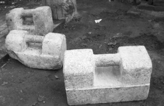
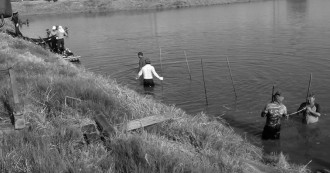
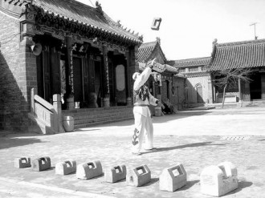
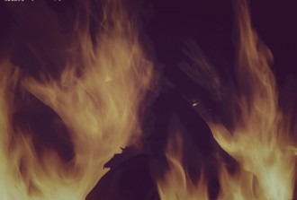

# 镇魂锁

如今沙上，还有几人记得马铁虎的爷？

时间是最厉害的杀人刀子，不光能杀的你身躯灰飞烟灭，更要连记忆一块消失无踪，仿佛你这个人从没在世上蹲过。你要说文章千古事，总有竹书铁券在，史家的事情断不了。那倒不假，可怎不见秦皇汉武，也不过二三页纸、千八百字，何况你我这等芝麻细民？上书的也不是没有——“坑杀赵兵四十万”。自古史家最无情，三四枚大字，便带过了积山的白骨，成海的怨魂。当然，也有例外，这个地方的百姓记住方卿的肯定比知道明宪宗的多——谁知道这皇帝老儿叫什么名号？哪有看戏来得痛快！

不过他们忘了铁虎的爷是不应该的。话说回来，若不是我的爷吃下了饭和我练唾沫，我又哪里晓得那个呆子的先人竟是这等人物！要知道我们家爷还在拾鸡屎的时候，这位好汉已经横行江北好些年啦！

如今沙上，已没有几人知晓马铁虎的爷。可要是搁在一甲子之前，整个沙上老岸并总靖泰十三镇谁敢不知道“一枪封江”朱定坤的名号？沪上罢工当街杀人，判死在监逢日军侵华赦死还乡，空手套得逃兵枪支起家，再往后，结队伍开香堂，维扬三县定规矩立秩序，兼任国军营长镇守一方——腰间一把三十二响快板百步穿杨，手下百十名彪汉壮卒铁索横江，莫说伪军汉奸闻风胆丧，便是真贼倭寇也无敢兵锋轻放。

这样的人物，就连死也是不能同一般好汉平白无奇的。若非是新四军做通了他情妇董朝南的工作，这女子在给他擦枪时磨去了撞针又套得了行踪，谁能知道这等大枭要纵横到几时？

朱定坤被打在了新丰街。

定坤儿子作为不折不扣的“匪种”，早在一次运动里被群众打死了。只留下了马铁虎这个呆种。

呆子的母亲怀着他的时候正挨批斗，看着他爸爸被打在了人堆里，引动了胎气，就在晒场上生下了才六个来月的马铁虎。刚生下来的孩子通体发红，几乎只有拳头大，也没什么进气，他娘惨厉的呼号让管仓库的老头马尧章听不住了，用铡草刀铡断了脐带，又从灶屋里扫出一簸箕火塘灰来，盖在了红孩儿的身上，居然也让他熬过来了。

他娘感念马尧章的情，也不愿意儿子再戴着土匪的姓，就随老头姓马。等我头一回见到马铁虎的时候，觉得他真配得上这个名号。这沙上人家多得是南人北相，高头壮汉不少见，但像马铁虎这样的，真是从书里变出来的人物。

十五年前圩乡的水好得很，有时候自来水管停水了，人家到河里打水回家直接倒锅里烧煮。那时候鱼多，虾也多，也贱——吃龙虾也是这几十年间的事情，以前都说它有毒，没人要的货。现在水里的东西少了，钓虾人都是拿套网，每一节里头放上几块鸡屁股或者鸡肠子，头天晚上扔水里，第二天一早去收，运气好了也有五六斤呆货。我们小时候哪要这么费事，一竿冲虾网，一条一人多高的竹棒槌，半条圩门口的河走下来，冲到的虾子能装满一大木头澡盆，水都不放的。

我头一回遇到马铁虎这呆子，就是和爷爷去冲龙虾。我们冲虾是贪鲜，都是自己或送亲戚吃了，他冲虾是拿去卖钱的。

马铁虎朝我们走过来。他上身赤膊，下身黑胶皮的连鞋裤，肩上跨一只虾篓，手里擎一竿竹棒槌，大马金刀地跨步子走来——这模样我居然看得有几分熟悉，把虾篓换做箭篓，竹棒作陌刀，可惜少了一匹黄骠马。

他所有显露在外头的皮都发黑发红，红是他的底色，黑是太阳的杰作，却是副上等的好皮囊，脸上胸口没有一点皮坑肉塘，光灿灿的像是抛过光的铜镜子。将近两个我那么高的个子，脸和手都阔得吓人，眉毛浓得连着头发长，深陷下去的眼眶好像两张张着的嘴，这嘴上的皮似乎不能合上，突出两枚核桃大的眼目珠珠，那眼珠似乎也不能动弹，直挺挺地朝着前方，他的步子太大，什么河岸上的沟沟坎坎都不能让他犹豫停顿，放佛前面有什么让他追求了一生的东西。

他走到我爷爷旁边，双脚猛地并拢，低低地叫一声，大。像是牛哼出来的。我牵住爷的衣襟，不敢靠他太近，那浑身小山丘般的腱子肉，巨鼻阔口铜铃眼和铁塔似的身子，终归让人生不了亲近的心思。我爷爷答应一声，他又踏着流星步走开去取他的网。

冲虾的网有人家半个台面子大，不过是立体形状，两片竹条撑起来三面网，独留一面空着。这并非网开一面的意思，而是把没有网的一面贴着河床下到水底，然后用棒槌在网口周围击打，龙虾受惊就会四处乱窜，网面开阔，往往都窜到了网里。和马铁虎熟识以后我就经常看他去冲虾，他下网的技艺几乎和我爷爷一样好，但是他人高，有些我们平时去不得的地方他都能到，我愿意跟着他走，很乐意给他捡虾子。

马铁虎是个呆子，这所有人都知道。比如他的眼目珠子从来不会转，要想看两旁的事物就一定得转头，再比如他永远也理解不了那些开他玩笑的人说的话有什么名堂，为什么大家听了都要笑。许是因为他爷爷朱定坤死在女人手里，注定这当孙子的不得和女子结缘份——哪家的姑娘愿意嫁给一个呆子呢？

有一回村里的闲汉同他招手：“铁虎铁虎，你来，我们帮你说媒！”

“好。”呆子唯独在这件事上不呆，兴奋地跑过来。

“这个姑娘好啊，尖尖嘴，翘翘鼻，细身段，梅花脚，你说好不好？”

“好！”呆子乐坏了，把个大嘴咧得像大衣口袋。

“哈哈，那你回去告诉你妈妈，让她也高兴高兴。”已经有人开始憋不住笑了。

这憨货一路飞奔回家，没进院子就大喊：“妈妈，妈妈，他们要同我说亲呢！”

“哦，是谁家的丫头啊！”老太太喜出望外。

“是好丫头！尖尖嘴，翘翘鼻，细身段，梅花脚！”

呆子的娘脸色一变，哭笑不得：“我的儿啊，他们骗你呐，鼻嘴尖梅花脚的是狗子啊！”然后不等呆子醒转，快步越出院子开始叫骂。从东圩骂到西圩，再回过头骂一遍，骂到洗衣服的不及涤完就回家锁院子，端碗准备上晒场搭腔的不敢出大门，经年便秘的一泻千里，中风偏瘫的双手塞耳，才肯罢休。这也实在不能怪她，一个寡妇带着弱智儿子过，若不能撒泼，怎么挨到今天？

当然，呆子是不知道这些的。他也从来不知道什么是记恨，大家也都欢喜他，每天到了晚饭的光景，大家端着碗聚到一块，不讲几个呆子的笑话，好像就连碗里的饭菜都不香。他呢，他笑得比别人都高兴。我看这里的人都是不大看得起他的，可是一个呆子，要别人看得起做什么呢？那还不如人家高兴了赏他一只烧饼两块肥肉来的高兴。

后来我学了生物，总结马铁虎的呆病可能在出生时就落下了，小产儿先天发育不善，少时又营养不良，才变得这样迟钝。可当初不足拳头大的东西，恶劣条件下竟能长成如此莽汉，前说又似乎不大能通，只好叫人感叹人生造化的神奇了。

老人们有知道朱定坤的，都叹气当年争雄江淮的大匪，后代却传了个呆子，实在有辱乃祖之风——除了有一样，那生猛壮健的丈二身躯。

他这份天生的身子真真没有浪费。他义父马尧章年轻时曾经拜过拳师，身兼武艺，等马铁虎稍长时颇行传授，而这呆子竟也有些天赋，到他二十岁的时候，就能把师父那两把五十斤重的镇魂石锁耍的虎虎生威。这不是虚话，马铁虎的两样绝技，乃是我平生仅见的。一曰“抛云”，就是把石锁抛到半空，空手接住，再抛上云空，一刻不停，很像小丑表演的转扔球。乡民们很喜欢看他演这套杂技，和他讲好了抛十下给一块钱他，他也很乐意大家爱看又有钱拿，有一回拿到十块钱的时候气力不济了，没能把握好尺度，把人家的猪棚砸塌了。二是“赛狗”，他一手一只石锁夹在肋下，和人家户上的狗赛跑，比谁输赢，输者请对方吃饭。马铁虎总能赢。他食量又大，渐渐的人家就不找他比了。

这简直就是传说里的力士了。我爷时常感叹，这孩子没赶上时候，要是生在战争年代，得是一员猛将。我想那也要在有皇帝的时候才好，要是算近百年的话，怕是他的石锁快不过他爷爷的快板，他那一身腱子肉也扛不住亮枪子儿吧。

他的食量我也见识过。那是我奶奶挑了一担“落巴儿”——猪仔里最小的几只的——去江南，和人家换了一捆毛竹家来，走到半途实在扛不动了，身上又没有钱买吃食，在路边干歇着，正好遇上了马铁虎。这家伙什话也不说扛起东西就走，一直送到我家门口——那是一捆碗口粗的毛竹，连扛七十里地不歇脚，想想都吓人。回来我奶奶说，今天要不是碰上铁虎，真不晓得要怎么弄。问他要吃什么，他说不要饭菜，要吃粥。我们赶紧煮了一锅，刚盛到盆里，就看着他端住面盆，也不管出锅的烫气，一口接住呼噜呼噜，如黄牛饮水，片刻功夫把盆放下，就剩下粘着盆底的米粒了。

据说铁虎起初也学过手艺，但是师傅嫌他钝，转不过弯来，同门的又都欺他，才屡不成功。东厂厂长也有意招募他做保镖，出堂入室不愁吃喝的好差事，但他母亲不肯，说不是正经行当，不能让他出去学坏了做痞子匪徒。于是呆子就只好在这村里做他的呆子了。好在他人钝手不懒，又不怕吃苦，养鸡种地冲虾摸鱼，母子两个也能支撑着过下来。现在不知道还摸不摸鱼了，那也实在太难熬，大冷天的穿着一层薄薄的胶皮连衣鞋裤，下到结了冰的河里——我们那里叫“摸鱼鬼”，因冬天太冷鱼被冻僵了游动不灵活，藏在河床边上，很容易捉——真是不容易啊，有一回我看见他摸完上来换衣服，胶皮和皮肤粘在了一起，一拖一大块皮就下来了，也不流血，就是皮色更红了。

我上中学以后不常回家，也就很少见到他了。有次假期回去，竟有几天傍晚没有见到马铁虎，也没有人讲笑话，冷清了许多，问人家，说是他犯了事，偷了西厂的东西，被抓进监牢了。我赶紧回家问奶奶，她说马铁虎的老娘得的癌症，呆子没钱给她医病，才去想这个办法。说被抓进去之后电击棍牛皮鞭打了一夜，也没有交代偷的东西藏哪了，上面找不到赃物，就依照厂里少的东西判了三年。后来又听说，他娘住院开了刀，病也缓过来了，就是开刀费用不少，不知道从哪里得来的这笔钱。

再见到马铁虎的时候，我很高兴。他还是那么壮硕，就是皮肤越发的红，红得发紫。我喊他叔，他冲我笑，不知听清没听清。他娘出院之后腿脚落下了毛病，铁虎又在牢里不能照应，她就搬到晒场上和马尧章作伴。这也没什么，他俩那事情，全村只有一个呆子不知道。马铁虎出来以后就也搬进晒场仓库，顺带照顾老人，原来那房子，也确实不能住了。

我们那里的小孩子最喜欢玩两样东西，一是藏在各类方便面里的卡片，有三国水浒西游种种，二就是各式各样的炸炮。一般的炸炮叫擦炮，和洋火一样，擦一下火纸就能引燃发火，然后丢出去爆炸。但是火纸擦多了就不灵了，不容易起火星，我们小时候都是用火柴点炮，过年就拿香头，记得有一种唤作“鱼雷王”的炮和别种不同，它有很短的引信，一点着就要扔到河里，让它在水里爆炸，电光一闪，像一个闷雷。

引燃晒场大火的孩子用的是火机还是洋火、点的是擦炮或者鱼雷王，已经没人分清了，只是当年那一场大火，真是烧透了半片黄天。

那时正好赶在过忙，人家把草把子摞起来结成一个个草垛，堆在晒场上，连老人都在地里帮着抢收稻，没有谁去管那些皮孩子。他们就在仓库旁边的草垛子上玩炸炮，兴许是点炮的时候连着草一起点着了，秋老虎当头，火势一下子蔓延开，接连烧起所有的草垛，然后是仓库，猪棚。浓烟升起来的时候人们疯了一样往晒场跑，但火势已成，尽管旁边伸手就是河也不成用，大家像呆子一样木讷地看着狂舞的烈焰吞天食地。逃得快的孩子往外跑，溜出来好几个，还有两个在起火的时候往屋里走，就被围在了火中央。

人群里那两个孩子的大人一阵骚动，女人开始打滚、呼号，凄惨的像四十年前土匪的老婆。人们围住她们，不说话，也不让她们去送死。

然后，我看到一个呆子往后退，退到离火场二十步的样子，他立在那里像一尊铁塔，那浑身的腱子肉放佛更加收紧了，他立在那里，就像地里凭空长出的一座山。马铁虎发出了一声震动八荒的嚎叫，像是刚刚进化出来的猿人发出的天地间第一声人音，盖过了火场所有的霹雳响，他在狂奔中狂吼，奔走带起的风摄人心魄，口里吼出的音镇人神魂，人们像呆子一样一动不动，像失掉了所有精气的一群人偶，看着一头老虎扑进火场。

没有人敢大声呼吸，他们温顺的像子夜蜷缩的母羊，只在心里默默数着时息，一瞬的功夫，仿佛过了四十年。人们看到一团巨大的火球从火海里迸射而出，那火里的人在烧，他的脸在烧，背在烧，腿在烧，他的血在烧，他的肋下夹了两团物件，像是夹了两只白玉般的石锁，他疯狂地奔跑，超过了火在他身上燃烧的速度，超过了这世上任何一条狗。在烧的人一声不吭，站着的人不敢出声，两个孩子被砸到地上，还活着，吓傻了，不会发声了，人们只听得到火焰灼烧皮肉的声音。然后，那火人跳入了天堂般的河流。

马铁虎被救醒的时候，已经不成人样，除却背上一塌糊涂，整张脸烧做了一团，连眉毛眼皮一道烧光，他那双核桃大眼没有瞎，也终于不用再闭上了。

我靠上去，轻声喊他：“叔，你是个人物，我要给你做传。”

他咧开“嘴”想笑，却流下了血。我不知道他听没听清楚。

是为《马铁虎传》。

采编：王卜玄；责编：王卜玄

[【微列传】莉昉](/archives/39252)—-糖果和鼻涕都没了，一身轻的她，居然翘起兰花指，咿咿呀呀地唱着什么。我那时不懂。后来听游园惊梦，想到她，惊起一身汗。 [【微列传】孔大牙](/archives/39233)—-前几日大牙突来我画室，照面后仍是一通讥讽，牙龈上多了一条歪歪扭扭的黑线，半笑半狰狞的嚷着：“你个死赖样。 [【微列传】我最喜欢的柬埔寨人](/archives/39272)—-那一刻我觉得我是一个语言艺术家，完美衔接了中外桥梁，总有一天世界各国会通过我和我的小伙伴们把手紧紧握在一起。
