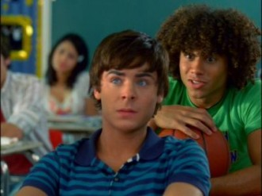

# 宝贝们

脏兮兮的布帘把夕阳挡在窗外，艾米在汽车修理工笨重的身躯下费力地扭着腰，臀部和乳房都因为挤压而变了形。床边的衣柜门掩着，暗色从里面流出来，把床单上撕咬着彼此的男女悄悄吞下。黛勃拉在衣柜里，什么都看不清。

男人带来的激情，就像是口香糖里的甜味——打开包装纸，揉进嘴里，咀嚼，甜味在嘴里散开，散尽，吐掉，再来一条，然后一条接着一条。如果那甜味终于让你感到腻味，那么，换一种口味试试看吧——总而言之，在它们中，没有哪一个值得你浪费更多时间——否则它们只会越嚼越涩，拌着你的唾液在那儿翻来覆去，最后散发出令人作呕的橡胶味儿。更糟的是，它们还会让你的咬肌越发健硕，叫你变成难看的方脸——这才是年轻女人应当在意的，而不是什么狗屁口腔卫生。

艾米想着，从床上挺起身，双手勾住汽车修理工的脖子，示意他压下来，贴紧。

_ _

高中毕业后，艾米在本地一家洗衣店找到了工作，暂时和正在上高中的妹妹，黛勃拉，生活在一起。就一个干洗店女工的工作内容和收入来说，艾米的想象力和胸围都大大地过剩了。而正如我们一向知道的，没有天赋会被轻易浪费：除了形同虚设的军官未婚夫之外，艾米同七个男人保持着亲密的关系——这份名单上的名字时有更替，但规模却一直保持着。对艾米来说，不多不少，她恰好需要这么多。她向他们索要相同的礼物，起相同的爱称：宝贝，不，宝贝们。

修理工忽然弓起背，在艾米身上发出一声低沉的呻吟。这声音让艾米感觉到了某种不可替代的轻松——她推开修理工，然后痴痴地微笑。

这种恰到好处的日子最终在这个星期四的傍晚发生了变故：当艾米送走汽车修理工“宝贝”，穿着内衣走回房间，准备着换身衣服、补好妆，再去和下一个“宝贝”约会的时候，打开衣柜，黛勃拉在里面向她打了声招呼。

“天呐！”衣柜门被猛地打开，艾米吓得尖叫了出来，“你在这里做什么？”

坐在黑魆魆的衣柜里，黛勃拉睁大了眼睛，就这么看着忽然出现在面前的姐姐，一言不发。她面无表情，仿佛自己依然是个旁观者。艾米冲着黛勃拉咆哮着：“出来，你给我出来！”

黛勃拉蜷成一团的身体缓缓展开——她听到了。从衣柜里动作迟缓地钻出来，这位高中生又回到了日常生活里。

“你简直就是个心理变态！”艾米继续叫嚷着，“你什么时候躲在里面的？多久了？你他妈都看见了什么？”

“别嚷嚷，你这个婊子。”黛勃拉揉了揉耳朵，慢吞吞地走向床边。

“婊子？总好过心理变态吧——那些恶心的小说！这他妈就是你学到的东西？”艾米的火气越来越大。

“哦，好吧。我是窥淫狂。”愤怒让黛勃拉清醒了些许，她深深吸了口气，继续说，“所以呢？”

“别装得这么专业，简直都是狗屎。”艾米浑身都在发抖。她闭上眼睛，摇晃了下脑袋，好让自己平静到可以继续说话，“好了，你都看到什么了？”

“要不专业的说法？那我想大概是‘打气’吧。”

“什么打气？”

“那个男人，”黛勃拉伸出双手，在空气中比划着，脸上带着嘲弄的笑，“向你两腿中间。一下又一下……”

“闭嘴！”

“如果我拒绝呢？杀了我？”

“我真恨不得拧断你的脖子，”艾米咬牙切齿地说，“如果你不是我的妹妹。”

“那还真是不幸，我就是你妹妹。”黛勃拉笑着看着艾米，用“小说里学来的那一套”给自己壮了壮胆，继续挑衅着，“对了，这次的男人和上次的不是同一个吧？”

“你他妈到底这么做了多少次？”艾米又是吃惊又是愤怒，“你想怎么样？”

“你是不是弄错了？是你把男人带回家了，你现在问我想怎么样？”黛勃拉平复了下情绪，“好的，我现在只想让你不舒服。我们彼此看不惯，现在没什么好隐瞒的了，不是么？”

“哼，真是好笑。让我不舒服？”艾米冷笑着，“我倒是挺好奇你有什么办法能让我不舒服。”

“有的是办法。”

“虚张声势可没用。”

“把你的事情告诉爸爸和妈妈，这如何？”

“我还以为是什么呢？赶快去吧，亲爱的妹妹。”艾米嘲笑着说，“不过，我还是提醒你下吧：黛勃拉，我们是姐妹——就算我真的倒霉了，这对你也没有任何好处。”

“为什么？”依旧是那本不该属于黛勃拉这个年龄的语气。

“我们是同一个工厂的产品。”

“也是。”黛勃拉摊开双手，“好吧，我是不是该构思个更加刺激的方案？你觉得把这事儿告诉你那个未婚夫怎么样？砰！砰！你死了。而且你可以慢慢等待，根本不知道他到底什么时候才会回来收拾你——这感觉真好，不是么？”

“黛勃拉，你简直就是个疯子！”艾米咒骂着，歇斯底里，“好了，我是个婊子！你到底想要怎么样？”

“好了，亲爱的艾米，婊子小姐。我们是姐妹，我爱你，我不会那么做的。不过，这不代表我想做的时候做不到——”黛勃拉微笑着站起身，对着艾米晃了晃自己的手机，惊吓带来的僵硬似乎不复存在了，“这就够了。”

“好吧，恭喜！你赢了，恶毒的小处女。”艾米瘫坐在地上，丧气，而又不甘。

正是托这个“恶毒的小处女”的福，艾米不得不愉快地同下一个“宝贝”说再见了——她爽约了：艾米并不是天生的谎话精，但她是不折不扣的说谎大师——她擅长于把握时机：知道如何保持良好的说谎状态——如果没那个兴致，她就连解释都不会多解释，以免露出马脚。

爽约就是爽约，最后一次，艾米想，没有下一次，不过是七分之一，算不上什么巨大的损失——事实如此：可考虑可相信的事情太多，就算是结婚了，也不代表什么——她所能做的，只有抓住现实。

艾米很快就会寻找新男人顶上，这毋庸置疑。她抬起头，盯着妹妹的背影，没有遮拦的目光仿佛要把“该死的小处女”这句话像钉子一样敲进黛勃拉发育中的脊柱。

“小处女”三个字却抛开了自己的定语，先行进入了黛勃拉的脑液。这可怜的高中生显然还眩晕在刚才那部平庸的“电影”中。主演恰是自己的姐姐，遥远的主题——性——被自己的姐姐毫无遗漏地呈现在眼前，而不再是隔门听到。一切都真实得陌生，陌生得叫人恐惧……对于一个小处女？恐怖得让人不由自主地想要走上前去，一探究竟。

一探究竟么……最早的时候，黛勃拉也是这样想的：当她回到家，发现姐姐的卧室房门紧闭。走上前去，黛勃拉想要一探究竟，却听到里面传出姐姐和男人的尖叫声和喘息——正是小说里描述的那一型。她探得究竟了么？是。但很快，黛勃拉就发现：自己并不满足于此——没错，她想要知道更多。

“黛勃拉，”黛勃拉关上门之前，艾米向自己的妹妹确认说。“求你别告诉他。”

“好了，我都听见了，清清楚楚。我不会的——”黛勃拉拖声应着，“但是不代表……你知道的。”

告诉别人？不，并不会。这样的一个发现，需要的是解答，而不是与人分享——这样的一个发现：就好像青春期找到的一本老派情色小说；就好像一张来路不明的朋克摇滚专辑。接下来会发生的，是小说里的情节，是一张朋克摇滚乐队的现场表演门票……绝对不是什么分享——尤其不是和那些同龄人：他们并不会陶醉于这种隐秘的乐趣。即使会，又能如何？在无所事事的高中生活中，这是难得的一点点个性——有了它，人们便不会把你和那些无知的高中生们混为一谈。

“包括你的那些同学。”艾米呆滞地坐着，没头没脑地说着。

“哦，别那么害怕。我真没你那么无聊。”

“包括尤金，那个和你一起长大的。”艾米哀求着，“别让其它任何人知道。”

“你可真是被吓傻了，可怜的小艾米，他们知道了也不会怎么样，”黛勃拉挖苦道，“他就算是知道，也是自己知道的。另外，乖乖在家呆着，我可要出去啦。”

天呐，尤金。就算真的无聊到要告诉学校的那些家伙，他也是排在最后面的那一个。黛勃拉想着，其实那家伙排在哪里也都是那么回事。

黛勃拉走出房间，确认一段冲突告终。黛勃拉把头脑从刚才的一切中解放出来——无论是性、讥讽，还是装腔作势的威胁。一切麻烦暂时结束，她又获得了自由。她是个高中生，是个女人，是个少女，是个处女——她还有太多借口去宽恕自己。她依然可以为所欲为，直到再也不能。

门外亮起了路灯，还有其它的光线。

至于刚才提到的尤金，则从来是那么小心翼翼地活着，循规蹈矩。这男孩儿并不如黛勃拉所想的那么一无是处——尤金有优点，直到十多年后的今天依然保持着：一种往好听了说叫作“普通”的优点。尽管随着年岁渐长，尤金也被动地具备了一些别的值得称道的地方，比如：他不由自主地成了一个成年男人，于是沉默便成了深刻，肤浅便成了睿智，猥琐便成了风趣，下流便成了浪漫，以及别的什么……去他妈的。但除了这些，尤金仍然是那么地普通——难能可贵。

去夜总会之前，尤金，这成年男人，站在客厅的落地镜前比划着。如今，这地方是他的了，而不再是他上高中时的住所这么简单：十多年前，这破房子法律上来说属于尤金的父亲。当时，父母正带着尤金的弟弟在全国各家医院之间和死亡赛跑——那可怜的孩子出生就得了种奇怪的肿瘤——尤金却总觉得：这只是父母为了摆脱自己所编造出的谎言——甚至十年前让他们丧生的车祸也是。至于为什么要摆脱，尤金并不太清楚。他只是觉得身边所有人都在试图摆脱他，包括十多年前的黛勃拉。

向面前的镜子夸张地探出脑袋，把脸凑近，尤金仔细地整理着亮黄色的领带，脸上露出满意的微笑——百分之一百的男人都会露出这种自信的微笑，时不时地，也是对着镜子。然后他们中的百分之四十不光微笑，还丢掉了工作。不过，尤金的自信确有其凭据：十多年前的尤金比大多数同龄的孩子都要矮小。远看，他就像一块砖头——因为砌在墙角而被截掉了一半的那种。现在呢？尤金挺起胸膛打量着镜子中的自己：他起码已经可以把父亲留下的西装撑满了——情况变好了，尽管变好得不多，但至少也能看得出来啦！

不过，一旦转身离开镜子，尤金看到的部分变好的程度就降至能见度以下了：破旧变形的木地板、除了没坏以外一无是处的沙发、看起来参加过海湾战争的电视机、恍惚间容易被当成某种神秘刑具的扩胸器……再加上忽明忽暗的简易吊灯，整个客厅看起来如同警方的审讯室，充满了“将要发生点什么怪事”的动人氛围。

尤金站着，背对着镜子，像位绝望的农夫，正打量着耕种多年却杂草丛生的农田，在镜子里留下了无比苍凉的背影。尤金适时地叹了口气，迈开腿，走到电视机旁，从那堆摆得乱七八糟的体面杂志里熟练地抽出了例外的那一本。

他在地板上躺下，带着英雄迟暮般的悲壮意味松下了裤带。握着“香草味甜筒”，尤金呆滞地看着杂志封面上的性感女郎——目光逐渐热切，房间也慢慢变得闷热起来，冰淇淋便在室温下最终融化殆尽：粘腻的糖浆缓缓地流在尤金的右手上，满足地停留在那儿。尤金喘着粗气，用抽纸大略地清理了一番。他把它们窝成团，扔在一边，懒懒地将身体转向另一侧——

“蠢透了，这是最后一次。”尤金自言自语地强调着，“我发誓。”

如同街边被风吹倒的广告纸偶，尤金无力地躺在地板上。换在十多年前，他会很快地从地上爬起来，提起裤子，变回一个循规蹈矩、发育迟滞的高中生——这倒不完全是因为年岁渐长，身体难以迅速从“香草味甜筒之梦”中恢复：只是尤金不再会想“不知道黛勃拉看到我这个样子会怎么想”这类蠢问题。

人长大，总是要被变得聪明起来。蠢话之类，绝不可以是生活的重心。

不过，在尤金五岁的时候，他听到过类似的蠢话。尽管从来没人把这当回事儿，但每隔一段时间，尤金就会想起这段对话。而时间过得越久，召唤这段旧事就越是需要勇气。

“真不敢想象，”艾米和黛勃拉的母亲，凯恩太太，支起胳膊，托着腮，感慨着，“竟然已经五年了。”

“是啊，阿格尼斯可一点都没老。”凯恩先生嬉皮笑脸地应和道，“真是迷人的母亲呐。”

“哈哈哈！托尼，你可得正经点。”尤金的父亲，麦金尼斯先生，假意责怪道，“琳达和我可都还在这儿呢。”

“哦，我道歉，哈哈。”

“是啊，黛勃拉和尤金都长大了呢。”麦金尼斯太太也加入了对话，她指向一边说，“看。”

那里，黛勃拉和尤金正在玩耍。

“是啊，多般配。”凯恩先生念着，转而高声地喊道，“尤金，你有女朋友了么？”

“托尼！”

麦金尼斯先生被托尼·凯恩的玩笑逗乐了：“哈哈！我看是还没有呢。”

“对了，”麦金尼斯太太仿佛忽然想起了什么，“艾米呢？还没放学么？”

“是啊，提醒的是。”凯恩太太担心地看了看窗外，灯光渐渐亮起，把窗帘映成红色，“天都已经黑了，早就放学了才对。”

“夜幕降临，霓虹灯亮起，”凯恩先生朗诵般地说，“听起来可真像是某本现代小说里的话啊。”

“托尼，你就不能正经些么？”凯恩太太问着自己的丈夫，语气里带着些许的不快。

“哦，我道歉，哈哈。”凯恩先生笑着弯了弯腰，看起来毫不在意，接着转开了话题，“瞧，尤金哭了。”

尤金被黛勃拉打了下脑袋，哭了起来。一边揉着眼睛一边向大人们这边逃过来。而那边，五岁的黛勃拉依旧若无其事地翻着一本小说。直到她的母亲喊她：

“黛勃拉，过来向尤金道歉！”

黛勃拉这才站起身，稚气的脸上写满了关于无辜和不情愿的表达。看着“傻冒尤金”在自己爸爸身边哭个没完没了，黛勃拉嫌弃地站在那里，远远地站着。

“别了，琳达，”麦金尼斯太太说，“这是孩子们的事情，没关系。”

“阿格尼斯，你可真是个温柔的人儿。”

“唔，孩子们的事情……”凯恩先生若有所思般地抬起头，一手抚摸着尤金的脑袋，“这可是黛勃拉和尤金夫妻俩的事。”

“托尼，”凯恩太太被丈夫没正经的表现弄得有些烦躁了——或许也是因为还没回家的大女儿，还是因为不听话的小女儿？总之，她继续说，“你胡说八道的间隙能不能长一点。”

“去玩儿吧，”麦金尼斯太太朝儿子挥挥手，示意他去黛勃拉那边，“宝贝们。”

“尤金，去吧。这里在讨论些特殊话题。”看到尤金有些迟疑，麦金尼斯先生不得不停下来，转向自己胆小的儿子说。说完，父亲轻轻拍了拍小尤金的脑袋。

“什么是特殊话题？”小尤金呆在那儿一动也没动，只是不解地问。

凯恩先生抢在所有人之前回答道：“等你长大就会明白的特殊话题。”

“可我不是小孩子，”小尤金不服气地解释着，一边踮起脚，让自己看上去更高一些，“我已经五岁了。”

“哦，我道歉，哈哈！”凯恩先生不禁笑起来了，“完全长大的时候。”

“尤金，快去陪黛勃拉玩儿吧。”母亲催促着。

“快过来，胆小鬼！”黛勃拉不耐烦地喊道，“要过来就快一点。不打你了。”

“瞧，相处和睦的宝贝们。”凯恩先生摊开手，做了个鬼脸，“化解了一次家庭危机！”

“托尼！”

“哈哈哈！”麦金尼斯夫妇齐齐地笑着。

回想着，尤金在地板上翻了个身，抓起杂志扔向墙角。杂志像回忆一样在空中无序地翻着页，然后“啪”地落在角落。尤金回忆着黛勃拉，心中不禁泛起鳏夫缅怀亡妻般的沉痛之情——

“黛勃拉！”尤金伸长了脖子，冲前面低头走路的黛勃拉叫道。

“嗯？”那个背影停住，转动，尤金看到的，是黛勃拉淡漠的表情，“喔。”

“嗯，”尤金走上去，尽可能表现得同样漫不经心，说道，“那个……”

“嗯？”

尤金顿了下，在脑子里翻出准备好的演讲稿：“哦，最近几天放学都没见你人……”

“喔？”黛勃拉耸耸肩，“是吧……怎么了？”

“没什么，”尤金不得不开始脱稿了，“只是不知道你怎么了，感觉有点奇怪。”

“这样么？”黛勃拉回答着，不快活地摊开了手。

“是啊。发生什么事了？”

“就像你说的，”黛勃拉转过身边走边说，“没什么。”

“啊？”

“嗯，是这样。”

尤金不得不赶上去，好让黛勃拉看到自己自然的笑容：“好啦，我只是感觉有点奇怪而已啦。”

“觉得我奇怪就别跟着我，”黛勃拉转过头，说着，继续向前走，“一切就回归于平静了。”

“黛勃拉，我不是这个意思。”

“你才是怪胎吧，尤金。”黛勃拉停下，给尤金最后一句指点，也是声明，“我没有任何事要对你说。而你，你什么都不懂，而且关心方式糟糕透顶——比起你的关心，我宁可自己待着。”

高中时的黛勃拉，在尤金看来，无论从童年的角度，还是从现在，都如此遥远。那时，尤金还没有长高，而黛勃拉的胸部却大大地领先了同龄的女孩儿。黛勃拉挺起胸，男儿们便如同感染了HIV一般，丢掉了自己的免疫功能和抵抗力——在随后的年月里，也再没能复原。他们被一波又一波其它新奇的病毒感染，落下了千奇百怪的后遗症。尽管他们未必还记得黛勃拉，尽管他们都从那场无人例外的瘟疫中活了下来，但他们都有些什么死在了那个时候，作为安度余生的保证金，或多或少。

在那时的尤金看来，同样遥远的事物还有很多。也许还有广告纸偶、夜总会，老男人（其中兴许也包括了现在的尤金自己，如果他可以预知的话）——他们也都若无其事地出没于高中生的生活，那辉煌的罗曼史足以写满一本厚厚的病历。这病历和奇特的后遗症们一起，又成了耀眼而迷人的荣誉勋章——经历了相同的疾病，他们奇迹般地活了下来，并因此得到了证书。对于患病的高中生和他们方才入夜的生活，老男人们活得宛如在小说中——老派、保守、淫荡，缀满了廉价却多彩的小灯泡，在黑暗中闪闪发光。

宝贝们开始焦虑，夜晚开始充满眩目的马赛克和欢乐气息。女高中生，黛勃拉，站在街边张望，直到那个已婚男人远远地出现在视野里；黛勃拉低下头，直到男人掌心向上地将手递到了她的面前；黛勃拉的手缓缓落进那里，直到他们从各自的日常生活中消失，消失于城市夜晚斑斓的色块中。

已婚男人的好处显而易见：他们直白而大胆，他们善于表达爱意和欲望，因为除了病入膏肓，他们什么都不是；他们温和却不容置疑，他们欺骗的对手大多心甘情愿，因为长年的病痛赋予了他们权威；他们懂得适可而止，知恩图报，因为他们还得活下去；他们绝望而脆弱，他们会陪你跳舞，直到深夜，只是因为他们对黑夜怀有恐惧；他们忠于女人的身体；他们不再思考……只是，此刻的黛勃拉并不知道这些。此刻，在黛勃拉眼里，这个男人是什么都不重要。换句话说——

他什么都不是，这才是最重要的。

他对于黛勃拉来说是什么？一个已婚男人么？不，他什么都不是：他来自一个陌生的世界，不在黛勃拉的生活中扮演任何角色——无论在学校，还是家庭。他不扮演，也不会，永远不会。他只会坐在汽车旅馆的床边，说：

“宝贝，别去开灯。”

是的，当他面对你的身体，颤抖着取下结婚戒指——那正是脱去内衣的正确时机。

黛勃拉背过身去，面向窗户，外面的红光照在男人颤抖的嘴唇上，外面的红光把黛勃拉的影子抛在床上。当她的双手伸向自己的后背，触摸到胸衣扣子的时候，黛勃拉能感受到身后男人那探索的目光：那目光像蠕虫一般，正从黛勃拉裸露的脊背爬过，去往胸前。

一切都漂浮在陌生的汽车旅馆世界，重复着小说，或是噩梦中的场景。上帝、亲人、宠物，他不是其中任何——微弱的红光下，他匍匐在汽车旅馆的地板上，亲吻着黛勃拉的脚踝。没有女儿、妹妹、学生的存在，没有黛勃拉的存在，没有一个不甘的处女——当她需要自尊，足够的性便迎面而来。

灯光变换着色彩，男人光着身子躺在床上，仿佛被钉在十字架上。夜景中的光线投来，一切亮如白昼，消融着男人的面孔——没有一种恐惧，哪怕是濒临死亡的恐惧，可以胜过这种全无意识的渴望。当黛勃拉的脚步逼近，当黑暗中，一只乳房如同圣光降临，他所能做的，就是含住它，然后继续那最虔诚的祈祷。

什么都别管——没错，毕竟，就算你要面对一切，也得让一切先发生……得等到卷烟的灰烬落在地板上的时候。

“我为什么会做这样的事情？”

“我怎么会做这样的事情？”

“我为什么会这么轻易地让一切发生？”

“我为什么没能阻止自己？”

问题经由呼吸，穿过嘴唇，随着烟雾飘荡在明暗之间。一切发生得如此迅速，男人来不及从中分析出想要的答案。于是，当那少女身体的温度再次靠近，他不禁再次将其压在身下，重温方才发生的一切。毕竟，距离太阳升起还早，还早，早到黛勃拉本可以离开这个是非之地。

不过，出于某些原因，她放弃了这个打算。

早晨的街道像是熄灭了的霓虹灯，一切令人眩晕的魔力都在这时褪去：男人不再捕猎，女人也收起了诱惑的手段。

至于汽车旅馆的痴男怨女们，也总是习惯于在早晨让彼此心碎：男人们会让女人们把他们记在心上便好——任由他们的身体去复原，去寻找下一段激情；而另一方，则早已芳心暗许。时不时地，还会有争吵，或是引擎的轰鸣声在这幽会之地留下点别的什么印记。

总之，一切都变得脆弱和冗长，在早晨——哪怕是艾米这样的女人。就像这样——

“你说什么？”艾米把那时还是高中生的尤金推开，几乎尖叫起来。

“我爱的是黛勃拉。”尤金摊开手，矮小的他抬起头解释着，“这是实话，我很难过。”

“你知道你在说什么么？”艾米费解地看着尤金，像是在看着一个外星人，而不是看着一个高中生——半小时前还和她赤身裸体躺在床上的男孩儿。

“我知道。”尤金发表着演说，“我说我喜欢黛勃拉，而不是你。我想和她在一起，但……现在发生的一切让我很难过。”

艾米像发高烧一样开始颤抖起来，向后退着，直到靠在墙上。她摇晃着脑袋，披肩的头发散开，遮住了她的脸。她一言不发，像一只拖把，安静地靠在墙上。尤金继续说：

“非常难过。”

“在我身上的时候可看不出你有半点难过啊，”拖把靠在墙边，低着头，低低地嘲笑着，尤金，或者是她自己，“呵呵呵呵。”

“我知道你不甘心，”尤金走过去，“我知道你一点都不爱我。”

“谁说我是不甘心？别那么自作聪明。”

“好的，我明白，我道歉。”尤金竖起手，挡在胸前，向下压了压示意艾米平静些，“没人希望把事情变成这样，这只是意外。”

“不。”

“什么？”

“不是。”

“不是什么？”

“这不是意外。”

“你在说什么，艾米。”

“这根本不是什么意外。另外，别叫我艾米，你不是我男朋友，”艾米顿了下，“你什么都不是。你只是黛勃拉的小朋友而已。”

“是的，我喜欢她，很久很久。”尤金说着，“也许这就是为什么我和你在一起，我爱她，她太遥远了。”

“我当然知道这些，我还知道她甚至都不会正眼看你一下。”艾米得意了起来，竖起指头，“一下都不会。”

“没错，是这样。但是，如果可以，我更愿意我对面站着的是她，就像过去那样。然后，哪怕永远都是这样……”尤金顿了下，“只要是黛勃拉，我会非常乐意。”

“没错，我都知道。可怜虫，你一直都是，而且还会是，因为你乐意。”艾米昂起头，“所以我来找你，所以我和你一块儿睡了。我故意的。”

“什么？”

“我说我是故意的。怎么样？感觉很难过么？我妹妹的追求者昨晚和我睡在一起。你只是个可怜虫，一切到此为止。”

“别这么说。”尤金摇着头，近乎自言自语，“这一切都是意外，不是么？你说什么都没用，是意外。”

“不，我的宝贝。”艾米可怕地笑起来，点了点戴着的腕表，“你后悔又难过，而我真的快活极了——这就是现实，在这个时间。”

告别这次争执，十多年后，尤金早已习惯了这一切。他重新穿上西装，神情黯淡地站在街边。旁边同样神情黯淡的，是来自遥远世界的女人——他们在前一天晚上的彩色马赛克中间相遇。她踩着短靴，穿着肉色丝袜，驼色的大衣下，是一套红色蕾丝内衣。他们站在那里，仿佛两个黑白的广告纸偶。当霓虹灯亮起，他们会重获生命，穿行在迪斯科舞厅，躲进那些“宝贝们”中间。

“再见，宝贝。”公共汽车驶来，黛勃拉熄灭手里的女士香烟，对身边这个穿着旧西装的男人说。

(采编：刘铮；责编：刘铮)

[【情爱专题】思凡的尼姑和花和尚](/archives/35718)——如今阳春白雪气若游丝，却到底受人重视成为国粹，青年一代也诸多有志于此；而下里巴人命根在民间，在乡俗，而今乡俗难继，古风不再，不知道什么时候婺剧就会真的“化石”——现在还只是徽剧的活化石，却不知以后更看什么？

[【情爱专题】我的三个情人](/archives/35799)——青春似乎就是用来疼痛难忘的。当过往那些天马行空的爱情成为记忆中静默的雕像时，我们所展望的未来又是什么呢？

[【情爱专题】我们还是要为远道而来的客人留一点面包](/archives/35868)——每人心里都住着一只粉色小兽，如果你愿意在忙碌时抽出时间陪它，在穷迫时省下面包喂它，在恼怒时温柔地与它说话，它将会长大，驮着你走到爱人面前，守着你们到白头那天。

[【情爱专题】雨夜](/archives/35904)——阴雨湿沉的深夜，脏乱破旧的小旅馆，连连倒霉的我，遇到她，失去她。。。

[【情爱专题】金赛博士，性与主义](/archives/36036)——在“性”这个话题上，至今人们仍谈之色变，至少在公开场合这是个难于启齿的话题。或碍于社会的压力，或因为自身观念的保守。金赛博士在这个问题上，在这个研究领域中，是一个先行者。
