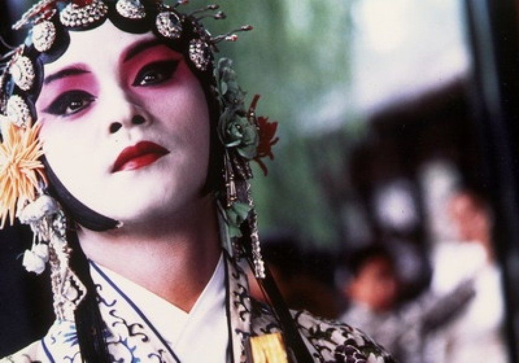
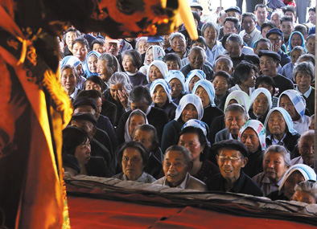

# 思凡的尼姑和花和尚

第一次知道昆曲《思凡》，是张国荣主演的电影《霸王别姬》的一句台词：男怕夜奔，女怕思凡。当时对京剧和昆曲都还不甚了解，懵懂中搜索了一下才知道《夜奔》原来讲的是林冲雪夜上梁山的故事。看了被毛主席赞誉为“后继有人”的侯少奎老先生的功夫，真是叹为观止。

《夜奔》难在字字句句有身段，腔满宫满，又要武戏，又要文唱——谁叫他林教头要生的俊美翩翩风度呢！但《思凡》则难在感情的处理：一个被迫出家的小尼姑，凡心炽热，又害羞含蓄；身段柔美却不妩媚，唱腔刚柔相杂。一人一桌一拂尘撑下半小时的折子，而要使人不厌倦不睡着，谈何容易！

****

我喜欢《思凡》，更重要的在于它文辞优美，虽然及不上《牡丹亭》那般典雅富丽，却更有微风拂面之感。

比如开场的几句念白：

"削发为尼实可怜，禅灯一盏伴奴眠。光阴易过催人老，辜负青春美少年。”真是令人有切身之想，觉得光阴虚度年华似水。至于大家最为熟悉的“小尼姑年方二八，正青春被师傅削去了头发”，“奴本是女娇娥，又不是男儿汉。为何腰盘黄绦，身穿直裰？”（这两句并不是如电影中所展示的连在一起，而是不同曲子中的唱段），则清明如月朗朗上口。林语堂先生说它“堪当中国第一流作品之称而无愧色”，我举双手赞成。

京剧之中，恐怕只有《贵妃醉酒》的几句四平调能够与之媲美：海岛冰轮初转成，见玉兔，玉兔又早东升。那冰轮离海岛，乾坤分外明。皓月当空，恰便似嫦娥离月宫。奴似嫦娥离月宫。我孤陋寡闻，所知所见，这真是京剧中最美最美的几句词了。

《思凡》注重刻画内心，小尼姑因为自己思凡，所以觉得殿堂里的罗汉们都在笑话她白白地浪费了这许多好光阴，这种感情的代入实在难演，这感情都要体现在唱词上，用一句句的词唱出

"倚门回首，却把青梅嗅”的感觉——要用语言传递感觉，是多么困难！

"佛前灯，做不得洞房花烛。香积厨，做不得玳筵东阁。钟鼓楼，做不得望夫台。草蒲团，做不得芙蓉软褥。"

幽而不怨，怨而不恨，要演到恰到好处，实在难上难。这一方面，沈世华的表演更令我喜欢，胜过梁谷音，梁老师的怨与恨太过露出痕迹，不显得含苞待放，音色上也不如沈老师适合这唱词。沈世华轻柔回环、如云过月的唱腔，欲说还休、花开含露的神态，简直令人陶醉！可惜至今只能在视频中欣赏，无缘现场。

********

《思凡》之剧，也正因为文辞清雅，字句诗意，曲境细腻，反而只适合在剧场作为高雅艺术来被人所知了。相比而言，家乡戏婺剧《僧尼会》的语言就更为活泼通俗，适合在乡下作为社戏演出。

《僧尼会》和《思凡》可以说同出一门，都来自明人剧本《孽海记》。不同的是，《僧尼会》一出侧重写一个叫半空的小和尚，在山门里自思自想，顽皮自耍，活泼泼的就是一个十四五岁的小男孩！当然，僧尼会僧尼会，当然是一僧一尼，小和尚下山来遇到的那个小尼姑，应当就是《思凡》中“自幼在仙桃庵出家，终日烧香念佛；到晚来，孤枕独眠，好不凄凉人也”的小色空吧？

小时候家乡逢年过节，总要搭台唱戏，一时间好不热闹。那戏台子多半是演出前几天临时搭建起来的，就在露天的地方，极少数是利用当地祠堂或寺庙。但风霜雨雪，都难以阻拦乡人拎个小板凳看戏的情调。

台上哭哭笑笑唱尽人间悲苦，台下瓜子香烟享受闲暇乐趣。乡民终年忙碌，难得亲朋相聚看戏，实在也是大喜事。台下看戏的人，不为帅哥美女，不为明星大腕，只为几句听得懂的滩簧，几个看得懂的故事。虽然如《碧玉簪》或《沙滩会》之类的戏，老观众们都已经烂熟了，小和尚小尼姑的打情骂俏笑料包袱，也都已经是陈年的芝麻了。但场面依旧火爆，笑声依旧诚恳。这大约就是戏曲独特的魅力——并不在新，而正在旧。

唱《僧尼会》小和尚唱得最好的，当然是八十多高龄的吴光煜老先生。我曾有幸两次近距离看这个“小和尚”。一次是墩头物资交流会的时候，特请吴老先生来，只为一折《僧尼会》——正戏之前，通常有“打八仙”，再有“前找戏”，就是如《僧尼会》这样的折子。那时候全镇爱看婺剧的人几乎都涌在那小小的明堂要一睹风采。

我冒着被挤成照片的风险，从人与人的缝隙中挤到戏台子的最前面，趴在舞台上——脚搭在舞台底座的木架子上，只一双手一个头端放在舞台。有好几次，吴老先生就离我不到十公分的地方打圆场，我都可以闻到他一脚过去扬起的灰尘，和戏班子行头上散发的点点霉味。

"和尚恨出家，（啊呀）怨出家，出家人口念菩萨，心里苦煞……”，“和尚嗳”，“尼姑嗳”——这样带着金华方言的唱词，加上红脸膛、尖鼻子、笑起来嘴巴像弥勒的造型，吐舌头、舔嘴巴、甩佛珠这极尽夸张之能事的功夫，真是令人捧腹不禁开怀畅乐。我们小孩子自然是觉得好玩，只管拍手——把那棒棒糖咬在嘴里。

第二次看吴老先生的演出是在义乌周村。那时候对婺剧的了解和对吴老先生的了解也更多了一些，知道了婺剧的民间性，知道了吴老先生的人生际遇，知道了梅兰芳先生对婺剧的评价：“京剧的前身是徽剧，京剧要寻找自己的祖宗，看来还要到婺剧中去找。”所以再看生动的表演，再看舞台上和尚尼姑不是夫妻胜似夫妻的默契，再看老先生一步一身段，转一圈眼珠同时转一圈佛珠的精湛技术，不禁敬佩，更为乡人独特的艺术和创造而自豪。

这几年再去戏台子看戏，都是白发驼背的老人家，却不知道小孩子都去哪里了呢？

如果说昆曲京剧是阳春白雪，婺剧就是不折不扣的下里巴人——只需要看一看《思凡》和《僧尼会》在表演、唱词的差异就一目了然。如今阳春白雪气若游丝，却到底受人重视成为国粹，青年一代也诸多有志于此；而下里巴人命根在民间，在乡俗，而今乡俗难继，古风不再，不知道什么时候婺剧就会真的“化石”——现在还只是徽剧的活化石，却不知以后更看什么？

不过不论高雅通俗，两者都在表达被桎梏的人性追求自由追求解放的永恒精神。且看《思凡》最后几句：

（**白**）今日师父师兄，多不在庵。不免逃下山去，倘有姻缘，亦未可知。有理吓，有理！

（**风吹荷叶煞牌**）奴把袈裟扯破，埋了藏经，弃了木鱼，丢了铙钹。学不得罗刹女去降魔，学不得南海水月观音座。夜深沉，独自卧，起来时，独自坐。有谁人，孤凄似我？似这等，削发缘何？恨只恨，说谎的僧和俗，哪里有天下园林树木佛？哪里有枝枝叶叶光明佛？哪里有江湖两岸流沙佛？哪里有八万四千弥陀佛？从今去，把钟鼓楼佛殿远离却，下山去，寻一个少哥哥，凭他打我，骂我，说我，笑我，一心不愿成佛，不念弥陀般若波罗！

（**白**）好了，被我逃下山来了！

（**尾声**）但愿生下一个小孩儿，却不道是快活煞了我！

这真是比农奴翻身得解放”还要来得轰轰烈烈，因为这是源自本真对生活的渴望和本然对至善的向往！

(采编：刘铮；编辑：季节扬；配图：季节扬；责编：刘铮)

[【情爱专题】宝贝们](/archives/35575)——坐在黑魆魆的衣柜里，黛勃拉睁大了眼睛，就这么看着忽然出现在面前的姐姐，一言不发。她面无表情，仿佛自己依然是个旁观者。艾米冲着黛勃拉咆哮着：“出来，你给我出来！”

[【情爱专题】我们还是要为远道而来的客人留一点面包](/archives/35868)——每人心里都住着一只粉色小兽，如果你愿意在忙碌时抽出时间陪它，在穷迫时省下面包喂它，在恼怒时温柔地与它说话，它将会长大，驮着你走到爱人面前，守着你们到白头那天。

[【情爱专题】雨夜](/archives/35904)——阴雨湿沉的深夜，脏乱破旧的小旅馆，连连倒霉的我，遇到她，失去她。。。

[【情爱专题】金赛博士，性与主义](/archives/36036)——在“性”这个话题上，至今人们仍谈之色变，至少在公开场合这是个难于启齿的话题。或碍于社会的压力，或因为自身观念的保守。金赛博士在这个问题上，在这个研究领域中，是一个先行者。
