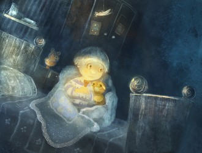

# 我们还是要为远道而来的客人留一点面包

这世间所有的关系都有结束的一天，不是从表象就是从心里。然而我的父母是特别的，他们有一个隐秘的纽带，或者说神秘的暗语。这个暗语贯穿了我整个童年，那就是“远道而来的客人。”每当他们闹别扭、冷战、或是猜忌时，只要一提起那位远道而来的客人，整个屋子便会静下来重新充满了爱，母亲会站起身去厨房切一片面包摆到圆桌上：“快收起你那向下的嘴角，客人要来了，他看到我们这样会难过的。”

每次晚饭后我的父母都会在桌上放一片面包，等待一位午夜到访的客人，最贫穷时如此，最寒冷时也是如此，从不间断。在还是孩子的我看来，这一切都充满了不可知的魔幻色彩。然而和很多童话一样，父母总是催我早早去睡觉，我也从未禁住过昏黄灯光的邀请，总是在午夜来临前沉沉睡去。

可我的好奇心也在随着身体一天天长大，有天我终于下定决心要见一见这位神秘的客人。于是一整天都躺在床上闭着眼，一直闭到晚上才睁开。这下夜间的睡神可怎么也奈何不了我了。吃完晚饭，我就进屋装作去睡了的样子，不过是点上了蜡烛，听着动静，等起那位远道而来的客人。

午夜一过便听到屋外有声音，我移开了一点门，透过缝隙看到了一匹粉红色的马，那匹马真美，像贵族般优雅，像晨曦般迷人，把破败的屋子衬得蓬荜生辉。母亲正捋着它的马鬃，父亲在喂它那片面包，尔后他们抱住它的脖子亲了亲，就向它挥手道别。我不敢发出一点声音，轻轻地关上门，回到床上做了一整夜关于它的梦。

第二天早上我忍不住去问母亲关于那匹粉红色的马，看到母亲的眸子里透出惊喜和一丝微微的惆怅。父亲走了进来：“儿子长大了，终于问这个问题了。”我望向父亲，父亲开始缓缓地讲述。他说自己年轻时上山砍柴，有次不知怎么被困在了林子里，摸回家时已经午夜了。他看到一匹粉红色的马站在屋前，马儿快要饿死了，当时他只剩下最后一片面包就喂给了它，从那天起粉色的马儿每天都要来分一片面包，父亲虽然是个穷小子，却也都慷慨解囊，就这样，瘦弱的马一天天恢复了健康，直到有一天粉马示意父亲坐上来，带着他翻山越岭，也不知翻过了多少个山头啊，来到一个从未听过的小镇，站在了母亲面前。母亲那时正在井边打水，看到他们时惊得水桶都落了下去。

母亲就说她后来回忆起自己年幼时曾喂过一匹快渴死的粉马水喝，没想到过了十几年那匹马儿居然驮了一个男人回来。然后又笑着说父亲真是个傻小子，也不知道见姑娘要骑白色的马。

后来我时不时留到午夜，仔细观察这匹粉红色的马，偶尔抚摸它。这真是一匹高贵的马，眸子里流出满满的温柔。我时常能闻到它马蹄上带着远方的清香，是一种薄荷草掺着野花湿漉漉的清香。一个晚上我没有吃晚饭，偷偷藏起了自己的那份面包，等到午夜来临，远道而来的客人踱出门后，我偷偷跟了出去。那匹粉红色的马站在几米远外，站在满天群星下，回过头静静地望着我。我靠近它要喂它自己的那片面包，它轻轻摇头，我只得把面包放回口袋里。然后它对我忽闪了一下睫毛，把头低了下来。我下意识地骑到马背上搂住它的脖子，它走了起来，我在不见五指的黑夜里居然毫不害怕。我从未遇到过走得那么稳的马，趴在它的背上好像趴在铺满羽毛的摇篮里。我听见水声，像是在渡河，我听见秸秆的沙沙声、听见夜狼的呼唤、看见神秘的光点、感到树叶轻抚过我的脸颊。就这样，我渐渐地睡着了，任由它带着我走到哪里，而我在渐渐泛上的晨曦下做起了未卜之梦。

不知过了多久，马儿停下，伴随着周围薄荷草掺着野花湿漉漉的清香，我醒了过来。一个女孩儿站在我面前，不是特别漂亮可是特别美。“我没想到今天清晨会来两位客人，我只为这匹马儿准备了一片面包，真是抱歉。”她望着我说。我从未感到那么安心，从口袋里掏出了另一片面包放到她手心里。

往后的日子我们住到过荒漠、深林或是海边，可无论在哪儿，这位客人都会准时在清晨朝我们走来，和粉红色的晨曦融为一体，带着远方的味道和清晨的雨露。每当我抱怨屋里的壁炉怎么也烤不起火或生活的无奈时，妻子就会轻轻走过来抚摸我的脸：“屋子已经凉透了，我们还是要为远道而来的客人留一点面包。”

(采稿：刘铮；编辑：陈静；配图：季节扬；责编：刘铮)

[【情爱专题】思凡的尼姑和花和尚](/archives/35718)——如今阳春白雪气若游丝，却到底受人重视成为国粹，青年一代也诸多有志于此；而下里巴人命根在民间，在乡俗，而今乡俗难继，古风不再，不知道什么时候婺剧就会真的“化石”——现在还只是徽剧的活化石，却不知以后更看什么？

[【情爱专题】宝贝们](/archives/35575)——坐在黑魆魆的衣柜里，黛勃拉睁大了眼睛，就这么看着忽然出现在面前的姐姐，一言不发。她面无表情，仿佛自己依然是个旁观者。艾米冲着黛勃拉咆哮着：“出来，你给我出来！”

[【情爱专题】雨夜](/archives/35904)——阴雨湿沉的深夜，脏乱破旧的小旅馆，连连倒霉的我，遇到她，失去她。。。

[【情爱专题】金赛博士，性与主义](/archives/36036)——在“性”这个话题上，至今人们仍谈之色变，至少在公开场合这是个难于启齿的话题。或碍于社会的压力，或因为自身观念的保守。金赛博士在这个问题上，在这个研究领域中，是一个先行者。
