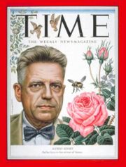
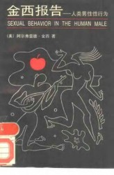
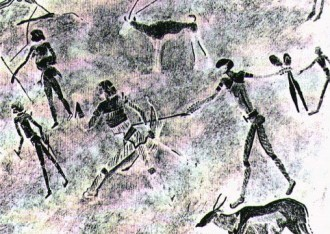

# 金赛博士，性与主义

在“性”这个话题上，至今人们仍然谈之色变，至少在公开场合谈论之，不是一个易于启齿的话题。或者碍于社会的压力——动辄便会被扣上“色情狂”“流氓”的帽子，或者因为自身观念的保守——他本身就难以接受这一私密在公开场合被人探讨、论说。

毫无疑问，金赛博士在这个问题上，在这个研究领域中，是一个先行者。在二十年代到四十年代的美国，社会的整体氛围仍然保守，道德、宗教环境更是不容许人们有这种异端的思想。金赛博士深知这一点，但他的勇气也就在此——为了自己的研究，为了更“科学”的解释人们几千年来一直深深依赖，但又极度敏感的“性”的问题，与那个社会，与那个时代发动了一场战争。

电影《金赛博士》从金赛博士的成长环境开始，到学术经历，再到学术兴趣的转向，把这个故事向我们娓娓道来。

金赛博士出生于一个保守的天主教家庭，父亲是当地一个有名的神职人员，他严格而细心的教导自己的孩子，希望他们能沿袭这种价值观，顺利继承自己的衣钵。金赛的弟弟是一个标准意义上的“好孩子”，懂事，听话，学习成绩优良，并且有一个很好的未来预期。但很遗憾的是，金赛在很小的时候就不认同父辈的那套价值观，认为他们只是虚伪的“卫道士”；而且，自己执着于生物学的研究，没考虑过自己的所谓“事业成就”，也得不到父亲的喜欢，相比之下，是一个不折不扣的失败者。因此，他与父亲的关系一直很紧张。

在家庭背景的介绍中，我们可以看到金赛家庭本身的内涵（这似乎是电影有意为之，抑或果真如此），至少在电影刻画手段中，这是一个寓意深远的手法。一个宗教虔诚的父亲却生养了一个看似离经叛道的儿子，而且处处与父亲所代表的传统观念“忤逆”，似乎也彰显了新观念推行的艰难。后来，金赛成为了一名大学教师，成为一名昆虫学教师，但始终没有失去对人类最隐秘行为的研究兴趣。后来成家立业，并最终获得洛克菲勒基金的资助（后期由于社会上的一些原因阻挠导致该基金的撤出），成为一名风云人物。同时他经营了自己的研究所，并担任主任。

电影的情节就介绍到此。我最感兴趣的（包括大多数人都感兴趣的应该也不在此）不是这些冗余的剧情，而是两种观念——开放与保守——的相互碰撞，以及由此产生出的一系列连带后果。

承上文所言，性在任何一个社会中都是极为隐秘的存在。人们几乎不会在公开场合进行讨论，并对一些无视此规则的人嗤之以鼻。即使在所谓的“开放社会”美国中，亦是如此。而金赛则希望通过自己的研究，把人类这一隐秘行为用一个“科学”的手段加以解读并公之于众。当然也就承担了潮水般的非议。但金赛的研究初期进展十分顺利，并取得了轰动效应。他成了一个名人。

但危机也就由此产生。他看来，人的性别不是一个固定的存在，而是一种流变，类似于当今的酷儿理论所揭示的，人的性别其实不是固定的，因而对男女的喜好也是因时而变，性伴侣的选择也会因此而发生不同。举个例子来说，金赛与自己的男助手，在宾馆中互生情愫，发生了亲密关系，正好验证了他的理论：男性之间的性行为不一定出于同性恋，而仅仅是某时某地性倾向的选择。而且，这种私下的行动不包含社会道德的意涵，而仅仅是一种生理的愉悦。他希望人能够剥离性与道德的关系，让人们单纯的享受性爱带来的满足。

但这种想法马上遭到了考验：妻子和自己的男助手萌生了爱意。于是金赛就允许了他们，甚至主动为他们提供便利，并期待为婚姻保鲜。诚然，他的态度是十分坦率的（至少在电影中的表现如此），希望用自己的实践证明，性和爱是可以分离的，人们在单纯享受的同时，不会因此干扰自己的家庭生活。

但事与愿违。随着时间的推移，金赛的几名助手都纷纷结婚成家，在他的默许之下，助手之间也发生了一些类似的事情。好景不长，终于因为一名助手的妻子爱上另外一名性伴侣，婚姻告急而终止。在这个危险的游戏里面，金赛似乎认识到：这两件事情其实有的时候是不可分的，是有风险的。

评论：

金赛博士可谓开风气之先，大力倡导性的去道德化，或者说是“祛魅化”，力图从传统道德的桎梏中解放出来。诚然，在六七十年代的美国，确实经历了一段时间的性解放乃至性泛滥，最终也带来了严重的社会问题—艾滋病，未成年人怀孕，堕胎。但在所谓“自由至上”的美国，也意识到这种风气的危险，保守势力重新抬头，并加强这方面的控制。这说明，性不是一个可以随意拿来“使用”的东西。

我的观点是：社会规范的形成自有其道理，而且长时间以来，社会观念对性的约束都建立在对问题的抑制上面，首先我们要做的就是尊重传统。而关于保守和自由的问题，我的立场也在保守一方面，如果打个标签的话，那就是保守主义。第一，性这个话题本身就是一个隐秘的存在，我们没必要为了哗众取宠而大肆宣扬性自由性解放，至于个体之间的性行为，那是隐私，我们无权过问也无权干涉，但前提是不能干扰到其他个体的正常生活，不能干扰整个社会观念的良性发展。当代大学生混乱的私生活备受社会谴责，也能说明一些问题。第二，尊重传统。当然不是说要倡导“三从四德”这些压迫女性的旧观念，而是说万事有度，万勿过度，艾滋病的流行以及现代婚姻基础的不稳定已经为此敲响警钟。不一定要将其打上道德上的“不洁”的印记，但也值得我们反思。第三，不必万事向“美”看。美国社会奉行经济自由主义，但政治上，逐渐趋于保守，这也和道德上的保守密切相关。资料称，美国西部和东部经济发达地区（传统的民主党地区）离婚率高，宗教信仰程度低；而共和党所盘踞的中部则是相反，自从布什政府以来，奉行新保守主义，更是将传统观念的保护推向新的高度。而并非中国人通常所认为的“美国就是性开放，性自由，中国发展到这个程度也要性开放什么的，云云”。一派胡言。

我不是卫道士，这些只是一些思考而已。无关政治，只关乎立场。

（采编：周拙恒；责编：刘铮）

[【情爱专题】思凡的尼姑和花和尚](/archives/35718)——如今阳春白雪气若游丝，却到底受人重视成为国粹，青年一代也诸多有志于此；而下里巴人命根在民间，在乡俗，而今乡俗难继，古风不再，不知道什么时候婺剧就会真的“化石”——现在还只是徽剧的活化石，却不知以后更看什么？

[【情爱专题】宝贝们](/archives/35575)——坐在黑魆魆的衣柜里，黛勃拉睁大了眼睛，就这么看着忽然出现在面前的姐姐，一言不发。她面无表情，仿佛自己依然是个旁观者。艾米冲着黛勃拉咆哮着：“出来，你给我出来！”

[【情爱专题】我们还是要为远道而来的客人留一点面包](/archives/35868)——每人心里都住着一只粉色小兽，如果你愿意在忙碌时抽出时间陪它，在穷迫时省下面包喂它，在恼怒时温柔地与它说话，它将会长大，驮着你走到爱人面前，守着你们到白头那天。

[【情爱专题】雨夜](/archives/35904)——阴雨湿沉的深夜，脏乱破旧的小旅馆，连连倒霉的我，遇到她，失去她。。。
