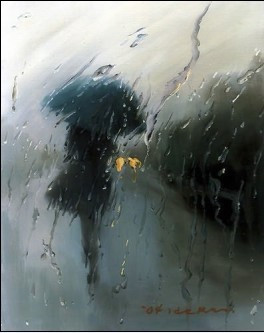

# 雨夜

刚才站在天桥下躲雨的时候，我骂了三句脏话，一句中文一句英文，还有一句家乡话。

我从上到下把自己全身的口袋摸了个遍，不仅依然没有找到我的钱包，还把一些原本并不湿的东西给弄湿了，我很沮丧地回忆了一下自己从机场出来坐地铁再转公交到这里的整个过程，还是没有想起来自己究竟把这个要命的亲爹丢在了哪个桃花盛开的地方。

就像我现在不仅记不清自己究竟怎么把钱包丢了，丢在了哪儿，甚至连钱包里具体有些什么东西都想不起来了。

不过可以肯定的是，身份证银行卡之类硬邦邦的东西都已经随着钱包一并壮烈牺牲了，只有不知何时落在包里的两百五十五块钱现金侥幸生还，这笔钱说多不多，说少不少，但对我而言好歹算是一个不小的安慰。

** **

见雨丝毫没有停下来的意思，我一路小跑到街对面，沿路开始寻觅可以不用身份证就能将就一晚的地方，好不容易找到了一家挂着“88元特价房”牌子的旅店，顺着又矮又窄的门望上去，狭小的楼梯间有些昏暗，不知通向何方，我挠着后脑勺想着恐怖片里的情节，心里不由得发怵，但犹豫了片刻后我还是小心翼翼地走了上去，心想反正自己现在除了两百五十五块，也没什么可失去的了，我的命不值钱，童贞早就没了。

绕了两个弯来到前台，里面坐着一个抱着小孩的胖女人，孩子已然入睡了，她则一边神情专注地看着电视一边空出一只手来嗑瓜子，专心致志到都没发现自己已经嗑了孩子一身的瓜子皮。

“那个，请问还有特价房么？”我特意压低声音问她道。

“没了，特价房就两间。”她亮着嗓门回答我道，孩子没被吵醒，反而把我给吓了一跳。

“那……还有多少钱的房间？”

“单人间小床房120，大床房180，小床房也没了，只剩180的了。”

我脑子里盘算着255以内的加减法，觉得实在是肉痛，现在身上就剩下这点保命钱了，可得精打细算。

于是我只好硬着头皮小声地和她讲价道：“老板呐，你看都这么迟了，便宜点好吧，我今天钱包丢了，现在身上就剩下一百来块钱了。”

她斜眼看了我一眼道：“钱包丢了？真的假的，钱包都丢了怎么还会有一百多在身上？”

“也不是所有的钱都会放在钱包里的嘛。”

“噢，是‘不要把所有的鸡蛋放在一个篮子里’么，还蛮有生意头脑嘛小伙子。”她敏锐地看穿了我颤抖的灵魂，冷笑两声从抽屉里掏出一本收据来，一边写一边对我说，“就算你小床房的价钱了，120，押金30，身份证拿来。”

“和钱包一起丢了。”我满脸赔笑道。

“啧啧，人怎么不一起丢了……算了，我拿别人身份证给你登记下。”

“谢谢谢谢……”我付了钱千恩万谢地双手接过收据和钥匙，就像受了皇后娘娘赏赐的小太监一般毕恭毕敬地跪安了。

但到了房间我才发现，所谓的大床房，名字起得真的很实在，因为床真的很大，目测可以在上面横着滚三滚，但是除此之外，似乎也没有什么卖点了，因为这床实在太大了，几乎塞满了所有的空间，所以房间里也就只放了这么一张床而已。屋里弥漫着一股浓重的霉味，冰冷墙壁上湿漉漉地渗着水，地板也嘎吱嘎吱地响个不停，我只有努力闭上眼睛想象着外面就是一片原始森林，才不会觉得这笔钱花得有多么的不值。

** ******

我很小心地把剩下的一百零五块钱，已经浸水的一包烟，还有一个打火机从口袋里掏出来糊在桌上，把没电的手机放在床头插上充电器，然后掀开被子确认床单是不是干净的。我时常觉得宾馆是个令人敬畏的地方，因为你从来不知道这张床上之前睡过谁，他们在床上做过什么，无论是尿床做爱还是自杀，这一切都已然无从考证，并且你无法得知床单和被子是否还留有那些活动所留下的痕迹，因此你唯一可以信赖的只有自己还没有完全退化的嗅觉和触觉。至于宾馆的老板，我不相信一个以那种方式嗑瓜子的人能花时间来认真洗床单。

瘫倒在床上的时候，我忽然觉得肚子有些饿了，于是便起身拿起五块零钱到楼下的超市买了碗泡面，但回到房间才发现没有开水，只能翻箱倒柜地找到一个看起来连装水都有些困难的热水壶来烧水。等了老半天，这个慢热的热水壶似乎依然没有找到自己的G point，水面平静得就像是仲夏夜的青海湖，我只好意兴阑珊地先跑去洗澡，心想或许洗完澡，这个热水壶应该就已经进入高潮了。

然而和热水壶不同的是，这个房间的热水器则要情绪化得多，它时而热情似火，时而冷若冰霜，我转来转去都没有发现它有“温水”这一档，只好咬牙接受冰火两重天的洗礼。也就是在这样一个时刻，我第一次对这次旅行感到了绝望，我忿忿地想，自己三年没回到这座城市，这次好不容易接着出差来一趟这里，没想到上天竟然以这样一种近乎戏谑的方式来迎接我，让我顿时丧失了所有早已预先准备好的离情别绪。

匆匆洗完澡光溜溜地从浴室里狼狈逃出，我第一眼就看见屋里站着一个人，吓得不由得“啊”了一声。等她回过头来，我定睛一看是一个姑娘，她看见我显然也吓了一跳，不过她没有叫出声，而是抱歉地朝我点了一下头。

“你你你……你是谁啊，怎么不敲门就进来了？”我慌忙遮住下身问她道。

“不好意思，我看你没关门，就推门进来了，请问先生你需要服务吗？”

我有些哭笑不得地说：“不需要，谢谢。”

“先生，你不要先忙着拒绝嘛，价格可以好商量。”

“但是麻烦你先让我擦干好不好，你没看我在滴水哎。”我头发上的水流到了眼睛里，眼前顿时一片模糊，但是我的双手遮着下体，没法空出手来去擦。

“噢，毛巾在哪？”

“在床上帮我拿过来。”

她拿了毛巾走过来，然后就伸手要帮我擦。

“等一下等一下……还是我自己来吧。”我紧张地抢过毛巾躲进卫生间里，生怕她以为这就已经开始服务了。

擦干净穿好衣服出来，那姑娘依然坐在床上，我有些尴尬地对她说：“你怎么还没走啊，都说了我不需要服务的。”

“真的吗，一个人在外很寂寞吧，不需要个人陪吗？价格真的好商量的噢。”她眨着眼睛望着我道。

“我去，哪有你这样做生意的啊，我这么跟你说吧，一个人出差在外的确很寂寞，但是我钱包丢了，现在全身就剩下一百块，所以没钱比没人陪更加寂寞，懂了吧，你可以走了。”

“这样啊，那我就算你一百块呗，看你丢钱包了也挺可怜的，就给你打个折吧。”她笑得很开心。

“喂……这个……”

说话间我很认真地端详了一下这个姑娘，白白净净的长得不错，我看了她两眼也颇有些动心。于是我精虫上脑地安慰自己道，既然都说到这个份上了，那不如就做了算了，反正钱的问题明天去银行补个卡就是了，这么个下雨天让一个姑娘家跑来跑去做生意我也不忍心。

刚想把这个姑娘摁倒，她问我有没有套子，我很肯定地告诉她，没有，因为刚才找热水壶的时候我已经把这个房间翻了个底朝天了。

于是我厚着脸皮伸手对那姑娘说：“借我点零钱，我下去买，我身上所有的钱都已经给你了。”

她憋住笑掏出一张十块的零钱给我，然后我红着脸奔去楼下的超市买了个套子，又气喘吁吁地跑上来。

进房间以后，那姑娘已经脱光躺好了，我有些羞涩地也脱了衣服钻进了被窝，然后就爬到了她的身上。

等做足了前戏准备进入的时候，我忽然发现她身下的床单上有一小滩红红的东西，我琢磨着不对啊这姑娘难道是个处，她是个小姐怎么会是处呢，况且就算是个处我还没进入呢，怎么就流血了呢。

正在发愣呢那姑娘忽然就喊了起来：“哎呀糟了，我来大姨妈了。”

与此同时，热水壶很合时宜地传来了“呜”的一声，告诉我水终于烧开了。

随着空气在一瞬间凝固住，我黑着脸从她身上翻下来，去把热水壶的插头拔了，然后坐在床边叹了口气，心想今天真是诸事不顺，嫖个娼都能见到大姨妈，估计现在就算跳楼都死不了了，妥妥的半身不遂。

沉默了半天姑娘很小心地问我道：“你现在是不是觉得很难过？”

我“嗯”了一声。

“对不起嘛，人家也不知道今天要来大姨妈，钱我全退给你，前面摸了都算白摸，好不好？”

我觉得有些哭笑不得，但还是“嗯”了一声，没有转头看她。

“那个……能不能麻烦你帮我下去买下卫生巾，钱在我包里。”

我终于忍不住回头瞪了她一眼，她很委屈地咬了一下被子，向我眨着和刚才一样无辜的眼神，然后我也没法再说些什么了，只好起身穿衣服，再次走出门去，一边走一边气愤地想，他娘的，一个小姐还卖什么萌呢。

到超市买完卫生巾结账的时候，我都不忍直视收银员的眼神了，毕竟她这个晚上已经第三次看到我了，一定能从我所买的三件东西里读出了一个曲折的故事，她找零钱的时候不怀好意地冲着我笑，就像目睹了一个欲望从诞生到破灭的伟大历程。

回到房间，把卫生巾递给姑娘，她接过就钻到卫生间里去了，我一个人坐在床上盯着那一抹扎眼的红，心想明天那三十块押金估计是拿不回来了，而且还要面对老板那嘲讽的眼神：你没钱付房费，哪里来的钱睡女人，你到底有多少个放鸡蛋的篮子。

等姑娘出来，我对她说到：“那个钱你就不用退给我了，不如今晚你就在这陪我聊天吧，这么大的雨你也别再跑了，反正来大姨妈也做不了生意。”

那姑娘很开心地点了点头，然后又很自来熟地钻到被窝里来了，她问我是哪里人，到这里来是做什么的。

“其实我之前在这个城市读书，后来毕业了就离开了这里，一晃三年过去了，这次刚好出差路过这里。”

“你之前在这里读书啊，你是X大的么？”

“是啊。”

“啊，我也是X大的。”

“你？不是吧。”我觉得有些匪夷所思。

“是的呢，学长好。”她很开心地就要往我肩膀上靠，吓得我连忙推开她。

“等一下等一下……你大几的啊？”

“大三。”

“噢，小我四届，为什么想到出来卖……做这行啊？”

“因为来钱快呀。”

“那还不如去求包养，来钱更快而且更轻松。”

“但是我有男朋友呀。”

“男朋友？”

“是啊，大我一届，也是学长噢。”

然后我把头埋进枕头里，很认真地想要弄清楚这里面之间的逻辑关系。

“嗨，纠结那么多干什么，做人嘛，活得单纯点没压力。”她从包里掏出根烟点上，然后自顾自地抽了起来。我瞟了一眼她手里的烟，这烟我上大学的时候抽过，是女式烟，细细长长的，薄荷味很浓，抽起来和吃糖一样，我偶尔觉得好玩儿也抽两根，后来听说这玩意杀精，于是打死我都不再抽了。

她抽了两口，左顾右盼想找烟灰缸，见床头放着一碗打开过的泡面，直接就把烟灰掸在了里面，我愣了一下，尖叫着扑了上去，但是已经来不及了。

“你个混蛋，这是我的晚饭！”我一脸怨念地盯着她，做了一个要把她掐死的动作。

“对不起，我以为是吃过的。”

“吃过我烧水干什么。”

“好嘛，再去买一包就是了，我请客。”

“不了，楼下超市那收银员都看见我三回了，我不想再让她看见我第四次。”

“好吧，但是学长你不饿吗？”

“你别喊我学长，我听着怪别扭的。”

“好吧，师兄。”

我一脸阴霾地穿好衣服走到了窗边，拉开窗帘，外面淅淅沥沥的雨还在下个不停，把关于整个城市的回忆都给藏在了一片虚幻与朦胧之中。我忽然回忆起那个夜晚，抱着她躺在学校外的一个小旅馆中，那时窗外的雨也恰如这般窸窣而至，当我进入她身体的时候，她颤抖着说会永远爱我，但是多年之后的今天，尽管一切景致都恍若当初，永远却已然变成了一个悖论。

“师兄，你在想什么呢？”

“没什么，想起一个人而已。”我吸了一下鼻子。

“在这里呆着怪闷的，不如我们去吃烧烤吧。”

“这么大雨，去哪里吃烧烤。”

“我知道一个地方，一起去吧师兄？”

“好吧……你还是叫我学长吧，师兄比学长听起来还要不堪。”

我本来想拒绝，但是肚子饿得不行，只好勉强同意了。她利索地穿好衣服，拉着我就出了门，走到楼底她从包里掏出一把伞来，我拿过伞搂着她，我们就这样一脚深一脚浅地走进了雨里，尽管每一步都小心翼翼，但心里却莫名开始有了一份别样的兴奋与喜悦。

到了烧烤摊，点完了东西，我们坐在遮雨棚下聊了起来。

“话说，做这行挺辛苦的吧。”我问她到。

“是啊，主要是不知道会遇到什么样的客人，有时候会有一些很奇葩的经历。”

“比如呢？”

“我前段时间去宾馆接一个生意，房间里有两个男人，一开始我不太愿意，但看他们给钱多，我就勉强同意了，没想到做完以后他们觉得时间还早，就拉我跟他们一起玩斗地主，结果玩了两个小时，好不容易赚到的钱又输得差不多了。”

“哈哈，还有这种事，他们也太能算计了。”我刚喝了一口啤酒，差点就喷出来。

“是的呢……对了，学长你是做什么的？”

“无非就是替人卖命呗，每天东奔西跑的。”我叹了口气道。

“你之前不是在这个城市嘛，为什么毕业后选择离开？”

“为了一个女人呐。”

“她去了你现在工作的那个城市？”

“不是，我曾经和她约定，毕业后一起留在这里，然后结婚，但是她最终还是离开了我，所以我后来选择离开这座城市，因为这里有着太多与她有关的记忆。”

她听完沉默了良久，然后说：“那你以后还会回到这里吗？”

“我不知道，也许有一天会吧，因为我真的很喜欢这里，喜欢这里的人和事。”

“嗨，其实你完全不用这么伤感嘛，谁的青春不疼痛，但是趁着年轻，总要去做一些不计后果的事情，这样才无悔青春不是嘛……等下吃完我带你去个地方，我心情不好的时候经常去那里的。”

于是吃饱喝足后，她带着我来到一栋还没有建好的大楼，拉着我气喘吁吁地爬到三楼，然后我们就这样坐在楼层边上一边看着雨一边聊着天，任空气中弥漫着潮湿的浪漫。

** ******

已经多很久没有这样开心过了呢，这样的一个夜晚勾起了太多自己曾经的回忆，以及关于这座城市的所有温存。我看着姑娘的侧脸，这个画面既熟悉又陌生，时空交错成一个个重叠的剪影，在多年之后这个朦胧的雨夜冲刷走了那些没有结局的故事，我想我并不是怀念她吧，只是怀念当时的那些心情，那些回不去的旧时光。

“真的，我要谢谢你，我想我永远也不会忘记这个夜晚的。”走到楼下的时候，我对她说道。

“呐，你不用谢我，我虽然抽烟，喝酒，卖X，但是我其实是个好姑娘呢。”她冲我狡黠地一笑。

“嗯，照你这么说，虽然我抽烟，喝酒，嫖娼，但我其实也是个好男人。”我冲她吐吐舌头。

“时候不早啦，天都快亮了，学长你该回去了，我也该走了。”

“是啊，作为被120块钱贱卖的大床房，既没人在里面睡觉，也没人在里面做爱，它应该会觉得很失望的。”我打了个哈欠，有些疲惫地调侃道。

“好啦，快回去吧。”

“你不跟我一起么？”

“不了，我们就在此分别吧，学长再见。”她给了我一个吻，然后我忽然就有些意识模糊了，之后究竟是怎样回的旅馆，怎么开的门，怎么躺到了床上，我都已经记不清了。

直到第二天窗外明媚的阳光照在了我的脸上，我才渐渐苏醒过来。我起身走到窗边往外望去，雨后的城市被洗刷得如此阳光灿烂，就好像昨夜的那场雨从来都未曾下过一般。我看了一眼手机，竟然才十点，离退房还有两个小时，于是我开心地想不如下去给自己买份早餐，但是忽然想起自己现在身无分文了，开心立刻又变成了沮丧。

我转头看了一眼桌子，桌上好端端的放着打火机，已经被晾干的烟，和一百块钱。 

“是那姑娘昨晚送我回来的么？她怎么把钱全都还给我了？”我拿起钱带着疑惑下了楼，心想这姑娘真是矫情，昨晚还说不送我回来呢，而且我昨晚竟然忘记问她名字和联系方式了，这下该如何再在茫茫人海中找到她。

走到街对面的一家小吃店，我随便买了点吃的，老板见我刚才从旅店里走出来，就和我攀谈起来。

“小伙子，你昨晚住在那家旅店里啊？”

“是的呢，怎么啦？”

“那家旅店三年前出过命案呢，一个女大学生被男朋友杀死在房间里，后来这家店就没什么本地人住啦，都是你们这些外地人不知情才敢住在里面。”

我心里一惊，像是想起什么似的问老板道：“老板这附近有没有什么烧烤店？”

“过去那边有一条小吃街，前些年改造商业街都拆掉了，这边就剩我们这一家小吃店了。”

然后我从店里出来，朝着昨晚去过的那栋楼的方向望去，只见一栋摩天大楼已经高耸入云。

我发疯一般地跑回旅店，打开房门到床头拿起那碗泡面，把面饼酱料统统倒了出来，却没有看见什么烟灰。

我像是着了魔一般呆呆地站在屋里，怅然若失地环顾着四周着一切，努力回想着昨晚所发生的一幕幕，直到我的目光落在了盖在床上的被子上。

我默默地想，无论怎样，有一样东西终归是不会骗人的，于是我深吸一口气，缓缓地走上前去，颤抖着双手揭开了它。

不知过了多久，我摇了摇头，露出了欣慰的微笑。

(采稿：陈静 编辑：陈静 责编：刘铮)

[【情爱专题】思凡的尼姑和花和尚](/archives/35718)——如今阳春白雪气若游丝，却到底受人重视成为国粹，青年一代也诸多有志于此；而下里巴人命根在民间，在乡俗，而今乡俗难继，古风不再，不知道什么时候婺剧就会真的“化石”——现在还只是徽剧的活化石，却不知以后更看什么？

[【情爱专题】宝贝们](/archives/35575)——坐在黑魆魆的衣柜里，黛勃拉睁大了眼睛，就这么看着忽然出现在面前的姐姐，一言不发。她面无表情，仿佛自己依然是个旁观者。艾米冲着黛勃拉咆哮着：“出来，你给我出来！”

[【情爱专题】我们还是要为远道而来的客人留一点面包](/archives/35868)——每人心里都住着一只粉色小兽，如果你愿意在忙碌时抽出时间陪它，在穷迫时省下面包喂它，在恼怒时温柔地与它说话，它将会长大，驮着你走到爱人面前，守着你们到白头那天。

[【情爱专题】金赛博士，性与主义](/archives/36036)——在“性”这个话题上，至今人们仍谈之色变，至少在公开场合这是个难于启齿的话题。或碍于社会的压力，或因为自身观念的保守。金赛博士在这个问题上，在这个研究领域中，是一个先行者。
