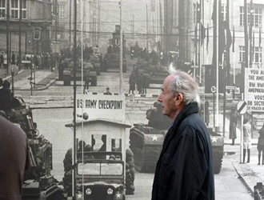

# No politics today？

在多倫多大學東亞圖書館談台灣的自然書寫時，有一位中文很好的外國學生問我：台灣的自然書寫，跟中國大陸的自然書寫有沒有什麼聯繫？

我在演講中已提及解嚴對台灣自然書寫有很大的影響，為什麼呢？因為在戒嚴時，台灣連帶把海岸跟山脈都戒嚴了，一個海島國家竟少有人假日選擇出海，只能在可憐的海水浴場泡水，有時候連舉起相機都可能違反軍事法令。

而即使現在中國已有一批在學院裡論述生態文學的學者，許多優秀的作家，但整個文壇而言，寫作環境議題的作家仍少，原因何在？我的想法是，現代環境議題，通常都是「即時的」政治議題。在近代社會中，有能力大規模剝削、傷害自然的，只有資本家與政府。一個農夫頂多為一個冬天砍十棵樹取暖，政府卻有能力用政策消滅一座山、一片海岸。

因此深入環境議題後，你會發現那絕非隨手關燈、沖澡淋浴這樣的瑣事，而是國家為何不發展再生能源？為何會有永遠做不完的工程？那是政治和利益掛勾的深淵。

也就是說，對環境議題認真，你不得不冒犯權力者，當然也就不得不對政治政策認真。在自然寫作裡的傑作，不冒犯權力只歌頌自然之美的作品幾不存在。中國在這個議題上的寬容度，和台灣過去一樣停留在「隨手關燈即環保」的狀態中，它暫時還很難容忍對南水北運、三峽大壩、政客如何和資本家聯手淘空環境這樣議題表達異議的寫作。但未來，來自台、港、澳，乃至於中國境內漢民族以外的民族寫作，很可能會對中國的環境運動與自然思維有對話和影響。

在張懸演唱會舉國旗事件中，她對說「No politics today」的女孩說，這只是一面旗子，不是政治。我仔細把演唱會這段內容看過後，不禁思考這樣的一件事：插話的女孩很可能相信「讓藝術歸藝術」的情境存在，而張懸也很可能部分認同。所以她避開了這個問題，說自己手上的那面旗子無關政治。

我不談張懸該不該舉起那面旗子、那位中國留學生該不該喊話打斷演場會的進行，或張懸回應的對與錯(因為這些都屬於自由意志的部分)。而想對在藝術裡，究竟有沒有「No politics」 提出我的看法。

我並不曉得「讓藝術歸藝術，讓政治歸政治」這樣的口號從何時開始的，有一個可能性是，它和十九世紀法國的唯美主義思潮有關。這個潮流是將德國的古典美學化繁為簡，認為藝術確實可以只專注在藝術的技藝之上。但事實上，影響這個思維甚深的法國作家史達爾夫人(Madame de Staël)，本身就是冒犯了拿破崙政權被流放，才有機會在德國接觸到歌德與席勒。而觀察史達爾夫人的作品，她對貴族制度下被壓抑的女權多所發言，可也不是馴化的羊羔。

「為藝術而藝術」的觀點裡頭另一個重點是：藝術本身「無目的性」。也就是說，不為權勢、金錢、世俗而服務。「藝術不再服務於宗教和道德，正如它不服務於快感與實用性一樣。藝術不是手段，它本身就是目的。」這話是由哲學家庫贊(Victor Cousin)所寫下的。但各位仔細一想就知道，當藝術不願意再為宗教與道德服務，這不就正挑釁了宗教與道德？而藝術若不願為政治而服務，那個「無目的性」就顯出背後的目的來：藝術應該是自由、狂放、反宰制性的。由此看來，「為藝術而藝術」的主張，顯然也具有高度的政治性。它的政治性格，就是以它的獨立性，挑釁了政治。

我們在藝術史上，很難找到一個在創作內容與實際人生裡，真正孤絕於政治之外的創作者。而一段時間後，我們發現「為藝術而藝術」也很常流入一種幼稚口號的惡果，比方說過度耽美，比方說誤以為「藝術不(能、應)涉及政治」。

倘若我們把「政治」(politics)這個詞視為一般性定義，指的是類似馬克思所說，「以權利為核心的各種社會活動與社會關係的總和」，那麼這個不能、不應的基礎何在？

我們可以在朗讀奈波爾(V. S. Naipaul)的《抵達之謎》，不同時朗讀政治嗎？我們可以吟詠李杜詩的時候，而不感受到大唐的政治情狀嗎？我們可以站在安迪‧沃荷(Andy Warhol)的作品前，不領略到一種視覺的政治性嗎？我們可以理解瓊‧拜雅(Joan Baez)歌聲的力量，卻不理解種族、階級的政治性嗎？我們可以唱楊三郎的〈望你早歸〉，而忘卻殖民時代嗎？

當然並不是不可以，只是那就可惜了。

我們時常在某些行為受到政治性阻礙時，向當局呼籲「讓○○歸○○」，但這其實是充滿悖論的一句話。因為如果一部作品會引起某種權力(或者是國家機器、資本家、宗教)以政治性發動阻礙時，它必然有讓這些權力機制恐懼之處。也就在這個時刻，藝術顯現了它的力量與價值所在。

像泰瑞‧伊格頓(Terry Eagleton)這樣的批評家，常提醒我們權力機制希望能主導我們的審美品味，這是為什麼呢？因為主導了民眾的審美品味，也就主導了他們的感情流向。藝術就成了馴服民眾的工具，而不是讓民眾自我發現自己在社會裡的權力、地位、存在感的啟蒙了。

是誰不希望你在作品裡、表演行動中表達你的立場？就是那些「不希望」你成長出具有監督政治，挑釁政治，洞悉政治的理性，並進而不被政治所愚弄的人啊！

今天的新聞裡，也看到李安受訪時提到，他的每一部電影，都受到他的台灣生長經驗影響，就連同志電影《斷背山》也不例外，因為台灣常是國際社會上的「失敗者」。這是李安作品的政治。

No politics today？No. 我們都活在政治裡，重點是我們得怎麼面對它，或者你怎麼面對我的，我怎麼面對你的。身為一個藝術創作者，你可以用唱的、演的、寫的、畫的，哭泣的，或者微笑的；又或者，像崔健一樣讓：「手中的吉它就像一把刀子」，「它要穿過你的嘴去吻你的肺」。

（採編:余澤霖 責編:劉文君）

[【懸著的旗】張懸說錯的兩句話](/archives/43700)——兩岸問題，需要更多一點理解，多一點對話和溝通，相信很多問題是可以坐下來好好談談的。今時今日，兩岸面對語境不同，所以也許在開始爭論之前，不如讓我們看看，張懸說錯了什麽？

[【懸著的旗】关于政治：张悬与no politics today](/archives/44073)——假若是没了原则，就会觉得任何事情都是我的原则。也就学不会尊重别人的原则，谈互相尊重更是瞎扯。而若是没有相互尊重，其实再好的观点也无法彼此交流。
