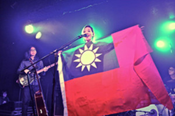

# 張懸說錯的兩句話

**1.**

昨天聽到曼城的風波，心揪著，對照了各種版本的說法與錄影，我得承認，我覺得向來欣賞的張懸，對那女孩說錯了兩句話。

第一句，其實是她第一時間的回應，「這不是政治，這只是一面旗子。」我了解張懸說這話是對 “no politics tonight” 的「直覺閃避」。她迴避了政治，以捍衛自己拿起那面旗幟的決定，凸顯這只是一件平常、微小、個人的盼望，不必那麼上綱上限。

這句話錯在哪裡，我稍後談。

第二句，則如同很多朋友抨擊的，是「這句話應該是從電視上學來的吧？還是電影上面？這樣講好像很有風度，彷彿很嘹這個狀況 I know I know…」這裡張懸雖沒有如同謠傳般說「我覺得這一點都不酷」，但這還是一種發言權力不對等下的奚落。

如果我是那個遠從Glasgow趕來的女孩，也會覺得受傷。

**2.**

我先想「揣摩」，她說這兩句話的心境：

張懸作為台灣外省家庭的女兒，無疑從小是認同那面青天白日滿地紅的旗子長大的。大陸朋友如果要去想像，就想想你小時候怎麼開始認識五星旗，如何對那面旗幟產生榮耀與感情。然而她的成長過程，面臨與各位很不同的命運。她一方面見證著本土認同崛起的台灣，越來越多台派質疑這面旗子，將其視為「蔣介石外來政權」的代表（所以民進黨都用綠色台灣旗）。而另一方面放眼國際，也必須忍受這面旗子，在中國政府的否定下罕有飄揚的空間。

所以當她來到英國，在演唱會現場看到台灣學生，帶上這面她熟悉的旗幟，興奮之情完全可以想像。而當她帶著心底的熱度，披起這面旗子──”No Politics Tonight!” 的聲音響起。那句清亮的質疑，必然勾起長年來，她見證「中華民國」在內外夾擊下的委屈。

這種情緒，在中華人民共和國成長的各位或許不容易懂。

聽到那話，第一時間張懸是迴避的，所以她先否定這跟政治相關，強調「只是旗子」。唱完一首歌後覺得心底醞釀些了什麼，才說出那一大段廣為流傳的話。其實大家都應看的出，張懸很努力在拿捏言語的分寸，甚至強調 “I am always listening” 。只是台上台下的權力差距，還是很難避免造成那女孩的傷害。

只是弔詭的是，當許多中國網民，攻擊張懸拿起的旗子代表某種「分離主義」時，他們或許沒想到，這面旗子，（比起民進黨的綠色台灣旗）至少還保有台灣跟中國的某種歷史聯繫。

**3.**

回看那句「這不是政治，這只是一面旗子」。錯在哪？

簡單說，這還是「政治」。

一面旗子這當然不屬於 high politics ，那是在中南海、人大、釣魚台賓館、台灣立法院上政治人物的事。但「政治」的根本，泛指公共生活中各種權力界線的拉扯分配，大到軍事外交政策預算，小到生活中各種權力拉扯的環節。像這類用微小的行動、語言、穿著、符碼界定「我是誰」，拉扯著「誰有決定我們如何界定自己的權力」，正是「認同政治」(identity politics) 的微觀展現。

其實，連那女孩呼喊 “no politics tonight” 的時候，否定張懸拿起「那面旗子」的合理性時，她也是在做一種政治宣告，暗示「那面旗子不能當成一面國旗」的信念，或至少是，對於一場演唱會可以/不可以有什麼元素的政治判決。

正因承載著政治情感，一面旗幟才會引起張懸的感動、中國留學生的錯愕，以及台灣某些群體（特別是早年在國民黨統治期間受難者後代）的傷痛。一面旗子牽動到不同群體的複雜感受，誰又能在普世的意義上宣稱那「只是一面旗子」？即便對於張懸，那真的只是「一面旗子」嗎？

我相信在面對自己的時候，張懸也會承認，那是一種政治。

4.

這個事件，還進一步凸顯出兩岸在不同脈絡中，形成對「政治」的不同理解：

1980年代以前的台灣，或當代的中國，政治主體是國家、是政府、是黨這一類「集體單位」。由於政治權力沒有充分下放，妄加干涉還可能帶來災禍。所以人們對於政治的理解是「危險的，不是我們能改變的，是不能碰的，離越遠越好」，主流的邏輯是明哲保身的切割。因此，台灣很多長輩（包括家父）經常叮囑「少碰政治」，而這種態度，似乎在當代中國也不陌生。

但台灣經歷民主化後的一代，有越來越多人透過見證參與，真正開始相信政治主體是你我每一個「個人」。我們開始比較放心地讓政治滲透到個人生活，並嘗試用自己的小小作為──或許是透過文字、歌曲、照片、衣服、連署、上街、選票等媒介，去表達自己，去參與引導權力的分配流動。雖然台灣還是有很多不夠有風度的人，我們相信每個人都有表達自己的自由，所以你在台北還可以看到五星旗飄揚，而這是三十年前無法想像的事情。

正是出於這樣的邏輯，多數台灣人都無法理解「歌手拿覺得能夠代表自己的旗子」何以冒犯？如果有一個大陸藝人到台灣在演出時，現場有陸生高興地拿出五星旗，而該藝人也把旗子披在身上，我絕對會支持他這樣的權利。如果是在英國，那就更不用說了。而對台灣人而言，一個人表達、定義自己的權利，被另外一大群人否決，本質上是一種暴力。

Coda

寫這麼多，我其實沒打算指責張懸，也不是要幫她辯護。我希望的是，透過我的詮釋與析辨，稍微促進一點對話跟理解。兩岸交流雖然也有二十年，我去過中國大陸也不下十多次。但除了那些真正來過台灣生活上一兩年的朋友，多數人在認定「台灣是中國的一部分」的同時，對台灣社會的理路是充滿陌生的。

很多人困惑，台灣為什麼不願意回歸？兩岸統一或一國兩制不是很好嗎？這不是我今天能夠去充分討論的問題。但如果你對台灣人的心理真想了解，有幾個關鍵詞可以下手：二二八、火燒島、美麗島、鄭南榕。如果你找的到這些資料，請再想想當年的台灣人會如何看待「中國」國民黨，或許你能對今日台灣人面對中國的複雜情緒，多一點體會。

[原文](http://www.douban.com/group/topic/45590843) 

（采编：余澤霖；责编：陈澜鑫）

[【懸著的旗】No politics today？](/archives/44106)——在張懸演唱會舉國旗事件中，她對說「No politics today」的女孩說，這只是一面旗子，不是政治。那麼，「讓藝術歸藝術」的情境是否真的存在？

[【懸著的旗】关于政治：张悬与no politics today](/archives/44073)——假若是没了原则，就会觉得任何事情都是我的原则。也就学不会尊重别人的原则，谈互相尊重更是瞎扯。而若是没有相互尊重，其实再好的观点也无法彼此交流。
