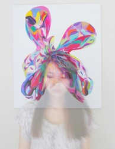

# 一个虚无主义者的自白

1. 

当那个满头银发，眼神却依然犀利精干的CBS记者问我，“你要明白驱使你生命的到底是什么”的时候，我的思维却不可救药地滑落到了另一个方向。

我生命的动机是什么？现在的我坐在自然历史博物馆的办公室里，面对双屏幕里正在剪辑的微生物视频，重新开始思考这个问题。我是羡慕这些渺小的生物的：它们生于沙砾间，死于沙砾间，在那卑微的意识还来不及觉察的时候，就已经度过了短暂一生。就这样渺小而繁多的生物而言，个体的存在对世界几乎没有任何重量，像是茫茫宇宙中的一粒尘埃，本身就代表混沌和空白。

我确实羡慕它们，因为我是一个虚无主义者。生命的动机对我来说，似乎没有前提。

2. 

我有一个朋友，是孟加拉某部长的女儿，在上流社会家庭长大，有一个法学博士学位，结婚生子前是美国知名智库的分析师。第一次见到她的时候，就感到矜持、得体、倨傲和优雅混作坚实的一团，像铁墙一般冷不防地拍在我脸上，让人神经紧绷起来。

后来她和我说，她最近开始看美剧绯闻女孩，突然感到非常空虚。她从小到大身边的人和剧里的人物是一样的，大家都出身显赫，家财万贯，并且互相睡来睡去。刚从大学毕业的时候，她看不起他们，坚决不肯回孟加拉；但十八年后的今天，她发现无论在美国还是在她的祖国，人们过的都是同一种生活，她和她看不起的人并无分别 。

“我现在又要回去继承我父亲的事业，那么我当初又为什么要留在美国？人生究竟又有什么意义呢？”她这样问我。

我不能告诉她，她的话让我想到加缪的《局外人》，里面的主人公在死刑前，愤怒地拒绝向神父皈依：“我曾以某种方式生活过，我也可能以另一种方式生活。我做过这件事，没有做过那件事。我干了某一件事儿没有干另一件事。而以后呢？……在我所度过的整个这段荒诞的生活里，一种阴暗的气息穿越尚未到来的岁月，从遥远的未来向我扑来，这股气息所过之处，是别人向我建议的一切都变得毫无差别，未来的生活并不比我以往的生活更真实。”

她已经三十六岁，是两个孩子的母亲，住在一间有巨大落地窗的酒店式公寓里。但这样的生活，并不比那样的生活更真实。

3. 

《射雕英雄传》里有一段充满哲学意味，让我印象深刻。郭靖当众许诺会娶华筝之后，黄蓉肝肠寸断，但两人还是继续前行去找洪七公。走在长岭上时下起了大雨，郭靖要拉着黄蓉快跑，黄蓉却讲了一个故事：“一日天下大雨，道上行人纷纷飞奔，只有一人却缓步行走。旁人奇了，问他干么不快跑。那人道：‘前面也下大雨，跑过去还不是一般的淋湿？’”郭靖笑道：“正是。”

黄蓉心中却忽然想起了华筝之事：“前途既已注定了是忧患伤心，不论怎生走法，终究避不了、躲不开，便如是咱们在长岭上遇雨一般。”于是他们两人在雨中缓缓而行，直到过了长岭，才见到一家农家，进去避雨。

人生总是这样连绵的阴雨，一所农家之后，又是一样的避不过。

4. 

在我造访过的那么多城市中，最让我感到自在的是两座：纽约，和拉斯维加斯。讽刺的是，她们都以纸醉金迷人情冷漠闻名。

我爱纽约，因为她巨大的喧嚣恰到好处地湮灭了个人。这个城市有最奢华的派对，也有最肮脏的角落，没有人关心任何人。黑皮肤，白皮肤，黄皮肤的人们，不问出处地在同一个街口擦肩而过，面无表情。我爱一个人在曼哈顿游荡，心里清明地知道不会有任何人在意自己，像是从世俗世界上消失了一般，变成隐形的人。如果戴上耳塞，把车水马龙和闲言碎语都隔绝，便更加孤单而自由。

躲藏在某个比自己更大的存在中，能让我感到无与伦比的安全。这样的时刻，我就能感觉到纽约城正以她冰冷的胸怀拥抱我，而我消失在地图上的一个小点，如同滴水没入海洋。

而维加斯正好相反，她是成人的迪士尼乐园，拙劣而艳俗的建筑在这里比比皆是，却并不荒诞，反而是一种值得推崇的超现实。金字塔，马戏团，巴黎铁塔，威尼斯，谁都知道它们是假的，但谁都不会去拆穿。为什么不做一个快乐的傻瓜呢？老虎机的最低起价是二十五美分，这意味着任何人只要口袋里有一个铜板，就可以在奢华的凯撒皇宫里享受一点刺激。这里的五星级酒店最便宜，这里的服务生笑脸最殷勤。赌场里最多的就是衣着平凡的老头老太，机械地按着老虎机的下注键，一坐就是一整天。

只要你有钱，无论你是谁，拉斯维加斯永远欢迎你。 即使大数定律让赌场只赢不亏，但对个人来说，每个人都有一夜暴富的可能。还有比这更公平的事吗？

我想要的，就是这样或者温情，或者冷漠的自由。

5. 

我最喜欢的一个虚拟男性角色叫做卡提斯。他从小在贫民窟长大，命如草芥，在黑暗与肮脏的夹缝之中成长为一名出色的杀手，因此拥有了金钱和地位。但世俗名利在他手中都像沙一样流动过去了，他真正汲汲以求的，是像烟花一样迅速而绚丽地死去，然后被人遗忘。

“执着的东西，空无一物。”这是他的座右铭。

死，而且要死得快，死得早，最一直是我短短二十几年人生的重大心愿之一。没有任何缘由，只是我从来无法让自己满意地回答这个问题：我为什么要活着，并且活下去？

这和张爱玲的“出名要趁早”倒是异曲同工。虽然不是同样的事，但都看到了人生那袭爬满虱子的袍。

死亡在我眼中并不是可怕的事，真正的痛苦是永久的告别与漫长的孤独。生前死后的事都是不可知的，也许这个世界的死亡在另一个世界却是诞生。之前读聊斋故事，和朋友开玩笑说，虽然我很不愿意做人，但说不定我前世是一个妖精，而在做妖精的时候很想做人呢？

但在这个世界上，我们只会活一次。就算还有来生，我们也会忘记这一生的事情——此生就是我们的天堂，此生也是我们的地狱。

6. 

叔本华认为，有人间或把人类和事物看作仅仅是幻影和梦景，这种天才就是哲学才能的标志。

我不相信自由意志，也不信任理性。比起以理性的名义被各种偏见蒙蔽，还不若相信纯粹主观的感情，比如爱与憎，比如狂热与忧伤。这就是为什么我在夜店会感到欣慰，看着迷乱起舞的人群会欣然微笑。

我爱这个世界。在许多瞬间，我感到自己只是一个观察世界的移动窗口，为作为某个大于自我的事物的一部分而欣喜不已。 在时间与空间的平行宇宙中，个体的人生并算不了什么，一切都不断地湮灭又再生。于是生死变得不再重要，重要的是如何向死而生。

正是因为明白个体的局限和虚无，我才确信自己的人生不应在于面朝大海，春暖花开 。杨丽萍说，有的人来到这个世界是为了享乐，有的人是为了传宗接代，她来到世界上则是为了做一个观察者。而我，我要把自己融入一个更大、更高的所在，无论那个极限的存在是什么，我希望自己是它的一部分。

千百年前，苏轼曾经扣舷而歌：“逝者如斯，而未尝往也；盈虚者如彼，而卒莫消长也。盖将自其变者而观之，则天地曾不能以一瞬；自其不变者而观之，则物与我皆无尽也，而又何羡乎？”

7. 

回到CBS记者的那个问题。

在伊斯坦布尔时，结识了一对年轻土耳其夫妇，丈夫是蓝色清真寺基金的负责人。闷热的夏夜，我们一起坐在他家的阳台上，居高临下地对着黄金号角的夜景喝茶闲聊，直到凌晨。

他问我：“你难道从来没有想过自己的创造者是谁吗？”我愣了一下，觉得自己真的从来没有想过这个问题，甚至为自己的无知感到一点羞耻了。

我反问他：“难道你就能确定世界上存在这样一个创造者吗？你又怎么证明呢？”

他把手放在身前，说道：“假设我手里有一个苹果，把它放在我身前，让你能够看到，于是你相信这里有一个苹果。但这叫做事实，不是信仰。信仰就是把这个苹果放在我背后，你看不见它，但仍然相信它的存在。这就是信仰。”

没有人能看见别人背后的真理。那么信仰这样东西，必然不是可以商榷的。人生观也是如此。

——而此文就是我的全部答案。

 

2013年7月7日凌晨  于华盛顿

（荐稿：麦静，采编：麦静，责编：佛冉）
